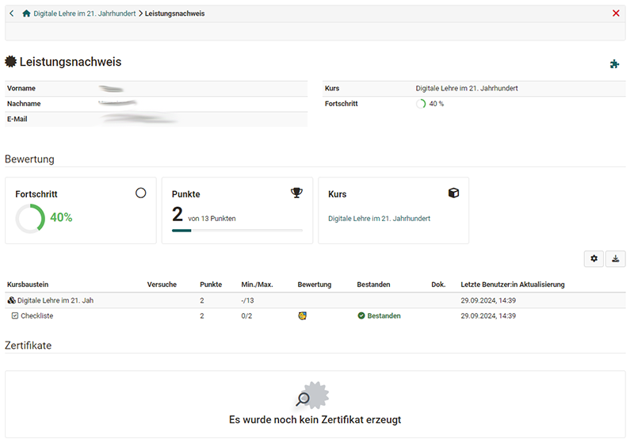

# Zusätzliche Kursfunktionen

{ class="shadow lightbox" }

In der Toolbar eines Kurses stehen Teilnehmenden eine Reihe von weiteren Kursfunktionen zur Verfügung. Einige Elemente wie ["Kursinfo"](../learningresources/Info_page.de.md), "Mein Kurs" oder der Bereich "Lernpfad" (bei Lernpfadkursen) werden automatisch angelegt. Auch das Element "Termine" erscheint automatisch in der Toolbar, wenn die ["Termine und Absenzen"](../learningresources/Events_and_absences.de.md) im Kurs aktiviert wurden. 

Andere Werkzeuge können von den Kursbesitzenden unter `Administration > Einstellungen > Toolbar` zusätzlich aktiviert werden. Weitere Infos zu diesen aktivierbaren Werkzeugen finden Sie auf der separaten Seite ["Einsatz weiterer Kursfunktionen der Toolbar"](../learningresources/Using_Additional_Course_Features.de.md). 

## Menü "Mein Kurs"

Das Dropdown-Menü "Mein Kurs" der Toolbar bietet Zugriff auf personalisierte Bestandteile des Kurses.

{ class="shadow lightbox" }

Abhängig von der Konfiguration des Kurses werden eventuell nicht alle der folgenden Einträge angezeigt.

* **Der Leistungsnachweis** zeigt die individuellen Bewertungen im Kurs an und gibt, sofern aktiviert, Zugriff auf das [Zertifikat](../learningresources/Course_Settings_Assessment.de.md#section_certificate) des Kurses.
* **To-dos** zeigt die aktuellen To-dos des Kurses an. 
* **Notizen**: Hier können Sie kursspezifische Notizen eintragen, die nur Sie als Kursteilnehmer:in lesen können.
* **Bookmark**: Aktivieren Sie den Bookmark, dann erscheint  der Kurs im Menü "Kurse" im Tab "Favoriten".
* **Einwilligung**: Sollte es im Kurs bestimmte Nutzungsbedingungen und/oder eine kursbezogene Datenschutzerklärung geben, denen Sie zugestimmt haben, können Sie diese hier einsehen und auch die Einwilligung widerrufen.
* **Gruppen**: Hier sehe Sie alle kursspezifischen Gruppen in denen Sie Mitglied sind und können direkt dorthin navigieren.
* Mit **"Kurs verlassen"** können Sie sich aus dem Kurs austragen.

### Leistungsnachweis

Ein Leistungsnachweis ist eine Bestätigung einer erfolgten Leistungskontrolle und muss vom Kursbesitzer bzw. der Kursbesitzerin zunächst aktiviert werden. Lernende sehen dann die einzelnen absolvierten Assessmentbausteine des Kurses wie Tests, Aufgaben u.ä., ihre Punkte und weitere Informationen.

{ class="shadow lightbox" }

Falls für den Kurs ein [Zertifikat](../learningresources/Course_Settings_Assessment.de.md#section_certificate) ausgestellt wurde finden Sie dies ebenfalls unter "Leistungsnachweis" zum Herunterladen. Betreuende des Kurses können die Zertifikate im [Coaching-Tool](../area_modules/Coaching.de.md) einsehen.

Bei automatisch ausgestellten Zertifikaten nach erfolgreichem Abschluss eines Kurses erhalten Sie eine automatisch generierte Benachrichtigung per E-Mail.

!!! tip "Alle Leistungsnachweise im Überblick"

    Leistungsnachweise und Zertifikate aus all Ihren Kursen finden Sie im persönlichen Menü unter ["Leistungsnachweise"](../personal_menu/Personal_Tools.de.md#evidences_of_achievement).

### To-dos [:octicons-tag-16:{ title="ab Release 18.2 (OO-7039)" }](https://track.frentix.com/issue/OO-7039)
Hier werden Teilnehmenden alle für Sie relevanten To-dos des Kurses angezeigt. 
Dabei kann es sich zum einen um automatisch generierte To-dos aus den [Aufgaben-Kursbausteinen](../learningresources/Course_Element_Task.de.md) handeln. Dann werden Sie aufgefordert einen bestimmten Schritt im Aufgabenflow zu gehen, z.B. eine Aufgabe auszuwählen, eine Lösung abzugeben o.ä. 
Zum anderen können Lehrende allen Teilnehmenden oder auch nur einzelnen Personen bestimmte konkrete To-dos zuweisen. Teilnehmende können den Status eines To-dos ändern, wenn sie die Aktion erledigt haben. 

Die To-dos dienen den Teilnehmenden als Orientierung, was aktuell im Kurs zu tun ist. 
Ein Überblick über alle persönlichen und kursbezogenen To-dos finden Teilnehmende im Bereich ["Persönliche Werkzeuge"](../personal_menu/To-Dos.de.md). Dort können Teilnehmende auch eigene To-dos erstellen.

### Kurs verlassen [:octicons-tag-16:{ title="ab Release 10.2 (OO-1405)" }](https://track.frentix.com/issue/OO-1405)

Die "Kurs verlassen" Funktion beendet sofort Ihre Kurs- oder Gruppenmitgliedschaft, abhängig davon auf welche Weise Sie Zugriff zum Kurs haben. Im Anschluss daran haben Sie keinen Zugriff mehr auf den Kurs, bzw.
müssen den entsprechenden Kurs- oder Gruppenbetreuer kontaktieren um wieder Kurszugriff zu erhalten.

Die Möglichkeit, sich aus einem Kurs auszutragen, muss zuvor von den Kursbesitzer:innen in den Einstellungen des Kurses im Tab "Freigabe" aktiviert worden sein und gilt nur für Teilnehmende, nicht für Betreuer:innen oder Besitzer:innen.

## Lernpfad der Toolbar 
Über das Lernpfad-Icon in der Toolbar erhalten Lernende einen Überblick über ihren Fortschritt in allen Kursbausteinen. Je nach gewählten Spalten können ausserdem zusätzliche Informationen wie die Art der Durchführung und Termine angezeigt werden. So behalten Lernende ihre Aktivitäten im Kurs einfach im Blick.

{ class="shadow lightbox" }

Kursbesitzer:innen und Betreuende erhalten über den Link "Lernpfad" zunächst eine Übersicht über alle Teilnehmenden und können dann im nächsten Schritt eine Person auswählen um sich ihren Lernfortschritt anzeigen zu lassen. 

## Weitere aktivierbare Werkzeuge der Toolbar im Kurzüberblick

* [Kurssuche](../basic_concepts/Search_in_Course.de.md): Durchsuchen Sie den Kurs nach Schlüsselbegriffen
* **Kurskalender**: Zugriff auf den kursspezifischen Kalender
* Liste der Teilnehmenden: Übersicht der **Kursmitglieder**
* **Mitteilungen**: Hier kann der Lehrende zentrale Kursinfos hinterlegen.
* **E-Mail**: Kontaktmöglichkeit zu den Kursbesitzer:innen, Betreuer:innen 
* **BigBlueButton** (Teams oder andere virtuelle Klassenzimmer): Für synchrone Meetings
* **Blog**: Zugriff auf einen zentralen Kurs-Blog
* **Wiki**: Zugriff auf ein zentrales Wiki für den Kurs
* **Forum**: Zugriff auf ein zentrales Kurs-Forum
* **Dokumente**: Zugriff auf einen zentralen Dokumenten Ordner
* **Glossar**: Zugriff auf das Glossar des Kurses, sofern ein Glossar mit dem Kurs verbunden wurde
* [Kurs-Chat](../basic_concepts/Chat.de.md): Für den synchronen Austausch der Kurs-Mitglieder
* [Externe Kurstools](../learningresources/Course_Settings_Toolbar.de.md#external_tools): Bis zu vier konfigurierbare Links zu externen Webanwendungen

Weitere Informationen zu den Werkzeugen finden Sie unter ["Einsatz weiterer Kursfunktionen der Toolbar"](../learningresources/Using_Additional_Course_Features.de.md).

## Weiterführende Informationen {: #further_information}

**Auf dieser Seite erwähnt** 
[Toolbar: Infoseite >](../learningresources/Info_page.de.md) 
[Termine und Absenzen >](../learningresources/Events_and_absences.de.md) 
[Einsatz weiterer Kursfunktionen der Toolbar >](../learningresources/Using_Additional_Course_Features.de.md) 
[Kurseinstellungen - Tab Bewertung >](../learningresources/Course_Settings_Assessment.de.md) 
[Coaching - Übersicht >](../area_modules/Coaching.de.md) 
[Persönliche Werkzeuge >](../personal_menu/Personal_Tools.de.md) 
[Kursbaustein "Aufgabe" >](../learningresources/Course_Element_Task.de.md) 
[Persönliche Werkzeuge: To-dos >](../personal_menu/To-Dos.de.md) 
[Suche in einem Kurs >](../basic_concepts/Search_in_Course.de.md) 
[Chat >](../basic_concepts/Chat.de.md) 
[Kurseinstellungen - Tab Toolbar >](../learningresources/Course_Settings_Toolbar.de.md)

**Weiterführend** 
[Toolbar: Mein Kurs >](../learningresources/Toolbar_My_Course.de.md) 
[Kurs-Administration: Übersicht >](../learningresources/Administration.de.md) 
[Toolbar: Termine >](../learningresources/Toolbar_Events.de.md) 
[Toolbar: Übersicht >](../learningresources/Toolbar.de.md)

[Zum Seitenanfang ^](#zusatzliche-kursfunktionen)

