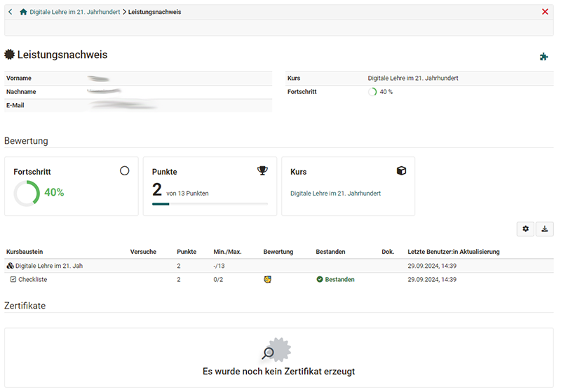

# Zusätzliche Kursfunktionen

Im Kurs stehen Usern eine Reihe von weiteren Kursfunktionen zur Verfügung, die der Besitzer bzw. die Besitzerin des Kurses nach Bedarf ein- und ausschalten kann. Diese Funktionen erscheinen dann entweder in der Toolbar oder unter "Mein Kurs". 

## Menü "Mein Kurs"

Das Dropdown-Menü "Mein Kurs" bietet Zugriff auf personalisierte Bestandteile des Kurses.

Abhängig von der Konfiguration des Kurses werden eventuell nicht alle Einträge angezeigt.

* **Der Leistungsnachweis** zeigt Ihre Bewertungen im Kurs an und gibt, sofern aktiviert, Zugriff auf das Zertifikat des Kurses.
* **To-dos**: Zeigt die aktuellen To-dos des Kurses an. 
* **Notizen**: Hier können Sie kursspezifische Notizen eintragen, die nur Sie als Kursteilnehmer:in lesen können.
* **Bookmark**: Aktivieren Sie den Bookmark, dann erscheinen diese Kurse im Menü "Kurse" im Tab "Favoriten".
* **Einwilligung**: Sollte es im Kurs bestimmte Nutzungsbedingungen und/oder eine kursbezogene Datenschutzerklärung geben der Sie zugestimmt haben, können Sie diese hier einsehen und auch die Einwilligung widerrufen.  
* **Gruppen**: Hier sehe Sie alle kursspezifischen Gruppen in denen Sie Mitglied sind und können direkt dorthin navigieren.
* Mit **"Kurs verlassen"** können Sie sich aus dem Kurs austragen.

### Leistungsnachweis

Ein Leistungsnachweis ist eine Bestätigung einer erfolgten Leistungskontrolle und muss vom Kursbesitzer bzw. der Kursbesitzerin zunächst aktiviert werden. Lernende sehen dann die einzelnen absolvierten Assessmentbausteine des Kurses wie Tests oder Aufgaben, ihre Punkte und weitere Informationen.

Falls für den Kurs ein Zertifikat ausgestellt wurde finden Sie dies ebenfalls unter "Leistungsnachweis" zum herunterladen. Betreuende des Kurses können die Zertifikate im [Coaching-Tool](../area_modules/Coaching.de.md) einsehen.
Bei automatisch ausgestellten Zertifikaten nach erfolgreichem Abschluss eines Kurses erhalten Sie eine automatisch generierte Benachrichtigung per E-Mail.

!!! info "Info"

    Leistungsnachweise und Zertifikate aus all Ihren Kursen finden Sie unter ["Leistungsnachweise"](../personal_menu/Personal_Tools.de.md#leistungsnachweise). 

### To-dos
Hier werden Teilnehmenden alle für Sie relevanten To-dos des Kurses angezeigt. 
Dabei kann es sich zum einen um automatisch generierte To-dos aus den Aufgaben-Kursbausteinen handeln. Dann werden aufgefordert einen bestimmten Schritt im Aufgabenflow zu gehen, z.B. eine Aufgabe auszuwählen, eine Lösung abzugeben o.ä. 
Zum anderen können Lehrende allen Kursteilnehmenden oder auch nur einzelnen Personen bestimmte konkrete To-dos zuweisen. Lernende können den Status eines To-dos ändern, wenn sie die Aktion erledigt haben. 

Die To-dos dienen dem User als Orientierung, was aktuell im Kurs zu tun ist. 
Ein Überblick über alle persönlichen und kursbezogenen To-dos finden User im Bereich ["Persönliche Werkzeuge"](../personal_menu/To-Dos.de.md). Dort können sie auch eigene To-dos ergänzen.

### Kurs verlassen

Die "Kurs verlassen" Funktion beendet sofort ihre Kurs- oder Gruppenmitgliedschaft, abhängig davon auf welche Weise Sie Zugriff zum Kurs haben. Im Anschluss daran haben Sie keinen Zugriff mehr auf den Kurs, bzw.
müssen den entsprechenden Kurs- oder Gruppenbetreuer kontaktieren um wieder Kurszugriff zu erhalten.

Die Möglichkeit, sich aus einem Kurs auszutragen muss zuvor von den Kursbesitzer*innen in den Einstellungen des Kurses im Tab "Freigabe" aktiviert worden sein und gilt nur für Kursteilnehmende, nicht für Betreuer:innen oder Besitzer:innen.

## Elemente der Toolbar

In der Toolbar stehen die Tools unabhängig von bestimmten Freigaben innerhalb der Kursstruktur zur Verfügung.

Standardmässig ist die [Kursinfo](../learningresources/Info_page.de.md) in der Toolbar sichtbar. Bei Lernpfad Kursen erscheint zusätzlich das Element "Lernpfad" in der Toolbar. Hier sehen User differenzierter ihren Fortschritt im Kurs und erhalten so eine gute Übersicht über erledigte und noch zu erledigende Kurselemente. 

Hier ein **Schnellüberblick** über die ja nach Aktivierung durch die Kursbesitzer:innen zur Verfügung stehenden Werkzeuge der Toolbar. 

* Kalender: Zugriff auf den kursspezifischen Kalender
* Teilnehmerliste: Übersicht der Kursmitglieder
* Mitteilungen: Hier kann der Lehrende zentrale Kursinfos hinterlegen.
* E-Mail: Kontaktmöglichkeit zu den Kursbesitzer:innen, Betreuer:innen 
* BigBlueButton (oder andere virtuelle Klassenzimmer): Für synchrone Meetings
* Blog: Zugriff auf einen zentralen Kurs-Blog
* Wiki: Zugriff auf ein zentrales Wiki für den Kurs
* Forum: Zugriff auf ein zentrales Kurs-Forum
* Dokumente: Zugriff auf einen zentralen Dokumenten Ordner
* Glossar: Zugriff auf das Glossar des Kurses
* [Kurs-Chat](../basic_concepts/Chat.de.md): Für den synchronen Austausch der Kurs-Mitglieder
* Kurssuche: Durchsuchen Sie den Kurs nach Schlüsselbegriffen

### Kurskalender

Der Kalender geht in einem neuen Fenster auf. Termine im Kurskalender eintragen dürfen nur Kursbesitzer:innen. Kurskalender werden automatisch zu Ihrem [persönlichen Kalender](../personal_menu/Personal_Tools.de.md) hinzugefügt. Wählen Sie dazu den Kurskalender in der Kalenderliste des persönlichen Kalenders aus. Informationen zur Kalenderliste sowie weiterer Kursfunktionen finden Sie im Kapitel [Kalender](../personal_menu/Calendar.de.md).

### Glossar {: #glossary}

Wenn der Kursbesitzer ein Glossar zur Begriffsklärung in den Kurs eingebunden hat, sehen Sie das Glossar Dropdown-Menü oben in der Kurstoolbar. Sie können das Glossar in einem neuen Fenster öffnen, oder die Begriffe im Kurs einblenden. Wenn im Kurs (beispielsweise im Wiki oder einer HTML-Seite) ein Begriff erwähnt wird, der im Glossar steht, wird Ihnen die Definition angezeigt, wenn Sie mit der Maus über den Begriff fahren. Das Glossar kann auch ausgedruckt werden.

Eventuell können Sie die Glossareinträge auch bearbeiten, sofern diese Option vom Lehrenden aktiviert wurde. Weitere Infos dazu finden Sie [hier](../learningresources/Using_Additional_Course_Features.de.md).

Weitere Informationen zu den anderen Elementen der Toolbar finden Sie [hier](../learningresources/Using_Additional_Course_Features.de.md). 
