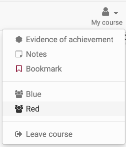
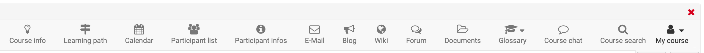
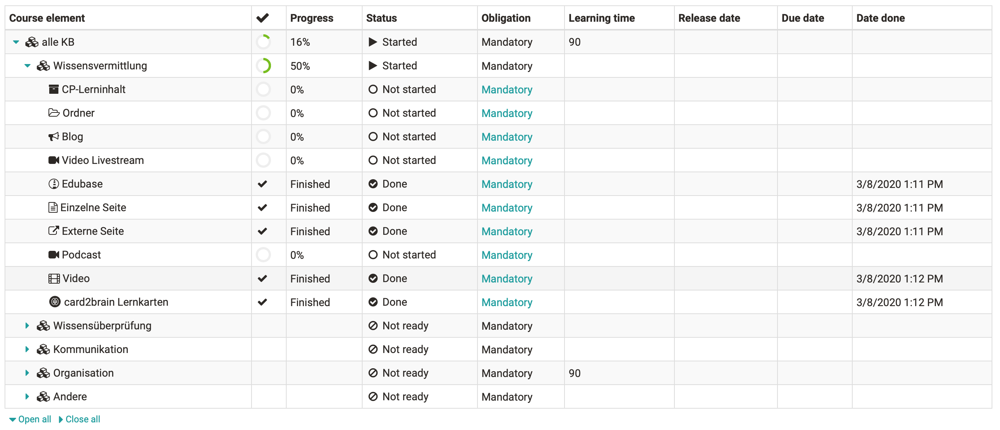

# Additional Course Features

In the course users have a number of additional course functions at their
disposal which the course author can activate and deactivate as required. This
way a toolbar with various additional functions can be activated. Those tools
can then be called up either via the menu "My course" or directly in the
toolbar. In the toolbar, the tools are independent of specific shares within
the course structure.

Menu "My course"

The drop down menu "My course" provides access to personalized course
functions. Depending on the course configuration, it is possible that not all
options are available.  

  * Notes: Here you can enter course-specific notes that only you as a course participant can read.
  * Evidence of achievement displays your assessments in the course in table form and, if activated, gives access to the certificate of the course
  * Bookmark: Bookmarked courses can be found in the Courses section in the "Favourites" tab.
  * Groups: Here you can see all course-specific groups in which you are a member.
  * Leave course: With "Leave course" you can sign out of the course.

The "Leave course" function immediately ends either your course or group
membership, depending on how you gained access to the course. Subsequently,
access to the course will be denied. In order to gain access to the course
again, you will have to contact the respective course or group coach.

Attention: The possibility to unsubscribe from a course has to be activated by
the course owner in the access configuration and is only valid for course
participants and not for tutors or owners.

###  Evidence of Achievement & Certificate

An evidence of achievement is a confirmation of an existing efficiency
control, e.g. taken tests or assessed tasks. If a course author has activated
the evidence of achievement option, if there are assessable course elements,
if you have already taken a test and if that test has been assessed you can
find the link "Evidence of achievement" in the drop-down menu "My course". If
a certificate has been issued for this course, you will find it alongside the
evidence of achievement details, ready for download.

Once a certificate is automatically issued after successfully completing a
course, you will receive an automatically generated email notification.

All your evidences of achievement and certificates will be listed in your ["Evidence of achievements"](../personal_menu/Personal_Tools.md#evidences-of-achievement). It always opens in a new window and is printable.

  

  

## Further elements of the toolbar

By default the course info is visible in the toolbar. The following additional
tools can also be called up via the toolbar:

  * Learning path: Overview of completed and open course elements
  * Calendar: Access to the course-specific calendar
  * Participant list: Overview of course members
  * Participant information: The coach can store central course information here (notifications)
  * E-mail: Pre-configured by the coach to send e-mails to course owners, supervisors and/or participants
  * Blog: Access to a central course blog
  * Wiki: Access to a central Wiki for the course
  * Forum: Access to a central course forum
  * Documents: Access to a central documents folder
  * Glossary: Access to the glossary of the course
  * [Course chat](../basic_concepts/Chat.de.md): For the synchronous exchange of course members
  * Course search: Search the course by keywords

  

### Learning path

Here, course participants in Learning Path Courses get a quick overview of
what they have already done and which things still need to be worked on or
called up in the course.

  

Course Calendar

The calendar opens in a new window. Only course authors are allowed to add
events to the course calendar. Course calendars are automatically added to
your [personal calendar](../personal_menu/Personal_Tools.md#PersonalMenu-_pers_kalender). Just
select the course calendar from your personal calendar list. Information on
the calendar list and further course functions can be found in the chapter
[calendar](../personal_menu/Calendar.md).

###   Glossary {: #glossary}

If your course author has included a glossary to clarify terms in your course
you will see the glossary drop-down menu at the top of the course toolbar. You
can open that glossary in a new window or show the terms in your course. If a
term in your course (e.g. in Wiki) is mentioned that is listed in the
glossary, you will see its definition when you move your mouse over that term.
The glossary can also be printed.

You may also be able to edit glossary entries if this option has been
activated by the teacher. Further information can be found
[here](../learningresources/Using_Additional_Course_Features.md).

###   Course chat

If the course author has activated the course chat you will see a link to the
chat room in the course toolbar; you can enter any time. Just click on "Course
chat" in order to open the chat window. At first you will always be anonymous.
On the right side of the chat window there is the possibility to choose your
alias or put your username on display. General chat features will be further
explained in the section ["Chat"](../basic_concepts/Chat.de.md).

  

  

