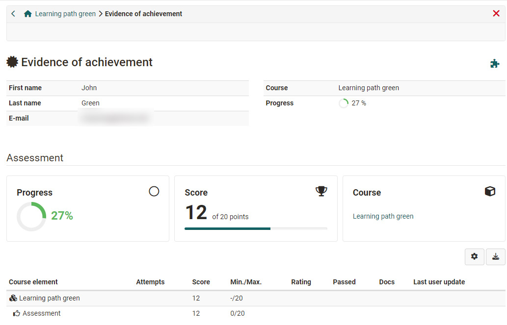

# Additional Course Features

In the course users have a number of additional course functions at their disposal, which the course author can activate and deactivate as required. These functions then appear either in the toolbar or under "My course". 

## Menu "My course"

The drop down menu "My course" provides access to personalized course functions. 

Depending on the course configuration, it is possible that not all options are available.  

 * **Evidence of achievement** displays your assessments in the course in table form and, if activated, gives access to the [certificate](../learningresources/Course_Settings_Assessment.md#certificate) of the course.*
 * **To-dos**: Displays the current to-dos of the course. 
  * **Notes**: Here you can enter course-specific notes that only you as a course participant can read. 
  * **Bookmark**: Bookmarked courses can be found in the "Courses" section in the "Favourites" tab.
  **Consent**: If there are specific terms of use and/or a course-related privacy policy in the course that you have agreed to, you can view them here and also revoke your consent. 
  * **Groups**: Here you can see all course-specific groups in which you are a member.
  * **Leave course**: With "Leave course" you can sign out of the course.

###  Evidence of Achievement & Certificate

An evidence of achievement is a confirmation of an existing efficiency control, e.g. taken tests or assessed tasks and must first be activated by the course owner. Learners can then see the individual assessment modules completed in the course, such as tests or tasks, their points and further information.

If a [certificate](../learningresources/Course_Settings_Assessment.md#certificate) has been issued for this course, you will find it alongside the evidence of achievement details, ready for download. Coaches can view the certificates in the [Coaching-Tool](../area_modules/Coaching.md).

Once a certificate is automatically issued after successfully completing a course, you will receive an automatically generated email notification.

!!! info 

    All your evidences of achievement and certificates will be listed in your ["Evidence of achievements"](../personal_menu/Personal_Tools.md#evidences-of-achievement). It always opens in a new window and is printable.

### To-dos
Participants are shown all relevant to-dos for the course here. 
On the one hand, these can be automatically generated to-dos from the task course elements. Then you are asked to take a certain step in the task flow, e.g. select a task, submit a solution or similar. 
On the other hand, teachers can assign specific to-dos to all course participants or just to individuals. Learners can change the status of a to-do once they have completed the action. 

The to-dos serve as an orientation for the user as to what currently needs to be done in the course. 
Users can find an overview of all personal and course-related to-dos in the ["Personal tools"](../personal_menu/To-Dos.md) section. They can also add their own to-dos there.

### Leave course

The "Leave course" function immediately ends either your course or group membership, depending on how you gained access to the course. Subsequently, access to the course will be denied. In order to gain access to the course again, you will have to contact the respective course or group coach.

Attention: The possibility to unsubscribe from a course has to be activated by the course owner in the access configuration and is only valid for course participants and not for tutors or owners.

## Elements of the toolbar

The tools are available in the toolbar independently of specific releases within the course structure.

By default the [course info](../learningresources/Info_page.md) is visible in the toolbar. 

For learning path courses, the “Learning path” element also appears in the toolbar. Here users can see their progress in the course in a more differentiated way and thus get a good overview of completed and still to be completed course elements. 

Here is a **quick overview** of the toolbar tools available after activation by the course owner. 

 * Course search: Search the course by keywords  
 * Course calendar: Access to the course-specific calendar
  * Participant list: Overview of course members
  * Participant information: The coach can store central course information here (notifications)
  * E-mail: Pre-configured by the coach to send e-mails to course owners, coaches and/or participants
  * BigBlueButton (or other virtual classrooms): For synchronous meetings
  * Blog: Access to a central course blog
  * Wiki: Access to a central Wiki for the course
  * Forum: Access to a central course forum
  * Documents: Access to a central documents folder
  * Glossary: Access to the glossary of the course if a glossary has been linked to the course
  * [Course chat](../basic_concepts/Chat.md): For the synchronous exchange of course members
 
  

### Course Calendar

The calendar opens in a new window. Only course authors are allowed to add events to the course calendar. Course calendars are automatically added to your [personal calendar](../personal_menu/Personal_Tools.md#PersonalMenu-_pers_kalender). Just select the course calendar from your personal calendar list. Information on the calendar list and further course functions can be found in the chapter [calendar](../personal_menu/Calendar.md).

###   Glossary {: #glossary}

If your course author has included a glossary to clarify terms in your course you will see the glossary drop-down menu at the top of the course toolbar. You can open that glossary in a new window or show the terms in your course. If a term in your course (e.g. in Wiki) is mentioned that is listed in the glossary, you will see its definition when you move your mouse over that term. The glossary can also be printed.

You may also be able to edit glossary entries if this option has been activated by the teacher. Further information can be found [here](../learningresources/Using_Additional_Course_Features.md).

Further information on the other elements of the toolbar can be found [here](../learningresources/Using_Additional_Course_Features.md)
  

  

