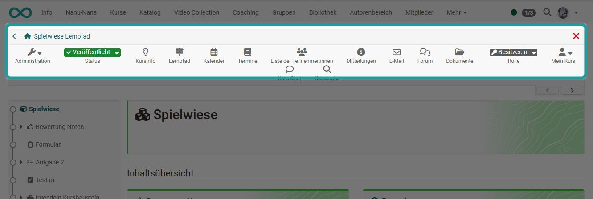
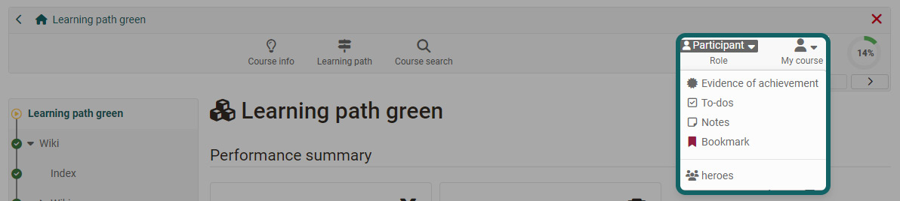
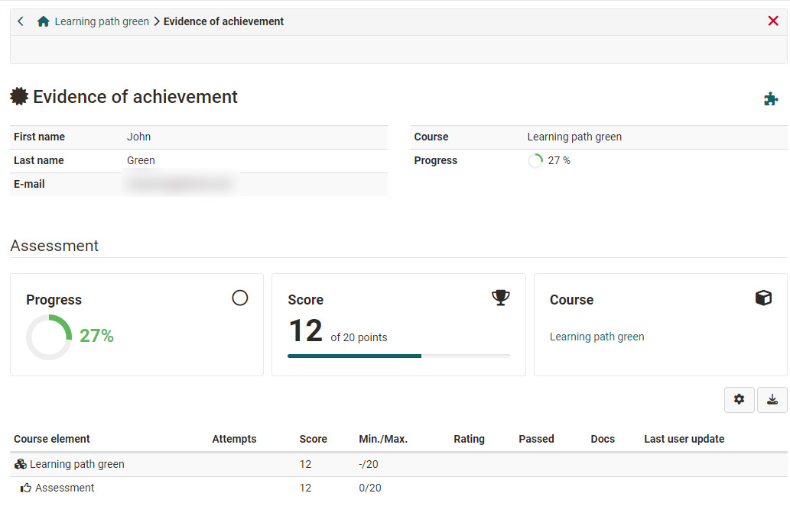

# Additional Course Features

{ class="shadow lightbox" }

In the toolbar of a course, participants have a number of additional course functions at their disposal. Some elements, such as ["Course info"](../learningresources/Info_page.md), "My course" or the "Learning path" area (for learning path courses), are added automatically. The "Events" element also appears automatically in the toolbar once ["Events and absences"](../learningresources/Events_and_absences.md) has been activated in the course.

Other tools can be additionally activated by the course owners under `Administration > Settings > Toolbar`. For more information on these activatable tools, see the separate page ["Using Additional Course Features"](../learningresources/Using_Additional_Course_Features.md).

## Menu "My course"

The drop-down menu "My course" in the toolbar provides access to personalized parts of the course.

{ class="shadow lightbox" }

Depending on the configuration of the course, not all of the following entries may be displayed.

* **Evidence of achievement** shows your individual assessments in the course and, if activated, gives access to the course [certificate](../learningresources/Course_Settings_Assessment.md#section_certificate).
* **To-dos** shows the current to-dos of the course.
* **Notes**: Here you can enter course-specific notes that only you as a course participant can read.
* **Bookmark**: Activate the bookmark, and the course appears in the "Courses" menu under the "Favourites" tab.
* **Consent**: If there are specific terms of use and/or a course-related privacy policy in the course that you have agreed to, you can view them here and also revoke your consent.
* **Groups**: Here you see all course-specific groups you are a member of and can navigate directly to them.
* With **"Leave course"** you can remove yourself from the course.

### Evidence of Achievement

An evidence of achievement is a confirmation of a completed assessment and must first be activated by the course owner. Participants then see the individual assessment elements completed in the course, such as tests or tasks, their points and further information.

{ class="shadow lightbox" }

If a [certificate](../learningresources/Course_Settings_Assessment.md#section_certificate) has been issued for the course, you will also find it under "Evidence of achievement" for download. Coaches of the course can view the certificates in the [coaching tool](../area_modules/Coaching.md).

For certificates issued automatically after successfully completing a course, you receive an automatically generated notification by e-mail.

!!! tip "All evidences of achievement at a glance"

    Evidences of achievement and certificates from all your courses can be found in the personal menu under ["Evidence of achievement"](../personal_menu/Personal_Tools.md#evidences_of_achievement).

### To-dos [:octicons-tag-16:{ title="from Release 18.2 (OO-7039)" }](https://track.frentix.com/issue/OO-7039)
Here, all to-dos of the course relevant to you are shown to participants.
On the one hand, these can be to-dos automatically generated from the [task course elements](../learningresources/Course_Element_Task.md). In that case, you are asked to take a certain step in the task flow, for example select a task or submit a solution.
On the other hand, teachers can assign specific to-dos to all participants or only to individual persons. Participants can change the status of a to-do once they have completed the action.

The to-dos serve participants as an orientation for what currently needs to be done in the course.
Participants find an overview of all personal and course-related to-dos in the ["Personal tools"](../personal_menu/To-Dos.md) area. There, participants can also create their own to-dos.

### Leave course [:octicons-tag-16:{ title="from Release 10.2 (OO-1405)" }](https://track.frentix.com/issue/OO-1405)

The "Leave course" function immediately ends your course or group membership, depending on how you have access to the course. After that, you no longer have access to the course and must contact the respective course or group coach to regain access.

The option to unsubscribe from a course must first be activated by the course owners in the course settings on the "Share" tab and is only valid for participants, not for coaches or owners.

## Learning path in the toolbar
Via the learning path icon in the toolbar, participants get an overview of their progress in all course elements. Depending on the columns selected, additional information such as the type of implementation and dates can also be displayed. This way, participants can easily keep track of their activities in the course.

{ class="shadow lightbox" }

Course owners and coaches first get an overview of all participants via the "Learning path" link and can then select a person in the next step to display their learning progress.

## Other activatable toolbar tools at a glance

* [Course search](../basic_concepts/Search_in_Course.md): Search the course by keywords
* **Course calendar**: Access to the course-specific calendar
* Participant list: Overview of **course members**
* **Notifications**: Here, the teacher can store central course information.
* **E-mail**: Contact option for the course owners and coaches
* **BigBlueButton** (or other virtual classrooms): For synchronous meetings
* **Blog**: Access to a central course blog
* **Wiki**: Access to a central wiki for the course
* **Forum**: Access to a central course forum
* **Documents**: Access to a central documents folder
* **Glossary**: Access to the course glossary, if a glossary has been linked to the course
* [Course chat](../basic_concepts/Chat.md): For the synchronous exchange of course members
* [External course tools](../learningresources/Course_Settings_Toolbar.md#external_tools): Up to four configurable links to external web applications

Further information on the tools can be found under ["Using Additional Course Features"](../learningresources/Using_Additional_Course_Features.md).

## Further information {: #further_information}

**Mentioned on this page** 
[Toolbar: Info page >](../learningresources/Info_page.md) 
[Events and absences >](../learningresources/Events_and_absences.md) 
[Using Additional Course Features >](../learningresources/Using_Additional_Course_Features.md) 
[Course Settings - Tab Assessment >](../learningresources/Course_Settings_Assessment.md) 
[Coaching - Overview >](../area_modules/Coaching.md) 
[Personal tools >](../personal_menu/Personal_Tools.md) 
[Course Element "Task" >](../learningresources/Course_Element_Task.md) 
[Personal tools: To-dos >](../personal_menu/To-Dos.md) 
[Search in a course >](../basic_concepts/Search_in_Course.md) 
[Chat >](../basic_concepts/Chat.md) 
[Course Settings - Tab Toolbar >](../learningresources/Course_Settings_Toolbar.md)

**Further reading** 
[Toolbar: My Course >](../learningresources/Toolbar_My_Course.md) 
[Course Administration: Overview >](../learningresources/Administration.md) 
[Toolbar: Events >](../learningresources/Toolbar_Events.md) 
[Toolbar: Overview >](../learningresources/Toolbar.md)

[To the top of the page ^](#additional-course-features)
