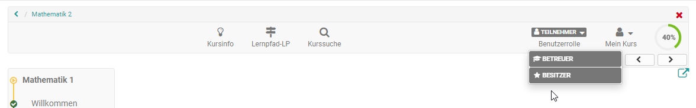

# Kursbetrieb

:octicons-device-camera-video-24: **Video-Einführung**: [Admin-Funktionen](<https://www.youtube.com/embed/rWPcz6udUrI>){:target="_blank”} 

Sie haben Ihren Kurs freigeschaltet und Kursteilnehmende bearbeiten bereits die Lerninhalte. Dieses Kapitel erklärt, welche Werkzeuge Sie als Kursbesitzer während des Kursbetriebs nutzen können, welche zusätzlichen Funktionen im Kurs zur Verfügung stehen und wie Sie Kursaktivitäten aufzeichnen können. 

Die meisten zentralen Einstellungen nehmen Sie über die Menüs, die Sie in der [Administration](Using_Course_Tools/) finden vor:

 * die [Mitgliederverwaltung](Members_management.de.md) zur Organisation der Teilnehmenden, Gruppen usw.
 * der [Ablageordner](Storage_folder.de.md) für die Ablage und Organisation der kursspezifischen Dateien
 * das [Bewertungswerkzeug](Assessment_tool_overview.de.md) für die Punktevergabe, die Bereitstellung von Feedbacks und die Organisation von Assessment Kursbausteinen
  * [Lektionen und Absenzen](Lectures_and_absences.de.md) für die Organisation von Abwesenheitsterminen der Teilnehmenden
  * das Menü [Erinnerung](Course_Reminders.de.md) für den Versand von Erinnerungen z.B. bezüglich Assessment Terminen
  * [Datenarchivierung](Data_archiving.de.md) für die Sicherung von Kursergebnissen und weiteren Dingen.

Auch der Einsatz weiterer Kursfunktionen der [Toolbar](Using_Additional_Course_Features.de.md) wird in diesem Kapitel erläutert. 

 **Rollenwechsel:**

Noch ein wichtiger Tipp, der Ihnen die Arbeit an einem Kurs und die Betrachtung des Kurses aus unterschiedlichen Rollen erleichtert: 

Wenn Sie als Kursbesitzer oder Betreuer in einem Kurs **mehr als eine Rolle** innehaben (siehe [Mitgliederverwaltung](Members_management.de.md)) erscheint in der [Kurs-Toolbar](Using_Additional_Course_Features.de.md)  die Möglichkeit, bei geschlossenem Editor die Benutzerrolle zu wechseln und sich so den Kurs aus Sicht der unterschiedlichen Rollen anzuschauen. 

Je nachdem welche Rollen Sie im Kurs haben, sehen Sie die jeweiligen Basis-Rollen angezeigt. Dabei wird nicht noch einmal zwischen Betreuern und Gruppenbetreuern oder Teilnehmern und Gruppenteilnehmern unterschieden, sondern die Möglichkeiten innerhalb der Rolle Betreuer bzw. Teilnehmer zusammengefasst.

{ class="shadow lightbox" }

Der Rollenwechsel bietet sich z.B. an, wenn man als Kursbesitzer die Teilnehmenden-Rolle einnehmen möchte. Auch kann man sich so den Flow der Kursbausteine Aufgabe, Gruppenaufgabe, Checkliste oder des Teilnehmer Ordners aus der Teilnehmersicht anschauen.
