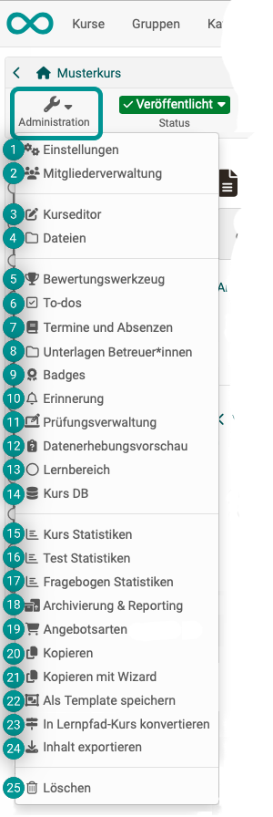

# Administration: Übersicht {: #course_administration}

{ class="shadow lightbox aside-left-lg" }

:octicons-device-camera-video-24: **Video-Einführung**: [Admin-Funktionen](<https://www.youtube.com/embed/rWPcz6udUrI>){:target="_blank”} 

Haben Sie als **Autor:in** einen Kurs ausgewählt, wird Ihnen links oben der Button "Administration" angezeigt. Dort finden Sie alle Optionen zur **Bearbeitung, Konfiguration und Administration** des gewählten Kurses. (Vor und während der Nutzung des Kurses.) Zu den wichtigsten zählen für Autor:innen der [Kurseditor](#course_editor) und die [Einstellungen](#settings).

**Betreuer:innen** steht der Button "Administration" ebenfalls zur Verfügung. Allerdings sind dann weniger und nur für Betreuer:innen relevante Optionen angezeigt. Insbesondere z.B. das [Bewertungswerkzeug](#assessment_tool).

!!! info "Hinweis"

    Manche Optionen stehen nur zur Verfügung, wenn das entsprechende Feature aktiviert wurde. Wenden Sie sich gegebenenfalls an Ihren/Ihre Administrator:in.

Andere Lernressourcen verfügen ebenfalls über das Menü "Administration", jedoch sind die Menüoptionen dort nicht so umfangreich. Sie variieren je nach Lernressource.

Im Folgenden erhalten Sie einen Überblick über die Menüoptionen der "Administration" von **Kursen**.

---

## Einstellungen {: #settings}

{ class=" aside-left-lg" }

Hier werden alle Einstellungen gemacht, die den **Kurs als Ganzes betreffen**. (Einstellungen, die nur einen bestimmten Kursbaustein betreffen, werden im Kurseditor nach Anwahl des betreffenden Kursbausteins gemacht.)

[Zu den Details >](Course_Settings.de.md) 
[Zum Seitenanfang ^](#course_administration)

## Mitgliederverwaltung {: #members_management}

{ class=" aside-left-lg" }

In der Mitgliederverwaltung finden Kursbesitzer:innen eine Auflistung aller Personen die Zugriff auf den Kurs bzw. die Lernressource haben. Sie können hier weiteren Benutzer:innen und Gruppen Zugriff gewähren, indem Sie jemand zum Mitglied des Kurses machen.

[Zu den Details >](Members_management.de.md) 
[Zum Seitenanfang ^](#course_administration)

## Kurseditor {: #course_editor}

{ class=" aside-left-lg" }

Im Kurseditor kann der Kurs bearbeitet werden, indem Kursbausteine hinzugefügt und konfiguriert werden.

[Zu den Details >](General_Configuration_of_Course_Elements.de.md) 
[Zum Seitenanfang ^](#course_administration)

## Dateien {: #files}

{ class=" aside-left-lg" }

Manche im Kurs verwendete Dateien werden im **Ablageordner** abgelegt. Dieser gehört zum Kurs und kann hier geöffnet werden. 
(Andere Dateien und Objekte werden mit anderen Benutzer:innen geteilt, sind an anderen Stellen abgelegt und können im File Hub oder Media Center verwaltet werden.)

[Zu den Details über den Ablageordner >](Storage_folder.de.md) 
[Zu den Details über den File Hub >](../personal_menu/File_Hub.de.md) 
[Zu den Details über das Media Center >](../personal_menu/Media_Center.de.md) 
[Über die Unterschiede zwischen Ablageordner, File Hub und Media Center >](../basic_concepts/Object_Collections.de.md) 

[Zum Seitenanfang ^](#course_administration)

## Bewertungswerkzeug {: #assessment_tool}

{ class=" aside-left-lg" }

Das Bewertungswerkzeug (nicht zu verwechseln mit dem Kursbaustein "Bewertung") dient der Betreuung und Ergebniskontrolle aller Kursteilnehmer:innen. Hier hat man Zugriff auf alle bewertbaren Kursbausteine und kann z.B. Bewertungen mit Punktevergabe, bestanden/nicht bestanden usw. vornehmen und individuelle Feedbacks bereitstellen.

[Zu den Details >](Assessment_tool_overview.de.md) 
[Zum Seitenanfang ^](#course_administration)

## To-dos {: #to-dos}

{ class=" aside-left-lg" }

To-dos, die einen bestimmten Kurs betreffen, können direkt hier im Kurs erstellt werden. Es können To-dos an alle Kursteilnehmer:innen  oder an Einzelpersonen vergeben werden.

[Zu den Details >](Course_todos.de.md) 
[Zum Seitenanfang ^](#course_administration)

## Termine und Absenzen {: #events_and_absences_}

{ class=" aside-left-lg" }
  
Hier finden Sie das Werkzeug zur Administration von Terminen und Abwesenheiten der Teilnehmenden.

[Zu den Details >](Lectures_and_absences.de.md) 
[Zum Seitenanfang ^](#course_administration)

## Unterlagen Betreuer:innen {: #coach_files}

{ class=" aside-left-lg" }

Sofern aktiviert, können Betreuer:innen und Besitzer:innen des Kurses in diesem gemeinsamen Ordner Dateien ablegen, auf die nur sie zugreifen können. 

[Zu den Details >](Coach_Files.de.md) 
[Zum Seitenanfang ^](#course_administration)

## Badges {: #badges}

{ class=" aside-left-lg" }

Sofern aktiviert, können hier kursbezogene Badges erstellt, editiert und angezeigt werden.

[Zu den Details >](OpenBadges.de.md) 
[Zum Seitenanfang ^](#course_administration)

## Erinnerungen {: #reminders}

{ class=" aside-left-lg" }

Mit der Erinnerungsfunktion wird der automatische Versand von Mails organisiert. Der Versand kann an verschiedene Bedingungen geknüpft werden.

[Zu den Details >](Course_Reminders.de.md) 
[Zum Seitenanfang ^](#course_administration)

## Prüfungsverwaltung {: #assessment_management}

{ class=" aside-left-lg" }

Unter dieser Menüoption können Sie Konfigurationen für Prüfungsmodi erstellen, bearbeiten und anzeigen lassen. Sie können beispielsweise einen Prüfungsmodus konfigurieren, der für die Teilnehmer:innen nur bestimmte Kursbausteine aufrufbar macht und auch den Aufruf anderer Informationsquellen für die Teilnehmer:innen einschränkt.

[Zu den Details des Prüfungsmodus >](Assessment_mode.de.md) 
[Zu den Details der Prüfungseinsicht >](Assessment_inspection.de.md) 
[Zum Seitenanfang ^](#course_administration)

## Datenerhebungsvorschau {: #data_collection_previews}

{ class=" aside-left-lg" }

Sofern aktiviert, können Kursbesitzer:innen die geplanten Erhebungen des **Moduls Qualitätsmanagement** des Kurses einsehen. Für Kursbesitzer:innen ist diese Vorschau rein informativ. Eine Bearbeitung ist lediglich für Qualitätsmanager:innen möglich.

[Zu den Details über das Qualitätsmanagement >](../../manual_admin/administration/Modules_Quality_Management.de.md) 
[Zum Seitenanfang ^](#course_administration)

## Lernbereiche {: #learning_areas}

{ class=" aside-left-lg" }

Mit Hilfe eines Lernbereichs können mehrere Gruppen eines Kurses gebündelt werden. Unter dieser Menüoption können die Lernbereiche des Kurses erstellt, angezeigt und editiert werden.

[Zu den Details >](Learning_Areas.de.md) 
[Zum Seitenanfang ^](#course_administration)

## Kurs DB {: #course_DB}

{ class=" aside-left-lg" }

Hier können Sie eine neue kurspezifische Datenbank anlegen, die bestimmte kurspezifische Informationen speichern kann.

[Zum Seitenanfang ^](#course_administration)

## Kurs Statistiken {: #course_statistics}

{ class=" aside-left-lg" }

Diese Kursfunktion zeigt Ihnen Statistiken über den Zugriff auf Ihren OpenOlat-Kurs an. Zugang zu den Statistiken haben alle Besitzer:innen dieses Kurses.

[Zu den Details >](Statistics_Course.de.md) 
[Zum Seitenanfang ^](#course_administration)

## Test Statistiken {: #test_statistics}

{ class=" aside-left-lg" }

Die Test-Statistiken erlauben generelle kursbezogene, anonymisierte statistische Auswertung der OpenOlat-Tests eines Kurses. Angezeigt werden alle im Kurs enthaltenen Tests.

[Zu den Details >](Statistics_Test.de.md) 
[Zum Seitenanfang ^](#course_administration)

## Fragenbogen Statistiken {: #survey_statistics}

{ class=" aside-left-lg" }

Die Fragebogen-Statistiken erlauben Ihnen die generelle kursbezogene, anonymisierte statistische Auswertung Ihrer Umfragen.

[Zu den Details >](Statistics_Survey.de.md) 
[Zum Seitenanfang ^](#course_administration)

## Archivierung & Reporting {: #archiving_reporting}

{ class=" aside-left-lg" }

Hier können Elemente des Kurses mit Hilfe eines Wizards archiviert werden. Es kann ein Gesamtarchiv oder ein Teilarchiv mit ausgewählten Kursbausteinen erstellt werden, sowie Kursresultate u.a.

[Zu den Details >](Course_Archiving.de.md)  
[Zu den Details 2 >](Data_archiving.de.md)  
[Zum Seitenanfang ^](#course_administration)

## Angebotsarten {: #offer_types}

{ class=" aside-left-lg" }

Um einen Kurs oder eine andere Lernressource im Katalog anzubieten, benötigt es jeweils mindestens ein Angebot. Es können aber auch mehrere verschiedene Angebote erstellt werden, zu denen Sie hier die Buchungsaufträge finden.

[Zu den Details >](Offer_Types.de.md)  
[Zum Seitenanfang ^](#course_administration)

## Kopieren {: #copy}

{ class=" aside-left-lg" }

Beim Kopieren eines Kurses werden die komplette Struktur, Ordnerinhalte, HTML-Seiten und Gruppennamen (ohne Gruppenmitglieder) übernommen. Benutzerdaten wie Forenbeiträge, Gruppenmitglieder etc. werden jedoch nicht kopiert.

[Zu den Details >](Course_Copy.de.md)  
[Zum Seitenanfang ^](#course_administration)

## Kopieren mit Wizard {: #copy_wizard}

{ class=" aside-left-lg" }

Wenn Sie einen Kurs mit Hilfe des Wizards kopieren, können Sie die zu kopierenden Elemente auswählen.

[Zu den Details >](Course_Copy_Wizard.de.md)  
[Zum Seitenanfang ^](#course_administration)

## Als Template speichern {: #copy_template}

{ class=" aside-left-lg" }

Soll ein bestehender Kurs für die Verwendung mit dem Course Planner zur Instanzierung in Durchführungen verwendet werden, speichern Sie ihn als Template.

[Zu den Details >](Course_Copy_Template.de.md)  
[Zum Seitenanfang ^](#course_administration)

## In Lernpfad-Kurs konvertieren

{ class=" aside-left-lg" }

Herkömmliche Kurse (und damit u.a. alle Kurse die vor der OpenOlat Version 15 erstellt wurden), können über dieses Werkzeug in einen Lernpfad-Kurs konvertiert werden. Beim Konvertieren muss als erstes entschieden werden, ob ein der Kurs "mit Lernpfad" oder "Mit Fortschritt" erstellt werden soll. 

Diese Funktion ist nur für herkömmliche Kurse verfügbar.

!!! info "Tipp"

     Wenn der Kurs lediglich in das aktuelle Format übertragen werden soll, ist in den meisten Fällen die Option „Mit Lernfortschritt“ die bessere Wahl. Hier muss die Kursstruktur nicht in einer festen Reihenfolge bearbeitet werden, was der Hypermedia-Struktur des Ausgangskurses eher entspricht. Diese Einstellung kann bei Bedarf auch nachträglich im Kurseditor des kopierten Kurses am obersten Kursbaustein angepasst werden.
     
     Beachten Sie, dass grundsätzlich Gäste keinen Zugang zu Lernpfad-Kursen haben. 

[Zum Seitenanfang ^](#course_administration)

## Inhalt exportieren {: #export_content}

{ class=" aside-left-lg" }

Exportieren Sie Ihre Lernressourcen als ZIP-Datei um eine Sicherungskopie zu erhalten oder um die Lernressource in einer anderen OpenOlat Instanz zu importieren.

[Zu den Details >](Export_Content.de.md)  
[Zum Seitenanfang ^](#course_administration)

## Löschen {: #delete}

{ class=" aside-left-lg" }

Beim Löschen wird ein Kurse zunächst in den Papierkorb verschoben und alle Benutzerdaten werden entfernt. (Das gilt auch für Lernressourcen.)

[Zu den Details >](Course_Delete.de.md)  
[Zum Seitenanfang ^](#course_administration)

## Weiterführende Informationen {: #further_information}

[Funktionen der Toolbar >](Using_Additional_Course_Features.de.md)

