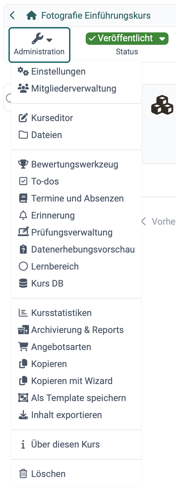
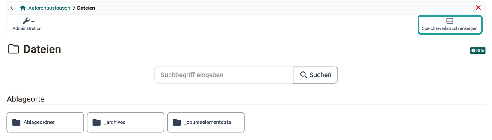
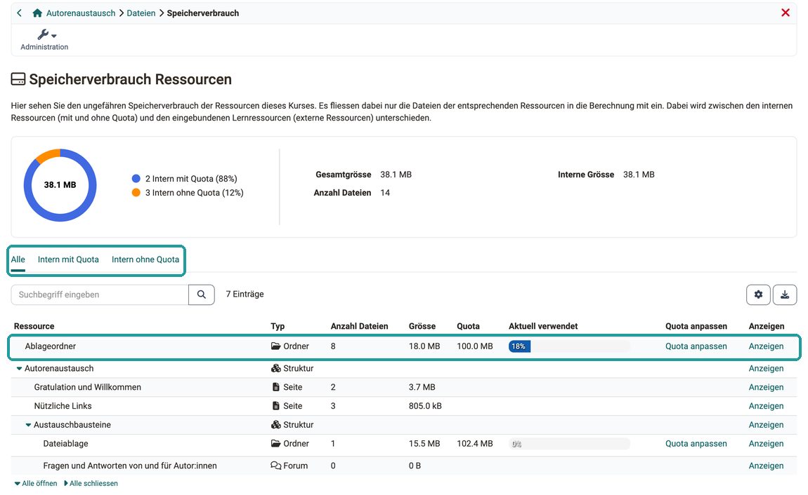

# Kurs-Administration: Übersicht {: #course_administration}

{ class="shadow lightbox aside-left-lg" }

:octicons-device-camera-video-24: **Video-Einführung**: [Admin-Funktionen](<https://www.youtube.com/embed/rWPcz6udUrI>){:target="_blank"}

Sind Sie **Besitzer:in** eines Kurses, wird Ihnen links oben der Button "Administration" angezeigt. Dort finden Sie alle Optionen zur **Bearbeitung, Konfiguration und Administration** des Kurses, vor und während seiner Nutzung. Dieselben Optionen sehen Administrator:innen und Lernressourcenverwalter:innen der Organisation, der der Kurs angehört. Zu den wichtigsten zählen der [Kurseditor](#course_editor) und die [Einstellungen](#settings).

**Betreuer:innen** steht der Button "Administration" ebenfalls zur Verfügung. Allerdings sind dann weniger und nur für Betreuer:innen relevante Optionen angezeigt. Insbesondere z.B. das [Bewertungswerkzeug](#assessment_tool). Personen, denen im [Bereich "Rechte" der Mitgliederverwaltung](Members_management.de.md#section_rights) einzelne Rechte erteilt wurden, sehen die Optionen zu diesen Rechten.

!!! info "Wichtig"

    Manche Optionen stehen nur zur Verfügung, wenn das entsprechende Feature aktiviert ist. Wenden Sie sich gegebenenfalls an die Administrator:innen Ihrer Organisation.

Andere Lernressourcen verfügen ebenfalls über das Menü "Administration", jedoch sind die Menüoptionen dort nicht so umfangreich. Sie variieren je nach Lernressource.

Im Folgenden erhalten Sie einen Überblick über die Menüoptionen der "Administration" von **Kursen**.

---

## Einstellungen {: #settings}

Hier werden alle Einstellungen gemacht, die den **Kurs als Ganzes betreffen**. (Einstellungen, die nur einen bestimmten Kursbaustein betreffen, werden im Kurseditor nach Anwahl des betreffenden Kursbausteins gemacht.)

[Zu den Details >](Course_Settings.de.md) 
[Zum Seitenanfang ^](#course_administration)

## Mitgliederverwaltung {: #members_management}

In der Mitgliederverwaltung finden Kursbesitzer:innen eine Auflistung aller Personen die Zugriff auf den Kurs bzw. die Lernressource haben. Sie können hier weiteren Benutzer:innen und Gruppen Zugriff gewähren, indem Sie jemand zum Mitglied des Kurses machen.

[Zu den Details >](Members_management.de.md) 
[Zum Seitenanfang ^](#course_administration)

## Kurseditor {: #course_editor}

Im Kurseditor kann der Kurs bearbeitet werden, indem Kursbausteine hinzugefügt und konfiguriert werden.

[Zu den Details >](General_Configuration_of_Course_Elements.de.md) 
[Zum Seitenanfang ^](#course_administration)

## Dateien {: #files}

Manche im Kurs verwendete Dateien werden im **Ablageordner** abgelegt. Dieser gehört zum Kurs und kann hier geöffnet werden. 
(Andere Dateien und Objekte werden mit anderen Benutzer:innen geteilt, sind an anderen Stellen abgelegt und können im File Hub oder Media Center verwaltet werden.)

[Zu den Details über den Ablageordner >](Storage_folder.de.md) 
[Zu den Details über den File Hub >](../personal_menu/File_Hub.de.md) 
[Zu den Details über das Media Center >](../personal_menu/Media_Center.de.md) 

### Speicherverbrauch [:octicons-tag-16:{ title="ab Release 18.0.2 (OO-6938)" }](https://track.frentix.com/issue/OO-6938){:target="_blank"} {: #storage_usage}

Wird ein Kurs gross oder geht ein Upload nicht mehr durch, zeigt die Auswertung Speicherverbrauch, welche Ordner und Kursbausteine wie viel Speicher belegen und wo eine Quota die Grenze setzt. So sehen Sie, wo Sie aufräumen können und ob Sie mehr Platz anfordern müssen.

Sie öffnen die Auswertung im Bereich "Dateien" mit dem Button :o_icon_o_icon_hdd: "Speicherverbrauch anzeigen" oben rechts: 
`Kurs > Administration > Dateien > Speicherverbrauch anzeigen`

{ class="shadow lightbox" title="Bereich Dateien der Kurs-Administration" }

Den Bereich "Dateien" sehen Besitzer:innen des Kurses und Personen, denen im [Bereich "Rechte" der Mitgliederverwaltung](Members_management.de.md#section_rights) das Recht "Kurseditor" erteilt wurde.

Die Seite "Speicherverbrauch Ressourcen" zeigt oben die Werte "Gesamtgrösse", "Interne Grösse" und "Anzahl Dateien" des Kurses, dazu ein Kreisdiagramm mit dem Anteil der Ressourcen mit und ohne Quota. Darunter listet eine Tabelle den Ablageordner und die Kursbausteine in der Struktur des Kurses. Über das Suchfeld finden Sie eine Zeile nach Name oder Typ, "Alle öffnen" und "Alle schliessen" klappen die Struktur auf und zu. Je Zeile stehen der Typ, die Anzahl Dateien, die Grösse, die Quota und in der Spalte "Aktuell verwendet" ein Balken, wie viel der Quota belegt ist. Ab 80 Prozent hebt OpenOlat den Balken farbig hervor. Mit "Anzeigen" öffnen Sie den Ordner oder den Kursbaustein der Zeile. Die Tabelle lässt sich als Excel-Datei exportieren.

{ class="shadow lightbox" title="Seite Speicherverbrauch Ressourcen eines Kurses" }

Drei Filter grenzen die Tabelle ein:

* "Alle": alle Ordner und Kursbausteine des Kurses, auch solche ohne Dateien.
* "Intern mit Quota": die Ordner mit eigener Quota. Das sind der Ablageordner, "Unterlagen Betreuer:innen" und "Dokumente (Toolbar)" sowie die Kursbausteine "Ordner" und "Teilnehmer:innen Ordner".
* "Intern ohne Quota": die Kursbausteine, die Speicher belegen, aber keine eigene Quota haben. Das sind "Forum", "Dateidiskussion", "Aufgabe", "Gruppenaufgabe", "Seite" und "Themenbörse".

Verwendet ein Kursbaustein "Ordner" als Ablageort einen Ordner aus dem Ablageordner, erscheint er nicht als eigene Zeile. Dasselbe gilt für "Unterlagen Betreuer:innen" und "Dokumente (Toolbar)", wenn sie einen Ordner aus dem Ablageordner nutzen. Die Dateien zählen dann zum Ablageordner und fallen unter dessen Quota. Beim Kursbaustein "Teilnehmer:innen Ordner" zeigt die Tabelle je Teilnehmer:in den Abgabeordner und den Rückgabeordner. Die Quota gilt für jeden dieser Ordner einzeln.

#### Quota anpassen {: #storage_usage_edit_quota}

Die Aktion "Quota anpassen" steht nur in den Zeilen mit eigener Quota: beim Ablageordner, bei "Unterlagen Betreuer:innen" und "Dokumente (Toolbar)" sowie bei den Kursbausteinen "Ordner" und "Teilnehmer:innen Ordner". Die Kursbausteine "Forum", "Dateidiskussion", "Aufgabe", "Gruppenaufgabe", "Seite" und "Themenbörse" zählen ihren Verbrauch, haben aber keine Quota, die sich anpassen lässt.

Ändern können die Quota [Administrator:innen, Systemadministrator:innen und Lernressourcenverwalter:innen](../basic_concepts/Roles.de.md#org) der Organisation, der der Kurs angehört. Alle anderen sehen im Dialog "Quota anpassen" die aktuellen Werte, aber keinen Button zum Speichern. Brauchen Sie für einen Ordner mehr Platz, wenden Sie sich an eine dieser Personen.

Weitere Wege, den Speicherbedarf zu senken, beschreibt die Anleitung ["Mit welchen Massnahmen kann ich den Speicherverbrauch reduzieren?"](../../manual_how-to/reduce_storage_consumption/reduce_storage_consumption.de.md).

[Zum Seitenanfang ^](#course_administration)

## Bewertungswerkzeug {: #assessment_tool}

Das Bewertungswerkzeug (nicht zu verwechseln mit dem Kursbaustein "Bewertung") dient der Betreuung und Ergebniskontrolle aller Kursteilnehmer:innen. Hier hat man Zugriff auf alle bewertbaren Kursbausteine und kann z.B. Bewertungen mit Punktevergabe, bestanden/nicht bestanden usw. vornehmen und individuelle Feedbacks bereitstellen.

[Zu den Details >](Assessment_tool_overview.de.md) 
[Zum Seitenanfang ^](#course_administration)

## To-dos [:octicons-tag-16:{ title="ab Release 18.2 (OO-7039)" }](https://track.frentix.com/issue/OO-7039){:target="_blank"} {: #to-dos}

To-dos, die einen bestimmten Kurs betreffen, können direkt hier im Kurs erstellt werden. Es können To-dos an alle Kursteilnehmer:innen oder an Einzelpersonen vergeben werden.

[Zu den Details >](Course_todos.de.md) 
[Zum Seitenanfang ^](#course_administration)

## Badges [:octicons-tag-16:{ title="ab Release 18.0 (OO-7003)" }](https://track.frentix.com/issue/OO-7003){:target="_blank"} {: #badges}

Sofern aktiviert, können hier kursbezogene Badges erstellt, editiert und angezeigt werden.

[Zu den Details >](OpenBadges.de.md) 
[Zum Seitenanfang ^](#course_administration)

## Unterlagen Betreuer:innen [:octicons-tag-16:{ title="ab Release 16.0 (OO-5566)" }](https://track.frentix.com/issue/OO-5566){:target="_blank"} {: #coach_files}

Sofern aktiviert, können Betreuer:innen und Besitzer:innen des Kurses in diesem gemeinsamen Ordner Dateien ablegen, auf die nur sie zugreifen können.

[Zu den Details >](Coach_Files.de.md) 
[Zum Seitenanfang ^](#course_administration)

## Termine und Absenzen [:octicons-tag-16:{ title="ab Release 12.0 (OO-2636)" }](https://track.frentix.com/issue/OO-2636){:target="_blank"} {: #events_and_absences_}

Hier finden Sie das Werkzeug zur Administration von Terminen und Absenzen der Teilnehmenden.

[Zu den Details >](Events_and_absences.de.md) 
[Zum Seitenanfang ^](#course_administration)

## Erinnerung [:octicons-tag-16:{ title="ab Release 10.3 (OO-1494)" }](https://track.frentix.com/issue/OO-1494){:target="_blank"} {: #reminders}

Mit der Erinnerungsfunktion wird der automatische Versand von Mails organisiert. Der Versand kann an verschiedene Bedingungen geknüpft werden.

[Zu den Details >](Course_Reminders.de.md) 
[Zum Seitenanfang ^](#course_administration)

## Prüfungsverwaltung [:octicons-tag-16:{ title="ab Release 10.2 (OO-1349)" }](https://track.frentix.com/issue/OO-1349){:target="_blank"} {: #assessment_management}

Unter dieser Menüoption können Sie Konfigurationen für Prüfungsmodi erstellen, bearbeiten und anzeigen lassen. Sie können beispielsweise einen Prüfungsmodus konfigurieren, der für die Teilnehmer:innen nur bestimmte Kursbausteine aufrufbar macht und auch den Aufruf anderer Informationsquellen für die Teilnehmer:innen einschränkt.

[Zu den Details des Prüfungsmodus >](Assessment_mode.de.md) 
[Zu den Details der Prüfungseinsicht >](Assessment_inspection.de.md) 
[Zum Seitenanfang ^](#course_administration)

## Datenerhebungsvorschau [:octicons-tag-16:{ title="ab Release 18.2 (OO-7399)" }](https://track.frentix.com/issue/OO-7399){:target="_blank"} {: #data_collection_previews}

Sofern aktiviert, können Kursbesitzer:innen die geplanten Erhebungen des **Moduls Qualitätsmanagement** des Kurses einsehen. Für Kursbesitzer:innen ist diese Vorschau rein informativ. Eine Bearbeitung ist lediglich für Qualitätsmanager:innen möglich.

[Zu den Details über das Qualitätsmanagement >](../../manual_admin/administration/Modules_Quality_Management.de.md) 
[Zum Seitenanfang ^](#course_administration)

## Lernbereich {: #learning_areas}

Mit Hilfe eines Lernbereichs können mehrere Gruppen eines Kurses gebündelt werden. Unter dieser Menüoption können die Lernbereiche des Kurses erstellt, angezeigt und editiert werden.

[Zu den Details >](Learning_Areas.de.md) 
[Zum Seitenanfang ^](#course_administration)

## Kurs DB {: #course_DB}

Hier können Sie eine neue kursspezifische Datenbank anlegen, die bestimmte kursspezifische Informationen speichern kann.

[Zum Seitenanfang ^](#course_administration)

## Kursstatistiken {: #course_statistics}

Diese Kursfunktion zeigt Ihnen Statistiken über den Zugriff auf Ihren OpenOlat-Kurs an. Zugang zu den Statistiken haben alle Besitzer:innen dieses Kurses. Betreuer:innen und weitere Mitglieder sehen den Menüpunkt nur, wenn ihnen das Recht "Statistiken" erteilt wurde.

[Zu den Details >](Statistics_Course.de.md) 
[Zum Seitenanfang ^](#course_administration)

## Teststatistiken {: #test_statistics}

Die Teststatistiken erlauben generelle kursbezogene, anonymisierte statistische Auswertung der OpenOlat-Tests eines Kurses. Angezeigt werden alle im Kurs enthaltenen Tests. Der Menüpunkt erscheint, sobald der Kurs einen Kursbaustein "Test" enthält.

[Zu den Details >](Statistics_Test.de.md) 
[Zum Seitenanfang ^](#course_administration)

## Fragebogen Statistiken {: #survey_statistics}

Die Fragebogen-Statistiken erlauben Ihnen die generelle kursbezogene, anonymisierte statistische Auswertung Ihrer Umfragen. Der Menüpunkt erscheint, sobald der Kurs einen Kursbaustein "Umfrage" enthält.

[Zu den Details >](Statistics_Survey.de.md) 
[Zum Seitenanfang ^](#course_administration)

## Archivierung & Reports {: #archiving_reporting}

Hier können Elemente des Kurses mit Hilfe eines Wizards archiviert werden. Es kann ein Gesamtarchiv oder ein Teilarchiv mit ausgewählten Kursbausteinen erstellt werden, sowie Kursresultate u.a.

[Zu den Details >](Course_Archiving.de.md) 
[Zum Seitenanfang ^](#course_administration)

## Angebotsarten {: #offer_types}

Um einen Kurs oder eine andere Lernressource im Katalog anzubieten, benötigt es jeweils mindestens ein Angebot. Es können aber auch mehrere verschiedene Angebote erstellt werden, zu denen Sie hier die Buchungsaufträge finden.

[Zu den Details >](Offer_Types.de.md) 
[Zum Seitenanfang ^](#course_administration)

## Kopieren {: #copy}

Beim Kopieren eines Kurses werden die komplette Struktur, Ordnerinhalte, HTML-Seiten und Gruppennamen (ohne Gruppenmitglieder) übernommen. Benutzerdaten wie Forenbeiträge, Gruppenmitglieder etc. werden jedoch nicht kopiert.

[Zu den Details >](Course_Copy.de.md) 
[Zum Seitenanfang ^](#course_administration)

## Kopieren mit Wizard [:octicons-tag-16:{ title="ab Release 16.0 (OO-4416)" }](https://track.frentix.com/issue/OO-4416){:target="_blank"} {: #copy_wizard}

Wenn Sie einen Kurs mit Hilfe des Wizards kopieren, können Sie die zu kopierenden Elemente auswählen. Der Menüpunkt erscheint nur in Lernpfad-Kursen.

[Zu den Details >](Course_Copy_Wizard.de.md) 
[Zum Seitenanfang ^](#course_administration)

## Als Template speichern [:octicons-tag-16:{ title="ab Release 20.2 (OO-8896)" }](https://track.frentix.com/issue/OO-8896){:target="_blank"} {: #copy_template}

Soll ein bestehender Kurs für die Verwendung mit dem Course Planner zur Instanzierung in Durchführungen verwendet werden, speichern Sie ihn als Template.

[Zu den Details >](Course_Copy_Template.de.md) 
[Zum Seitenanfang ^](#course_administration)

## Als Kurs instanziieren [:octicons-tag-16:{ title="ab Release 20.2 (OO-8897)" }](https://track.frentix.com/issue/OO-8897){:target="_blank"} {: #instantiate_as_course}

Haben Sie ein Template vorbereitet, erstellen Sie daraus mit diesem Menüpunkt einen neuen Kurs. Ein Wizard führt Sie durch die Erstellung.

Den Menüpunkt gibt es nur in Kursen mit dem Verwendungszweck "Template". Dort steht er an der Stelle von "Als Template speichern".

[Zu den Details >](Creating_Course.de.md#purpose) 
[Zum Seitenanfang ^](#course_administration)

## Als Lernpfad duplizieren {: #duplicate_as_learning_path}

Herkömmliche Kurse (und damit u.a. alle Kurse die vor der OpenOlat Version 15 erstellt wurden), können über dieses Werkzeug in einen Lernpfad-Kurs konvertiert werden. Der ursprüngliche herkömmliche Kurs bleibt erhalten und es wird eine Kopie erzeugt, in der die zusätzlichen Eigenschaften eines Lernpfadkurses ergänzt werden. Beim Konvertieren muss als erstes entschieden werden, ob der Kurs "Mit Lernpfad" oder "Mit Lernfortschritt" erstellt werden soll.

Diese Funktion ist nur für herkömmliche Kurse verfügbar.

!!! tip "Tipp"

    Wenn der Kurs lediglich in das aktuelle Format übertragen werden soll, ist in den meisten Fällen die Option "Mit Lernfortschritt" die bessere Wahl. Hier muss die Kursstruktur nicht in einer festen Reihenfolge bearbeitet werden, was der Hypermedia-Struktur des Ausgangskurses eher entspricht. Diese Einstellung kann bei Bedarf auch nachträglich im Kurseditor des kopierten Kurses am obersten Kursbaustein angepasst werden.

    Beachten Sie, dass grundsätzlich Gäste keinen Zugang zu Lernpfad-Kursen haben.

[Zum Seitenanfang ^](#course_administration)

## Inhalt exportieren {: #export_content}

Exportieren Sie Ihre Lernressourcen als ZIP-Datei um eine Sicherungskopie zu erhalten oder um die Lernressource in einer anderen OpenOlat Instanz zu importieren.

[Zu den Details >](Export_Content.de.md) 
[Zum Seitenanfang ^](#course_administration)

## Über diesen Kurs [:octicons-tag-16:{ title="ab Release 21.1 (OO-9760)" }](https://track.frentix.com/issue/OO-9760){:target="_blank"} {: #about}

Hier schlagen Sie nach, welche ID der Kurs hat, wer ihn erstellt hat und wem er gehört. Das Fenster zeigt auch den externen Link und die Produkte im Course Planner, in denen der Kurs eingebunden ist. Bei anderen Lernressourcen sehen Sie zusätzlich, welche Kurse sie verwenden.

Den Menüpunkt sehen Besitzer:innen des Kurses, Lernressourcenverwalter:innen und Administrator:innen.

[Zu den Details >](Technical_Information_on_Resources_and_Usage.de.md) 
[Zum Seitenanfang ^](#course_administration)

## Löschen {: #delete}

Beim Löschen wird ein Kurs zunächst in den Papierkorb verschoben und alle Benutzerdaten werden entfernt. (Das gilt auch für Lernressourcen.)

Liegt der Kurs im Papierkorb, steht an dieser Stelle der Menüpunkt "Wiederherstellen".

[Zu den Details >](Course_Delete.de.md) 
[Zum Seitenanfang ^](#course_administration)

## Weiterführende Informationen {: #further_information}

[Einsatz weiterer Kursfunktionen der Toolbar >](Using_Additional_Course_Features.de.md) 
[Toolbar: Infoseite >](Info_page.de.md) 
[Rollen und Rechte: Welche Rollen gibt es? >](../basic_concepts/Roles.de.md)

**youtube** 
[Admin-Funktionen](<https://www.youtube.com/embed/rWPcz6udUrI>)

[Zum Seitenanfang ^](#course_administration)

