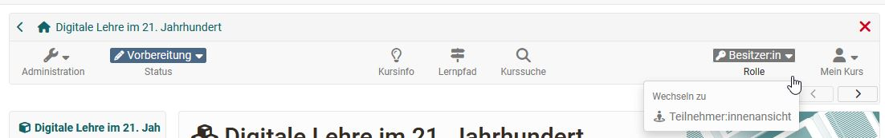

# Übersicht: Kursadministration

:octicons-device-camera-video-24: **Video-Einführung**: [Admin-Funktionen](<https://www.youtube.com/embed/rWPcz6udUrI>){:target="_blank”} 

Sie haben Ihren Kurs freigeschaltet und Kursteilnehmende bearbeiten bereits die Lerninhalte. Dieses Kapitel erklärt, welche Werkzeuge Sie als Kursbesitzer:in während des Kursbetriebs nutzen können, welche zusätzlichen Funktionen im Kurs zur Verfügung stehen und wie Sie Kursaktivitäten aufzeichnen können. 

{ class="shadow lightbox aside-left-lg" }

Die meisten zentralen Einstellungen nehmen Sie vor in den Menüoptionen, die Sie in der [Administration](Using_Course_Tools.de.md) finden z.B.:

 * die [Mitgliederverwaltung](Members_management.de.md)  zur Organisation der Teilnehmenden, Gruppen usw.
 * der [Ablageordner](Storage_folder.de.md) im Menü "Dateien" für die Ablage und Organisation der kursspezifischen Dateien
 * das [Bewertungswerkzeug](Assessment_tool_overview.de.md) für die Punktevergabe, die Bereitstellung von Feedbacks und die Organisation von Assessment Kursbausteinen
  * [Lektionen und Absenzen](Lectures_and_absences.de.md) für die Organisation von Abwesenheitsterminen der Teilnehmenden
  * das Menü [Erinnerung](Course_Reminders.de.md) für den Versand von Erinnerungen z.B. bezüglich Assessment Terminen
  * [Archivierung & Reporting](Data_archiving.de.md) für die Sicherung von Kursergebnissen und weiteren Dingen.

Auch der Einsatz weiterer Kursfunktionen der [Toolbar](Using_Additional_Course_Features.de.md) wird in diesem Kapitel erläutert. 

---

## Rollenwechsel 
In der Toolbar wird Ihnen angezeigt, in welcher Rolle Sie gerade den Kurs betrachten. In der Regel wird das die Rolle "Besitzer:in" sein. Sie können aber jederzeit über das Ausklappmenü in die Teilnehmendenrolle wechseln. 

Sofern Sie noch weitere Rollen im Kurs besitzen werden diese ebenfalls angezeigt und Sie können zur entsprechenden Ansicht wechseln.  

Bei den Rollen wird aber nicht zwischen Betreuer:innen und Gruppenbetreuer:innen oder Teilnehmer:innen und Gruppenteilnehmer:innen unterschieden, sondern die Möglichkeiten innerhalb der Rolle Betreuer:in bzw. Teilnehmer:in zusammengefasst.

Der Rollenwechsel bietet sich z.B. an, wenn man als Kursbesitzer:in die Teilnehmenden-Rolle einnehmen möchte. Auch kann man sich so den Flow der Kursbausteine Aufgabe, Gruppenaufgabe, Checkliste oder des Teilnehmer:innenordners aus der Teilnehmendensicht gut anschauen.

    
Spezialfall: Verhalten bei Einschreibung in eine Gruppe (Einschreibe-Baustein)

    
    <b>Situation:</b>  
    - Sie erstellen einen Kurs mit dem Kursbaustein "Einschreibung". 
    - Sie wechseln in die Teilnehmer:innenansicht und nehmen eine Einschreibung vor.  
    <b>-></b> OpenOlat wechselt danach ungewollt in die Besitzer:innenrolle. 
    - Bei erneutem Wechsel in die Teilnehmer:innenansicht wird der sinnvolle Warndialog ("Sie sind in der Rolle Teilnehmer:in") mit Löschoption für Daten nicht mehr angezeigt. 
    - Erst nach einem erneuten Aufruf des Kurses wird die Teilnehmer:innenansicht mit Warndialog wieder korrekt angezeigt.
      
    <b>Erklärung:</b>  
    Die Teilnehmer:innenansicht ist analog zur Kurs-Freigabe "Ohne Buchung" umgesetzt - man ist in dieser Ansicht nicht in der Kurs-Mitgliederverwaltung eingebucht.
    Es passiert deshalb nun Folgendes: 
    - Trägt man sich im Einschreibe-Baustein in eine Gruppe eine, so wird man in diesem Moment Gruppenteilnehmer:in und ist in der Mitgliederverwaltung des Kurses eingetragen. 
    - Sobald man im Kurs eine eingetragene Mitgliedschaft "Teilnehmer:in" (Kurs oder Gruppe oder Curriculum) besitzt, steht die "Teilnehmer:innen-Ansicht" nicht mehr zur Verfügung. Diese ist nur vorhanden, wenn man nicht in der Kurs-Mitgliederverwaltung als Teilnehmer:in aufgeführt ist. 
    <b>-></b> Schreibe ich mich aus der Teilnehmer:innenansicht in eine Gruppe ein, existiert danach die Teilnehmerinnenansicht für mich nicht mehr, sondern ich bin als Gruppenteilnehmer:in in der Mitgliederverwaltung des Kurses aufgeführt. Deshalb wechselt die Rolle von der Teilnehmerinnenansicht in die Besitzer:innen-Rolle. 
    - Klappt man nun bei den Rollen die Auswahl aus, sieht man anstelle der Teilnehmer:innenansicht nun die Rolle "Teilnehmer:in" aufgeführt. 
    - Trägt man sich aus der Gruppe wieder aus (und lädt den Kurs neu), so ist die Rolle "Teilnehmer:in" wieder weg und stattdessen die Teilnehmer:innenansicht wieder verfügbar.  

