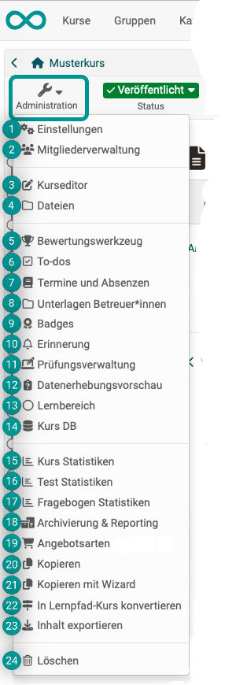

# Administration: Overview {: #course_administration}

{ class="shadow lightbox aside-left-lg" }

:octicons-device-camera-video-24: **Video introduction (German)**: [Admin-Funktionen](<https://www.youtube.com/embed/rWPcz6udUrI>){:target="_blank”} 

If you have selected a course as **author**, the "Administration" button is displayed at the top left. There you will find all options for **editing, configuration and administration** of the selected course. (Before and during use of the course.) The most important options for authors include the [course editor](#course_editor) and the [settings](#settings).

**The "Administration" button is also available for coaches. However, fewer options are then displayed, and only those relevant to coaches. In particular, for example, the [assessment tool](#assessment_tool).

!!! info "Note"

    Some options are only available if the corresponding feature has been activated. If necessary, please contact your administrator.

Other learning resources also have the "Administration" menu, but the menu options there are not as extensive. They vary depending on the learning resource.

Below you will find an overview of the "Administration" menu options for **courses**.

---

## Settings {: #settings}

{ class=" aside-left-lg" }

All settings that affect the **course as a whole** are made here. (Settings that only affect a specific course element are made in the course editor after selecting the relevant course element).

[See the details >](Course_Settings.md) 
[To the top of the page ^](#course_administration)

## Member management {: #members_management}

{ class=" aside-left-lg" }

In the member administration, course owners will find a list of all persons who have access to the course or learning resource. You can grant access to other users and groups here by making someone a member of the course.

[See the details >](Members_management.md) 
[To the top of the page ^](#course_administration)

## Course editor {: #course_editor}

{ class=" aside-left-lg" }

In the course editor the course can be edited by adding and configuring course elements.

[See the details >](General_Configuration_of_Course_Elements.md) 
[To the top of the page ^](#course_administration)

## Files {: #files}

{ class=" aside-left-lg" }

Some files used in the course are stored in the **storage folder**. This belongs to the course and can be opened here. 
(Other files and objects are shared with other users, are stored in other places and can be managed in the File Hub or Media Center).

[See the details about the Storage folder >](Storage_folder.md) 
[See the details about the File Hub >](../personal_menu/File_Hub.md) 
[See the details about the Media Center >](../personal_menu/Media_Center.md) 
[About the differences between Storage folder, File hub and Media center >](../basic_concepts/Object_Collections.md) 

[To the top of the page ^](#course_administration)

## Assessment tool {: #assessment_tool}

{ class=" aside-left-lg" }

The assessment tool (not to be confused with the course element "Assessment") is used to coach and monitor the results of all course participants. Here you have access to all assessable course elements and can, for example, make assessments with points, pass/fail etc. and provide individual feedback.

[See the details >](Assessment_tool_overview.md) 
[To the top of the page ^](#course_administration)

## To-dos {: #to-dos}

{ class=" aside-left-lg" }

To-dos relating to a specific course can be created directly here in the course. To-dos can be assigned to all course participants or to individuals.

[See the details >](Course_todos.md) 
[To the top of the page ^](#course_administration)

## Lectures and absences {: #events_and_absences_}

{ class=" aside-left-lg" }
  
Here you will find the tool for the administration of participants' lectures and absences.

[See the details >](Lectures_and_absences.md) 
[To the top of the page ^](#course_administration)

## Coach files {: #coach_files}

{ class=" aside-left-lg" }

If activated, coaches and owners of the course can store files in this shared folder that only they can access.

[See the details >](Coach_Files.md) 
[To the top of the page ^](#course_administration)

## Badges {: #badges}

{ class=" aside-left-lg" }

If activated, course-related badges can be created, edited and displayed here.

[See the details >](OpenBadges.md) 
[To the top of the page ^](#course_administration)

## Reminders {: #reminders}

{ class=" aside-left-lg" }

The reminder function is used to organize the automatic sending of e-mails. If activated, course-related badges can be created, edited and displayed here.

[See the details >](Course_Reminders.md) 
[To the top of the page ^](#course_administration)

## Assessment management {: #assessment_management}

{ class=" aside-left-lg" }

This menu option allows you to create, edit and display configurations for assessment modes. For example, you can configure an assessment mode that only allows participants to access certain course elements and also restricts participants from accessing other sources of information.

[See the details about the assessment mode >](Assessment_mode.md) 
[See the details about the assessment inspection >](Assessment_inspection.md) 
[To the top of the page ^](#course_administration)

## Data collection preview {: #data_collection_previews}

{ class=" aside-left-lg" }

If activated, course owners can view the planned surveys of the **Quality Management** module of the course. This preview is purely informative for course owners. Editing is only possible for quality managers.

[See the details about quality management >](../../manual_admin/administration/Modules_Quality_Management.md) 
[To the top of the page ^](#course_administration)

## Learning areas {: #learning_areas}

{ class=" aside-left-lg" }

Several groups of a course can be bundled together with the help of a learning area. The learning areas of the course can be created, displayed and edited under this menu option.

[See the details >](Learning_Areas.md) 
[To the top of the page ^](#course_administration)

## Course DB {: #course_DB}

{ class=" aside-left-lg" }

Here you can create a new course-specific database that can store certain course-specific information.

[Zum Seitenanfang ^](#course_administration)

## Course statistics {: #course_statistics}

{ class=" aside-left-lg" }

This course function shows you statistics on access to your OpenOlat course. All owners of this course have access to the statistics.

[See the details >](Statistics_Course.md) 
[To the top of the page ^](#course_administration)

## Test statistics {: #test_statistics}

{ class=" aside-left-lg" }

The test statistics allow general course-related, anonymized statistical assessment of the OpenOlat tests in a course. All tests contained in the course are displayed.

[See the details >](Statistics_Test.md) 
[To the top of the page ^](#course_administration)

## Survey statistics {: #survey_statistics}

{ class=" aside-left-lg" }

The survey statistics allow you to carry out a general course-related, anonymized statistical assessment of your surveys.

[See the details >](Statistics_Survey.md) 
[To the top of the page ^](#course_administration)

## Archiving & Reporting {: #archiving_reporting}

{ class=" aside-left-lg" }

Elements of the course can be archived here with the help of a wizard. A complete archive or a partial archive with selected course elements can be created, as well as course results, etc.

[See the details >](Course_Archiving.md)  
[See more details >](Data_archiving.md)  
[To the top of the page ^](#course_administration)

## Types of offers {: #offer_types}

{ class=" aside-left-lg" }

tbd

[See the details >](Offer_Types.md)  
[To the top of the page ^](#course_administration)

## Copy {: #copy}

{ class=" aside-left-lg" }

When copying a course, the complete structure, folder contents, HTML pages and group names (without group members) are copied. However, user data such as forum posts, group members etc. are not copied.

[See the details >](Course_Copy.md)  
[To the top of the page ^](#course_administration)

## Kopieren mit Wizard {: #copy_wizard}

{ class=" aside-left-lg" }

If you copy a course using the wizard, you can select the elements to be copied.

[See the details >](Course_Copy_Wizard.md)  
[To the top of the page ^](#course_administration)

## Convert to learning path course

{ class=" aside-left-lg" }

Conventional courses (including all courses created before OpenOlat version 15) can be converted into a learning path course using this tool.

The function is only available for conventional courses.

!!! info

    If the course is only to be transferred to the current format, the “With learning progress” option is usually the better choice. In this case, the course structure does not have to be edited in a fixed order, which is more in line with the hypermedia structure of the previous course. If necessary, this setting can also be adjusted retrospectively in the course editor of the copied course at the top course element. 
    
    Please note that guests do not have access to learning path courses. 

Translated with DeepL.com (free version)

[To the top of the page ^](#course_administration)

## Export content {: #export_content}

{ class=" aside-left-lg" }

Export your learning resources as a ZIP file to get a backup copy or to import the learning resource in another OpenOlat instance.

[See the details >](Export_Content.md)  
[To the top of the page ^](#course_administration)

## Delete {: #delete}

{ class=" aside-left-lg" }

When a course is deleted, it is first moved to the recycle bin and all user data is removed. (This also applies to learning resources).

[See the details >](Course_Delete.md)  
[To the top of the page ^](#course_administration)

## Further information {: #further_information}

[Fuctions of the toolbar >](Using_Additional_Course_Features.md)

