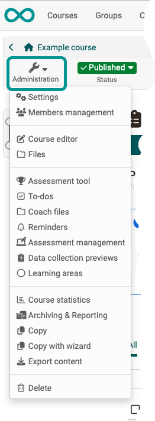

# Overview: Course Administration

You have granted access to your course; course participants are already working on your learning content. This chapter explains which tools can be used by course authors during course operation, which additional features are at their disposal and how they can archive course activities. 

{ class="shadow lightbox aside-left-lg" }

You control most of the central settings via the tools that you find in the [administration](Using_Course_Tools.md) of the course or the respective learning resource:

 * [Members management](Members_management.md) for organizing participants, groups, etc.
 * [Storage folder](Storage_folder.md) in the menu "Files" for storing and organizing course-specific files
 * [Assessment tool - overview](Assessment_tool_overview.md) for scoring, providing feedback, and organizing assessment course components 
 * [Lectures and absences](Lectures_and_absences.md) for the organization of absences of the participants
 * [Reminders](Course_Reminders.md) for sending reminders e.g. regarding assessment dates
 * [Archiving & Reporting](Data_archiving.md) for securing course results and other things.

The use of other course functions of the [Toolbar](Using_Additional_Course_Features.md) is also explained in this chapter.

---

## Role change
The toolbar shows you in which role you are currently viewing the course. As a rule, this will be the "owner" role. However, you can switch to the participant role at any time via the drop-down menu. 

If you have other roles in the course, these are also displayed and you can switch to the corresponding view. 

There is no further distinction between coaches and group coaches or participants and group participants, but the options within the role coach or participant are summarized.
ßß
The role change is useful if you want to look at the course from the respective perspective, e.g. as the course owner you want to take on the role of the participant. It is also possible to view the flow of the course elements task, group task, checklist or the participant folder from the participant's point of view.

    
Special case: Behaviour when enrolling in a group (course element 'enrolment')

    
    <b>Situation:</b>  
    - You create a course with the course element ‘Enrolment’. 
    - You switch to the participant view and make an enrolment.  
    <b>-></b> OpenOlat then unintentionally switches to the owner role. 
    - When switching back to the participant view, the useful warning dialogue (‘You are in the participant role’) with the option to delete data is no longer displayed. 
    - The participant view with warning dialogue is only displayed correctly again once the course has been called up again.
      
    <b>Explanation:</b>  
    The participant view is implemented in the same way as the course activation ‘Without booking’ - in this view you are not booked into the course member administration.
    The following therefore now happens: 
    - If you register for a group in the enrolment module, you become a group member at that moment and are entered in the course member administration.  
    - As soon as you have a registered ‘Participant’ membership (course or group or curriculum) in the course, the ‘Participant view’ is no longer available. This is only available if you are not listed as a participant in the course member administration. 
    <b>-></b> If I enrol in a group from the participant view, the participant view no longer exists for me, but I am listed as a group participant in the member administration of the course. The role therefore changes from the 'participant view' to the owner role. 
    - If you now unfold the selection for the roles, you will now see the role ‘Participant’ listed instead of the 'participant view'. 
    - If you unsubscribe from the group (and reload the course), the ‘Participant’ role is removed and the participant view is available again instead.  

