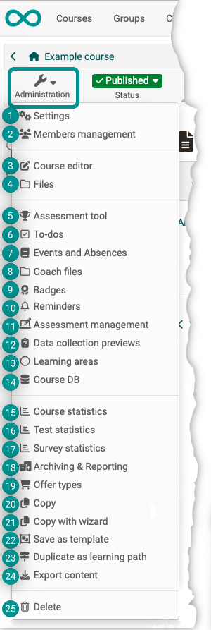

# Course Administration: Overview {: #course_administration}

{ class="shadow lightbox aside-left-lg" }

:octicons-device-camera-video-24: **Video introduction (German)**: [Admin-Funktionen](<https://www.youtube.com/embed/rWPcz6udUrI>){:target="_blank"}

If you have selected a course as **author**, the "Administration" button is displayed at the top left. There you will find all options for **editing, configuration and administration** of the selected course. (Before and during use of the course.) The most important options for authors include the [course editor](#course_editor) and the [settings](#settings).

The "Administration" button is also available for **coaches**. However, fewer options are then displayed, and only those relevant to coaches. In particular, for example, the [assessment tool](#assessment_tool).

!!! info "Important"

    Some options are only available if the corresponding feature has been activated. If necessary, please contact your administrator.

Other learning resources also have the "Administration" menu, but the menu options there are not as extensive. They vary depending on the learning resource.

Below you will find an overview of the "Administration" menu options for **courses**.

---

## Settings {: #settings}

{ class=" aside-left-lg" }

All settings that affect the **course as a whole** are made here. (Settings that only affect a specific course element are made in the course editor after selecting the relevant course element).

[See the details >](Course_Settings.md) 
[To the top of the page ^](#course_administration)

## Member management {: #members_management}

{ class=" aside-left-lg" }

In the member administration, course owners will find a list of all persons who have access to the course or learning resource. You can grant access to other users and groups here by making someone a member of the course.

[See the details >](Members_management.md) 
[To the top of the page ^](#course_administration)

## Course editor {: #course_editor}

{ class=" aside-left-lg" }

In the course editor the course can be edited by adding and configuring course elements.

[See the details >](General_Configuration_of_Course_Elements.md) 
[To the top of the page ^](#course_administration)

## Files {: #files}

{ class=" aside-left-lg" }

Some files used in the course are stored in the **storage folder**. This belongs to the course and can be opened here. 
(Other files and objects are shared with other users, are stored in other places and can be managed in the File Hub or Media Center).

[See the details about the Storage folder >](Storage_folder.md) 
[See the details about the File Hub >](../personal_menu/File_Hub.md) 
[See the details about the Media Center >](../personal_menu/Media_Center.md) 

### Storage usage [:octicons-tag-16:{ title="from Release 18.0.2 (OO-6938)" }](https://track.frentix.com/issue/OO-6938){:target="_blank"} {: #storage_usage}

When a course grows large or an upload no longer goes through, the storage usage evaluation shows which folders and course elements occupy how much storage and where a quota sets the limit. This shows you where you can clean up and whether you need to request more space.

You open the evaluation in the "Files" area with the :o_icon_o_icon_hdd: "Show memory usage" button at the top right: 
`Course > Administration > Files > Show memory usage`

{ class="shadow lightbox" }

The "Files" area is visible to owners of the course and to persons who have been granted the "Course editor" right in the [Rights area of the members management](Members_management.md#section_rights).

The storage usage page, titled "Memory usage resources" on screen, shows the values "Total size", "Internal size" and "Number of files" of the course at the top, together with a pie chart showing the share of resources with and without quota. Below, a table lists the storage folder and the course elements with files in the structure of the course. Each row shows the number of files, the size, the quota and, in the "Currently used" column, a bar showing how much of the quota is occupied. From 80 percent, OpenOlat highlights the bar in color.

{ class="shadow lightbox" }

Three filters narrow down the table:

* "All": all resources of the course that contain files.
* "Internal with quota": the folders with their own quota. These are the storage folder, "Coach files" and "Documents (Toolbar)" as well as the course elements "Folder" and "Participant folder".
* "Internal without quota": the course elements that occupy storage but have no quota of their own. These are "Forum", "File dialog", "Task", "Group task", "Page" and "Topic broker".

If a "Folder" course element uses a folder from the storage folder as its file destination, it does not appear as a separate row. The same applies to "Coach files" and "Documents (Toolbar)" when they use a folder from the storage folder. The files then count towards the storage folder and fall under its quota. For the "Participant folder" course element, the table shows the drop box and the return box for each participant. The quota applies to each of these folders individually.

#### Edit quota {: #storage_usage_edit_quota}

The "Edit quota" action only appears in rows with their own quota: for the storage folder, for "Coach files" and "Documents (Toolbar)" as well as for the course elements "Folder" and "Participant folder". The course elements "Forum", "File dialog", "Task", "Group task", "Page" and "Topic broker" count their usage but have no quota that can be adjusted.

The quota can be changed by [administrators, system administrators and learning resource managers](../basic_concepts/Roles.md#org) of the organisation the course belongs to. Everyone else sees the current values in the "Edit quota" dialog, but no button to save. If you need more space for a folder, contact one of these persons.

The guide ["What measures can I take to reduce storage space consumption?"](../../manual_how-to/reduce_storage_consumption/reduce_storage_consumption.md) describes further ways to reduce storage requirements.

[To the top of the page ^](#course_administration)

## Assessment tool {: #assessment_tool}

{ class=" aside-left-lg" }

The assessment tool (not to be confused with the course element "Assessment") is used to coach and monitor the results of all course participants. Here you have access to all assessable course elements and can, for example, make assessments with points, pass/fail etc. and provide individual feedback.

[See the details >](Assessment_tool_overview.md) 
[To the top of the page ^](#course_administration)

## To-dos {: #to-dos}

{ class=" aside-left-lg" }

To-dos relating to a specific course can be created directly here in the course. To-dos can be assigned to all course participants or to individuals.

[See the details >](Course_todos.md) 
[To the top of the page ^](#course_administration)

## Events and absences {: #events_and_absences_}

{ class=" aside-left-lg" }

Here you will find the tool for the administration of participants' events and absences.

[See the details >](Events_and_absences.md) 
[To the top of the page ^](#course_administration)

## Coach files {: #coach_files}

{ class=" aside-left-lg" }

If activated, coaches and owners of the course can store files in this shared folder that only they can access.

[See the details >](Coach_Files.md) 
[To the top of the page ^](#course_administration)

## Badges {: #badges}

{ class=" aside-left-lg" }

If activated, course-related badges can be created, edited and displayed here.

[See the details >](OpenBadges.md) 
[To the top of the page ^](#course_administration)

## Reminders {: #reminders}

{ class=" aside-left-lg" }

The reminder function is used to organize the automatic sending of emails. The sending can be linked to various conditions.

[See the details >](Course_Reminders.md) 
[To the top of the page ^](#course_administration)

## Assessment management {: #assessment_management}

{ class=" aside-left-lg" }

This menu option allows you to create, edit and display configurations for assessment modes. For example, you can configure an assessment mode that only allows participants to access certain course elements and also restricts participants from accessing other sources of information.

[See the details about the assessment mode >](Assessment_mode.md) 
[See the details about the assessment inspection >](Assessment_inspection.md) 
[To the top of the page ^](#course_administration)

## Data collection preview {: #data_collection_previews}

{ class=" aside-left-lg" }

If activated, course owners can view the planned surveys of the **Quality Management** module of the course. This preview is purely informative for course owners. Editing is only possible for quality managers.

[See the details about quality management >](../../manual_admin/administration/Modules_Quality_Management.md) 
[To the top of the page ^](#course_administration)

## Learning areas {: #learning_areas}

{ class=" aside-left-lg" }

Several groups of a course can be bundled together with the help of a learning area. The learning areas of the course can be created, displayed and edited under this menu option.

[See the details >](Learning_Areas.md) 
[To the top of the page ^](#course_administration)

## Course DB {: #course_DB}

{ class=" aside-left-lg" }

Here you can create a new course-specific database that can store certain course-specific information.

[To the top of the page ^](#course_administration)

## Course statistics {: #course_statistics}

{ class=" aside-left-lg" }

This course function shows you statistics on access to your OpenOlat course. All owners of this course have access to the statistics.

[See the details >](Statistics_Course.md) 
[To the top of the page ^](#course_administration)

## Test statistics {: #test_statistics}

{ class=" aside-left-lg" }

The test statistics allow general course-related, anonymized statistical assessment of the OpenOlat tests in a course. All tests contained in the course are displayed.

[See the details >](Statistics_Test.md) 
[To the top of the page ^](#course_administration)

## Survey statistics {: #survey_statistics}

{ class=" aside-left-lg" }

The survey statistics allow you to carry out a general course-related, anonymized statistical assessment of your surveys.

[See the details >](Statistics_Survey.md) 
[To the top of the page ^](#course_administration)

## Archiving & Reports {: #archiving_reporting}

{ class=" aside-left-lg" }

Elements of the course can be archived here with the help of a wizard. A complete archive or a partial archive with selected course elements can be created, as well as course results, etc.

[See the details >](Course_Archiving.md) 
[To the top of the page ^](#course_administration)

## Offer types {: #offer_types}

{ class=" aside-left-lg" }

In order to offer a course or other learning resource in the catalog, at least one offer is required. However, several different offers can also be created, for which you will find the booking orders here.

[See the details >](Offer_Types.md) 
[To the top of the page ^](#course_administration)

## Copy {: #copy}

{ class=" aside-left-lg" }

When copying a course, the complete structure, folder contents, HTML pages and group names (without group members) are copied. However, user data such as forum posts, group members etc. are not copied.

[See the details >](Course_Copy.md) 
[To the top of the page ^](#course_administration)

## Copy with wizard {: #copy_wizard}

{ class=" aside-left-lg" }

If you copy a course using the wizard, you can select the elements to be copied.

[See the details >](Course_Copy_Wizard.md) 
[To the top of the page ^](#course_administration)

## Save as template {: #copy_template}

{ class=" aside-left-lg" }

If an existing course is to be used with the Course Planner for instantiation in implementations, save it as a template.

[See the details >](Course_Copy_Template.md) 
[To the top of the page ^](#course_administration)

## Duplicate as learning path {: #duplicate_as_learning_path}

{ class=" aside-left-lg" }

Conventional courses (including all courses created before OpenOlat version 15) can be converted into a learning path course using this tool.
The original conventional course is retained and a copy is created in which the additional features of a learning path course are added.
When converting, the first decision to be made is whether to create the course "With learning path" or "With learning progress".

The function is only available for conventional courses.

!!! tip "Tip"

    If the course is only to be transferred to the current format, the "With learning progress" option is usually the better choice. In this case, the course structure does not have to be edited in a fixed order, which is more in line with the hypermedia structure of the previous course. If necessary, this setting can also be adjusted retrospectively in the course editor of the copied course at the top course element.

    Please note that guests do not have access to learning path courses.

[To the top of the page ^](#course_administration)

## Export content {: #export_content}

{ class=" aside-left-lg" }

Export your learning resources as a ZIP file to get a backup copy or to import the learning resource in another OpenOlat instance.

[See the details >](Export_Content.md) 
[To the top of the page ^](#course_administration)

## Delete {: #delete}

{ class=" aside-left-lg" }

When a course is deleted, it is first moved to the recycle bin and all user data is removed. (This also applies to learning resources).

[See the details >](Course_Delete.md) 
[To the top of the page ^](#course_administration)

## Further information {: #further_information}

[Using Additional Course Features >](Using_Additional_Course_Features.md)

**youtube** 
[Admin-Funktionen](<https://www.youtube.com/embed/rWPcz6udUrI>)

[To the top of the page ^](#course_administration)

