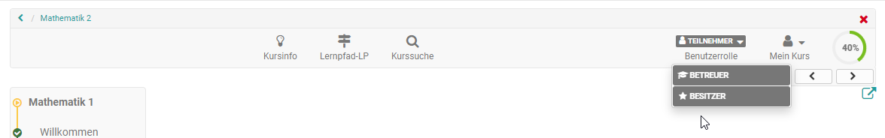

# Course Operation

You have granted access to your course; course participants are already working on your learning content. This chapter explains which tools can be used by course authors during course operation, which additional features are at their disposal and how they can archive course activities. 

You make most of the central settings via the tools that you find in the [administration](Using_Course_Tools.md) of the course or the respective learning resource. Hierzu zählen:

 * [Members management](Members_management.md)zur Organisation der Teilnehmenden, Gruppen usw.
 * [Storage folder](Storage_folder.md) für die Ablage und Organisation der kursspezifischen Dateien
 * [Assessment tool - overview](Assessment_tool_overview.md) für die Punktevergabe, die Bereitstellung von Feedbacks und die Organisation von Assessment Kursbausteinen 
 * [Lectures and absences](Lectures_and_absences.md) für die Organisation von Abwesenheitsterminen der Teilnehmenden
 * [Course Reminders](Course_Reminders.md) für den Versand von Erinnerungen z.B. bezüglich Assessment Terminen
 * [Data archiving](Data_archiving.md) für die Sicherung von Kursergebnissen und weiteren Dingen.

Auch der Einsatz weiterer Kursfunktionen der [Toolbar](Using_Additional_Course_Features.md) wird in diesem Kapitel erläutert. 

## Role change

!!! Tip

    Noch ein wichtiger Tipp, der Ihnen die Arbeit an einem Kurs und die Betrachtung des Kurses aus unterschiedlichen Rollen erleichtert: 

If you as a course owner or coach have **more than one role** in a course (see [Members management](Members_management.md)), the option to switch user roles when the editor is closed will appear in the course toolbar, allowing you to view the course from the perspective of the different roles. 

Depending on which roles you have in the course, you will see the respective basic roles displayed. There is no further distinction between coaches and group coaches or participants and group participants, but the options within the role coach or participant are summarized.

{ class="shadow lightbox" }

The role change is useful if you want to look at the course from the respective perspective, e.g. as the course owner you want to take on the role of the participant. It is also possible to view the flow of the course elements task, group task, checklist or the participant folder from the participant's point of view.
