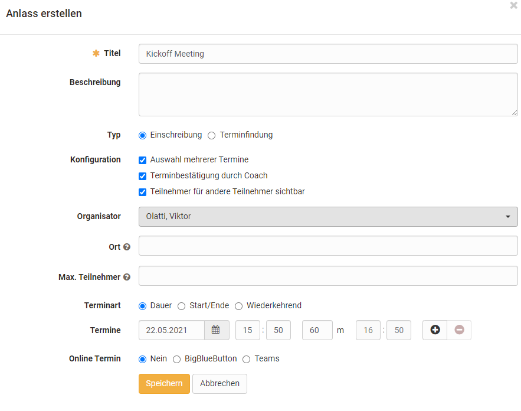
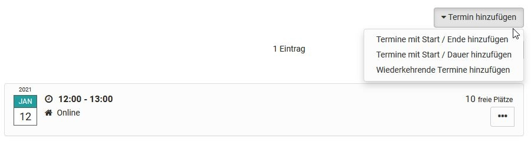
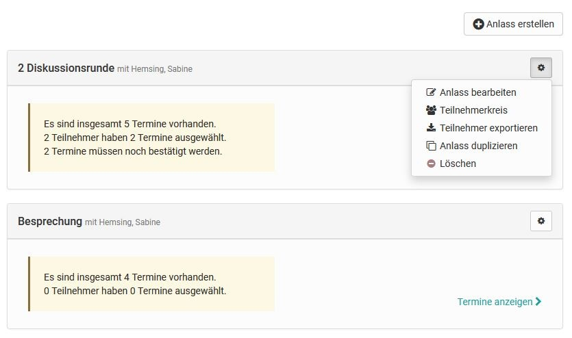
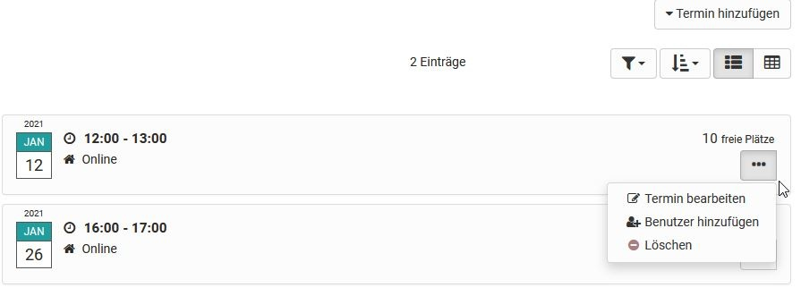
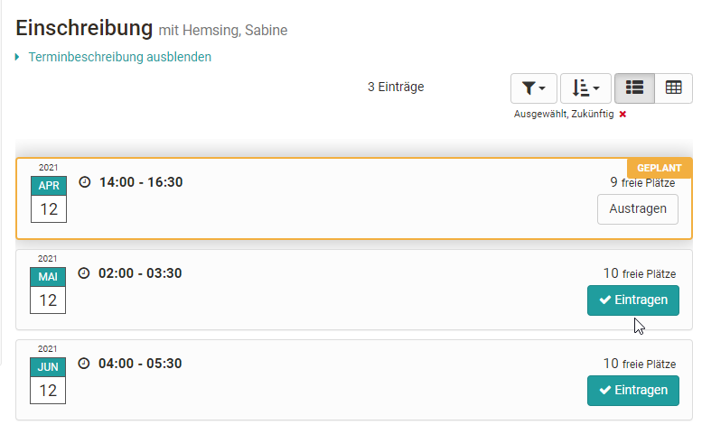

# Administration and Organisation

## Course Element "Enrolment" {: #enrolment}

:fontawesome-solid-right-to-bracket:

The course element "Enrolment" is used to let participants enrol in
one or more OpenOlat groups. To do this, define in the "Configuration"
tab in which and how many **groups** participants can enrol. You can
also define the order of the groups in the selection list. If you have not
yet created any groups or need more, you can do so directly in the
"Configuration" tab by clicking on "Select" and "Create". Existing and newly
created groups can be edited in the [member management](../learningresources/Members_management.md).

Use "**Allow multiple enrolments**" to optionally define whether
participants may enrol in more than one group, and if so, how many.

In the field "**Delisting allowed**" you optionally decide whether an
already enrolled person has the possibility to delist again from a
group. In the group management you can determine while editing the group
whether there should be a waiting list and whether automatic promotion from
that list should be possible.

!!! info "Access via learning areas"

    If you have previously created one or more learning areas in the administration and assigned groups here, you can also access these learning areas in the "Configuration" tab of the enrolment course element.

## Course Element "Notifications" {: #notification}

:fontawesome-solid-circle-info:

:octicons-device-camera-video-24: **Video introduction**: [Notifications](<https://www.youtube.com/embed/3tAj19Avfkk>){:target="_blank"}

The course element offers the possibility to embed notifications in the
course structure. These notifications are visible both in the course and in
the notifications of each individual user. A notification can be either a
short info text or extensive information, added as a file attachment (max.
5 MB). While creating a notification, you can define whether it should
additionally be sent by mail to certain user groups of the course
(subscribers, course owners, coaches, members or groups).

 **Display:** The maximum number of days determines how long (in days) the
notifications are displayed in the course. The maximum number of
notifications determines how many notifications are displayed simultaneously
in the course.

 **Subscribe automatically:** By default, the course element is
automatically subscribed by course visitors. You can disable this option
here so that course visitors can subscribe to notifications manually.

:octicons-device-camera-video-24: **Video introduction**: [Subscriptions](<https://www.youtube.com/embed/h9gOqt7TR7Q>){:target="_blank"}

Notifications can be viewed in the personal menu under "Subscriptions". The
number of displayed notifications can be set in the course editor.

By default, only coaches and owners may create notifications. However, all
participants may read notifications. In the "Notification configuration" tab
you can adjust this setting to your needs.

The number of characters for the notification is limited to 32,000. You
receive corresponding information about the number of characters already
used in the bottom right of the notification editor. If the permitted number
of characters is exceeded, a corresponding message is shown. Note: The
number of actual characters differs from the number of visible characters,
since the actual count uses the HTML code.

!!! tip "Tip"

    An element with similar functions, but without specific configuration, can also be found in the toolbar. This is the "[Participant infos](../learningresources/Using_Additional_Course_Features.md#participant-infos)".

## Course Element "E-Mail" {: #mail}
:fontawesome-regular-envelope:

Via the course element "E-Mail" you give your participants the
possibility to send an e-mail to a group of recipients defined by you.

You have two ways to send messages. Either you enter the e-mail address of
specific persons directly in the "**Recipients**" tab, or you select the
groups of people the message should be sent to. You can decide in detail
whether the message is sent to course owners, coaches and/or participants of
the course and/or groups.

To enter several recipient addresses in the "E-mail addresses" field, you
must separate them with a line break, i.e. each e-mail address must be on
its own line.

### Sending to course owners/coaches/participants
Mark the desired checkboxes to define the member groups you want to
write to. For coaches and participants, mark in a second step whether you
want to address all of them, or distinguish by course and groups. If you
mark no checkbox, no mail is sent.

In the fields "Subject (template)" and "Message (template)" you can
optionally define default values.

 * *Subject*: If the subject is predefined, participants cannot adjust it.
If the subject is left empty in the template, participants must
define their own subject (mandatory field).
 * *Message*: The predefined message can be edited freely by
participants when sending an e-mail.

In addition, the message and the subject can be designed with variables,
both personal and course-related.

### Use of variables

The following variables can be used in the subject and text of the e-mail:

| Variable | Description |
| -----|----|
|    `$firstname` | The first name of the person  |
| `$lastname` | The last name of the person  |
| `$fullName` | The full name of the person  |
| `$username` | The username  |
| `$email` | The e-mail address of the person  |
| `$courseurl` | The internet address of the course  |
| `$coursename` | The name of the course as shown on the info page  |
| `$coursedescription` | The description of the course as shown on the info page  |

!!! info ""

    The variables refer to the person who triggers and sends the e-mail via the **"Send" button**.

By giving the course element "E-Mail" a suitable short title, you give your
participants a hint about the group of recipients this message is sent to.
For data protection reasons, the recipient addresses are not shown in the
e-mail form itself.

!!! tip "Tip"

    An element "E-Mail" with similar functions, but without specific configuration, can also be found in the [toolbar](../learningresources/Using_Additional_Course_Features.md#e-mail).

## Course Element "Calendar" {: #cal}

:fontawesome-regular-calendar-days:

With the course element "Calendar" you can embed the course calendar in the
course structure. It is also possible to add several instances of the same
calendar to the course.

This embedding is an alternative to embedding the calendar in the course
toolbar (see "[Using additional course features](../learningresources/Using_Additional_Course_Features.md#course-calendar)").

By default, only owners and coaches may create appointments. All
participants may read calendar entries. In the "Calendar configuration" tab
you can define whether, besides the course owners, participants and coaches
of the course may also set and edit calendar entries. You can also configure
here which date is displayed when the course calendar is opened from the
course structure. Course calendars are automatically added to the
[personal calendars](../personal_menu/Calendar.md) of the participants.

If you display one semester week at a time in the calendar and insert links
to course elements, the calendar serves as an overview page for the
appointments and tasks of the week.

Check whether the course element "Calendar" is really the optimal choice
for you. In many cases, especially with [learning path courses](../learningresources/Learning_path_course.md), it is more
useful to activate the calendar in the [toolbar](../learningresources/Using_Additional_Course_Features.md#course-calendar) in the settings.

!!! tip "Tip"

    If you cannot find the course element "Calendar" in your OpenOlat instance, it has been disabled system-wide by an administrator.

## Course Element "Appointment scheduling" {: #appointment_scheduling}

:fontawesome-regular-calendar-check:

With the course element Appointment scheduling, both enrolments for specific
appointments and appointment finding can be organized. In general, you can
configure whether several appointments can be selected, whether there is a
limit to the number of participants, whether participants can see who has
registered, and whether a BigBlueButton room should be assigned.

The course element is added in the course editor, where you can also define
whether coaches may also edit topics and appointments, or whether this is
only possible for the course owners. If the appointment selection should
only be possible within a certain time window, the time specifications must
be set accordingly in the course editor, in the "Learning path" tab, or, for
conventional courses, the visibility or access must be configured
accordingly.

The actual configuration and setup of the appointments, however, takes place
in the course run with the editor closed. For this, a new enrolment or
appointment finding is first created via the "Create occasion" button, and
the basic configuration is done and appointments are entered.

{ class="shadow lightbox" }

Via the button "**Add appointment**" you can also add further appointments
to this poll later. Already created appointments can also be revised again
via the three-dot link.

{ class="shadow lightbox" }

### Appointments: create & edit

!!! info "Menu Create occasion"

    How to configure an enrolment or appointment finding

**Title:** Enter the name of the appointment here, e.g. "Closing
meeting vote", "Kick-off meeting" etc. The entry is required (mandatory
field).

 **Description:** Explain the appointment selection in more detail.

 **Type:** Decide whether this is an appointment finding for a
common appointment, or an enrolment for one or more appointments from a
selection, e.g. lab appointments.

 **Configuration:** Decide whether participants may select only one
or several appointments, and whether the names of participants are visible
to other participants. For "Enrolment" you can additionally define
whether the coach must still confirm the appointment.

 **Organizer:** Define here who is displayed as the organizer of the
appointment scheduling.

 **Location:** Enter the venue here.

 **Max. participants:** You can limit the number of members for an
appointment (only for "Enrolment").

 **Appointment type:** You can create appointments based on duration, based
on a start and end date, or recurring on specific weekdays. The selection
makes it easier for you to create further appointments.

!!! info ""

    If "Duration" is selected, when adding further appointments, the appointments are preconfigured on the same day and the times are adjusted according to the duration.

    If Start/End is selected, the selected times are retained and for new entries you only need to adjust the date.

 **Appointments:** The concrete selectable appointments are entered here. Clicking the
"+ sign" adds new appointments. Clicking the "-
sign" deletes appointments again.

 **Online appointment:** The options are: No, no online appointment, or you
select the desired tool BigBlueButton or Teams directly, provided that
virtual classrooms have been activated by the system administration.

!!! tip "Tip"

    If BigBlueButton or Teams is activated, a BigBlueButton or Teams room can be added and further configured for the selected appointments. In this case, "online" is automatically displayed for the location.

A created "occasion" can later be edited, duplicated or deleted by
clicking the gear icon. The group of participants for an occasion can also
be restricted to certain groups. Exporting the participants for an occasion
is also possible.

{ class="shadow lightbox" }

The concrete appointments of already created appointment schedules can be
viewed in more detail via the "Show appointments" link and edited by the
course owners or coaches. Here you can add, delete or rebook participants,
adjust the description, change appointments or confirm appointments.

{ class="shadow lightbox" }

Participants can use the "**Select appointments**" or "**Enrol**" link to
see and select the appointments they want. If an appointment has been
confirmed, this is also visible.

{ class="shadow lightbox" }

## Further information {: #further_information}

**Mentioned on this page** 
[Members management >](../learningresources/Members_management.md) 
[Using Additional Course Features >](../learningresources/Using_Additional_Course_Features.md) 
[Personal tools: Calendar >](../personal_menu/Calendar.md) 
[Learning path course - Overview >](../learningresources/Learning_path_course.md)

**Further reading** 
[Course Element "Enrolment" >](../learningresources/Course_Element_Enrolment.md) 
[Course Element "Notifications" >](../learningresources/Course_Element_Notifications.md) 
[Course Element "E-Mail" >](../learningresources/Course_Element_EMail.md) 
[Course Element "Calendar" >](../learningresources/Course_Element_Calendar.md)

[To the top of the page ^](#administration-and-organisation)
