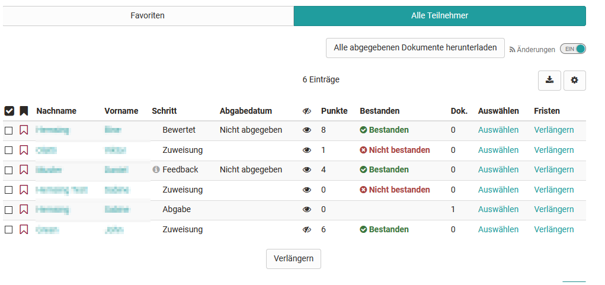
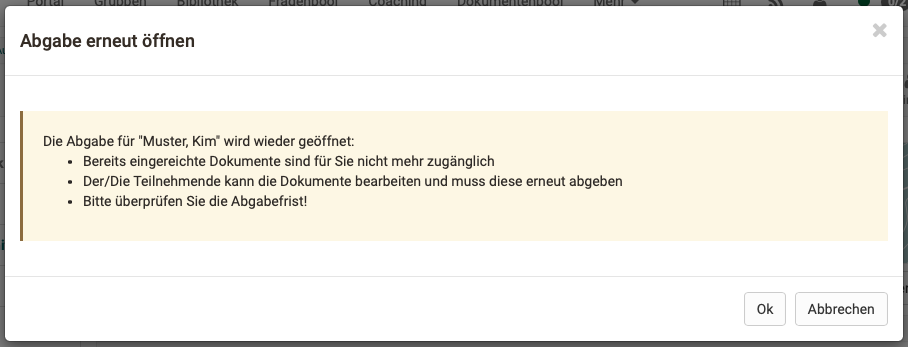

# Aufgaben bewerten

Betreuer und Kursbesitzer können sowohl über das Bewertungswerkzeug als auch
direkt im Kursrun die Bewertung der Teilnehmenden bezüglich der eingereichten
Aufgaben vornehmen.

Wie Aufgaben und Gruppenaufgaben im Bewertungswerkezug bewertet werden erfahren Sie ausführlich im Kapitel ["Bewertungswerkzeug"](Assessment_tool_overview.de.md) → ["Aufgaben und Gruppenaufgaben bewerten"](Assessing_tasks_and_group_tasks.de.md). Im Folgenden wird kurz beschrieben, wie die Bewertung im Kursrun erfolgt:

## Übersicht für Betreuer

Im Kursrun gelangt man in den Bewertungsbereich durch Anklicken der
entsprechenden Aufgabe. Es stehen die Tabs "Favoriten" und "Alle Teilnehmer"
zur Verfügung. Sofern die Aufgabenstellung direkt in der Aufgabe hinterlegt
ist, erscheint zusätzlich der Tab "Verwalten". Wenn ein Betreuer auch Aufgaben
erstellen darf, ist für ihn ebenfalls der Tab "Verwalten" sichtbar.

Die Übersichtstabelle zeigt an in welchem Schritt des Workflows der Benutzer
sich befindet. Am { class=size16 }
erkennen Sie, ob es Handlungsbedarf für den Betreuer gibt. In den Schritten
Feedback und Korrektur ist eine Eingabe durch den Betreuer zwingend
erforderlich um die Aufgabe zum Abschluss zu bringen. Ob im Schritt Lösung
(ohne Icon Anzeige) eine Bewertung vorgenommen werden muss, hängt von der
Konfiguration der Aufgabe ab. Der Schritt Bewertung wird auch angezeigt bei
bereits erfolgter Bewertung, allerdings nur dann, wenn es keine Musterlösung
gibt. Aktivieren Sie die angezeigten Spalten der Tabelle entsprechend Ihren
Bedürfnissen.

{ class="shadow" }

Mit Klick auf eine einzelne Person der Teilnehmerliste gelangt man zum
Bewertungsflow für diese Person und kann Feedbacks hochladen und Punkte
vergeben, je nach Konfiguration der Aufgabe.

Die von den Lernenden hochgeladenen Dokumente können auch gesammelt über den
Button „Alle abgegebenen Dokumente herunterladen“ gespeichert und für die
Bewertung herangezogen werden. Die einzelnen Einreichungen werden sortiert
nach Lernenden (Name, Vorname, Benutzername) mit entsprechenden Unterordnern
als zip Datei gespeichert.

Erfolgt bis zum gesetzten Abgabedatum keine Dateiabgabe wird dies entsprechend
in der Übersicht in der Spalte "Abgabedatum" gekennzeichnet.

!!! tip "Tipp"

    Ist man gleichzeitig als Kurbesitzer bzw. Betreuer und Teilnehmer in den
    Kurs eingetragen, kann man zwischen den jeweiligen Rollen wechseln und sich so
    anschauen, wie sich die Aufgabe aus Sicht der Lernenden darstellt.

Wie der Aufgabenbaustein aus Sicht der Kursteilnehmenden aussieht, erfahren
Sie im Kapitel "Lernaktivitäten im Kurs“ unter dem Punkt ["Aufgabe &
Gruppenaufgabe"](../learningresources/Course_Elements.de.md).

### Rückgabe und Feedback-Dokumente ändern

Um bei einer bereits abgeschlossenen Aufgabe die Feedback-Dokumente von
einzelnen Teilnehmenden unter "Rückgabe und Feedback" zu ändern, können Betreuende
wie folgt vorgehen:

!!! warning "Achtung"

    Feedback-Dokumente können nur geändert werden, solange die Abgabefrist noch
    nicht verstrichen ist. Diese muss ggfs. verlängert werden!

    Damit die Teilnehmenden in diesem Fall nicht nochmals auf die Aufgabe
    zugreifen können, kann z.B. der Kursbaustein im Kurseditor --> Tab
    Sichtbarkeit "für Lernende gesperrt" werden. Achtung: diese Möglichkeit
    besteht im Lernpfadkurs nicht!

- Am Kursbaustein den/die Teilnehmer:in auswählen.
- Im Schritt "Abgabe" die "Abgabe erneut öffnen".
- Es erscheint folgende Meldung:

    { class="shadow lightbox aside-right-sm" }
    Die Abgabe für "Nachname, Vorname" wird wieder geöffnet: 
        * Bereits eingereichte Dokumente sind für Sie nicht mehr zugänglich 
        * Der/Die Teilnehmende kann die Dokumente bearbeiten und muss diese erneut abgeben 
        * Bitte überprüfen Sie die Abgabefrist!

- Nach Bestätigung der Meldung können Betreuende über einen Button "Alle abgegebenen Dokumente einziehen". Die Dokumente des/der Teilnehmenden sind nun wieder in der Betreueransicht verfügbar.
- Im Schritt "Feedback- und Rückgabe" können die Dokumente nun ebenfalls wieder bearbeitet, ausgetauscht, ergänzt oder gelöscht werden.

!!! warning "Achtung"

    Nicht vergessen: Ändern Sie die Abgabefrist wieder auf den ursprünglichen Wert
    zurück, so können die Teilnehmer nichts mehr abgeben. Auch die Einschränkung
    der Sichtbarkeit für Lernende am Kursbaustein kann nun wieder entfernt werden,
    damit die Aufgabe für alle Teilnehmer in der Kursnavigation wieder verfügbar
    ist.
