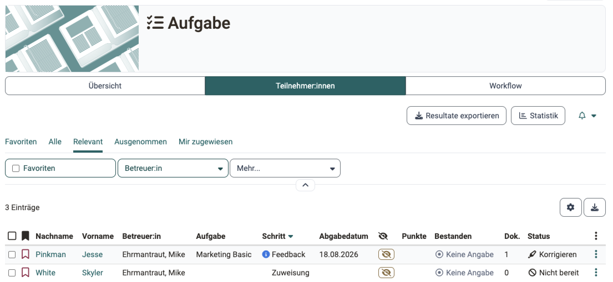
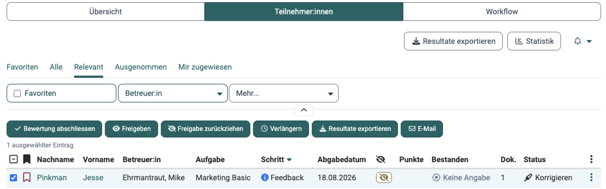
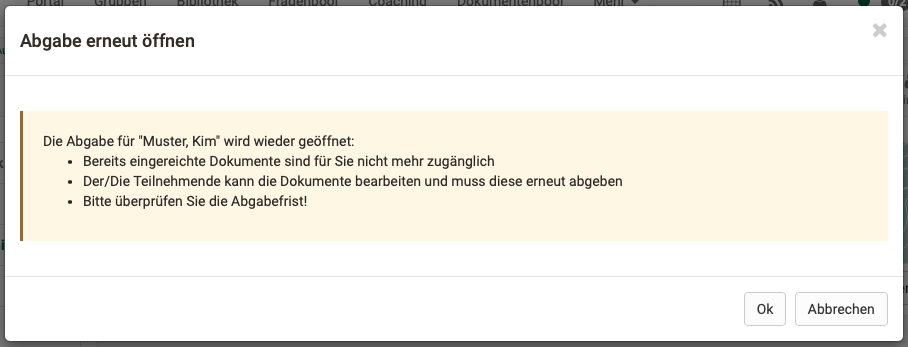

# Aufgaben bewerten {: #assess_tasks}

Betreuer:innen und Kursbesitzer:innen können sowohl über das Bewertungswerkzeug als auch direkt im Kursrun die Bewertung der Teilnehmenden bezüglich der eingereichten Aufgaben vornehmen.

Wie Aufgaben und Gruppenaufgaben im Bewertungswerkzeug bewertet werden, erfahren Sie ausführlich im Kapitel ["Bewertungswerkzeug"](Assessment_tool_overview.de.md) → ["Aufgaben und Gruppenaufgaben bewerten"](Assessing_tasks_and_group_tasks.de.md). Im Folgenden wird kurz beschrieben, wie die Bewertung im Kursrun erfolgt:

## Übersicht für Betreuer:innen {: #coach_view}

Im Kursrun gelangt man in den Bewertungsbereich durch Anklicken der entsprechenden Aufgabe. Es stehen die Tabs "Übersicht" und "Teilnehmer:innen" zur Verfügung. Beim Kursbaustein Aufgabe kommt der Tab "Workflow" hinzu. Sofern die Aufgabenstellung direkt in der Aufgabe hinterlegt ist, erscheint zusätzlich der Tab "Verwalten". Wenn Betreuer:innen auch Aufgaben erstellen dürfen, ist für sie ebenfalls der Tab "Verwalten" sichtbar. Sind Erinnerungen oder To-dos eingerichtet, erscheint für Kursbesitzer:innen der Tab "Erinnerungen & To-dos".

Im Tab "Teilnehmer:innen" grenzen Filterreiter die Liste ein, darunter "Alle" und "Relevant". Welche weiteren Reiter erscheinen, hängt von der Konfiguration des Kursbausteins ab.

Die Übersichtstabelle zeigt in der Spalte "Schritt" an, in welchem Schritt des Workflows die Teilnehmenden sich befinden. Das Symbol :o_icon_o_icon_info: vor dem Schritt bedeutet, dass eine Aktion durch die betreuende Person erforderlich ist. In den Schritten Feedback und Korrektur ist eine Eingabe durch die Betreuer:innen zwingend erforderlich, um die Aufgabe zum Abschluss zu bringen. Ob im Schritt Lösung (ohne Icon Anzeige) eine Bewertung vorgenommen werden muss, hängt von der Konfiguration der Aufgabe ab. Der Schritt Bewertung wird auch angezeigt bei bereits erfolgter Bewertung, allerdings nur dann, wenn es keine Musterlösung gibt. Aktivieren Sie die angezeigten Spalten der Tabelle entsprechend Ihren Bedürfnissen.

{ class="shadow lightbox" }

Mit Klick auf eine einzelne Person der Teilnehmerliste gelangt man zum Bewertungsflow für diese Person und kann Feedbacks hochladen und Punkte vergeben, je nach Konfiguration der Aufgabe.

Um mehrere Personen auf einmal zu bearbeiten, wählen Sie die gewünschten Zeilen aus. Bereits bei einer Auswahl erscheinen über der Liste die Aktionen "Bewertung abschliessen", "Freigeben", "Freigabe zurückziehen", "Verlängern", "Resultate exportieren" und "E-Mail".

{ class="shadow lightbox" }

Die von den Lernenden hochgeladenen Dokumente können auch gesammelt über "Resultate exportieren" gespeichert und für die Bewertung herangezogen werden. Die einzelnen Einreichungen werden sortiert nach Lernenden (Name, Vorname, Benutzername) mit entsprechenden Unterordnern als zip Datei gespeichert.

Die ZIP-Datei enthält zusätzlich einen Excel-Report. Er führt für jeden aktivierten Workflow-Schritt eine eigene Datumsspalte, also genau für die Schritte, welche die Übersichtstabelle in der Spalte "Schritt" anzeigt. Ist die Zuweisung Betreuende/Teilnehmende aktiviert, weist der Report zudem die zugewiesene betreuende Person aus. Die einzelnen Spalten sind unter [Excel-Report der Resultate](Assessing_tasks_and_group_tasks.de.md#results_export) beschrieben.

Ist die Zuweisung Betreuende/Teilnehmende aktiviert, zeigt die Spalte "Betreuer:in" der Übersichtstabelle, wer eine Person betreut. Die Zuordnung selbst nehmen Kursbesitzer:innen über die [Zuordnungstabelle](Course_Element_Task.de.md#coach_assignment_table) vor; Betreuende sehen diesen Button nicht.

Erfolgt bis zum gesetzten Abgabedatum keine Dateiabgabe wird dies entsprechend in der Übersicht in der Spalte "Abgabedatum" gekennzeichnet.

!!! tip "Tipp"

    Ist man gleichzeitig als Kursbesitzer:in bzw. Betreuer:in und Teilnehmer:in in den Kurs eingetragen, kann man zwischen den jeweiligen Rollen wechseln und sich so anschauen, wie sich die Aufgabe aus Sicht der Lernenden darstellt.

Wie der Aufgabenbaustein aus Sicht der Teilnehmenden aussieht, erfahren Sie im Kapitel "Lernaktivitäten im Kurs" unter dem Punkt ["Aufgabe & Gruppenaufgabe"](../learningresources/Course_Elements.de.md).

### Rückgabe und Feedback-Dokumente ändern {: #return_feedback}

Um bei einer bereits abgeschlossenen Aufgabe die Feedback-Dokumente von einzelnen Teilnehmenden unter "Rückgabe und Feedback" zu ändern, können Betreuende wie folgt vorgehen:

!!! warning "Achtung"

    Feedback-Dokumente können nur geändert werden, solange die Abgabefrist noch nicht verstrichen ist. Diese muss ggfs. verlängert werden!

    Damit die Teilnehmenden in diesem Fall nicht nochmals auf die Aufgabe zugreifen können, kann z.B. der Kursbaustein im Kurseditor unter `Tab "Sichtbarkeit"` auf "für Lernende gesperrt" gesetzt werden. Achtung: diese Möglichkeit besteht im Lernpfadkurs nicht!

- Am Kursbaustein den/die Teilnehmer:in auswählen.
- Im Schritt "Abgabe" die "Abgabe erneut öffnen".
- Es erscheint folgende Meldung:

    { class="shadow lightbox aside-right-sm" }
    Die Abgabe für "Nachname, Vorname" wird wieder geöffnet: 
        * Bereits eingereichte Dokumente sind für Sie nicht mehr zugänglich 
        * Der/Die Teilnehmende kann die Dokumente bearbeiten und muss diese erneut abgeben 
        * Bitte überprüfen Sie die Abgabefrist!

- Nach Bestätigung der Meldung können Betreuende über einen Button "Alle abgegebenen Dokumente einziehen". Die Dokumente des/der Teilnehmenden sind nun wieder in der Betreueransicht verfügbar.
- Im Schritt "Feedback- und Rückgabe" können die Dokumente nun ebenfalls wieder bearbeitet, ausgetauscht, ergänzt oder gelöscht werden.

!!! warning "Achtung"

    Nicht vergessen: Ändern Sie die Abgabefrist wieder auf den ursprünglichen Wert zurück, so können die Teilnehmenden nichts mehr abgeben. Auch die Einschränkung der Sichtbarkeit für Lernende am Kursbaustein kann nun wieder entfernt werden, damit die Aufgabe für alle Teilnehmenden in der Kursnavigation wieder verfügbar ist.

## Weiterführende Informationen {: #further_information}

[Bewertungswerkzeug - Übersicht >](Assessment_tool_overview.de.md) 
[Aufgaben und Gruppenaufgaben bewerten >](Assessing_tasks_and_group_tasks.de.md) 
[Kursbaustein "Aufgabe" >](Course_Element_Task.de.md) 
[Kursbausteine >](../learningresources/Course_Elements.de.md)

[Zum Seitenanfang ^](#assess_tasks)
