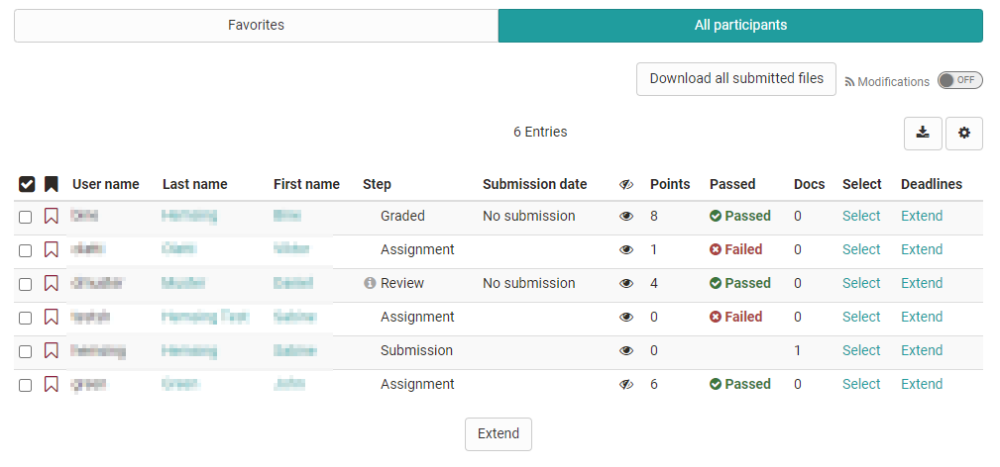

# Assess tasks

The assessment of handed in tasks can be done by coaches and course owners either in the assessment tool or directly in the course run.

You can find out in detail how tasks and group tasks are evaluated in the assessment tool in the chapter ["Assessment tool"](../learningresources/Assessment_tool_overview.md) → ["Assessing tasks and group tasks"](../learningresources/Assessing_tasks_and_group_tasks.md). The following is a brief description of how the assessment is performed in the run time view:

## Coach view

In the run time view you get to the assessment area by clicking on the corresponding task. If the coach or course owner is participant at the same time in the course the tabs "Favorites" and "All participants" appear. If the assignment is stored directly in the task, the tab "Edit tasks and sample solutions" also appears. If a coach may also create tasks, the tab "Edit tasks and sample solutions" is also visible for him.

The table displays the current workflow step. The { class=size16 } indicates whether the coach needs to take action. The steps Review and Correction require coach input in order for the user to be able to finalize the task. Whether the step Solution (without icon) includes the assessment step, depends on the configuration of the task. The Grading step is only displayed if no sample solution is available, but remains, even with the assessment already carried out. Choose the column according to your needs.

{ class="shadow" }

Clicking on an individual person in the participant list takes you to the assessment workflow for that person and allows you to upload feedback and assign points, depending on the configuration of the task.

All files uploaded by the participant can be downloaded in the tab "Submissions" as well as in the assessment tool with one click on the button "Download all submitted files". The single uploads are saved sorted after learners (last name, name, username) with the corresponding sub folders as zip file.

If no file is uploaded until the submission deadline it is marked in the overview as "No submission".

!!! tip "Hint"

    If you are simultaneously registered in the course as a course owner and a participant, you can switch between the respective roles to see how the task looks from the learner's point of view.

How course participants will see the course element "Task" will be explained in the chapter "Learning Activities in Courses," section ["Task and Group Task"](../learningresources/Course_Elements.md).

### Changing return and feedback documents

To change the feedback documents of individual participants under "Return and feedback" for a task that has already been completed, coaches can proceed as follows:

!!! warning "Attention"

    Feedback documents can only be changed as long as the submission deadline has not yet passed. If necessary, this deadline has to be extended!

    In order to prevent participants from accessing the task again in this case, the course element can be "blocked for learners" in the course editor --> Visibility tab, for example. Attention: this option is not available in the learning path course!

- Select the participant in the course element.
- In the "Submission" step, select "Reopen submission".
- The following message appears:

    { class="shadow lightbox aside-right-sm" }
    The submission for "Last name, First name" is reopened: 
        * Documents already submitted are no longer accessible to you 
        * The participant can edit the documents and must submit them again 
        * Please check the submission deadline!

- After confirming the notification, coaches can use a button "Collect all submitted documents". The documents of the participant are now available again in the coach view.
- In the "Return and feedback" step, the documents can now also be edited, exchanged, supplemented or deleted again.

!!! warning

    Don't forget: Change the submission deadline back to the original value, and participants will no longer be able to submit anything. Also, the restriction of visibility for learners on the course element can now be removed again so that the task is available again for all participants in the course navigation.
