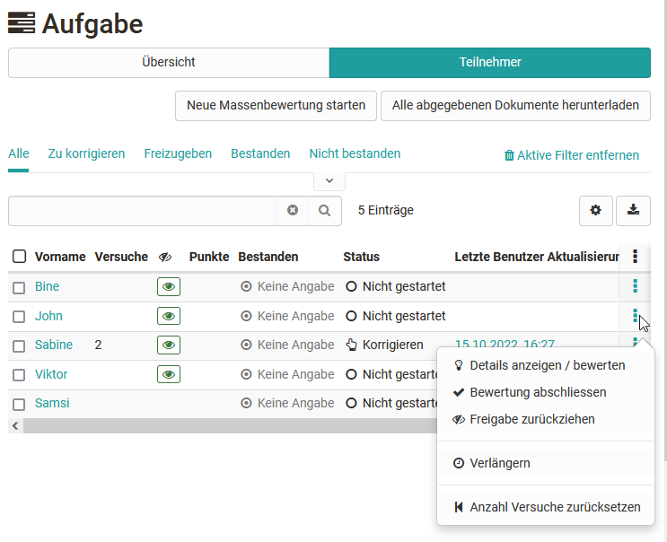
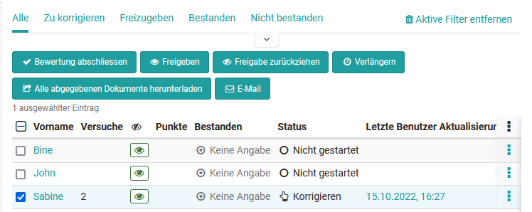
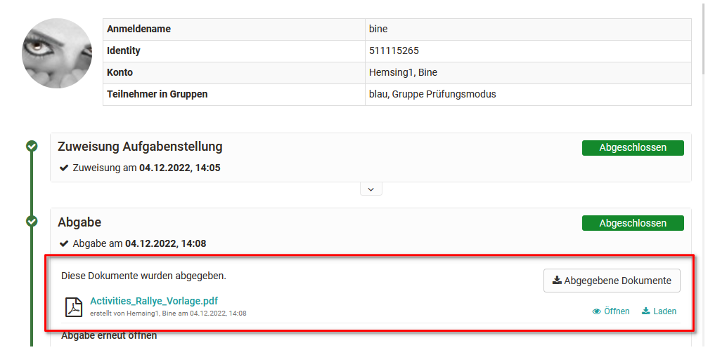
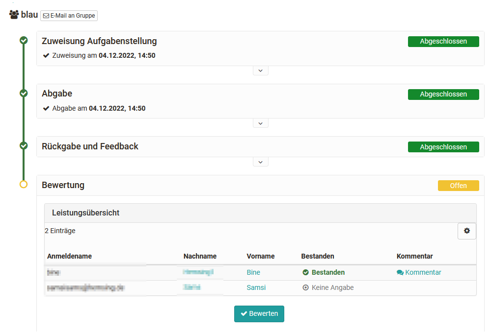

# Assessing tasks and group tasks

Here you will learn how to make assessments for tasks and group tasks using the OpenOlat "Assessment tool".

Go to the assessment tool, activate the tab "User" and select a task from the left overview of the assessment elements of the course. In the table you will now see various action options as well as all assessable persons.

In the tab Overview you get an overview of the assessment of this course element, e.g. how many persons have already passed this course element. In the tab Participants the course participants are displayed and the actual evaluation of participants can be started.

## Tab Teilnehmer

**General action options**

{ class="shadow lightbox" }

Course coaches and course owners have various action options via the corresponding buttons:

* download all submitted documents at once
* start a new bulk assessment and thus assess all participants at once.
* set the task to the status "completed" for all or several selected participants and thus finally finish the assessment. To do this, the desired participants or all participants must first be selected.
* set the assessments of the task to visible or invisible for all or several selected participants at once.
* To send an email to all or specific participants.
* To extend the submission time for certain or all people.

Directly selectable are the options to download all submitted documents as well as to perform a mass evaluation. How to create a mass evaluation for tasks exactly you will learn here in the section [How to](../../manual_how-to/bulk_assessment/bulk_assessment.md). For further actions that only apply to certain participants, the desired participants must first be selected before the options are displayed.

{ class="shadow lightbox" }

## View submitted documents

Before an assignment can be graded, the coaches or course owners must look at the submissions or submitted documents. This can be done either individually for each participant or in the form of mass evaluation or downloading the submitted documents from several people.

### Submissions of individual users

Once a file has been submitted by a learner via the "final submission" button, it can be opened and viewed by the teacher.

To view the submission of _an individual person_ select that person and click on the submitted file.

{ class="shadow lightbox" }

You can find out how to assess the assessment modules of individual persons in general in a [step-by-step guide](Assessment_of_learners.md).

### Submissions from all or multiple users

If many solution attempts have been uploaded or you need to assess many learners, it is recommended to use the "Download all submitted documents" button to download all solution attempts at once. In the downloaded folder you will also find all the task assignments. 

Alternatively, you can select the desired people and then choose the option "Download all submitted documents".

Afterwards you can fill in the [Assessment form](The_assessment_form.md). It will appear under "Assessment" when you assess a course element.

## Assessment workflow course element "Task"

Exactly which steps are available in the evaluation flow depends on the specific configuration of the task module. The details are defined in the configuration of the course element ["Task"](../learningresources/Course_Element_Task.md) or ["Group task"](../learningresources/Course_Element_Grouptask.md). In the assessment tool, the assessment options can no longer be changed.

If desired and configured accordingly, a return document can be uploaded. This could be, for example, a detailed evaluation table or a revised version of the submission. It is also possible to return a submission to the learner via the "Revision" button and trigger a revision loop.

Once a user has definitely submitted a task, it is no longer possible for him to submit it again or to exchange it. However, if an assignment is submitted by mistake or the wrong document is uploaded, the coach can "reopen submission" and allow the learner to submit another submission.

Both learners and teachers can see how far the assessment workflow has progressed by the green ticks next to the individual assessment steps.

Once a submission has been accepted and the user is not to make any more submissions or revisions, the "Accept Submission" button should be confirmed. 

The further assessment actions for the task take place in the lower part in the "Assessment" area, in the actual assessment form. Here points, feedbacks etc. can be deposited. A description of the possibilities can also be found [here](The_assessment_form.md).

## Assessment workflow course element "Group task"

The evaluation of submissions via the course element "Group task" is similar to the course element "Task".

 * Go to the desired group task.
 * Select the desired group in the "Overview" tab or filter the desired group in the "Participants" tab.
 * Provided that a group member has made a submission for the group, this submission applies to the entire group and can now also be evaluated for the entire group.
 * Click on a group member or select the "View / Assess details" option in the 3-dot area and you will be taken to the assessment flow for the group.
 * Carry out the assessment in the same way as the assessment of the course element Task.

In the "Assessment" area, i.e. the actual assessment form, click on the "Assess" button.

{ class="shadow lightbox" }

The advantage of a group task is that an assessment can be made for all group members at once using the "Grade" button, but at the same time adjustments can be made for individual group members.

If not the whole group has passed or not all should receive the same score, "For the whole group" must _not_ be selected. This makes individual scoring per user possible.

{ class="shadow lightbox" }

!!! info "Info"

    If other assessable course elements are to be assessed instead of a "group task" for a group, the assessments must be made separately for each group member.

!!! info "Info"

    In the course run, the evaluation of the individual groups is even more intuitive, as all potential groups to be evaluated are displayed directly here.