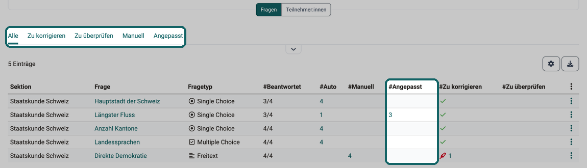
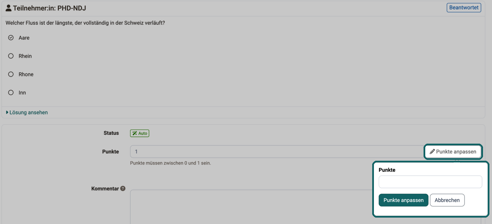
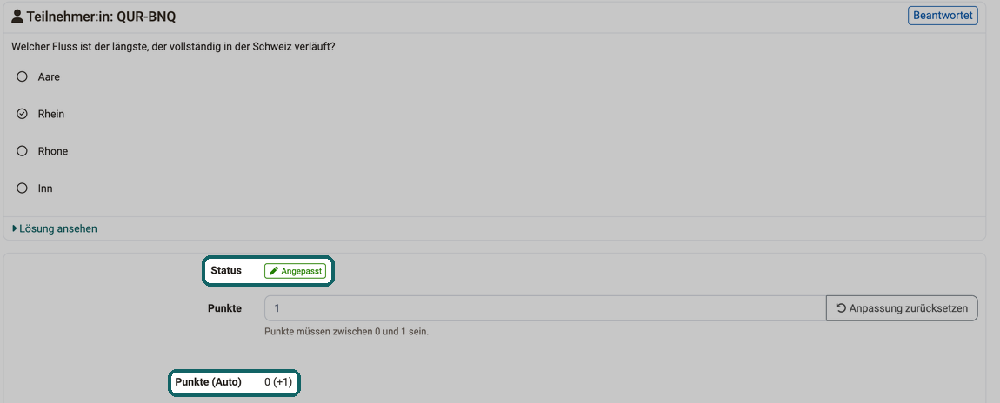
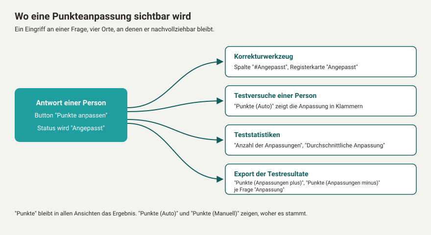
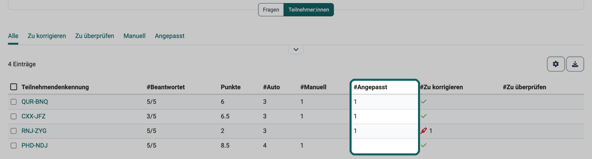
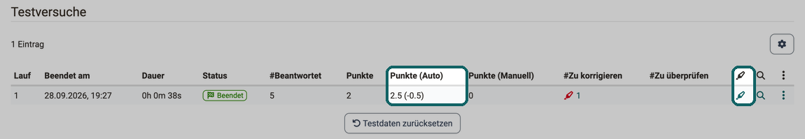
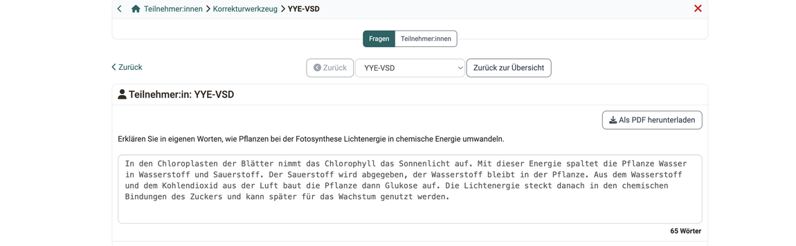
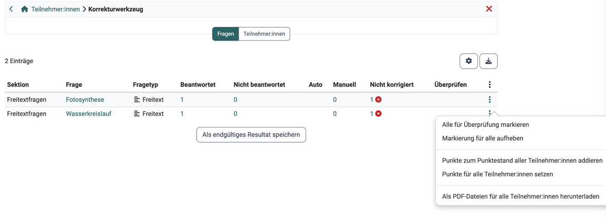
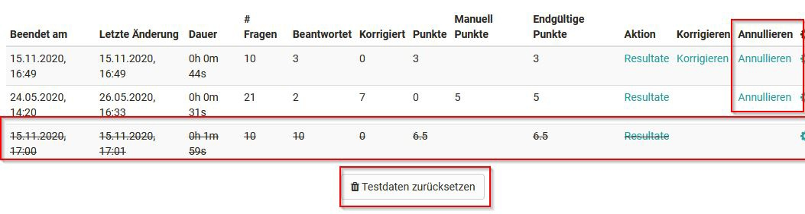

# Tests bewerten {: #assessing_tests}

Hier erfahren Sie, wie Sie Tests mit dem Bewertungswerkzeug von OpenOlat bewerten und korrigieren.

Gehen Sie in das Bewertungswerkzeug und wählen Sie in der linken Übersicht, die die Kursstruktur widerspiegelt, den Test aus, den Sie bewerten möchten. Hier finden Sie zwei Tabs: "Übersicht" und "Teilnehmer:innen".

Im Tab "Übersicht" erhalten Sie eine Übersicht zur Bewertung dieses Kursbausteins, z.B. wie viele Personen diesen Kursbaustein schon bestanden haben. Im Tab "Teilnehmer:innen" werden die Teilnehmenden angezeigt und die eigentliche Bewertung von Teilnehmenden kann gestartet werden.

## Tab Teilnehmer:innen

**Generelle Aktionsmöglichkeiten**

{ class="shadow lightbox" title="Tab Teilnehmer:innen im Bewertungswerkzeug eines Tests" }

Kursbetreuer:innen und Kursbesitzer:innen haben über die entsprechenden Buttons die Möglichkeit:

* sich die Test Statistiken anzuschauen,
* die Resultate aller angezeigten Lernenden als zip-Datei zu exportieren,
* Tests einzuziehen, die sich aktuell in Bearbeitung befinden,
* die Ergebnisse (Daten) aller bisherigen Tests zurückzusetzen,
* die Bewertung für alle oder mehrere ausgewählte Teilnehmende auf den Status "abgeschlossen" zu setzen und damit die Bewertung final zu beenden,
* die Bewertungen der Tests für alle oder mehrere ausgewählte Teilnehmende auf einen Schlag sichtbar bzw. unsichtbar zu setzen (freigeben),
* die Zeit für die Bearbeitung des Tests zu verlängern,
* eine E-Mail an einen oder mehrere Teilnehmende zu versenden,
* die Tests fragenweise zu korrigieren (Button "Korrekturwerkzeug"),
* die zuvor eingerichtete Bewertungsskala noch einmal anzupassen.

!!! note "Hinweis"

    Welche Optionen im Detail angezeigt werden, hängt teilweise von der Konfiguration des Kursbausteins ab.

Die Buttons und Optionen im Detail:

### Test Statistiken
Aufrufen der detaillierten Statistik zu jeder Frage eines Tests. Sämtliche Antworten der Lernenden werden dabei berücksichtigt. Mehr dazu auf der Seite [Test Statistiken](Statistics_Test.de.md).

### Resultate exportieren
Hier können die kompletten Testresultate als zip-Datei exportiert und somit archiviert werden. Der Titel der zip-Datei zeigt den Namen des Tests, den zugehörigen Kurs sowie das Datum des Downloads an. Der Ergebnisdownload beinhaltet eine Teilnehmendenübersicht als HTML-Seite, Ordner mit den Ergebnissen der Teilnehmenden sowie weitere Dateien. Wenn die Testquittung aktiviert wurde, wird auch diese exportiert. Welche Spalten die Excel-Datei enthält, steht auf der Seite [Tests exportieren](Test_export.de.md#export_results).

### Tests einziehen
Sofern gestartete, aber noch nicht abgegebene Tests vorliegen, können diese eingezogen und somit angeschaut werden. Die Tests können auch einmalig nach Ende des Testdurchlaufs eingezogen werden.

### Korrekturwerkzeug {: #correction_tool}
Im Korrekturwerkzeug korrigieren Sie einen Test Frage für Frage oder Person für Person. Sie vergeben Punkte für Fragen, die OpenOlat nicht selbst auswertet, passen die Punkte automatisch korrigierter Fragen an und hinterlassen Kommentare.

Von Hand korrigiert werden die Fragetypen Freitext, Zeichnen und Datei hochladen. Alle übrigen Fragetypen korrigiert OpenOlat automatisch.

Der Button "Korrekturwerkzeug" erscheint, wenn die Einstellung "Korrektur" des Kursbausteins auf "Manuell durch Kursbetreuer:in oder -besitzer:in" steht oder der Test Fragen enthält, die von Hand korrigiert werden. Steht die Einstellung auf "Manuell durch Korrektor:innen", fehlt der Button. Die Korrektur läuft dann über den [Korrektur-Workflow](../area_modules/Coaching_Assessment_Orders.de.md#tab_grading_assignments) im Coaching. Die Einstellung selbst ist auf der Seite [Tests auf Kursebene](Tests_at_course_level.de.md#correction) beschrieben.

Sind Bewertungen bereits abgeschlossen, fragt OpenOlat vor dem Öffnen im Dialog "Abgeschlossene Bewertungen wieder öffnen" nach. Mit "Bewertung wiederöffnen" setzen Sie die abgeschlossenen Bewertungen zurück auf den Status "Korrigieren" und können erneut korrigieren. Mit "Korrektur nur sehen" öffnen Sie das Korrekturwerkzeug, ohne die Bewertungen wieder zu öffnen. Die Antworten dieser Personen sind dann schreibgeschützt, der Button "Punkte anpassen" fehlt.

### Testquittung validieren
Wenn diese Option angewählt wird, wird nach Beenden des Tests eine Testquittung erstellt, welche als XML-File heruntergeladen werden kann. Es dient der Verifizierung des Tests. Das erstellte XML-File kann zusätzlich per Mail an die teilnehmende Person verschickt werden, wenn die Option "Testquittung per Mail schicken" aktiviert wird.

### Alle Daten zurücksetzen
Hiermit werden die Daten des aktuellen Tests zurückgesetzt. Das bedeutet, alle Daten aller Teilnehmenden inklusive Resultate werden unwiderruflich gelöscht. Es ist aber auch möglich, nur einzelne Tests von bestimmten Personen zurückzusetzen. Dies erfolgt direkt in den Einstellungen der jeweiligen Person.

### Verlängern
Hier kann die voreingestellte Testzeit verlängert werden.

### Bewertungsskala anpassen [:octicons-tag-16:{ title="ab Release 16.2 (OO-6008)" }](https://track.frentix.com/issue/OO-6008)
Über diesen Button kann die Bewertungsskala geändert oder ein Wechsel zu einem anderen Bewertungssystem vorgenommen werden.

## Manuelle Bewertung von Testfragen
Für die manuelle Bewertung der Fragen eines Tests sind grundsätzlich folgende Vorgehensweisen möglich:

a) Bewertung aller Teilnehmenden ausgehend von einer einzelnen Frage

b) Bewertung aller Fragen des Tests ausgehend von einer Person

c) Bewertung einer einzelnen Person

!!! note "Hinweis"

    Für die Bewertung von a) und b) nutzen Sie den Button "Korrekturwerkzeug".

### a) Manuelle Bewertung pro Test-Item - Tab Fragen

Wählen Sie den gewünschten Test in der linken Navigation aus und klicken Sie auf "Korrekturwerkzeug". Im Tab "Fragen" erscheinen alle Fragen des Tests mit ihrem Korrekturstand.

{ class="shadow lightbox" title="Tab Fragen im Korrekturwerkzeug · 2026.09.28" }

#### Registerkarten {: #questions_tabs}

Die Registerkarten über der Tabelle führen Sie direkt zu den Fragen, bei denen noch Arbeit ansteht oder nachträglich eingegriffen wurde, ohne dass Sie die Liste sortieren müssen:

* **Alle**: alle Fragen des Tests.
* **Zu korrigieren**: Fragen, die von Hand korrigiert werden und mindestens eine Antwort ohne Punkte haben.
* **Zu überprüfen**: Fragen mit mindestens einer Antwort, die zur Überprüfung markiert ist.
* **Manuell**: alle Fragen, die von Hand korrigiert werden.
* **Angepasst**: automatisch korrigierte Fragen mit mindestens einer Punkteanpassung.

#### Spalten {: #questions_columns}

Die Spalten zeigen, an welchen Stellen noch etwas zu tun ist:

* **Sektion**: die Sektion des Tests, in der die Frage steht.
* **Frage**: der Titel der Frage. Ein Klick darauf öffnet die Antworten aller Personen auf diese Frage.
* **Schlagworte**: die Schlagworte der Frage. Die Spalte ist standardmässig ausgeblendet.
* **Fragetyp**: die Art der Frage, etwa Single Choice oder Freitext.
* **#Beantwortet**: wie viele Testversuche die Frage beantwortet haben, im Verhältnis zu allen Testversuchen.
* **#Auto**: wie viele Antworten OpenOlat automatisch korrigiert hat, ohne Anpassung. Nur bei automatisch korrigierten Fragen gefüllt.
* **#Manuell**: wie viele Antworten die Frage hat, wenn sie von Hand korrigiert wird. Die Zahl umfasst korrigierte und noch nicht korrigierte Antworten.
* **#Angepasst**: wie viele Antworten eine Punkteanpassung tragen. Nur bei automatisch korrigierten Fragen gefüllt.
* **#Zu korrigieren**: wie viele Antworten noch keine Punkte haben. Ein Klick auf die Zahl öffnet genau diese Antworten. Sind alle Antworten korrigiert, steht dort ein Häkchen.
* **#Zu überprüfen**: wie viele Antworten zur Überprüfung markiert sind.

Die Spalten "#Manuell" und "#Zu korrigieren" erscheinen nur, wenn der Test Fragen enthält, die von Hand korrigiert werden. Die Spalte "Frage" und das Menü mit drei Punkten lassen sich nicht ausblenden. Ein Klick auf die Zahl in "#Auto", "#Manuell", "#Angepasst" oder "#Zu überprüfen" öffnet die Antworten, die diese Zahl bilden.

#### Antworten korrigieren {: #correct_answers}

Klicken Sie auf den Titel der Frage, die Sie korrigieren möchten. Es erscheint die Antwort der ersten Person. Hier können Sie Punkte und Kommentare hinterlassen und bei Bedarf die Korrektur auch "Zur Überprüfung markieren". Für automatisch korrigierte Fragen können Sie sich auch die Lösung anzeigen lassen ("Lösung ansehen", "Korrekte Lösung ansehen") und die [Punkte anpassen](#adjust_score).

Mehrere Korrektor:innen können gleichzeitig Bewertungen für einen Test vornehmen. Ist eine Frage durch eine:n Korrektor:in bereits in Bearbeitung, wird diese automatisch für andere gesperrt. In der System-Administration legen Administrator:innen unter `Administration > e-Assessment > Test` im Abschnitt "Konfiguration Korrektur" fest, ob die Teilnehmenden im Korrekturwerkzeug anonym aufgeführt werden. Statt des Namens erscheint dann die "Teilnehmendenkennung".

Abschliessend speichern Sie die Eingaben mit "Speichern", "Speichern und weiter" oder "Speichern und zur Übersicht". Sie können zur nächsten Person wechseln oder zurück in die Fragenübersicht des Korrekturwerkzeugs gehen und die nächste Frage auswählen.

#### Punkte für alle Teilnehmenden einer Frage {: #score_all_participants}

Im Menü mit drei Punkten am Ende der Zeile einer Frage stehen zwei Aktionen, die eine Frage für alle Teilnehmenden auf einmal bewerten:

* **Punkte zum Punktestand aller Teilnehmer:innen addieren**: OpenOlat zählt die eingegebene Punktzahl zu den Punkten jeder Person dazu. Die maximale Punktzahl der Frage wird dabei nicht überschritten.
* **Punkte für alle Teilnehmer:innen setzen**: Alle Personen erhalten für diese Frage dieselbe Punktzahl.

Bei einer automatisch korrigierten Frage gelten diese Punkte als Anpassung, genau wie eine [einzelne Punkteanpassung](#adjust_score).

### Punkte einer Frage anpassen [:octicons-tag-16:{ title="ab Release 21.1 (OO-9599)" }](https://track.frentix.com/issue/OO-9599) {: #adjust_score}

Stellt sich nach der Durchführung eines Tests heraus, dass eine automatisch korrigierte Frage fehlerhaft gestellt war oder eine falsche Lösung hinterlegt hat, gleichen Sie das mit einer Anpassung aus. Die Frage lässt sich nach der Durchführung nicht mehr aus dem Test entfernen. Mit der Anpassung geben Sie den betroffenen Personen Punkte dazu oder ziehen welche ab, ohne die Frage selbst zu ändern. Die Anpassung bleibt dabei sichtbar: Statistik und Export weisen sie getrennt aus, das Ergebnis bleibt auch bei einer späteren Prüfung nachvollziehbar.

Öffnen Sie im Korrekturwerkzeug die Antwort einer Person auf eine automatisch korrigierte Frage. Das Feld "Punkte" ist schreibgeschützt. Daneben steht der Button "Punkte anpassen".

{ class="shadow lightbox" title="Antwort auf eine automatisch korrigierte Frage im Korrekturwerkzeug · 2026.09.28" }

1. Klicken Sie auf "Punkte anpassen". Es öffnet sich ein kleines Eingabefenster.
2. Tragen Sie im Feld "Punkte" den neuen Punktwert der Frage ein, nicht die Differenz. Der Wert muss zwischen der minimalen und der maximalen Punktzahl der Frage liegen.
3. Bestätigen Sie mit "Punkte anpassen".
4. Speichern Sie die Korrektur mit "Speichern", "Speichern und weiter" oder "Speichern und zur Übersicht".

Die Frage trägt danach den Status "Angepasst". Das Feld "Punkte" zeigt das Ergebnis. Darunter zeigt "Punkte (Auto)" den automatisch errechneten Wert und dahinter die Anpassung in Klammern, zum Beispiel "0 (+1)".

{ class="shadow lightbox" title="Angepasste Frage im Korrekturwerkzeug · 2026.09.28" }

Mit "Anpassung zurücksetzen" stellen Sie den automatisch errechneten Wert wieder her. Der Status wechselt zurück auf "Auto". Speichern Sie auch diese Änderung.

Bei Fragen, die von Hand korrigiert werden, gibt es keine Anpassung. Dort tragen Sie den Punktwert direkt im Feld "Punkte" ein, die Frage erhält den Status "Manuell".

Die Anpassung erscheint überall dort, wo Punkte stehen:

{ class="shadow lightbox" title="Wo eine Punkteanpassung sichtbar wird" }

* **Korrekturwerkzeug**: in der Spalte "#Angepasst" und in der Registerkarte "Angepasst".
* **Testversuche einer Person**: in der Spalte "Punkte (Auto)", siehe [c) Manuelle Bewertung ausgehend von einer einzelnen Person](#test_runs).
* **Test Statistiken**: in den Kennzahlen "Anzahl der Anpassungen" und "Durchschnittliche Anpassung" der Frage, siehe [Test Statistiken](Statistics_Test.de.md#adjustment_figures).
* **Export der Testresultate**: in eigenen Spalten der Excel-Datei, siehe [Tests exportieren](Test_export.de.md#score_columns).

Die Teilnehmenden sehen in ihren Resultaten nur den Endwert der Frage, nicht die Anpassung.

### Status einer Frage {: #question_status}

Wenn Sie die Antwort einer Person öffnen, zeigt der Status auf einen Blick, wie die Frage bewertet ist und ob noch etwas zu tun bleibt:

* **Nicht beantwortet**: Die Person hat keine Antwort abgegeben.
* **Auto**: OpenOlat hat die Frage automatisch korrigiert.
* **Angepasst**: Der automatisch errechnete Punktwert wurde angepasst.
* **Zu korrigieren**: Die Frage wird von Hand korrigiert und hat noch keine Punkte.
* **Manuell**: Die Frage wurde von Hand korrigiert.

Hat die Person keine Antwort abgegeben, steht über der Antwort der Hinweis "Diese Frage wurde von der teilnehmenden Person nicht beantwortet." Hat sie die Frage gar nicht geöffnet, lautet er "Diese Frage wurde von der teilnehmenden Person nicht gelesen." Eine nicht gelesene Frage trägt ebenfalls den Status "Nicht beantwortet". Den eigenen Wert "Nicht gelesen" zeigt die Markierung rechts neben dem Namen der Person über der Antwort, dort stehen auch "Beantwortet" und "Nicht beantwortet". Denselben Wert zeigt die Fragenliste eines einzelnen Testversuchs, siehe [c) Manuelle Bewertung ausgehend von einer einzelnen Person](#test_runs).

### b) Manuelle Bewertung pro Person - Tab Teilnehmer:innen

Wählen Sie den gewünschten Test in der linken Navigation aus, klicken Sie auf "Korrekturwerkzeug" und wählen Sie den Tab "Teilnehmer:innen". Hier sehen Sie eine Übersicht der zu bewertenden Personen sowie deren aktuellen Bewertungsstand für den gewählten Test.

{ class="shadow lightbox" title="Tab Teilnehmer:innen im Korrekturwerkzeug · 2026.09.28" }

Über der Tabelle stehen dieselben Registerkarten wie im Tab "Fragen": "Alle", "Zu korrigieren", "Zu überprüfen", "Manuell" und "Angepasst". Sie zeigen die Personen, bei denen Antworten zu korrigieren, zur Überprüfung markiert, von Hand korrigiert oder angepasst sind.

Die Tabelle zeigt je Person:

* **Name** oder **Teilnehmendenkennung**: Bei anonymer Korrektur steht statt der Namensspalten die "Teilnehmendenkennung".
* **Testlauf ID**: die Nummer des Testversuchs. Die Spalte ist standardmässig ausgeblendet.
* **Nicht beantwortet**: wie viele Fragen die Person nicht beantwortet hat. Die Spalte ist standardmässig ausgeblendet.
* **#Beantwortet**: wie viele Fragen die Person beantwortet hat, im Verhältnis zu allen Fragen.
* **Punkte**: das Ergebnis der Person im Test.
* **#Auto**: wie viele Fragen OpenOlat automatisch korrigiert hat, ohne Anpassung.
* **#Manuell**: wie viele Fragen von Hand korrigiert sind.
* **#Angepasst**: wie viele Fragen eine Punkteanpassung tragen.
* **#Zu korrigieren**: wie viele Fragen noch keine Punkte haben.
* **#Zu überprüfen**: wie viele Antworten zur Überprüfung markiert sind.

Die Spalten "#Manuell" und "#Zu korrigieren" erscheinen nur, wenn der Test Fragen enthält, die von Hand korrigiert werden. Die Spalte mit der Teilnehmendenkennung und die Spalte "Punkte" lassen sich nicht ausblenden, damit immer erkennbar bleibt, wessen Ergebnis in der Zeile steht.

Wählen Sie hier die erste Person aus und Sie gelangen in die Fragenliste dieser Person. Hier wählen Sie die gewünschte Frage aus und nehmen die Bewertung vor (siehe a)). Anschliessend wählen Sie die nächste Person, bis alle Bewertungen erledigt sind.

### c) Manuelle Bewertung ausgehend von einer einzelnen Person {: #test_runs}

Falls nur eine einzelne Person bewertet werden soll, bietet sich folgender Weg an:

Wählen Sie den gewünschten Test in der linken Navigation aus und wählen Sie den Tab "Teilnehmer:innen". Klicken Sie dann auf den Namen der zu bewertenden Person. Es erscheint eine Liste mit allen Testversuchen dieser Person. Beim jüngsten Versuch klicken Sie in der Spalte "Korrektur" auf das Stift-Symbol "Korrigieren".

{ class="shadow lightbox" title="Testversuche einer Person im Bewertungswerkzeug · 2026.09.28" }

#### Liste der Testversuche {: #test_runs_columns}

Die Liste zeigt je Testversuch:

* **Lauf**: die Nummer des Testversuchs.
* **Beendet am**, **Dauer** und **Status** des Testversuchs.
* **#Beantwortet**: wie viele Fragen die Person in diesem Testversuch beantwortet hat.
* **Punkte**: das Ergebnis des Testversuchs. Der Wert ist schreibgeschützt.
* **Punkte (Auto)**: der automatisch errechnete Anteil. Gibt es Anpassungen, stehen sie in Klammern dahinter, zum Beispiel "3 (+1 | -0.5)".
* **Punkte (Manuell)**: der von Hand vergebene Anteil.
* **#Zu korrigieren**: wie viele Fragen noch keine Punkte haben.
* **#Zu überprüfen**: wie viele Antworten zur Überprüfung markiert sind.
* **Korrektur**: Das Stift-Symbol "Korrigieren" öffnet die Fragenliste des Testversuchs zum Korrigieren. Die Spalte trägt statt einer Überschrift ebenfalls ein Stift-Symbol.
* **Resultate**: Das Lupen-Symbol "Resultate anzeigen" öffnet die Resultate des Testversuchs.

Nur beim jüngsten Testversuch sind die Werte in "#Zu korrigieren" und "#Zu überprüfen" farbig hervorgehoben und anklickbar, und nur dort steht das Symbol "Korrigieren". Ältere Testversuche zeigen die blosse Zahl, weil nur der jüngste korrigiert wird. Die Spalten "Punkte (Manuell)" und "#Zu korrigieren" erscheinen nur, wenn der Test Fragen enthält, die von Hand korrigiert werden. Die Spalten "Lauf", "Punkte", "Korrektur" und das Menü mit drei Punkten lassen sich nicht ausblenden. Weitere Spalten wie "ID", "Gestartet am", "Letzte Änderung", "Test-Ressource" und "#Fragen" blenden Sie bei Bedarf ein.

#### Fragenliste eines Testversuchs {: #test_run_questions}

Über das Symbol "Korrigieren" gelangen Sie in die Fragenliste des Testversuchs. Sie zeigt je Frage die Spalten "Sektion", "Frage", "Fragetyp", "Beantwortet", "Punkte", "Punkte (Auto)", "Punkte (Manuell)", "#Zu korrigieren" und "#Zu überprüfen". Die Spalte "Beantwortet" zeigt für jede Frage "Beantwortet", "Nicht beantwortet" oder "Nicht gelesen".

Die Registerkarten "Alle", "Zu korrigieren", "Zu überprüfen", "Beantwortet", "Manuell" und "Angepasst" führen direkt zu den Fragen, die Sie suchen. Zusätzlich schränkt der Filter "Status" die Liste auf die Werte "Beantwortet", "Nicht beantwortet" oder "Nicht gelesen" ein. Von hier aus öffnen Sie jede Frage und nehmen die Bewertung vor (siehe a)).

### Freitextantworten als PDF herunterladen [:octicons-tag-16:{ title="ab Release 19.1 (OO-8963)" }](https://track.frentix.com/issue/OO-8963)

Antworten auf Freitextfragen können Sie als PDF herunterladen, einzeln oder gesammelt. Für eine einzelne Antwort öffnen Sie im Korrekturwerkzeug die Antwort einer Person auf eine Freitextfrage. Über den Button "Als PDF herunterladen" oben rechts laden Sie diese Antwort als PDF herunter.

{ class="shadow lightbox" title="Antwort auf eine Freitextfrage im Korrekturwerkzeug" }

Für alle Antworten einer Frage öffnen Sie im Tab "Fragen" das Menü mit drei Punkten am Ende der Zeile. Über "Als PDF-Dateien für alle Teilnehmer:innen herunterladen" erhalten Sie eine zip-Datei mit je einem PDF pro Teilnehmer:in.

{ class="shadow lightbox" title="Tab Fragen im Korrekturwerkzeug" }

Das PDF enthält im Kopfbereich Angaben zu Kurs, Kursbaustein und Test, damit eine eindeutige Zuordnung möglich ist. Wird der Test anonym korrigiert, werden die persönlichen Angaben der Teilnehmenden weggelassen und stattdessen die "Teilnehmendenkennung" angezeigt.

Der Download steht im Korrekturwerkzeug eines Kurses zur Verfügung sowie im [Korrektur-Workflow](../area_modules/Coaching_Assessment_Orders.de.md#tab_grading_assignments) für externe Korrektor:innen.

!!! tip "Voraussetzung"

    Der Download setzt voraus, dass in der System-Administration ein [PDF-Service](../../manual_admin/administration/External_Tools_-_Administration.de.md#pdf_generator) konfiguriert ist.

## Tests zurücksetzen oder annullieren [:octicons-tag-16:{ title="ab Release 14.2 (OO-4825)" }](https://track.frentix.com/issue/OO-4825)

Von Lernenden durchgeführte Test-Versuche können auch rückgängig gemacht werden. Dafür wird der entsprechende Test einer Person aufgerufen und dann die Option "Annullieren" oder "Testdaten zurücksetzen" gewählt.

{ class="shadow lightbox" title="Testversuche einer Person im Bewertungswerkzeug" }

Beim **Annullieren** wird ein einzelner Versuch als ungültig markiert. Das bedeutet, der Versuch erscheint weiter in der Liste und kann von Lehrenden eingesehen und sogar wieder aktiviert werden, wird aber nicht mehr als Ergebnis für die lernende Person berücksichtigt. Hat die Person mehrere Versuche durchgeführt, wird der zeitlich nächste Versuch als Ergebnis berücksichtigt.
Die Anzahl der angezeigten Versuche ändert sich dadurch aber nicht. Ist also ein Test z.B. auf drei Versuche eingeschränkt und hat die Person drei Versuche unternommen, stehen ihr keine weiteren Versuche zur Verfügung, auch wenn einer oder mehrere der Versuche annulliert wurden.

Liegt nur ein Versuch vor und wird dieser annulliert, ändert sich die Tabellenanzeige im Bewertungswerkzeug nicht. Der annullierte Versuch mit den zugehörigen Punkten wird weiterhin angezeigt.

Im Gegensatz zum Annullieren führt **"Testdaten zurücksetzen"** dazu, dass alle Versuche komplett gelöscht werden, die Anzahl der Versuche somit auf 0 gesetzt wird.

## Bewertung im Kursrun [:octicons-tag-16:{ title="ab Release 15.5 (OO-5211)" }](https://track.frentix.com/issue/OO-5211)

Neben der Bewertung im Bewertungswerkzeug können auch einzelne Tests im Kursrun bei geschlossenem Editor bewertet werden. Die Bewertungsmöglichkeiten in den Tabs "Übersicht" und "Teilnehmer:innen" sind überwiegend identisch. Allerdings gibt es im Kursrun noch die Tabs "Kommunikation", "Vorschau" und "Erinnerungen".

Die Vorschau zeigt die Perspektive der Teilnehmenden an und im Tab "Erinnerungen" besteht die Möglichkeit, eine Erinnerungsmail für bestimmte Bedingungen der Test-Bearbeitung, z.B. bei einer bestimmten Punktzahl, bestimmter Anzahl der Versuche oder beim Bestehen/Nichtbestehen, zu verschicken (siehe [Erinnerung](Course_Reminders.de.md)). Der Tab "Kommunikation" ist für die Kommunikation während eines laufenden Tests z.B. im Rahmen von Online-Klausuren gedacht.

{ class="shadow lightbox" title="Test-Kursbaustein im Kursrun" }

---

## Weiterführende Informationen {: #further_information}

**Auf dieser Seite erwähnt** 
[Test Statistiken >](Statistics_Test.de.md) 
[Tests exportieren >](Test_export.de.md) 
[Coaching - Bewertungsaufträge >](../area_modules/Coaching_Assessment_Orders.de.md) 
[Tests auf Kursebene >](Tests_at_course_level.de.md) 
[Externe Werkzeuge: Übersicht >](../../manual_admin/administration/External_Tools_-_Administration.de.md) 
[Erinnerungen >](Course_Reminders.de.md)

**Weiterführend** 
[Bewertungswerkzeug - Übersicht >](Assessment_tool_overview.de.md) 
[Kursbaustein "Test" >](Course_Element_Test.de.md) 
[Bewertungswerkzeug: Tab Teilnehmer:innen >](Assessment_tool_tab_Users.de.md)

[Zum Seitenanfang ^](#assessing_tests)
