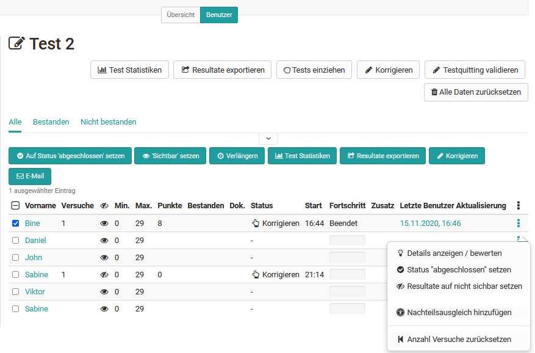
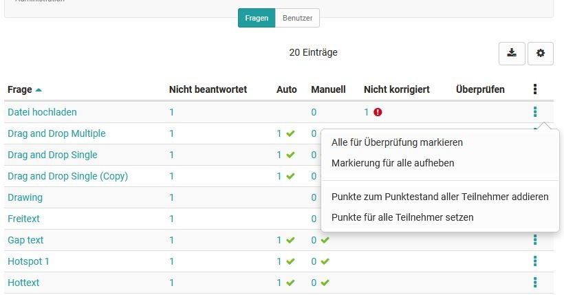
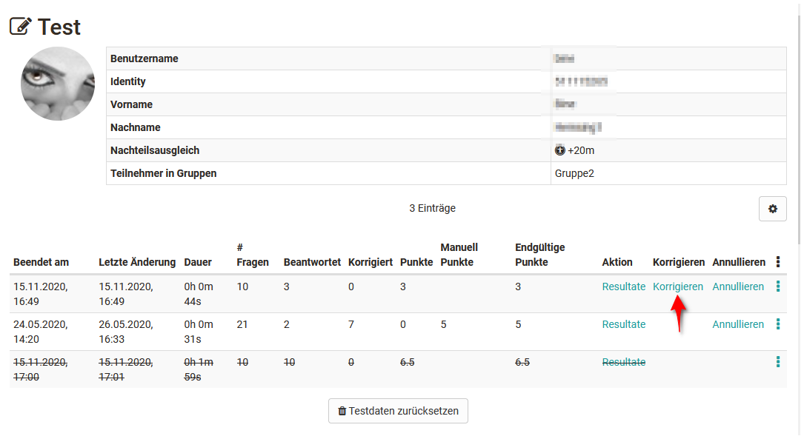
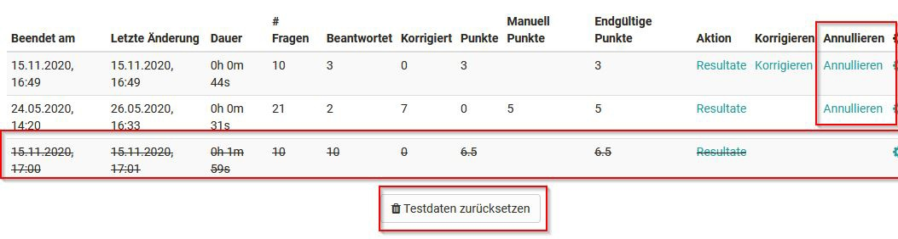
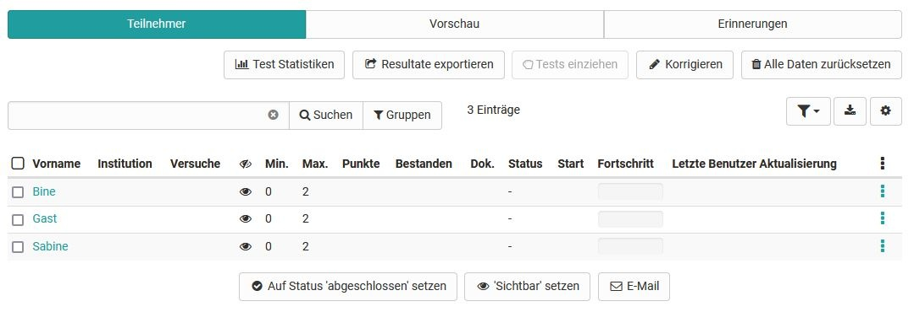

# Assessing tests

Here you will learn how to make assessments for tests using the OpenOlat "Assessment tool".

Go to the assessment tool and select a test from the left overview of the assessment elements of the course. The table will now show you various action options as well as all assessable persons for the test.

## Tab Participants

**General action options**

{ class="shadow lightbox" }

Course coaches and course owners have the possibility to...

* view the test statistics
* export the results of all displayed learners as zip file
* to pull tests that are currently in progress and
* reset the results of all previous tests
* set the task's status to "completed" for all or several selected learners, thus finalizing the assessment
* to set the assessments of the task to visible or invisible for all or several selected participants at one go
* to extend the time for processing the test
* send an e-mail to one or more participants
* correct the tests question by question ("Correct" button)
* set up rating scale, which can be adjusted once again

... via the corresponding buttons.

!!! note "Hinweis"

    Which options are displayed in detail depends partly on the configuration of the course element.

The buttons and options in detail:

### Test Statistics
Access detailed test statistics for each question of a test. All learner responses are included.

### Export results
Here, the complete test results can be exported as a zip file and thus archived. The title of the zip file shows the name of the test, the corresponding course and the date and time of the download. The results download includes a user overview as html page, folders with the respective user results as well as other files. If the test receipt is enabled, it will be exported as well.

### Retract tests
If there are tests that have been started but not yet submitted, they can be pulled in and thus viewed. Tests can also be pulled in once after the end of the test run.

### Grading tool
This button can be used to make manual evaluations _per test question_. Points can be assigned and comments added here. The option appears only in case of manual scoring.

!!! note "Note"

    The Grading tool is the key element for the manual assessment of tests.

### Validate test receipt
If this option is selected, a test receipt is created after the test is completed, which can be downloaded as an XML file. It is used to verify the test. The created XML file can additionally be sent to the participant by mail if the option "Send test receipt by mail" is activated.

### Reset all data
This resets all data of the current test. This means that all data of all users including results will be irrevocably deleted. It is also possible to reset only single tests of certain users. This is done directly in the respective user settings.

### Extend
Here the preset test time can be extended.

### Customize rating scale
This button can be used to change the rating scale or switch to another rating system.

## Manual correction of test questions
For the manual evaluation of the questions of a test, the following procedures are generally possible:

a) Evaluation of all users based on a single test item

b) Evaluation of all manual questions of the test starting from one user

c) Evaluation of a single person

!!! note "Note"

    For the evaluation of a) and b) use the "Correction tool" button.

{ class="shadow lightbox" }

The columns provide information about where something still needs to be done:

* Auto: questions that have been corrected automatically by the system
* Manual: Questions that need to be corrected manually
* Not corrected: Questions that have not yet been corrected. But here you should first check whether answers have been submitted for this question. (Tab "Answered").
* Review: Questions that have been marked for further review

Sort the test items (questions) for the "Manual" or "Not corrected" column to get an overview of the pending assessments.

Then click on the question title of the item to be corrected and you will get to the evaluation form. Here they can now leave points and comments and if necessary also "Mark for review" the correction. For items that can be evaluated automatically, you can also display the solutions or overwrite the points.

Multiple graders can make assessments for a test at the same time. If a question is already being edited by a corrector, it is automatically blocked for others. In the administration it is possible to define for this correction process whether the users should be listed anonymously (user 1, user 2, ...).

Finally, you save the entries and can switch to the next user or go back to the item overview of the correction tool and select the next item.

### b) Manual assessment per user - Tab User

Select the desired test in the left navigation and click on "Correction tool". An overview of all questions of the test with the evaluation status appears.

In the Users tab, you can see an (anonymized) overview of the users to be evaluated as well as their current evaluation status for the selected test.

Select one or the first user here and you will get to the assessment overview of this person for a test. Here you select the desired question and make the assessment in the assessment tool (see a)). Then select the next user until all evaluations have been completed.

### c) Manual assessment of a user

If only one person is to be evaluated, the following method is recommended:

Activate the tab "User" in the left navigation. Now directly select the person you would like to assess. A list with all test attempts of this person appears. Select the current test here and click on "Correct".

{ class="shadow lightbox" }

One lands again in the test item overview with all questions of the test and can get an overview of the processing status and make the evaluations (see a).

### Invalidate or cancel tests

Test attempts performed by learners can also be undone. To do this, the corresponding test of a person is called up and then the option "Cancel" or "Reset test data" is selected.

{ class="shadow lightbox" }

When **invalidating**, a single attempt is marked as invalid. This means that the attempt continues to appear in the list and can be viewed and even reactivated by the teacher, but is no longer taken into account as a result for the learner. If the user has performed several attempts, the next attempt in time will be considered as the result. However, this does not change the number of attempts displayed. For example, if a test is limited to three attempts and the user has made three attempts, no further attempts are available to the user, even if one or more of the attempts have been cancelled.

If there is only one attempt and it is cancelled, the table display in the evaluation tool does not change. The cancelled attempt with the associated points is still displayed.

In contrast to cancelling, **"Reset test data"** results in all tests being completely deleted, and the number of tests is therefore set to 0.

## Assessment in the course run

In addition to the assessment in the assessment tool, individual tests can also be assessed in the course run with the editor closed. The assessment options in the tabs "Overview" and "Participants" are mostly identical.Only the "Preview" and "Reminders" tabs supplement the options.

The preview shows the user perspective and in the tab "Reminders", there is the possibility to send a reminder email for certain conditions e.g. at a certain score, certain number of attempts or at pass/fail
(see also [Reminder](Course_Reminders.md)). The tab "Communication" is intended for communication during an ongoing test, e.g. in the context of online exams.

{ class="shadow lightbox" }
