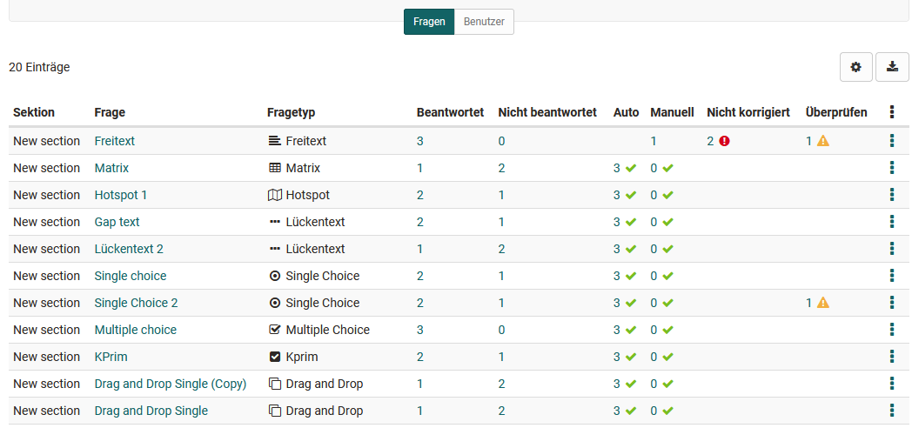
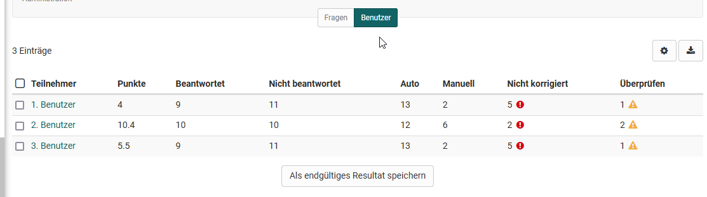
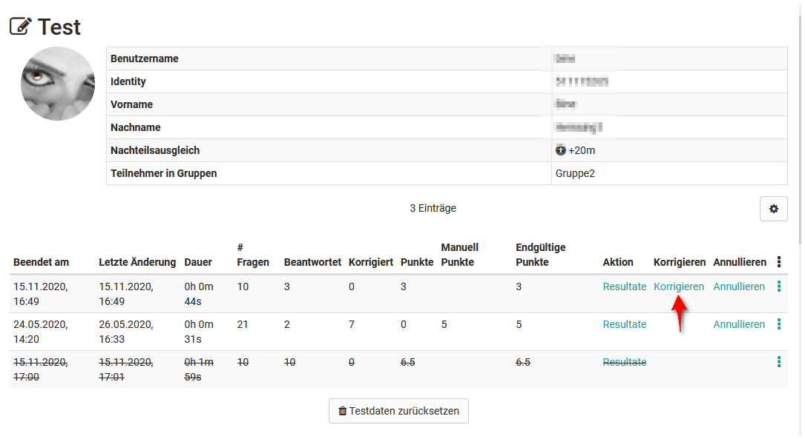
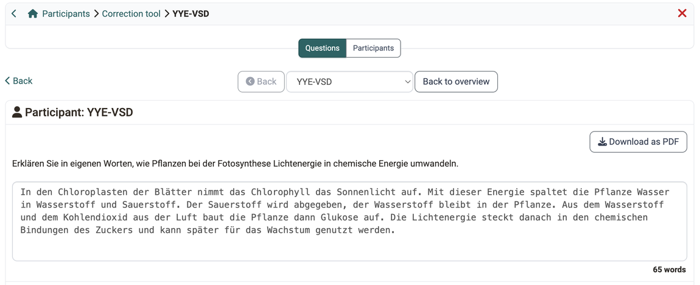
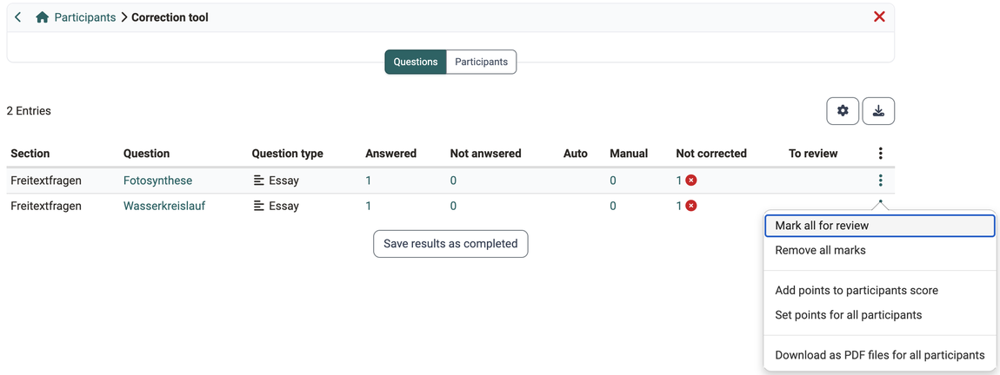
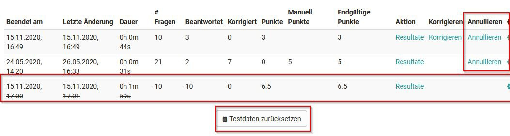
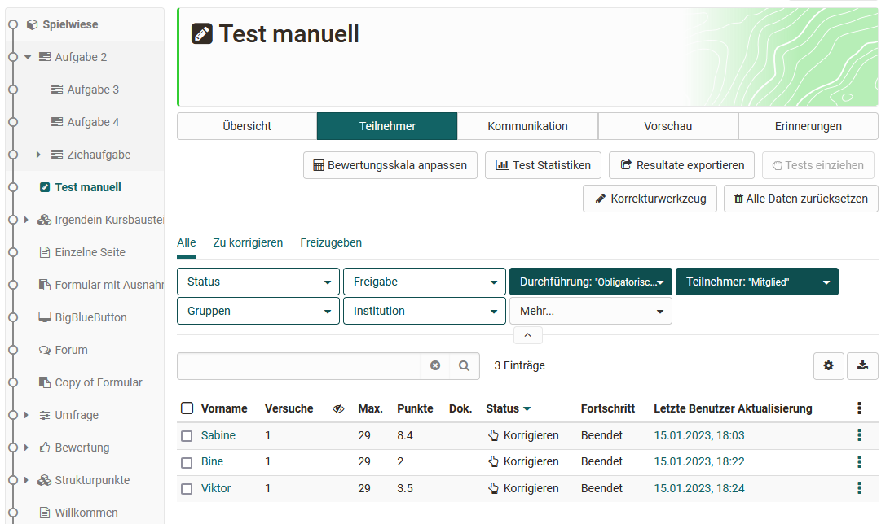

# Assessing tests {: #assessing_tests}

Here you will learn how to make assessments for tests using OpenOlat's "Assessment tool".

Go to the assessment tool and, in the left-hand overview that reflects the course structure, select the test you want to assess. Here you find two tabs: Overview and Participants.

## Tab Participants

**General action options**

{ class="shadow lightbox" }

Course coaches and course owners have the possibility, via the corresponding buttons, to:

* view the test statistics,
* export the results of all displayed learners as a zip file,
* retract tests that are currently in progress,
* reset the results (data) of all previous tests.
* set the assessment for all or several selected participants to the status "completed", finalizing the assessment.
* set the assessments of the tests to visible or invisible for all or several selected participants at once (release).
* extend the time for processing the test.
* send an email to one or more participants
* correct the tests question by question (button "Grading tool")
* also adjust the previously configured rating scale again.

!!! note "Note"

    Which options are displayed in detail depends partly on the configuration of the course element. 

The buttons and options in detail:

### Test Statistics
Opens the detailed statistics for each question of a test. All responses from the learners are taken into account.

### Export results
Here you can export the complete test results as a zip file and archive them. The title of the zip file shows the name of the test, the corresponding course and the date of the download. The results download includes a participant overview as an HTML page, folders with the participants' results, as well as other files. If the test receipt is activated, it is exported as well.

### Retract tests
If tests have been started but not yet submitted, they can be retracted and viewed. Tests can also be retracted once after the end of the test run.

### Grading tool
This button lets you make manual assessments _per test question_. Here you can award points and add comments. The option only appears for manual assessment.

### Validate test receipt
If this option is selected, a test receipt is created after the test is completed, which can be downloaded as an XML file. It is used to verify the test. The created XML file can additionally be sent to the participant by mail if the option "Send test receipt by mail" is activated.

### Reset all data
This resets the data of the current test. This means that all data of all participants, including results, is irrevocably deleted. It is also possible to reset only individual tests of certain persons. This is done directly in the settings of the respective person.

### Extend
Here the preset test time can be extended.

### Customize rating scale
This button lets you change the rating scale or switch to another rating system.

## Manual assessment of test questions 
For the manual assessment of the questions of a test, the following approaches are generally possible:

a) Assessment of all participants based on a single test item 

b) Assessment of all manual questions of the test based on one person 

c) Assessment of a single person

!!! note "Note"

    For the assessment of a) and b), use the "Grading tool" button.

### a) Manual assessment per test item - Tab Questions

Select the desired test in the left navigation and click "Grading tool". An overview of all questions of the test with the assessment status appears. 

{ class="shadow lightbox" } 

The columns show where something still needs to be done: 

* Auto: questions that were corrected automatically by the system; no action is needed at first, but the points can also be overwritten here.
* Manual: questions that must be corrected manually
* Not corrected: questions that have not yet been corrected. Here you should first check whether answers were submitted for this question (column "Answered").
* Review: questions that have been marked for further review. 

Sort the test items (questions) by the "Manual" or "Not corrected" column to get an overview of the pending assessments.

Then click the question title of the item to be corrected and you reach the assessment form. Here you can now leave points and comments, and if necessary also "Mark for review" the correction. 
For automatically evaluated items, you can also display the solutions or overwrite the points. 

Several correctors can make assessments for a test at the same time. If a question is already being edited by a corrector, it is automatically blocked for others. In the administration, it can be defined for this correction process whether the participants are listed anonymously. The participant identifier then appears instead of the name.

Finally, save the entries. You can then switch to the next person or go back to the item overview of the grading tool and select the next item.

### b) Manual assessment per person - Tab Participants

Select the desired test in the left navigation and click "Grading tool". An overview of all questions of the test with the assessment status appears. 

{ class="shadow lightbox" }

In the Participants tab, you see an (anonymized) overview of the persons to be assessed as well as their current assessment status for the selected test.

Select the first person here and you reach the assessment overview of this person for a test. Here you select the desired question and make the assessment in the assessment tool (see a)). Then select the next person until all assessments are done.

### c) Manual assessment starting from a single person

If only a single person is to be assessed, the following approach is recommended: 

Select the desired test in the left navigation and select the tab "Participants". Then click the name of the person to be assessed. A list with all test attempts of this person appears. Select the current attempt here and click "Correct".

{ class="shadow lightbox" }

This leads back to the test item overview with all questions of the test, where you can get an overview of the processing status and make the assessments (see a).

### Downloading essay answers as PDF

You can download answers to essay questions as PDF, either individually or in bulk. For a single answer, open a person's answer to an essay question in the grading tool. Use the "Download as PDF" button at the top right to download this answer as a PDF.

{ class="shadow lightbox" }

For all answers to a question, open the menu with three dots at the end of the row in the "Questions" tab. Via "Download as PDF files for all participants" you receive a zip file with one PDF per participant.

{ class="shadow lightbox" }

The PDF contains information about the course, course element and test in the header so that it can be clearly assigned. If the test is corrected anonymously, the participants' personal details are omitted and the "Participant identifier" is shown instead.

The download is available in the grading tool of a course, as well as in the [Grading workflow](../area_modules/Coaching_Assessment_Orders.md#tab_grading_assignments) for external correctors.

!!! tip "Prerequisite"

    The download requires a [PDF service](../../manual_admin/administration/External_Tools_-_Administration.md#pdf_generator) configured in the administration.

## Resetting or invalidating tests

Test attempts performed by learners can also be undone. To do this, open the corresponding test of a person and select the option "Invalidate" or "Reset test data".

{ class="shadow lightbox" }

When **invalidating**, a single attempt is marked as invalid. This means the attempt continues to appear in the list and can be viewed and even reactivated by the teacher, but is no longer taken into account as a result for the learner. If the learner has made several attempts, the next attempt in time is taken into account as the result.
However, this does not change the number of attempts displayed. So if, for example, a test is limited to three attempts and the learner has made three attempts, no further attempts are available, even if one or more of the attempts have been invalidated.

If there is only one attempt and it is invalidated, the table display in the assessment tool does not change. The invalidated attempt with its points is still displayed.

In contrast to invalidating, **"Reset test data"** completely deletes all attempts, so the number of attempts is set to 0.

## Assessment in the course run

In addition to the assessment in the assessment tool, individual tests can also be assessed in the course run with the editor closed. The assessment options in the tabs "Overview" and "Participants" are mostly identical. However, the course run also has the tabs "Communication", "Preview" and "Reminders". 

The preview shows the participants' perspective, and the "Reminders" tab lets you send a reminder email for certain conditions of the test processing, e.g. at a certain score, a certain number of attempts, or upon passing/failing (see [Reminders](Course_Reminders.md)). The "Communication" tab is intended for communication during an ongoing test, e.g. as part of online exams.

{ class="shadow lightbox" }

---

## Further information {: #further_information}

[Coaching - Assessment Orders >](../area_modules/Coaching_Assessment_Orders.md) 
[External Tools: Overview >](../../manual_admin/administration/External_Tools_-_Administration.md) 
[Course Reminders >](Course_Reminders.md) 
[Assessment tool - overview >](Assessment_tool_overview.md) 
[Course Element "Test" >](Course_Element_Test.md)

[To the top of the page ^](#assessing_tests)
