# Assessing tests {: #assessing_tests}

Here you will learn how to assess and correct tests with the assessment tool of OpenOlat.

Go to the assessment tool and, in the left-hand overview that reflects the course structure, select the test you want to assess. Here you find two tabs: "Overview" and "Participants".

In the "Overview" tab you get an overview of the assessment of this course element, e.g. how many persons have already passed this course element. The "Participants" tab lists the participants, and the actual assessment of participants can be started there.

## Tab Participants

**General action options**

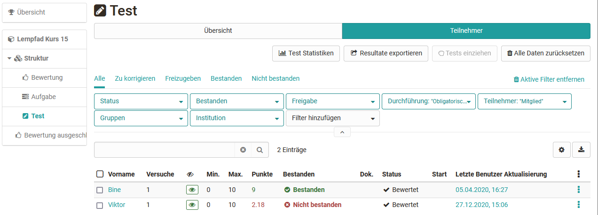{ class="shadow lightbox" title="Tab Participants in the assessment tool of a test" }

Course coaches and course owners have the possibility, via the corresponding buttons, to:

* view the test statistics,
* export the results of all displayed learners as a zip file,
* retract tests that are currently in progress,
* reset the results (data) of all previous tests,
* set the assessment for all or several selected participants to the status "completed", finalizing the assessment,
* set the assessments of the tests to visible or invisible for all or several selected participants at once (release),
* extend the time for processing the test,
* send an email to one or more participants,
* correct the tests question by question (button "Correction tool"),
* adjust the previously configured rating scale again.

!!! note "Note"

    Which options are displayed in detail depends partly on the configuration of the course element.

The buttons and options in detail:

### Test Statistics
Opens the detailed statistics for each question of a test. All responses from the learners are taken into account. More about this on the page [Test statistics](Statistics_Test.md).

### Export results
Here you can export the complete test results as a zip file and archive them. The title of the zip file shows the name of the test, the corresponding course and the date of the download. The results download includes a participant overview as an HTML page, folders with the participants' results, as well as other files. If the test receipt is activated, it is exported as well. The columns of the Excel file are described on the page [Export tests](Test_export.md#export_results).

### Retract tests
If tests have been started but not yet submitted, they can be retracted and viewed. Tests can also be retracted once after the end of the test run.

### Correction tool {: #correction_tool}
In the correction tool you correct a test question by question or person by person. You award points for questions that OpenOlat does not evaluate itself, adjust the score of automatically corrected questions and leave comments.

The question types Essay, Drawing and File upload are corrected by hand. OpenOlat corrects all other question types automatically.

The "Correction tool" button appears if the "Correction" setting of the course element is set to "Manual by course coach/owner" or if the test contains questions that are corrected by hand. If the setting is "Manual by correctors", the button is missing. The correction then runs through the [correction workflow](../area_modules/Coaching_Assessment_Orders.md#tab_grading_assignments) in Coaching. The setting itself is described on the page [Tests at course level](Tests_at_course_level.md#correction).

If assessments are already closed, OpenOlat asks first in the dialog "Reopen closed assessments". With "Reopen assessment" you set the closed assessments back to the status "To review" and can correct them again. With "See correction read only" you open the correction tool without reopening the assessments. The answers of these persons are then read-only, and the "Adjust score" button is missing.

### Validate test receipt
If this option is selected, a test receipt is created after the test is completed, which can be downloaded as an XML file. It is used to verify the test. The created XML file can additionally be sent to the participant by mail if the option "Send test receipt by mail" is activated.

### Reset all data
This resets the data of the current test. This means that all data of all participants, including results, is irrevocably deleted. It is also possible to reset only individual tests of certain persons. This is done directly in the settings of the respective person.

### Extend
Here the preset test time can be extended.

### Customize rating scale [:octicons-tag-16:{ title="from Release 16.2 (OO-6008)" }](https://track.frentix.com/issue/OO-6008)
This button lets you change the rating scale or switch to another rating system.

## Manual assessment of test questions
For the manual assessment of the questions of a test, the following approaches are generally possible:

a) Assessment of all participants based on a single question

b) Assessment of all questions of the test based on one person

c) Assessment of a single person

!!! note "Note"

    For the assessment of a) and b), use the "Correction tool" button.

### a) Manual assessment per test item - Tab Questions

Select the desired test in the left navigation and click "Correction tool". The "Questions" tab lists all questions of the test with their correction status.

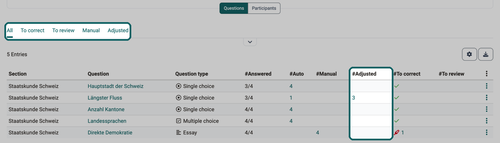{ class="shadow lightbox" title="Tab Questions in the correction tool · 2026.09.28" }

#### Tabs {: #questions_tabs}

The tabs above the table take you directly to the questions where work is still pending or where a change was made afterwards, without having to sort the list:

* **All**: all questions of the test.
* **To correct**: questions that are corrected by hand and have at least one answer without points.
* **To review**: questions with at least one answer that is marked for review.
* **Manual**: all questions that are corrected by hand.
* **Adjusted**: automatically corrected questions with at least one score adjustment.

#### Columns {: #questions_columns}

The columns show where something still needs to be done:

* **Section**: the section of the test in which the question is located.
* **Question**: the title of the question. A click on it opens the answers of all persons to this question.
* **Keywords**: the keywords of the question. The column is hidden by default.
* **Question type**: the type of the question, for example Single Choice or Essay.
* **#Answered**: how many test runs answered the question, in relation to all test runs.
* **#Auto**: how many answers OpenOlat corrected automatically, without adjustment. Only filled for automatically corrected questions.
* **#Manual**: how many answers the question has if it is corrected by hand. The number includes corrected and not yet corrected answers.
* **#Adjusted**: how many answers carry a score adjustment. Only filled for automatically corrected questions.
* **#To correct**: how many answers do not have points yet. A click on the number opens exactly these answers. When all answers are corrected, a check mark appears there.
* **#To review**: how many answers are marked for review.

The columns "#Manual" and "#To correct" only appear if the test contains questions that are corrected by hand. The column "Question" and the menu with three dots cannot be hidden. A click on the number in "#Auto", "#Manual", "#Adjusted" or "#To review" opens the answers that make up this number.

#### Correcting answers {: #correct_answers}

Click the title of the question you want to correct. The answer of the first person appears. Here you can leave points and comments, and if necessary also "Mark for review" the correction. For automatically corrected questions, you can also display the solution ("View solution", "View correct solution") and [adjust the score](#adjust_score).

Several correctors can make assessments for a test at the same time. If a question is already being edited by a corrector, it is automatically blocked for others. In the system administration, administrators define under `Administration > e-Assessment > Test` in the section "Configuration of correction" whether the participants are listed anonymously in the correction tool. The "Participant identifier" then appears instead of the name.

Finally, save the entries with "Save", "Save and next" or "Save and back to overview". You can switch to the next person or go back to the question overview of the correction tool and select the next question.

#### Points for all participants of a question {: #score_all_participants}

The menu with three dots at the end of a question's row contains two actions that assess a question for all participants at once:

* **Add points to participants score**: OpenOlat adds the entered points to the points of each person. The maximum score of the question is not exceeded.
* **Set points for all participants**: all persons receive the same score for this question.

For an automatically corrected question, these points count as an adjustment, exactly like a [single score adjustment](#adjust_score).

### Adjusting the score of a question [:octicons-tag-16:{ title="from Release 21.1 (OO-9599)" }](https://track.frentix.com/issue/OO-9599) {: #adjust_score}

If it turns out after a test has been conducted that an automatically corrected question was incorrectly worded or has a wrong solution, you compensate for this with an adjustment. The question can no longer be removed from the test after it has been conducted. With the adjustment, you add points for the persons concerned or deduct points, without changing the question itself. The adjustment remains visible: statistics and export show it separately, and the result remains traceable in a later review.

In the correction tool, open the answer of a person to an automatically corrected question. The "Score" field is read-only. Next to it is the "Adjust score" button.

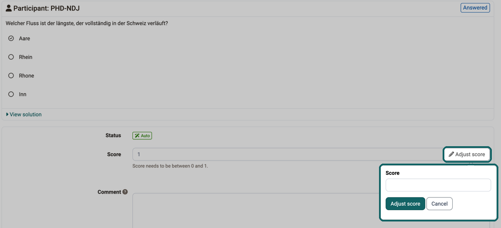{ class="shadow lightbox" title="Answer to an automatically corrected question in the correction tool · 2026.09.28" }

1. Click "Adjust score". A small input window opens.
2. In the "Score" field, enter the new score of the question, not the difference. The value must lie between the minimum and the maximum score of the question.
3. Confirm with "Adjust score".
4. Save the correction with "Save", "Save and next" or "Save and back to overview".

The question then carries the status "Adjusted". The "Score" field shows the result. Below it, "Score (auto)" shows the automatically calculated value followed by the adjustment in brackets, for example "0 (+1)".

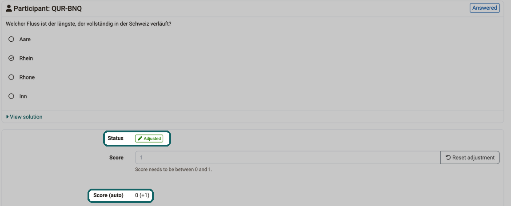{ class="shadow lightbox" title="Adjusted question in the correction tool · 2026.09.28" }

With "Reset adjustment" you restore the automatically calculated value. The status changes back to "Auto". Save this change as well.

There is no adjustment for questions that are corrected by hand. There you enter the score directly in the "Score" field, and the question receives the status "Manual".

The adjustment appears wherever points are shown:

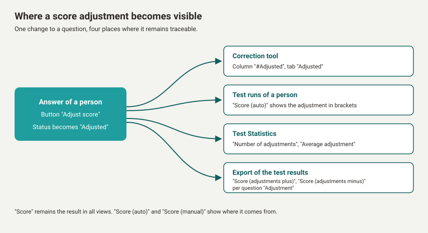{ class="shadow lightbox" title="Where a score adjustment becomes visible" }

* **Correction tool**: in the column "#Adjusted" and in the tab "Adjusted".
* **Test runs of a person**: in the column "Score (auto)", see [c) Manual assessment starting from a single person](#test_runs).
* **Test statistics**: in the key figures "Number of adjustments" and "Average adjustment" of the question, see [Test statistics](Statistics_Test.md#adjustment_figures).
* **Export of the test results**: in separate columns of the Excel file, see [Export tests](Test_export.md#score_columns).

The participants only see the final score of the question in their results, not the adjustment.

### Status of a question {: #question_status}

When you open the answer of a person, the status shows at a glance how the question is assessed and whether anything still needs to be done:

* **Not answered**: the person did not submit an answer.
* **Auto**: OpenOlat corrected the question automatically.
* **Adjusted**: the automatically calculated score was adjusted.
* **To correct**: the question is corrected by hand and has no points yet.
* **Manual**: the question was corrected by hand.

If the person did not submit an answer, the note "This question has not been answered by the participant." appears above the answer. If the person did not open the question at all, it reads "This question has not been read by the participant." An unread question also carries the status "Not answered". The separate value "Unread" is shown by the label to the right of the person's name above the answer, which also shows "Answered" and "Not answered". The question list of a single test run shows the same value, see [c) Manual assessment starting from a single person](#test_runs).

### b) Manual assessment per person - Tab Participants

Select the desired test in the left navigation, click "Correction tool" and select the "Participants" tab. Here you see an overview of the persons to be assessed as well as their current assessment status for the selected test.

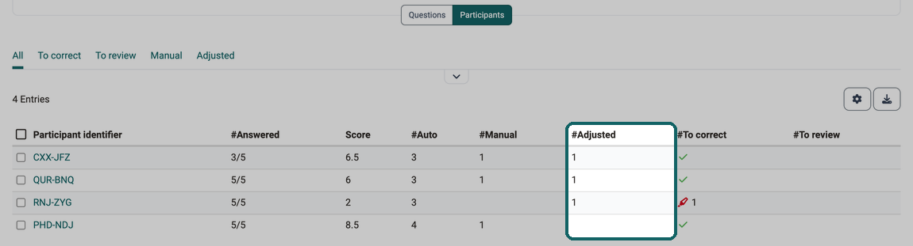{ class="shadow lightbox" title="Tab Participants in the correction tool · 2026.09.28" }

Above the table are the same tabs as in the "Questions" tab: "All", "To correct", "To review", "Manual" and "Adjusted". They show the persons whose answers are to be corrected, marked for review, corrected by hand or adjusted.

The table shows for each person:

* **Name** or **Participant identifier**: with anonymous correction, the "Participant identifier" appears instead of the name columns.
* **Test run ID**: the number of the test run. The column is hidden by default.
* **Not answered**: how many questions the person did not answer. The column is hidden by default.
* **#Answered**: how many questions the person answered, in relation to all questions.
* **Score**: the result of the person in the test.
* **#Auto**: how many questions OpenOlat corrected automatically, without adjustment.
* **#Manual**: how many questions are corrected by hand.
* **#Adjusted**: how many questions carry a score adjustment.
* **#To correct**: how many questions do not have points yet.
* **#To review**: how many answers are marked for review.

The columns "#Manual" and "#To correct" only appear if the test contains questions that are corrected by hand. The column with the participant identifier and the column "Score" cannot be hidden, so that it always remains clear whose result is in the row.

Select the first person here and you reach the question list of this person. Here you select the desired question and make the assessment (see a)). Then select the next person until all assessments are done.

### c) Manual assessment starting from a single person {: #test_runs}

If only a single person is to be assessed, the following approach is recommended:

Select the desired test in the left navigation and select the tab "Participants". Then click the name of the person to be assessed. A list with all test runs of this person appears. For the most recent run, click the pencil icon "Correct" in the "Correction" column.

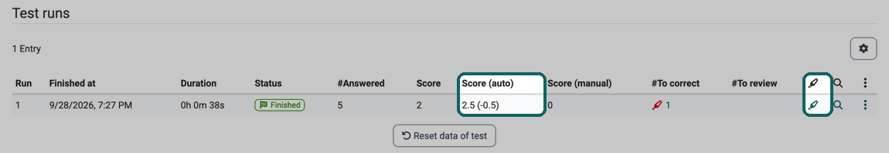{ class="shadow lightbox" title="Test runs of a person in the assessment tool · 2026.09.28" }

#### List of test runs {: #test_runs_columns}

The list shows for each test run:

* **Run**: the number of the test run.
* **Finished at**, **Duration** and **Status** of the test run.
* **#Answered**: how many questions the person answered in this test run.
* **Score**: the result of the test run. The value is read-only.
* **Score (auto)**: the automatically calculated share. If there are adjustments, they follow in brackets, for example "3 (+1 | -0.5)".
* **Score (manual)**: the share awarded by hand.
* **#To correct**: how many questions do not have points yet.
* **#To review**: how many answers are marked for review.
* **Correction**: the pencil icon "Correct" opens the question list of the test run for correction. Instead of a heading, the column also shows a pencil icon.
* **Results**: the magnifying glass icon "View results" opens the results of the test run.

Only for the most recent test run are the values in "#To correct" and "#To review" highlighted in colour and clickable, and only there does the "Correct" icon appear. Older test runs show the plain number, because only the most recent one is corrected. The columns "Score (manual)" and "#To correct" only appear if the test contains questions that are corrected by hand. The columns "Run", "Score", "Correction" and the menu with three dots cannot be hidden. Further columns such as "ID", "Started on", "Last modified", "Test resource" and "#Questions" can be shown if needed.

#### Question list of a test run {: #test_run_questions}

Via the "Correct" icon you reach the question list of the test run. For each question it shows the columns "Section", "Question", "Question type", "Answered", "Score", "Score (Auto)", "Score (Manual)", "#To correct" and "#To review". The "Answered" column shows "Answered", "Not answered" or "Unread" for each question.

The tabs "All", "To correct", "To review", "Answered", "Manual" and "Adjusted" take you directly to the questions you are looking for. In addition, the "Status" filter restricts the list to the values "Answered", "Not answered" or "Unread". From here you open each question and make the assessment (see a)).

### Downloading essay answers as PDF [:octicons-tag-16:{ title="from Release 19.1 (OO-8963)" }](https://track.frentix.com/issue/OO-8963)

You can download answers to essay questions as PDF, either individually or in bulk. For a single answer, open a person's answer to an essay question in the correction tool. Use the "Download as PDF" button at the top right to download this answer as a PDF.

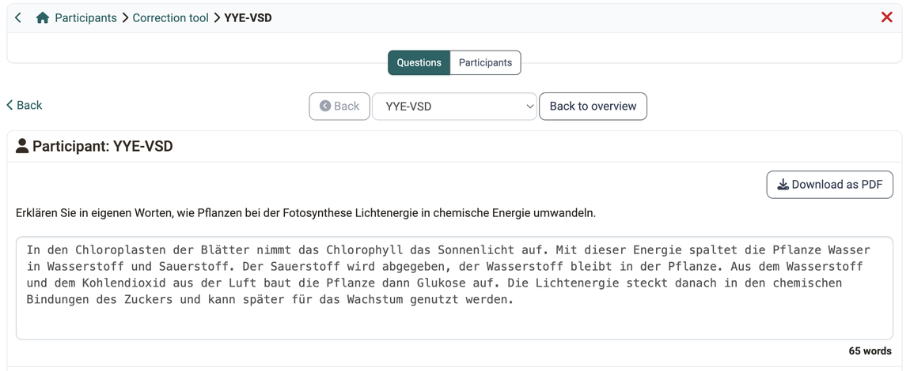{ class="shadow lightbox" title="Answer to an essay question in the correction tool" }

For all answers to a question, open the menu with three dots at the end of the row in the "Questions" tab. Via "Download as PDF files for all participants" you receive a zip file with one PDF per participant.

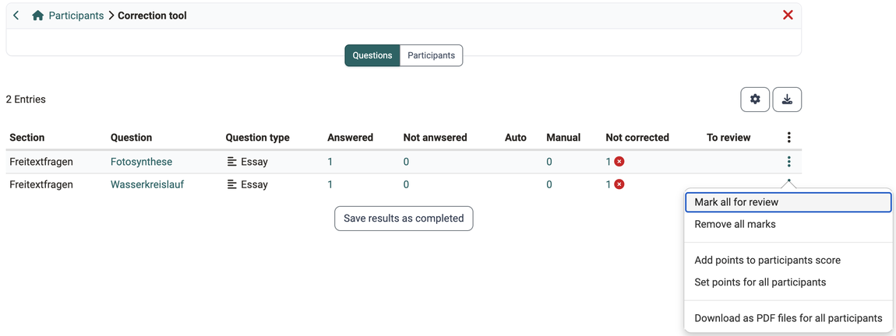{ class="shadow lightbox" title="Tab Questions in the correction tool" }

The PDF contains information about the course, course element and test in the header so that it can be clearly assigned. If the test is corrected anonymously, the participants' personal details are omitted and the "Participant identifier" is shown instead.

The download is available in the correction tool of a course, as well as in the [correction workflow](../area_modules/Coaching_Assessment_Orders.md#tab_grading_assignments) for external correctors.

!!! tip "Prerequisite"

    The download requires the [PDF service](../../manual_admin/administration/External_Tools_-_Administration.md#pdf_generator) to be switched on in the system administration.

## Resetting or invalidating tests [:octicons-tag-16:{ title="from Release 14.2 (OO-4825)" }](https://track.frentix.com/issue/OO-4825)

Test attempts performed by learners can also be undone. To do this, open the test of a person in the assessment tool. Under "Test runs", you find "Invalidate" in the menu with three dots at the end of an attempt's row. The "Reset data of test" button is below the list of attempts.

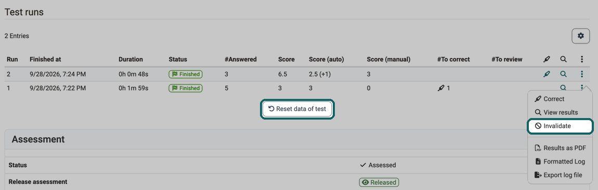{ class="shadow lightbox" title="Test runs of a person in the assessment tool · 2026.09.29" }

When **invalidating**, a single attempt is marked as invalid. This means the attempt continues to appear in the list and can be viewed and even reactivated by teachers, but is no longer taken into account as a result for the learner. If the learner has made several attempts, the next attempt in time is taken into account as the result.
However, this does not change the number of attempts displayed. So if, for example, a test is limited to three attempts and the learner has made three attempts, no further attempts are available, even if one or more of the attempts have been invalidated.

If there is only one attempt and it is invalidated, the table display in the assessment tool does not change. The invalidated attempt with its points is still displayed.

In contrast to invalidating, **"Reset data of test"** completely deletes all attempts, so the number of attempts is set to 0.

## Assessment in the course run [:octicons-tag-16:{ title="from Release 15.5 (OO-5211)" }](https://track.frentix.com/issue/OO-5211)

In addition to the assessment in the assessment tool, individual tests can also be assessed in the course run with the editor closed. The assessment options in the tabs "Overview" and "Participants" are mostly identical. However, the course run also has the tabs "Communication", "Preview" and "Reminders".

The preview shows the participants' perspective, and the "Reminders" tab lets you send a reminder email for certain conditions of the test processing, e.g. at a certain score, a certain number of attempts, or upon passing/failing (see [Reminders](Course_Reminders.md)). The "Communication" tab is intended for communication during an ongoing test, e.g. as part of online exams.

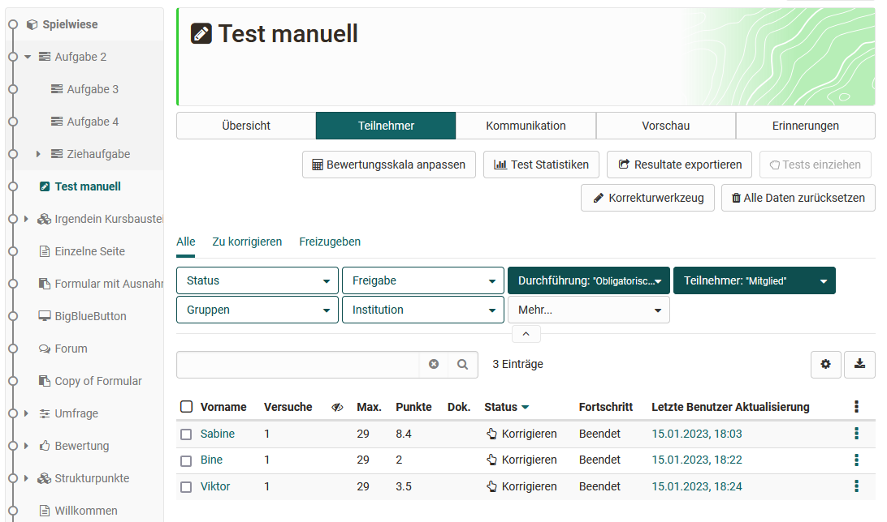{ class="shadow lightbox" title="Test course element in the course run" }

---

## Further information {: #further_information}

**Mentioned on this page** 
[Test statistics >](Statistics_Test.md) 
[Export tests >](Test_export.md) 
[Coaching - Assessment Orders >](../area_modules/Coaching_Assessment_Orders.md) 
[Tests at course level >](Tests_at_course_level.md) 
[External Tools: Overview >](../../manual_admin/administration/External_Tools_-_Administration.md) 
[Course Reminders >](Course_Reminders.md)

**Further** 
[Assessment tool - overview >](Assessment_tool_overview.md) 
[Course Element "Test" >](Course_Element_Test.md) 
[Assessment tool: Tab Participants >](Assessment_tool_tab_Users.md)

[To the top of the page ^](#assessing_tests)
