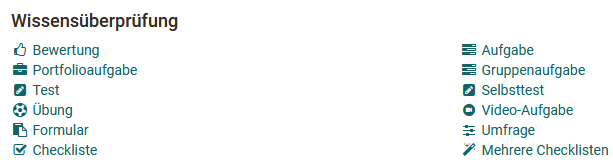
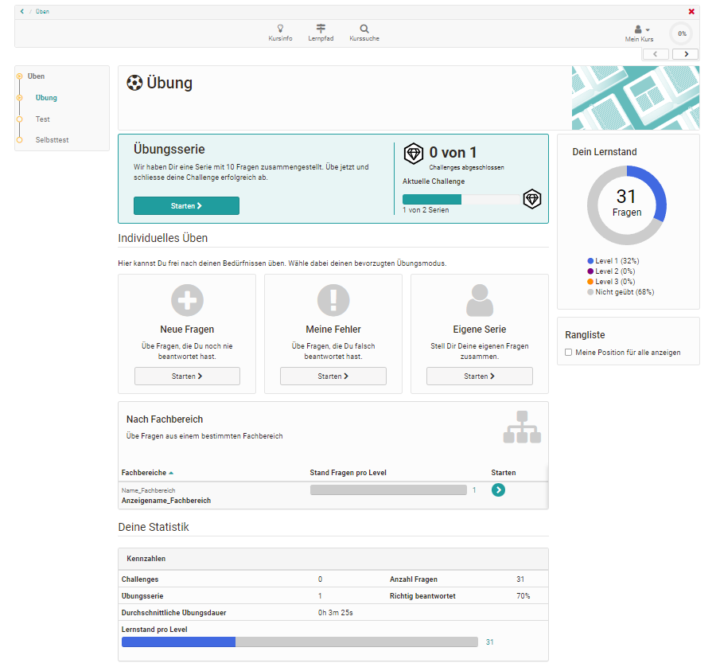
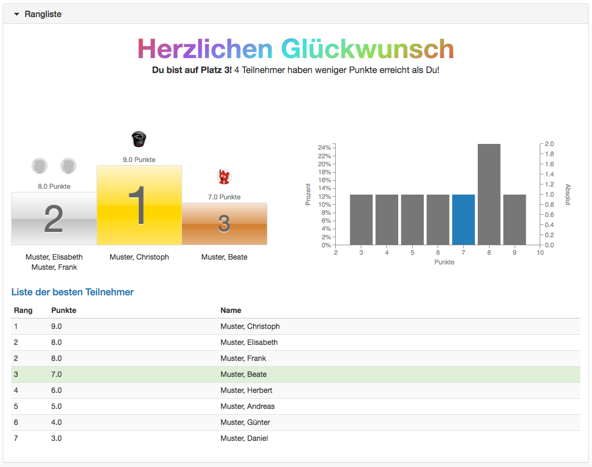

# Wissensüberprüfung

Hier erhalten Sie einen Überblick über die Kursbausteine, die zur
Wissensüberprüfung eingesetzt werden können. Für einige Kursbausteine
existieren vertiefende, separate Seiten oder Kapitel hier im Handbuch.

OpenOlat stellt diverse Kursbausteine für die Wissensüberprüfung zur
Verfügung. Die zentralen Kursbausteine hierfür sind die drei Kursbausteine die OpenOlat [Tests](../learningresources/Configure_tests.de.md) verwenden und die beiden
Kursbausteine für
[Einsendeaufgaben](../task/index.de.md). Aber auch die
anderen Bausteine wie
[Portfolioaufgabe](../learningresources/Creating_Portfolio_Tasks.de.md),
[Bewertungen](Course_Element_Assessment.de.md) mit und ohne
Bewertungsraster (Rubrik) oder die Checklisten bieten für bestimmte Szenarien
viel Potenzial.

Die meisten Kursbausteine der Kategorie Wissensüberprüfung können bei Bedarf
auch mit Punkten versehen werden und erhalten dann den Konfigurations-Tab
"Highscore". Mit der Vergabe von Punkten können weitere Features wie die
Addition von Punkten oder das Bestehen/Nicht bestehen eines Kurses basierend
auf den Bewertungen verschiedener Kursbausteine hinzugefügt werden. Verwendet
wird hierfür ein Kursbaustein
[Struktur](Course_Element_Structure.de.) bei herkömmlichen
Kursen.

Ein weiterer Konfigurations-Tab der bei den meisten Kursbausteinen der Wissensüberprüfung zur Verfügung steht (bis auf Selbsttest und Umfrage) ist der Tab "Erinnerung". Hier können in Abhängigkeit von der Bearbeitung des jeweiligen Kursbausteins E-Mails verschickt werden. Zum Beispiel kann eine
Mail verschickt werden, wenn zu einem bestimmten Datum eine Aufgabe oder ein Test noch nicht bearbeitet wurde. Die Möglichkeiten sind ähnlich wie im Menü ["Erinnerung"](../learningresources/Course_Reminders.de.md) in
der Kurs-Administration. 

In der Kategorie Wissensüberprüfung findet man auch die Kursbausteine "Umfrage" und "Formular" mit dem man OpenOlat [Formulare](../learningresources/Form_editor_Questionnaire_editor.de.md) für Befragungen u.ä. in einen Kurs einbauen kann.

## Kursbaustein „Bewertung“  {: #course_element_assessment}

Der Kursbaustein „Bewertung“ eignet sich, um Leistungen zu bewerten, welche
nicht explizit elektronisch abgegeben werden, z.B. Präsenz-Referate oder
Online-Webseiten. Auch eine Rubrik-Bewertung steht hier zur Verfügung.

Auf separaten Seiten erfahren Sie wie man eine 
[Bewertung](Course_Element_Assessment.de.md) einrichtet, durchführt und
konfiguriert.

  

## Kursbaustein "Aufgabe" {: #course_element_task}

Mit Hilfe des Kursbausteins Aufgabe können Lehrende Dateiabgaben und
Einsendeaufgaben organisieren. Lernende laden dabei ihre Einreichungen in den
OpenOlat Kurs hoch und erhalten vom Lehrenden ein Feedback bzw. eine
Bewertung. Ebenso können Überarbeitungen eingefordert oder Musterlösungen bereitgestellt werden.

Die zentrale Konfiguration des Kursbausteins erfolgt im Tab
„Workflow“. Hier bestimmen Sie, welche der folgenden Optionen Sie verwenden möchten. Anschliessend können Sie diese weiter konfigurieren:
 
  * **Aufgabenstellung**: Stellen Sie eine Aufgabenstellung direkt im Kursbaustein zur Verfügung. 
  * **Abgabe**: Lernende sollen die Möglichkeit haben ihre Bearbeitung einzureichen. Kursteilnehmer erstellen hier ihre Lösungen oder laden diese als PDF hoch.
  * **Rückgabe und Feedback**: Korrigierte Aufgaben und Überarbeitungsanforderungen können hier den Teilnehmern zurückgegeben werden.
  *  **Überarbeitung**: Teilnehmer geben in diesem Abschnitt überarbeitete Dokumente ab. Sie können weitere Korrekturanforderungen stellen, bis Sie die Aufgabe als erledigt betrachten und den Revisionsprozess schliessen.
  *  **Musterlösung**: Stellen Sie allen Teilnehmenden eine Musterlösung für die Aufgabe  zur Verfügung. Musterlösungen können als Datei hochgeladen oder direkt in OpenOlat erstellt werden.
  *  **Bewertung**: Punkte, bestanden/nicht bestanden und Feedbacks können individuell hinterlegt werden. 

 Im Tab "Lernpfad" (bzw. im Tab "Workflow" bei herkömmlichen) kann ferner definiert werden ob die Aufgabe obligatorisch oder freiwillig ist. Obligatorische Aufgaben müssen bearbeitet werden und werden nach Ablauf des eingestellten Abgabetermins eingezogen und zur Bewertung an den Lehrenden übergeben. Bei freiwilligen Aufgaben kann der User selbst entscheiden ob er sie bearbeiten möchte. Ferner werden freiwillige Aufgaben nach der Deadline _nicht_ eingezogen.   

!!! info "Info"

    Eine Schritt-für-Schritt-Anleitung zum Erstellen einer Aufgabe und die detaillierten [Konfigurationsmöglichkeiten](../learningresources/Task_Further_Configurations.de.md) finden Sie im Kapitel [„Aufgabe erstellen"](../task/index.md).

  

## Kursbaustein „Portfolioaufgabe“ {: #course_element_portfolio}

Über den Kursbaustein „Portfolioaufgabe“ werden vom Lehrenden vordefinierte Portfolio Mappen für die Lernenden bereitgestellt. Die Kursteilnehmenden können die
Portfolioaufgabe im Kurs abholen und werden anschliessend in ihren individuellen Portfoliobereich weitergeleitet. Das so abgeholte Portfolio kann dann von den Lernenden mit Inhalten und Artefakten befüllt und wenn gewünscht weiteren Personen oder den Kursbetreuern zugänglich gemacht werden. Je nach Konfiguration können diese Personen das Portfolio auch bewerten und kommentieren. 

Für den Kursbaustein Portfolioaufgabe benötigen Sie eine „Portfolio 2.0
Vorlage“, die mit dem Kursbaustein verknüpft wird. Sie können direkt im Kurs
über "Portfoliovorlage wählen oder erstellen" eine neue Portfoliovorlage
erstellen bzw. eine zuvor erstellte verlinken.  Wie Sie eine Portfolioaufgabe
genau erstellen erfahren Sie
[hier](../learningresources/Creating_Portfolio_Tasks.de.md).

  
Sofern Sie bereits eine Portfoliovorlage hinzugefügt haben, erscheint diese
unter Gewählte Portfoliovorlage. Folgen Sie dem Link um zur Vorschau zu
gelangen. Sie haben nun die Möglichkeit, mit der Schaltfläche
"Portfoliovorlage auswechseln" eine andere Portfolioaufgabe zu wählen.

!!! Info 

    Wurde eine Portfoliovorlage bereits heruntergeladen und bearbeitet, kann diese Vorlage nicht mehr ausgewechselt werden.

Im Kurseditor im Tab „Bewertung" können Sie die Anzeige von Punkten, Status
Bestanden/Nicht bestanden und individuellen Kommentaren vorkonfigurieren. In
den Feldern „Hinweis für alle Benutzer“ und „Hinweis für Betreuer“ formulieren
Sie allgemeine Informationen zur Bewertung an alle Kursteilnehmer und
-betreuer.

Weitere Informationen wie Lernende eine Portfolioaufgabe abholen und nutzen
finden Sie im Kapitel „[Portfolioaufgabe: abholen und
bearbeiten](../learningresources/Portfolio_task_and_assignment_Collecting_and_editing.de.md)“.
Wie Lehrende eine Portfolioaufgabe bewerten können, erfahren Sie im Kapitel
„[Portfolioaufgabe: kommentieren und
bewerten](../learningresources/Portfolio_assignment_Grading.de.md)“.

Generelle Infos zum Thema Portfolio bzw. E-Portfolio können Sie
[hier](../area_modules/index.de.md) nachlesen.

## Kursbaustein "Gruppenaufgabe"  {: #course_element_group_tasks}

Der Kursbaustein Gruppenaufgabe funktioniert größtenteils wie der Kursbaustein
„[Aufgabe](../task/index.de.md)“.
Punkte und Feedbacks werden in diesem Kursbaustein für die gesamte Gruppe erstellt, können aber individuell angepasst werden.

Folgende Unterschiede zum Kursbaustein Aufgabe sind zu beachten:

Bei der Erstellung der Gruppenaufgabe müssen im Tab „Workflow“ eine oder
mehrere Gruppen ausgewählt werden, denen die Aufgabenstellung zugewiesen wird.
Nur diese Gruppen können die Aufgabe anschliessend einsehen und bearbeiten.
Solange keine Gruppe zugewiesen wurde, ist der Kursbaustein bei geschlossenem
Editor nicht sichtbar.

Bei geschlossenem Editor werden im Tab „Alle Teilnehmer“ die zugeordneten Gruppen angezeigt, die dann ausgewählt und bewertet werden können. Im Rahmen des
Bewertungsprozesses kann entschieden werden, ob die Bewertung für die gesamte
Gruppe gilt oder ob die Bewertung nur für ein bestimmtes Gruppenmitglied gilt.  

##  Kursbaustein „Test“  {: #course_element_test}

Mit dem Kursbaustein „Test“ binden Sie eine OpenOlat Lernressource „Test“ in
Ihren Kurs ein. Ein Test wird im Kurs zur Leistungsüberprüfung oder als Quiz
verwendet und umfasst diverse Frage-Typen. Er wird je nach Wahl der  „[Fragetypen](../learningresources/Test_question_types.de.md)“ automatisiert oder manuell ausgewertet. OpenOlat verwendet das IMS-QTI 2.1
Format für Tests, was einen Austausch mit anderen Test-Systemen und Learning
Management Systemen, die diesen Standard ebenfalls unterstützen, gewährt.

Wenn Sie noch keinen Test ausgewählt haben, erscheint im Tab „Test-
Konfiguration“ der Text  _Keine Datei ausgewählt_. Klicken Sie auf „Datei
wählen, erstellen oder importieren“, um einen Test dem Kursbaustein zuzuordnen
oder einen neuen Test zu erstellen. Sollten Sie bereits einen Test ausgewählt
haben, erscheint der Name dieser Lernressource hinter  _Gewählte Datei_. Mit
Klick auf den Namen starten Sie die Vorschau des Tests. Mittels "Datei
auswechseln" können Sie die Lernressource austauschen. Weitere Informationen
finden Sie im Kapitel „[Tests
erstellen](../learningresources/Test.de.md)“.

Die zwei zentralen „[Tabs](../learningresources/Tests_at_course_level.de.md)“ in denen Sie Einstellungen für Ihren Test vornehmen können sind  **Test-Konfiguration** und „**Optionen** “.

Die Einstellungen unter "Optionen" werden zunächst aus den Optionen in der
Lernressource übernommen, können aber bei Bedarf aber im Kurs geändert werden.
Falls Sie angepasst werden sollen, kann im Tab "Optionen" die Einstellung
"Konfiguration anpassen" ausgewählt werden. In diesem Fall können Sie eine
Zeitbeschränkung setzen, die Anzahl der Lösungsversuche einschränken, Gästen
erlauben den Test durchzuführen, verschiedene Darstellungsoptionen wählen usw.
Ist die Option "Fragetitel anzeigen" nicht markiert aber gleichzeitig die
Menu-Navigation erlaubt, werden statt der wirklichen Titel lediglich
anonymisierte Titel in der Navigation angezeigt.

Ferner kann ein Informationstext (HTML-Seite) für den Test eingerichtet
werden, der auf der Startseite des Tests oberhalb der Start-Schaltfläche als
"Rechtliche Hinweise" angezeigt wird. Um eine Datei hinzuzufügen, klicken Sie
im Tab "Optionen" auf "Seite auswählen" oder Seite im Editor erstellen. Sie
können die Datei auch später wieder auswechseln.

Sobald Sie eine Datei ausgewählt haben, erweitert sich die Anzeige um das Feld
"Sicherheitseinstellung" und Sie können Verlinkungen zu Dateien im
Ablageordner zulassen. Das ist sinnvoll, wenn Sie z.B. auf andere HTML-Dateien
oder Grafiken verlinken möchten. Diese Einstellung bewirkt aber auch, dass
versierte Kursteilnehmer Einsicht in den gesamten Ablageordner des Kurses
erlangen können.

Wenn Sie den eingebundenen Test austauschen möchten, klicken Sie im Tab „Test-
Konfiguration“ auf „Datei auswechseln“ und wählen den neuen Test. Falls
bereits Testresultate von Kursteilnehmern vorhanden sind, können Sie diese im
nächsten Schritt herunterladen.

Ein in einem Kurs verlinkter Test kann nur solange vollständig im Test-Editor bearbeitet werden, bis er von mindestens einem Teilnehmenden gestartet und
abgeschlossen wurde. Danach können nur noch Tippfehler korrigiert werden.

!!! Warning "Achtung"

    Wenn Teilnehmer aktuell den Test ausführen, jedoch noch nicht abgeschlossen haben, gehen deren Resultate verloren. Ebenso gehen alle Resultate verloren, die zwischen dem Austauschen des Tests und dem Publizieren dieser Änderung angefallen sind.

Die Resultate der Kursteilnehmenden werden personalisiert aufgezeichnet.

##  Kursbaustein „Selbsttest“ {: #course_element_self_test}

Der Selbsttest wird ähnlich konfiguriert und eingerichtet wie der Kursbaustein Test. Bei Selbsttests gibt es allerdings keine Option „bestanden/nicht bestanden“, der Tab
„Highscore“ entfällt und der Kursbaustein taucht auch nicht im Bewertungswerkzeug auf.

Im Gegensatz zum Kursbaustein „Test“ dienen Selbsttests Übungszwecken, d.h. die Resultate der Kursteilnehmenden werden anonymisiert gespeichert. Selbsttests können so oft wie erwünscht bearbeitet werden. 

Im Kursbaustein „Selbsttest“ werden genau wie beim Kursbaustein "Test" Lernressourcen vom Typ
Test eingebunden. Wenn Sie noch keinen Test erstellt haben, folgen Sie den
Anweisungen im Kapitel „[Vier Schritte zu Ihrem Test oder
Selbsttest“](../tests/Four_Steps_to_Your_Test_or_Self-test.de.md).

Weitere Informationen zu Tests finden Sie im Kapitel „[Tests erstellen](../learningresources/Test.de.md)“. Relevant ist hier vor allem das Unterkapitel „[Tests auf Kursebene](../learningresources/Tests_at_course_level.de.md).

Eine komplexere Alternative zum Selbsttest stellt der Kursbaustein Übung dar. 

## Kursbaustein "Übung" {: #course_element_uebung}

:octicons-device-camera-video-24: **Video-Einführung**: [Der Kursbaustein Übung](<https://www.youtube.com/embed/ljbqzYLn0Zs>){:target="_blank”} 

Der Kursbaustein mit Lernkarten-Logik dient der individuellen Selbstüberprüfung der Kursteilnehmenden. Dafür kombiniert die Lehrperson mehrere OpenOlat Tests oder Fragen-Sets aus dem Fragenpool, die die Lernenden selbständig in Serien und Challenges bearbeiten können. Die Anzahl der Fragen pro Übungsserie kann genau wie die Anzahl der Gesamt-Challenges festgelegt werden. Umfasst eine Serie beispielsweise 10 Fragen, werden dem Lernenden 10 Fragen eingeblendet. Danach kann er entscheiden, ob er falsch beantwortete Fragen noch mal beantworten oder diese überspringen will. Die Anzahl der Level spiegelt die Intensität der Übung wider und gibt an wie häufig eine Frage wiederholt korrekt beantwortet werden muss. 

Neben den von der Lehrperson konfigurierten Übungssettings können Kursteilnehmende auch bestimmte Fragen wie neue Fragen oder Fragen eines bestimmten Levels filtern und bearbeiten. Auch eigene Serien können zusammengestellt werden.

Nach Abschluss einer Challenge sind neben der Einordnung in Ranglisten detaillierte Statistiken zum Lernstand sowie eine zusammenfassende Übersicht verfügbar.

!!! info "Info"

    Für diesen Kursbaustein können nur automatisch auswertbare Testfragen verwendet werden. 

## Kursbaustein "Videoaufgabe"

Mit dem  Kursbaustein „Videoaufgabe“ können OpenOlat Video-Lernressourcen für interaktive (formative) Übungen oder Aufgaben mit Bewertungen (summativ) wiederverwendet werden. Dabei müssen Teilnehmende in einem Video relevante Situationen erkennen und einer Kategorie zuordnen. Die dafür notwendigen Platzhalter im Video (= Segmente) sowie die Kategorien werden in der Lernressource "Video" definiert (s. Video Editor). Es steht ein Übungsmodus und ein scharfer Testmodus zur Verfügung. 

## Kursbaustein "Formular"  {: #course_element_form}

Mit dem Kursbaustein "Formular" können Sie die Lernressource Formular einem Kurs hinzufügen. Das Formular funktioniert ähnlich wie der Kursbaustein "Umfrage" und kann ebenfalls nur einmal ausgefüllt werden. Allerdings sind die Bearbeitungen des Formulars nicht anonym (zumindest in der Standard
Einstellung). 

Für das Ausfüllen des Kursbausteins kann im Tab
"Formular" ein letzter Abgabetermin definiert werden. Eine [Kurs-Erinnerung](../learningresources/Course_Reminders.de.md) kann ebenfalls ergänzend
verknüpft werden. Anders als beim Umfragebaustein erhalten die Teilnehmenden
bei Abgabe des ausgefüllten Formulars automatisch eine Bestätigungsmail mit
Datum und Zeitpunkt der Abgabe sowie ihr ausgefülltes Formular als PDF im
Anhang.
  
Betreuende sehen in der Übersichtstabelle im Kursrun welche Teilnehmenden das
Formular schon ausgefüllt haben und welche nicht. Bereits abgegebene Formulare
können zur weiteren Bearbeitung durch den Teilnehmenden vom Betreuer wieder
geöffnet oder auch komplett zurückgesetzt werden. Mit Klick auf die
Teilnehmenden kann das ausgefüllte Formular angesehen werden. Die
Formulardaten aller Teilnehmenden stehen als Excel-Export zur Verfügung.

Die Verwendung dieses Kursbausteins ist z.B. hilfreich, wenn die Lernenden bestimmte Formulare verpflichtend ausfüllen müssen, z.B. vor der Aufnahme eines Laborpraktikums oder als Bestätigung für das eigenständige Erbringen einer Leistung.

!!! Info 

    Anders als beim Kursbaustein Umfrage erfolgt für diesen Kursbaustein allerdings keine spezifische grafische Auswertungsübersicht. 

##  Kursbaustein „Umfrage“ {: #course_element_survey}

 
Mit dem Kursbaustein „Umfrage“ fügen Sie Ihrem Kurs einen Online-Fragebogen hinzu. Als Basis wird die Lernressource "Formular" verwendet und mit dem Kursbaustein Umfrage verknüpft. Wenn Sie noch kein Formular für Befragungen erstellt haben, folgen Sie den Anweisungen im
Kapitel "[3 Schritte zu Ihrem Formular](../forms/Three_Steps_to_your_Form.de.md)". Die Resultate einer Umfrage werden  standardmässig anonymisiert gespeichert. 

Ein in einem Kurs verlinktes Formular kann nur solange vollständig im
"[Formular-Editor](../learningresources/Form_editor_Questionnaire_editor.de.md)" bearbeitet werden, solange die Seite nicht aufgerufen wurde.
Danach können nur noch Tippfehler korrigiert werden.

!!! note "Achtung"

    Wenn Teilnehmende aktuell die Umfrage ausführen, jedoch noch nicht abgeschlossen haben, gehen deren Resultate verloren.

Weitere Informationen zum Thema Fragebogen und Umfrage finden Sie im Kapitel
„[Formulare erstellen](../learningresources/Form.de.md)“ und den
entsprechenden Unterkapiteln.

## Kursbaustein „Checkliste“  {: #course_element_checklist}

Der Kursbaustein bietet Ihnen die Möglichkeit, Check- oder Prüflisten in der Kursstruktur einzubetten und zu bewerten. Eine Checkliste enthält
Checkelemente mit erledigten und unerledigten Tätigkeiten oder Überprüfungen.
Als informationelle Arbeitshilfe, die Benutzer dabei unterstützt z.B. kleinere
Aufgaben zu erledigen oder Informationen gesichert zu behalten, erlaubt die
Checkliste z.B. das Führen von Anwesenheits- oder To Do-Listen. 

Es können auch mehrere Checklisten auf einmal hinzugefügt werden. Dieses
Vorgehen ist sinnvoll, wenn Sie mehrere identische Checklisten benötigen.
Dabei werden mehrere (maximal 12) Bausteine mit denselben Checkelementen
erstellt und mit einem Strukturbaustein gebündelt.  Für jeden Baustein wird
dabei automatisch ein Titel angelegt, Änderungen sind aber möglich. Jeder
Baustein kann dann noch mit einem spezifischen Abgabedatum versehen werden.

So können relativ schnell mehrere Checklisten mit identischen Check-Kriterien
aber für unterschiedliche Gruppen, für unterschiedliche zu checkende Objekte,
für unterschiedliche Veranstaltungstermine oder zur Überprüfung desselben
Gegenstandes zu unterschiedlichen Zeitpunkten (Entwicklung) erstellt werden.  

Weitere Informationen finden Sie
[hier](Course_Element_Checklist.de.md).

### Highscore {: #highscore}

Alle bewertbaren Kursbausteine, mit Ausnahme des Kursbausteins Übung, sowie der Kursbaustein „Struktur“ verfügen zusätzlich über den Tab „Highscore“.

Die Highscore Darstellung ermöglicht einen spielerischen Vergleich der
Teilnehmenden und kann als Motivationsfaktor verstanden werden. Voraussetzung
für die Nutzung des Tabs "Highscore" ist, dass für den gewählten Baustein
(z.B. Test, Aufgabe, Bewertung) Punkte vergeben werden.

Zuerst muss "Highscore anzeigen" aktiviert werden. Optional kann ein
Anfangsdatum hinzugefügt werden. Ab diesem Datum wird die Highscore angezeigt.
Andernfalls wird die Highscore direkt nach Beenden des Tests angezeigt.
Anschliessend kann definiert werden, ob die Benutzerdaten anonymisiert oder
mit Vor- und Nachnamen dargestellt werden. Im nächsten Abschnitt können Sie
wählen, welche Elemente der Highscore angezeigt werden sollen. Zur Auswahl
stehen die Positionsanzeige, das Siegertreppchen, das Histogramm und die Liste
der besten Teilnehmer. Bei der Liste kann zudem definiert werden, ob alle
Benutzer oder nur eine gewisse Anzahl der besten Benutzer angezeigt werden
soll. Mindestens eine dieser Optionen muss ausgewählt werden.

  

