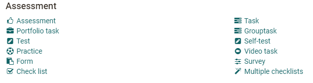
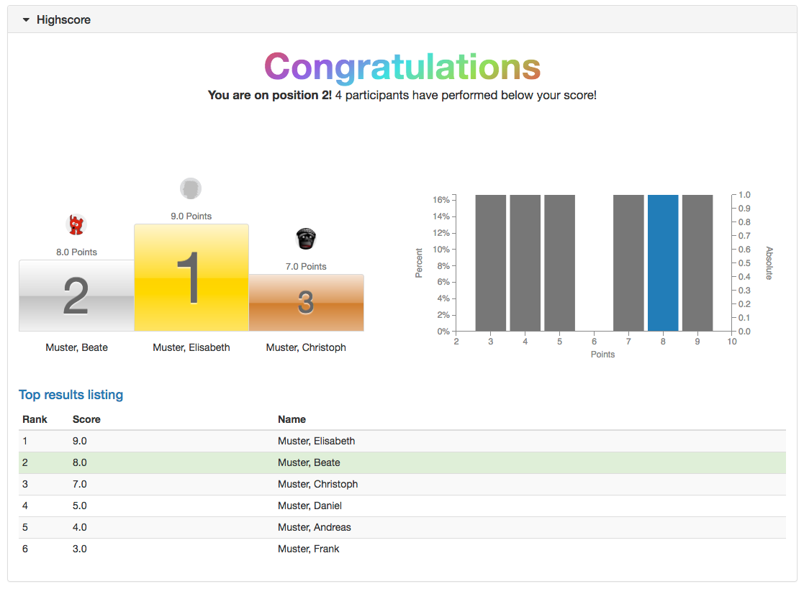

# Assessment

Here you get an overview of the course elements that can be used for knowledge
testing. For some course elements there are separate pages or chapters here in
the manual.

OpenOlat provides various course elements for knowledge testing. The central
course elements for this are the three course elements for OpenOlat
[tests](../learningresources/Configure_tests.md) and the two course elements for [submission tasks](Course_Element_Task.md). But also the other elements such as [portfolio task](../learningresources/Creating_Portfolio_Tasks.md),
[assessments](Course_Element_Assessment.md) with and without
evaluation grid (rubric) or the checklists offer a lot of potential for
certain scenarios.

Most course elements in the assessment category can also be given points if
required and then will be given the "Highscore" configuration tab. With the
allocation of points, further features such as the addition of points or the
passing/failing of a course based on the assessments of different course
elements can be added. A course element [structure](Knowledge_Transfer.md#course-element-structure--structure)
is used for this.

Another configuration tab that is available for most assessment course
elements (except for self-test and survey) is the tab "Reminder". Here,
e-mails can be sent depending on the progress of the respective course
element. For example, a mail can be sent if a task has not yet been worked on
by a certain date. The possibilities are similar to those in the menu
"Reminder" in the course administration for which you can find more
information [here](../learningresources/Course_Reminders.md).

The OpenOlat [questionnaire](../learningresources/Form_editor_Questionnaire_editor.md) or the course
element Survey can also be found in the assessment category.

  

##  Course Element: Assessment {: #course_element_assessment}

The course element "Assessment" is suitable for evaluating services which are
not explicitly submitted electronically, e.g. presence presentations or online
websites.

On separate pages you will learn how to set up, perform and configure an
[assessment](Course_Element_Assessment.md).

  

##  Course Element: Task {: #course_element_task}

Coaches can use the Task course element to organize actions and submission
tasks. Learners upload their submissions to the OpenOlat course and receive
feedback or assessment from the teacher. Revisions can also be requested.
Sample solutions can also be provided using this course element.

The central configuration of the course element takes place in the first step
in the tab "Workflow". Here you determine which of the following options you
want to use:

   *  **Task Assignment**: assign tasks to course participants or groups.

  *  **Submission**: Learners should have the opportunity to submit tasks. This is where course participants create their solutions or upload them in a PDF file format.

  *  **Review and Correction**: this is where course participants will find their tasks corrected as well as requests for revisions.

  *  **Revision Period**: course participants upload their revised documents in this element. You as a coach can place multiple revision requests until the task is considered completed and the revision process closed.

  *  **Sample solution**: provide course participants with sample solutions of their tasks. You can either create them directly in OpenOlat or upload files.

  *  **Assessment**: create individual assessments for each course participant or for participants of a group as a whole.

 In the tab "Learning path" (or in the tab "Workflow" for conventional) you can also define whether the task is mandatory or voluntary. 

Mandatory tasks have to be completed and will be collected after the set deadline and handed over to the coach for evaluation. In the case of optional tasks, the user can decide for himself if he wants to work on them. Furthermore, optional tasks are not collected after the deadline.

!!! info "Info"

    How to create tasks step by step and further information on other [configuration possibilities](../learningresources/Task_Further_Configurations.md) can be found in the chapter ["Creating Tasks"](Course_Element_Task).

##  Course Element: Portfolio Task {: #course_element_portfolio}

By means of the course element "Portfolio task" you can provide predefined
portfolio templates to be filled by your course participants. The course
participants can then pick up the portfolio task in their course, 
and are then forwarded to their individual portfolio area. The portfolio picked up in this way can then be filled with content and artifacts by the learners and, if desired, made available to other people or the course supervisors. Depending on the configuration, these persons can also evaluate and comment on the portfolio. 
 
For the course element Portfolio task you need a "Portfolio 2.0 template",
which you link to the course element. If you have not yet created a Portfolio
Template learning resource, you can also create a new Portfolio Template or
link to a previously created one directly in the course via "Select or create
Portfolio Template".  Click [here](../learningresources/Creating_Portfolio_Tasks.md) to find out
exactly how to create a portfolio task.

If you have already added a portfolio template, it will appear under Selected
Portfolio Template. Follow the link to get to the preview. You now have the
option of selecting a different content with the "Change Portfolio Template"
button.

!!! info

    In case a portfolio template has already been downloaded and edited it will no longer be possible to replace it.

In the tab "Evaluation" you can preconfigure the display of points, status
passed/failed and individual comments. In the fields "Note for all users" and
"Note for supervisors" you formulate general information for the evaluation to
all course participants and coaches.

Further information on how learners can pick up and use a portfolio task can
be found in the chapter "[Portfolio task and assignment: Collecting and editing](../learningresources/Portfolio_task_and_assignment_Collecting_and_editing.md)".
How teachers can evaluate a portfolio task can be found in the chapter
"[Portfolio assignment: Grading](../learningresources/Portfolio_assignment_Grading.md)".

How the portfolio component looks like from the students' point of view and
how it can be solved can be found in the chapter "Learning activities in the
course" under the item ["Portfolio task"](../learningresources/Portfolio_assignment_Grading.md).

General information on the subject of portfolios and e-portfolios can be found
[here](../area_modules/index.md).

## Course Element: Group Task {: #course_element_group_tasks}

The course element Group task functions largely like the course element[Task](Course_Element_Task.md). 

Points and feedbacks are created for the whole group in this course element, but can be customized.

The following differences to the course element Task should be noted:

When creating the group task, one or more groups to which the task is assigned
must be selected in the tab "Workflow". Only these groups can then view and
edit the task. As long as no group has been assigned, the course element is
not visible when the editor is closed.

When the editor is closed, the tab "All participants" does not show the
individual persons directly, but the assigned groups are shown, which can then
be selected and evaluated. Within the evaluation process it can be decided
whether the evaluation is valid for the entire group or whether the evaluation
is only valid for a certain group member.

##  Course Element: Test {: #course_element_test}

The course element "Test" integrates tests into a course. A test in a course
is used to assess achievements and includes various question types. Depending
on the choice of question types, it is evaluated automatically or manually.
OpenOlat uses the IMS-QTI 2.1 format for tests, which allows exchange with
other test systems and learning management systems that also support this
standard.

If you have not selected any test yet, there will be a message saying _No file
chosen_ under the tab Test configuration. Click on "Choose, create or import
file" to add a test to the course element, or to create a new test,
respectively. In case you have already selected a test the name of this
learning resource will be displayed after _Selected file_. Click on the name
to open a preview of the test. Click on "Replace file" if you would like to
exchange the learning resource with another one. Further information can be
found in the chapter "[Creating Tests](../learningresources/Configure_tests.md)".

The two main tabs for test configuration are "[Test configuration](../learningresources/Tests_at_course_level.md)" and " **Options** ".

The settings under "Options" are initially being copied from the options of
the learning resource. However, the options can be adjusted if needed. To do
so, open the tab "Options" and click on "Adjust configuration". You may now
set a time limit, limit the number of attempts, allow guests to do the test,
choose from various display options, etc. If the option "Show question title"
is not selected while menu navigation is allowed, the navigation will only
show "anonymised" titles, not the real titles.

Furthermore, you can set up an information text (HTML page) which will be
visible at the test start page as "Information", above the "Start" button. To
add a file go to the tab "Options" and click on "Select page" or "Create page
and open in editor". You can replace the file later if needed.

Once you have selected a file, the security setting field is added to the
display and you can allow links to files in the storage folder. This is
useful, for example, if you want to link to other HTML files or graphics.
However, this setting also means that experienced course participants can view
the entire folder of the course.

Any test linked to a course can only be edited in your test-editor as long as
there are no users launching and taking it. After that only typing errors can
be corrected.

!!! attention

    In case participants are taking a test at that moment all their
    results will be lost since that test is not complete. All results achieved between replacing and publishing a test will be lost as well.

The test results of the participants will be personalised.
  

##  Course Element: Self-test {: #course_element_self_test}

Like the "Test", the course element "Self-test" uses the learning resource
Test and is configured and set up similarly. The main difference is that there
is no option "passed/failed" and the tab "Highscore" is omitted.

In contrast to the course element "Test" self-tests are suitable to get practice; results of self-tests will be saved anonymously. Self-tests can be taken as often as needed. The course element "Self-test" contains learning resources of the type "Test." If you have not generated a test before please follow the instructions in the chapter ["How do I proceed when I create a test"](../../manual_how-to/test_creation_procedure/test_creation_procedure.md).

For more information on tests, refer to the chapter "[Creating Tests](../learningresources/Configure_tests.md)". 
The chapter "[Tests at course level](../learningresources/Tests_at_course_level.md)" is particularly relevant here.

Eine komplexere Alternative zum Selbsttest stellt der Kursbaustein Übung dar. 

## Course Element: Practice {: #course_element_uebung}

The course element with flashcard logic is used for individual self-testing of course participants. For this purpose, the teacher combines several OpenOlat tests or question sets from the question pool, which the learners can work on independently in series and challenges. The number of questions per exercise series can be defined, as can the number of total challenges. For example, if a series comprises 10 questions, the learner is shown 10 questions. Afterwards, he can decide whether he wants to answer incorrectly answered questions again or skip them. The number of levels reflects the intensity of the exercise and indicates how often a question has to be answered correctly repeatedly. 

In addition to the practice settings configured by the teacher, course participants can also filter and edit specific questions such as new questions or questions of a certain level. Custom series can also be created.

After completion of a challenge, detailed statistics on the learning status as well as a summary overview are available in addition to the classification in ranking lists.

!!! info "Info"

    Only automatically evaluable test questions can be used for this course element. 

## Course Element: Video task
With the course element "Video task" video learning resources can be reused for interactive (formative) exercises or tasks with assessments (summative). Participants have to identify relevant situations ("teachable moment") in a video and assign them to a category.
Es steht ein Übungsmodus und ein scharfer Testmodus zur Verfügung. 

## Course Element: Form  {: #course_element_form}

Using the course element "Form" you can add the learning resource form to a
course. The form works similar to the course element "Survey" and can also be
filled out only once. However, with the form it is visible which participant
has filled in what in the form. Thus, in contrast to the survey (at least in
the standard setting), filling in the form is not anonymous. 

For the
completion of the course element, a last deadline can be defined in the tab
"Form". A [course reminder](../learningresources/Course_Reminders.md) can also be linked in
addition. In contrast to the survey module, participants automatically receive
a confirmation e-mail with the date and time of submission as well as their
completed form as a PDF attachment when they submit the completed form.

Coaches can see in the overview table in the course run which participants
have already completed the form and which have not. Forms that have already
been submitted can be reopened by the coach for further processing by the
participant, or they can be completely reset. By clicking on the participant,
the completed form can be viewed. The form data of all participants are
available as Excel export.

The use of this course element makes sense e.g. if the learners have to fill
in certain forms obligatorily, e.g. before starting a laboratory internship or
as confirmation for the independent performance of a service.

!!! Info 

    Anders als beim Kursbaustein Umfrage erfolgt für diesen Kursbaustein allerdings keine spezifische grafische Auswertungsübersicht. 

##  Course Element: Survey {: #course_element_survey}

With the course element "Survey" you can add an online questionnaire to your
course. Als Basis wird die Lernressource "Formular" verwendet und mit dem Kursbaustein Umfrage verknüpft. 
A questionnaire must
first be created with the learning resource "Form" in the author area. If you
have not yet created a questionnaire, follow the instructions in chapter "[3 steps to your questionnaire](../forms/Three_Steps_to_your_Form.md)". By default, the results are stored anonymously. 

A formular linked in a course can only be edited completely in the formular
editor as long as the page has not been opened. After that only typing errors
can be corrected.

!!! Note 

    If participants are currently running the questionnaire but have not yet completed it, their results will be lost.

Further information on the subject of questionnaires and surveys can be found
in the chapter "[Creating questionnaires](../learningresources/Form_editor_Questionnaire_editor.md)" and
the corresponding subchapters.

##  Course Element: Checklist {: #course_element_checklist}

The course element allows you to embed and evaluate checklists in the course
structure. A checklist contains check elements with completed and uncompleted
tasks or checks. The checklist can be used as an informational tool that helps
users to complete smaller tasks or to keep information secure, for example, by
maintaining attendance or to-do lists. It is the only module that the user or
course participant can complete as a self-assessment.

You can also add several checklists at once. This procedure is useful if you
need several identical checklists. Several (maximum of 12) modules with the
same check elements are created and bundled with a structure module. A title
is automatically created for each module, but changes are possible. Each
module can then be given a specific submission date.

In this way, several checklists with identical check criteria but for
different groups, for different objects to be checked, for different event
dates or for checking the same object at different times (development) can be
created relatively quickly.

Further information can be found
[here](Course_Element_Checklist.md).

  

###  Highscore  {: #highscore}

The highscore, except for the course element "practice" , can be added for all assessable course element as well as for
structure elements.

The highscore makes a playful comparison between test participants possible
and can be seen as motivational factor. The prerequisite for using the
"Highscore" tab is that points are awarded for the selected block (e.g. test,
task, evaluation).

First "Show Highscore" needs to be enabled. Optional a starting date can be
added. Upon this date the highscore will be shown. Otherwise the highscore is
shown directly after finishing the test. Afterword it can be defined, if the
user data is shown anonymized or with pre and last name. In the next part it
can be chosen, which elements of the highscore should be shown. There is the
choice between congratulation title, podium, histogram and top result listing.
For the listing it can be defined additionally, if all users or only a certain
number should be shown. At least one of the above options need to be selected.

  

  

  

