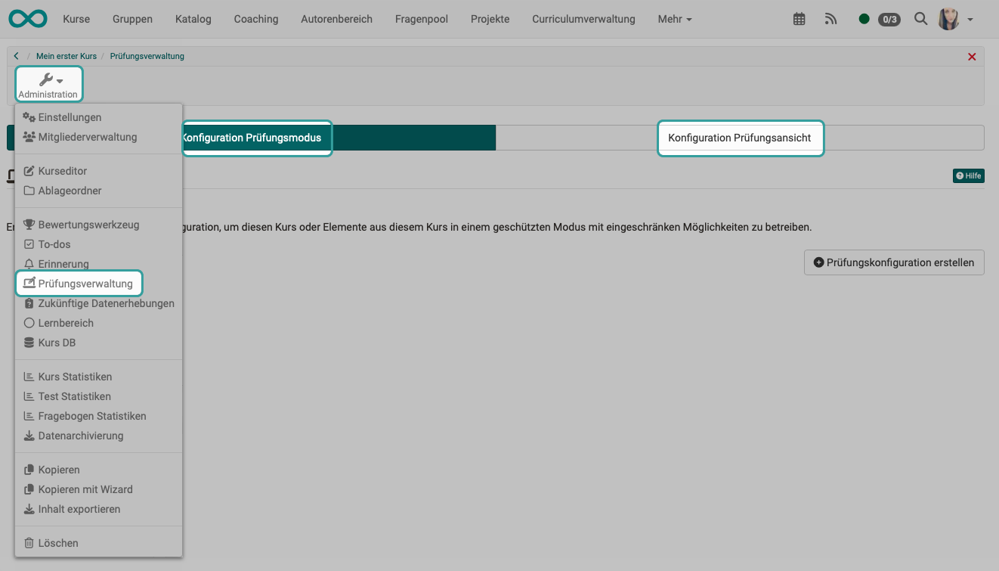

# Prüfungsverwaltung: Übersicht {: #Assessment_Management}

:octicons-tag-16: Release 18.2

Die Prüfungsverwaltung umfasst die Konfiguration des [**Prüfungsmodus**](Assessment_mode.de.md) und die Konfiguration der [**Prüfungseinsicht**](Assessment_inspection.de.md). 

Sie finden die beiden Tabs unter `Kurs > Administration > Prüfungsverwaltung`. 

{ class="shadow lightbox" }

