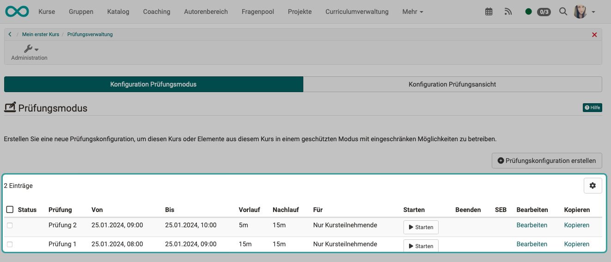
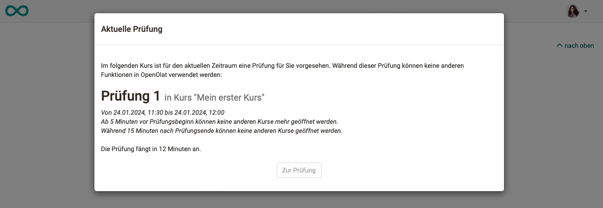
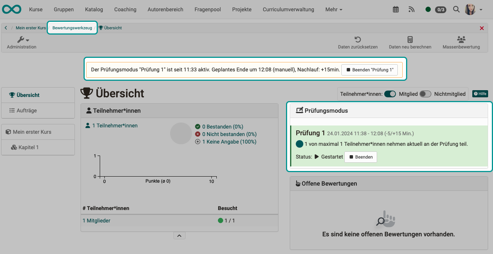
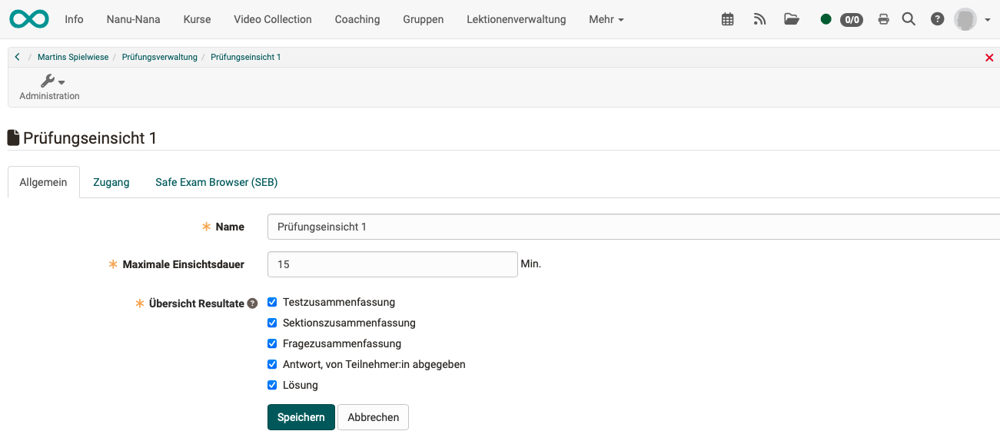
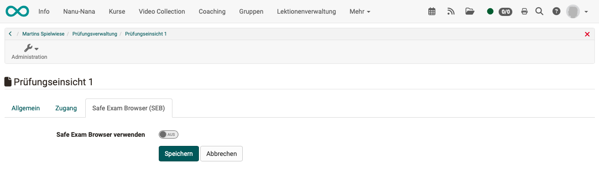

# Prüfungsverwaltung {: #Assessment_Management}

Die Prüfungsverwaltung umfasst die Konfiguration des **Prüfungsmodus** und die Konfiguration der **Prüfungsansicht**. Sie finden die beiden Tabs in der  **Kursadministration > Prüfungsverwaltung**. 

{ class="shadow lightbox" }

## Tab "Konfiguration Prüfungsmodus"

!!! note "Hinweis"

    Vor Version 18.2 war die Konfiguration des Prüfungsmodus eine separate Menüoption in der Kursadministration. 

### Was versteht man unter "Prüfungsmodus"?

Ein Prüfungsmodus ist eine **Prüfungskonfiguration**, in der Tests und Prüfungen in **geschütztem Modus** (sogenannter Kioskmodus) während einer festgelegten Zeit durchgeführt werden.

Während dieser Zeit ist nur der Zugriff auf zuvor festgelegte Kursbausteine im betroffenen Kurs gestattet. Alle weiteren Funktionen in OpenOlat, wie andere Kurse, Gruppen, Notizen etc., werden während der Prüfungsdauer (Laufzeit des Prüfungsmodus) ausgeblendet. Nur ein Logout ist während der Prüfung möglich.

### Konfiguration erstellen

Sie **erstellen** die Konfiguration eines Prüfungsmodus, indem Sie 

1. Ihren **Kurs** mit dem darin enthaltenen Test wählen,
2. in der **"Administration"** die Option **"Prüfungsverwaltung"** wählen,
3. und dort den **Tab "Prüfungsmodus"** auswählen.
4. Klicken Sie dort auf den **Button "Prüfungskonfiguration erstellen"**.

{ class="shadow lightbox" }

Auf der Übersichtsseite sehen Sie alle für einen Kurs bereits abgehaltenen, laufenden oder geplanten Prüfungen. Der Modus geplanter Prüfungen kann bis zur Prüfung noch bearbeitet werden, eine nachträgliche Bearbeitung ist nicht möglich. Die Übersicht enthält Informationen zu Datum und Dauer, Vor- und Nachlaufzeiten, sowie Benutzergruppen.

{ class="shadow lightbox" }

Prüfungskonfigurationen werden vorab erstellt und enthalten

* eine Start- und Endzeit
* evtl. Vor- und Nachlaufzeiten (falls diese gewünscht)
* evtl. Einschränkungen auf spezifische Nutzergruppen. 

Ein Prüfungsmodus kann gelten

* nur für Kursteilnehmende,
* nur für Gruppenteilnehmer ausgewählter Gruppen
* oder für beides. 

Dadurch ist es möglich, zeitgleich unterschiedlich konfigurierte Prüfungen für verschiedene Nutzergruppen desselben Kurses abzuhalten. 

Neben der Benutzergruppe können Sie festlegen, ob und auf welche Kursbausteine der Zugriff eingeschränkt werden soll, und ob ein Kursbaustein davon als Startbaustein verwendet wird. 
Des Weiteren kann der Zugang zur Prüfung auf spezifische IP-Adressen beschränkt, oder die Nutzung des [Safe Exam Browsers](http://www.safeexambrowser.org) vorausgesetzt werden.

### Tab "Allgemein"

{ class="shadow lightbox" }

Detailliert können neben Titel und Beschreibung, die dem Benutzer in der Prüfungsbenachrichtigung angezeigt werden, die folgenden Parameter konfiguriert werden:

**Beginn**: Legen Sie hier Datum und Uhrzeit für den Beginn der Prüfung fest. Die **Vorlaufzeit**, die Sie in Minuten angeben, sperrt OpenOlat während der angegebenen Dauer vor Prüfungsbeginn.

**Ende**: Der Zeitpunkt an dem die Prüfung beendet wird. Wird eine **Nachlaufzeit** in Minuten angegeben, bleibt OpenOlat während dieser Dauer im Anschluss an die Prüfung noch gesperrt.

**Art des Beginns / Endes**: Sie können zwischen automatischem und manuellem Start / Ende wählen. Stellen Sie als Autor:in hier "manuelle Bedienung" ein, finden Betreuer:innen auf der Übersichtsseite des Bewertungswerkzeugs einen Start- und Ende-Button bei der entsprechenden Prüfungskonfiguration, mit dem Sie den Prüfungsmodus manuell einschalten können.

### Tab "Einschränkungen Kursbaustein"

{ class="shadow lightbox" }

**Zugriff auf Kursbaustein einschränken**: Um die Prüfung auf ausgewählte Kursbausteine des betroffenen Kurses zu beschränken, wählen Sie hier die Checkbox aus, und klicken Sie dann auf die Schaltfläche "Kursbausteine auswählen". Es öffnet sich eine Liste aller Kursbausteine des Kurses - wählen Sie jene Kurselemente aus, die den Probanden während der Prüfung angezeigt werden sollen. Alle anderen Kursbausteine werden für die Dauer der Prüfung ausgeblendet.

**Startbaustein**: Soll den Studenten ein bestimmtes Kurselement direkt beim Start angezeigt werden, so arbeiten Sie mit der Schaltfläche "Kursbaustein auswählen". Wählen Sie aus den verfügbaren Kurselementen eines aus. Es werden nur die Kursbausteine angezeigt, die im Schritt zuvor zur Anzeige ausgewählt wurden.

### Tab "Zugang" 

{ class="shadow lightbox" }

**Einschränkung auf IP-Adressen**: Um eine Ausführung der Prüfung nur an bestimmten Computern oder Orten zuzulassen, markieren Sie hier die Checkbox und tragen dann die zulässigen IP-Adressen ein. Diese sollten Sie von ihrer Informatik-Abteilung erhalten können. Sie können dadurch z.B. verhindern, dass eine Prüfung von einem Prüfling von zuhause abgelegt wird.

**Teilnehmende**: Hier legen Sie fest für welche Benutzer die Prüfung gültig ist. Wählen Sie aus den folgenden Optionen aus:

* Nur Kursteilnehmende
* Nur Gruppenteilnehmende
* Nur Curriculumteilnehmende oder 
* Teilnehmende des Kurses und der ausgewählten Gruppen oder Curriculum

Sobald eine Option mit Gruppen ausgewählt wurde, müssen Sie zwingend immer über die Schaltflächen "Gruppen auswählen" oder "Lernbereich auswählen" die betroffenen Gruppen auswählen. Wird ein Curriculum verwendet, muss dies ebenfalls ausgewählt werden. 

Ferner kann definiert werden ob der Prüfungsmodus auch auf Betreuer angewendet werden soll. 

### Tab "Safe Exam Browser"

{ class="shadow lightbox" }

**Safe Exam Browser verwenden**: Die Verwendung des [Safe Exam Browsers](http://www.safeexambrowser.org) erlaubt die sichere Ausführung von Online-Prüfungen, in dem der Computer in den sogenannten Kioskmodus versetzt wird. Dadurch wird die Verwendung unerlaubter Quellen während einer Prüfung unterbunden. Tragen Sie die Browser Exam Keys aller zugelassenen Browser-Instanzen ein, um die Ausführung im SEB zu ermöglichen. Benutzer werden darüber benachrichtigt, dass der SEB für die Prüfung Voraussetzung ist. Erst wenn OpenOlat im Safe Exam Browser gestartet wurde kann die Prüfung durchgeführt werden.

 

###  Prüfung durchführen

Benutzer, die einer Prüfung zugeteilt wurden, werden zu Beginn der Prüfung bzw. zu Beginn der Vorlaufzeit über den Start der Prüfung informiert. Sollte OpenOlat durch eine Nachlaufzeit am Ende der Prüfung noch gesperrt sein, werden Benutzer ebenfalls darüber informiert.

{ class="shadow lightbox" }

Wurde von dem/der Kursbesitzer:in ein manueller Start vorgesehen, finden Betreuer:innen auf der Übersichtsseite des [Bewertungswerkzeugs](Assessment_tool_overview.de.md) einen Start- und Ende-Button bei der entsprechenden Prüfungskonfiguration. Damit kann der Prüfungsmodus manuell eingeschaltet werden. Der Start-Button wird für Betreuer:innen erst sichtbar, sobald der vorkonfigurierte Zeitraum für diese Prüfung erreicht wurde.

{ class="shadow lightbox" }

Wird der Prüfungsmodus manuell durch Betreuer:innen gestartet, so bleibt die Vorlaufzeit unverändert (wie in der Konfiguration vorgesehen), auch wenn der Button zum Start der Prüfung später als geplant geklickt wird.

Wird manuell die Prüfung verspätet gestartet, dann verschiebt sich das Prüfungsende nach hinten.  Die vorkonfigurierte Prüfungs**dauer** bleibt also gleich. 

Ein laufender Prüfungsmodus kann von den Betreuer:innen im Bewertungswerkzeug verfolgt werden. 

Bewertungen, z.B. für Einsendeaufgaben oder Freitext Elemente von Tests, können auch direkt bewertet und für die Teilnehmer freigeschaltet bzw. sichtbar gemacht werden. So wird direkt eine Prüfungseinsicht und –besprechung ermöglicht. 

 

###  Prüfung beenden

Ein laufender Prüfungsmodus kann generell automatisch oder manuell beendet werden.

Bei manuellem Modus können Betreuer:innen und Kursbesitzer:innen die Prüfung im **Bewertungswerkzeug** beenden.

{ class="shadow lightbox" }

Der Prüfungsmodus wird auch beendet, wenn der entsprechende Kurs beendet oder gelöscht wird.

 

## Tab "Konfiguration Prüfungsansicht"

### Um was geht es bei einer Prüfungseinsicht?

Prüfungsteilnehmer:innen haben gelegentlich den Wunsch, nicht nur ihre Prüfungsergebnisse zu erfahren, sondern die absolvierte Prüfung nochmals im Original zu sehen. Es ist ein legitimes Anliegen um nachvollziehen zu können, wie das Prüfungsergebnis (Punkte/Noten) zustande kam. 

Dem steht aber entgegen, dass die Teilnehmer die Prüfung nicht ausgehändigt bekommen sollen und auch keine Kopie davon erhalten oder selbst erstellen sollen (Sreenshots). Lediglich eine kurze Einsichtnahme soll gestattet werden um Verbreitung manipulierter Kopien auszuschliessen.  

Deshalb gibt es in OpenOlat ein spezielles Werkzeug zur Prüfungseinsicht. Sie definieren

* ein festes Zeitfenster,
* während diesem Zeitfenster ist der Prüfungsmodus aktiv.

Sie erstellen einen Termin zur Prüfungseinsicht unter 
**Administration > Prüfungsverwaltung > Tab "Konfiguration Prüfungsansicht"** 
Dort fügen Sie durch Klick auf den **Button "Prüfungseinsicht hinzufügen"** einen neuen Termin zur Prüfungseinsicht hinzu. Bereits definierte Zeitfenster werden aufgelistet.

{ class="shadow lightbox" }

### Tab "Allgemein"

Zunächst definieren Sie, wie lange die Einsichtnahme dauern darf und was während der Prüfungseinsicht gezeigt werden soll.

{ class="shadow lightbox" }

### Tab "Zugang"

Im Tab "Zugang" kann die Einsichtnahme durch Angabe einer oder mehrerer IP-Adressen auf ganz bestimmte Geräte eingeschränkt werden. (Z.B. nur ein ganz bestimmter Computer eines Betreuers /einer Betreuerin.)

{ class="shadow lightbox" }

### Tab "Safe Exam Browser (SEB)"

Durch Verwendung des SEB können alle anderen Aktivitäten auf dem Computer während der Einsichtnahme gesperrt werden.  

{ class="shadow lightbox" }