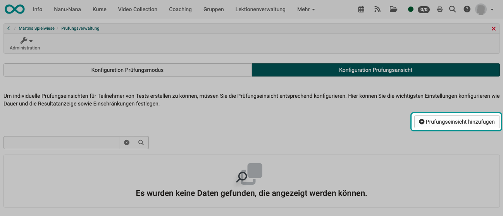
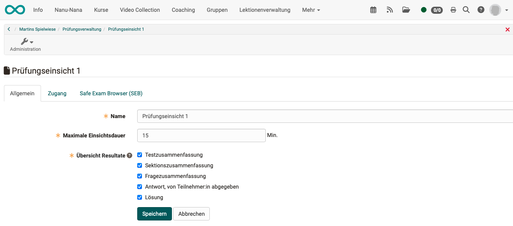
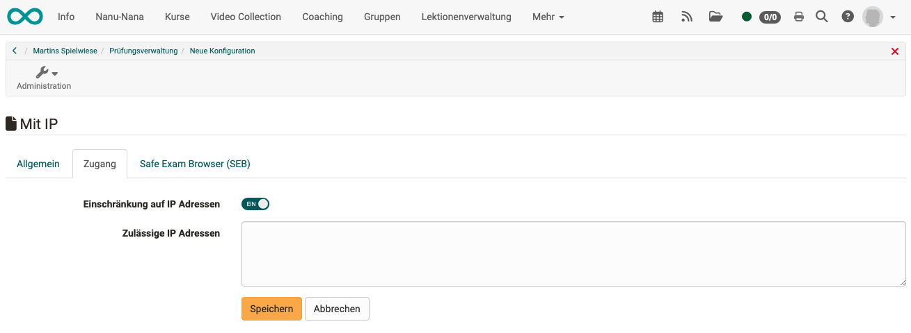
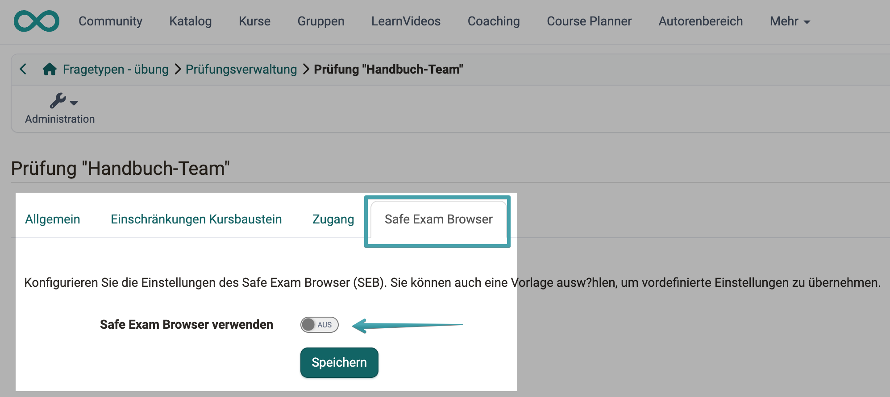
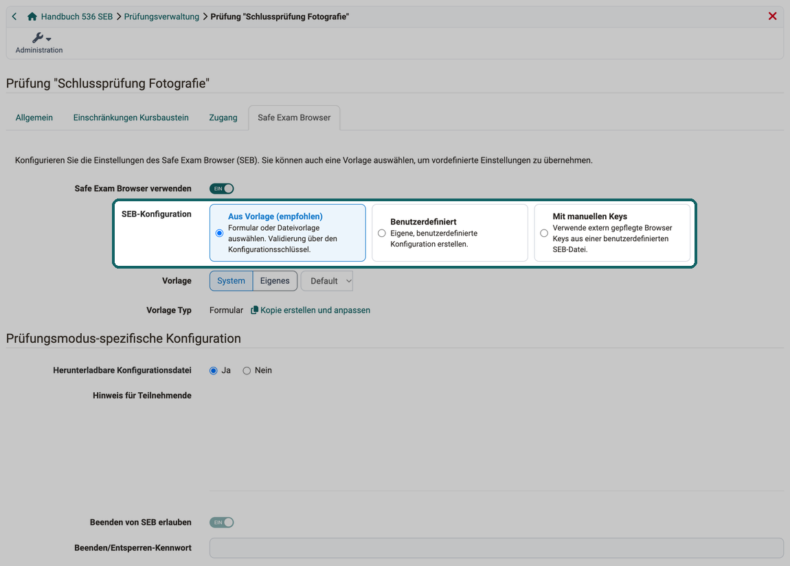
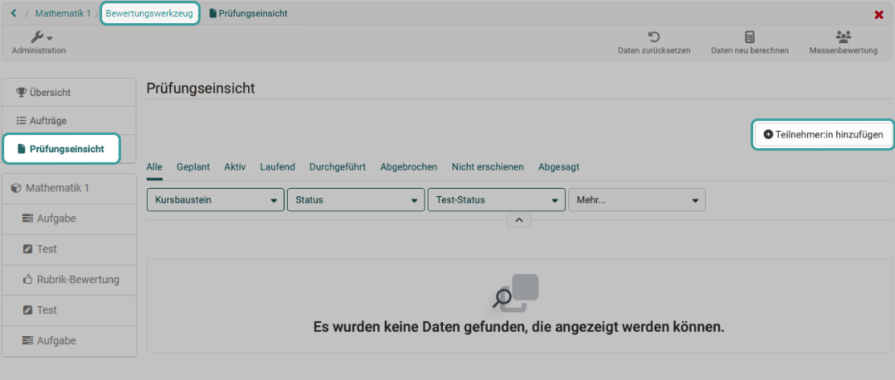
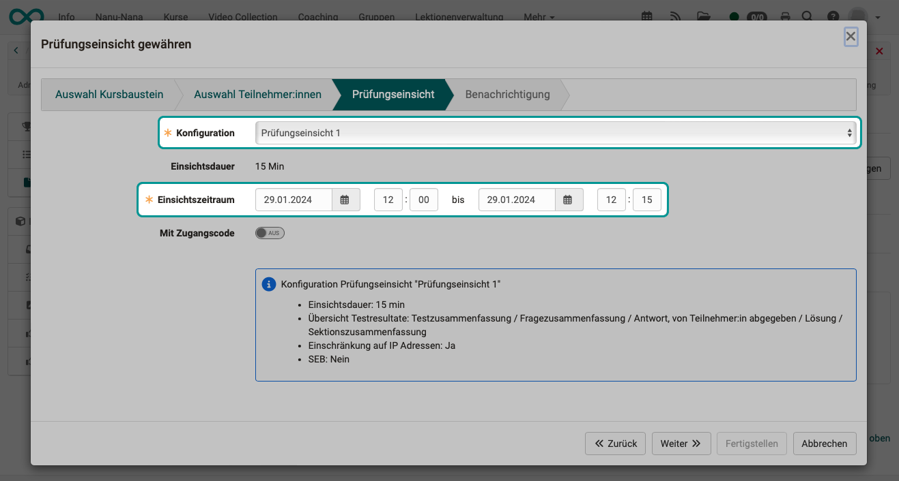
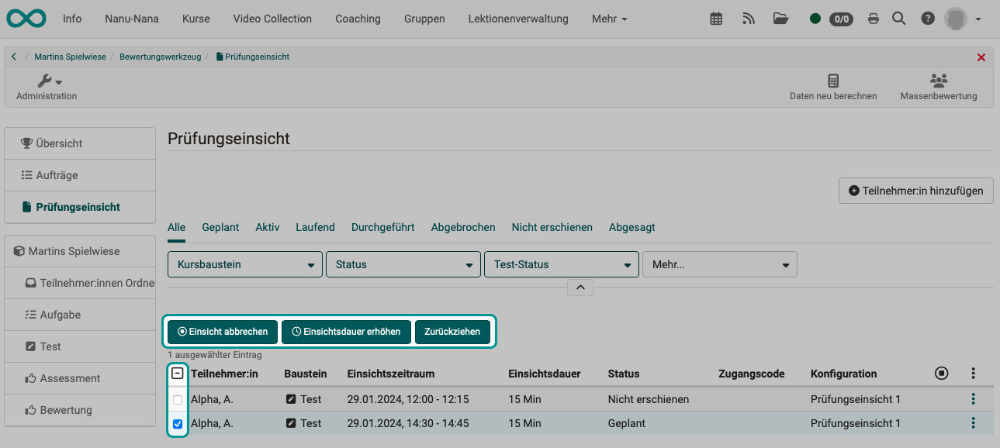
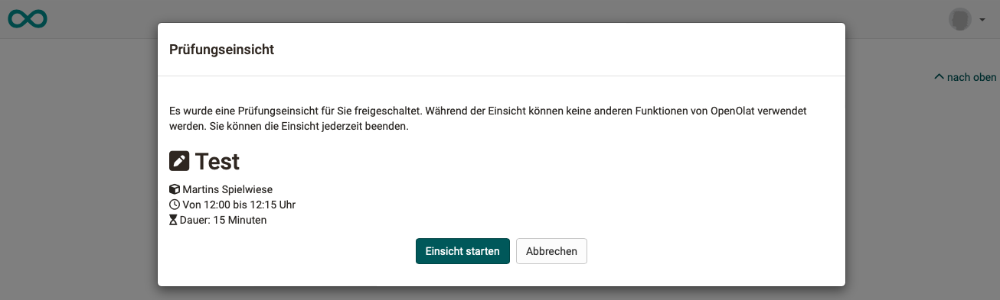
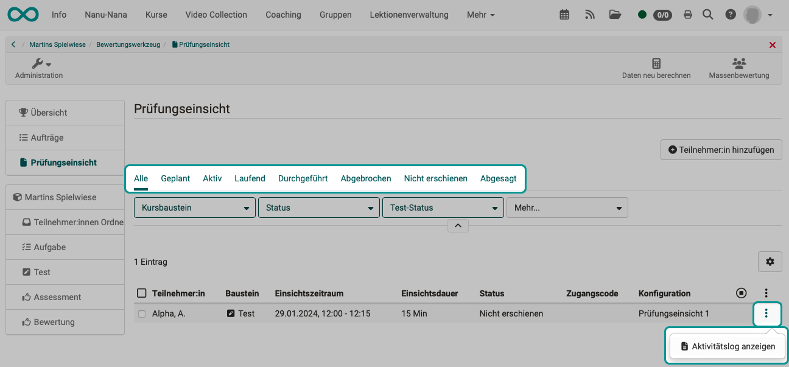

# Prüfungsverwaltung: Prüfungseinsicht {: #Assessment_inspection}

:octicons-tag-16:{ title="ab Release 18.2" }

## Um was geht es bei einer Prüfungseinsicht?

Prüfungsteilnehmer:innen haben gelegentlich den Wunsch, nicht nur ihre Prüfungsergebnisse zu erfahren, sondern die absolvierte Prüfung nochmals im Original zu sehen. Es ist ein legitimes Anliegen um nachvollziehen zu können, wie das Prüfungsergebnis (Punkte/Noten) zustande kam. 

Dem steht aber entgegen, dass die Teilnehmer die Prüfung nicht ausgehändigt bekommen sollen und auch keine Kopie davon erhalten oder selbst erstellen sollen (Screenshots). Lediglich eine kurze Einsichtnahme soll gestattet werden, um Verbreitung manipulierter Kopien auszuschliessen.  

Deshalb gibt es in OpenOlat ein spezielles Werkzeug zur Prüfungseinsicht. Sie definieren

* ein festes Zeitfenster,
* ob während diesem Zeitfenster der Prüfungsmodus aktiv ist.

## Konfiguration eines Ablaufschemas für eine Einsichtnahme [:octicons-tag-16:{ title="ab Release 18.2 (OO-7425)" }](https://track.frentix.com/issue/OO-7425){:target="_blank"}

Als **Kursbesitzer:in** erstellen Sie Ablaufschemata, in denen Sie bestimmen, wie Prüfungseinsichten ablaufen.  
Die **Betreuer:innen** terminieren dann für die Prüfungsteilnehmer:innen die Einsichtnahmen und wählen dazu eines der vorderfinierten Ablaufschemata (Konfigurationen).

Sie definieren als Kursbesitzer:in eine Prüfungseinsicht (Ablaufschema) unter 
`Kurs > Administration > Prüfungsverwaltung > Tab "Konfiguration Prüfungseinsicht"` 
Dort fügen Sie durch Klick auf den **Button "Prüfungseinsicht hinzufügen"** eine neue Konfiguration (Ablaufschema) zur Prüfungseinsicht hinzu. Bereits definierte Ablaufschemata werden aufgelistet.

{ class="shadow lightbox" title="Tab Konfiguration Prüfungseinsicht in der Prüfungsverwaltung" }

### Tab "Allgemein"

Zunächst definieren Sie, wie lange die Einsichtnahme dauern darf und was während der Prüfungseinsicht gezeigt werden soll: Testzusammenfassung, Sektionszusammenfassung, Fragezusammenfassung, die von den Teilnehmenden abgegebene Antwort und die Lösung. (Datum und Uhrzeit bestimmt dann der/die Betreuer:in, wenn er/sie eine Einsichtnahme mit Prüfungsteilnehmer:innen organisert.)

{ class="shadow lightbox" title="Tab Allgemein einer Prüfungseinsicht" }

### Tab "Zugang"

Im Tab "Zugang" kann die Einsichtnahme durch Angabe einer oder mehrerer IP-Adressen auf ganz bestimmte Geräte eingeschränkt werden. (Z.B. nur ein ganz bestimmter Computer in einem bestimmten Raum.)

{ class="shadow lightbox" title="Tab Zugang einer Prüfungseinsicht" }

### Tab "Safe Exam Browser (SEB)" {: #seb_tab}

Durch Verwendung des SEB können alle anderen Aktivitäten auf dem Computer während der Einsichtnahme gesperrt werden.

{ class="shadow lightbox" title="Tab Safe Exam Browser einer Prüfungseinsicht" }

{ class="shadow lightbox" title="Tab Safe Exam Browser im Dialog einer Prüfung · 2026.10.02" }

#### SEB-Konfiguration [:octicons-tag-16:{ title="ab Release 21.0 (OO-9571)" }](https://track.frentix.com/issue/OO-9571){:target="_blank"} {: #seb_type_of_use}

Wie im Prüfungsmodus wählen Sie zwischen «Aus Vorlage (empfohlen)», «Benutzerdefiniert» und «Mit manuellen Keys». Die drei Arten beschreibt die Seite zum Prüfungsmodus: [Tab "Safe Exam Browser"](../learningresources/Assessment_mode.de.md#tab-safe-exam-browser)

#### Vorlage [:octicons-tag-16:{ title="ab Release 20.3 (OO-9159)" }](https://track.frentix.com/issue/OO-9159){:target="_blank"} {: #seb_template}

Bei «Aus Vorlage (empfohlen)» wählen Sie mit "System" eine der aktiven SEB-Konfigurationsvorlagen aus dem Dropdown, die von der Administration bereitgestellt werden, oder laden mit "Eigenes" eine eigene SEB-Datei hoch. Die als Standard markierte Vorlage ist vorausgewählt. Wurde eine gespeicherte Vorlage nachträglich deaktiviert, bleibt sie als ausgewähltes Element in der Liste erhalten, bis eine andere Vorlage gewählt wird.

#### Vorlage Typ {: #seb_configuration}

Zeigt, ob die Vorlage ein "Formular" oder eine "SEB-Datei" ist. Bei einem Formular übernimmt der Button "Kopie erstellen und anpassen" die Werte der Vorlage in eine Konfiguration «Benutzerdefiniert», die Sie für diese Einsichtnahme ändern können.

#### Prüfungsmodus-spezifische Konfiguration {: #seb_assessment_mode_configuration}

Unter dieser Legende stehen die **Herunterladbare Konfigurationsdatei**, der **Hinweis für Teilnehmende**, **Beenden von SEB erlauben** und das **Beenden/Entsperren-Kennwort** für diese Einsichtnahme. Bei einer SEB-Datei überschreibt das Kennwort jenes der Datei, und der Config Key wird automatisch neu berechnet. Bei einem Formular aus dem System kommen Hinweis, Beenden und Kennwort aus der Vorlage.

#### Konfiguration anhand der Vorlage {: #seb_template_configuration}

Unter dieser Legende werden die aus der gewählten Vorlage übernommenen Detaileinstellungen angezeigt.

{ class="shadow lightbox" title="Legende Konfiguration anhand der Vorlage" }

!!! tip "Voraussetzung"
    Die Vorlagenauswahl steht nur zur Verfügung, wenn in der System-Administration unter `Administration > e-Assessment > Prüfungsverwaltung > Tab "Safe Exam Browser Konfiguration"` mindestens eine aktive Vorlage angelegt wurde.

 

## Planung von Einsichtnahmen durch Betreuer:innen

Als Betreuer:in organisieren Sie im **Bewertungswerkzeug** die Einsichtnahmen für einzelne oder mehrere Prüfungsteilnehmer. (Z.B nur für diejenigen Prüfungsteilnehmer, die ausdrücklich eine Einsichtnahme wünschen.)

{ class="shadow lightbox" title="Bewertungswerkzeug eines Kurses" }

Ein Wizard führt Sie durch die Schritte.
Bestimmen Sie z.B. den Termin und wählen Sie eines der von dem/der Kursbesitzer:in vordefinierten Ablaufschemata (Konfiguration). So wird sichergestellt, dass für alle Einsichtnehmenden die gleichen Bedingungen herrschen.

{ class="shadow lightbox" title="Wizard-Schritt Prüfungseinsicht" }

Die Termine zur Einsichtnahme können bereits vor Durchführung der Prüfung geplant werden.

## Durchführung von Einsichtnahmen als Betreuer:in

Es empfiehlt sich, die Einsichtnahme als Betreuer:in an den geplanten Terminen zu begleiten.

Die in der Konfiguration (von dem/der Kursbesitzer:in) vorgegebene Maximalzeit für die Einsichtnahme muss nicht zwingend bis zum Ende genutzt werden. Als Betreuer:in können Sie die Einsichtnahme vorzeitig abbrechen, wenn Sie z.B. unerlaubtes Verhalten bemerken. (Wenn z.B. jemand unerlaubt Fotos mit dem Mobil macht.) Sie können die Einsichtsdauer auch nachträglich erhöhen oder eine noch nicht begonnene Einsichtnahme zurückziehen.

{ class="shadow lightbox" title="Liste Prüfungseinsicht im Bewertungswerkzeug" }

## Einsichtnahme aus Sicht der Prüfungsteilnehmer:innen

Als Prüfungsteilnehmer:in erhalten Sie eine Benachrichtigung mit Termin und Uhrzeit zur Einsichtnahme in Ihre Prüfung, sowie ggf. einen Zugangscode.

Ist das Zeitfenster zur Einsichtnahme verstrichen, wird die Einsichtnahme beendet. Wer nicht pünktlich mit der Einsichtnahme seiner Prüfung beginnt, verliert entsprechend Zeit.

{ class="shadow lightbox" title="Ansicht der Prüfungsteilnehmer:innen" }

## Dokumentation der Einsichtnahmen

Alle Termine zur Einsichtnahme, die von Betreuer:innen geplant wurden, sind in OpenOlat erfasst.
Es kann also nachgewiesen werden, wenn Prüfungsteilnehmer:innen, die einen Termin zur Einsichtnahme hatten, diesen Termin nicht wahrgenommen haben. Auch Beginn, Dauer und Ende der Einsichtnahmen werden protokolliert. 

Für mehrere Personen können Sie die **Tabs oberhalb der Tabelle** verwenden.  
Pro Person finden Sie alles im **Aktivitätslog** unter den 3 Punkten am Ende einer Zeile. 

{ class="shadow lightbox" title="Zeilenmenü in der Prüfungseinsicht" }

## Unterschied: Report - Prüfungseinsicht

| Report                                    | Prüfungseinsicht                          |
| :----------------------------------------- | :----------------------------------------- |
| **Überblick** zum Ergebnis der Teilnehmer:innen| **Detailansicht** der Prüfung bestimmter Teilnehmer:innen |
| Definierte **Resultatansicht für alle** Kursteilnehmer:innen | Die Prüfungseinsicht ist insbesondere für die **Einsichtnahme durch Einzelpersonen** geeignet (z.B. wenn im Einzelfall Zweifel bestehen). |
| wiederholbar               | einmalig                    |
| jederzeit, solange Zugriff auf den Kurs besteht       | nur zu fixen Terminen         |
| Zugriff für Besitzer:innen: `Kurs > Administration > Kurseditor > Test-Kursbaustein wählen > Tab "Testkonfiguration" > Abschnitt "Report"`| Zugriff für Besitzer:innen: `Kurs > Administration > Prüfungsverwaltung > Tab "Konfiguration Prüfungseinsicht"` |
| Zugriff für Betreuer:innen:  `Bewertungswerkzeug`  | Zugriff für Betreuer:innen:  `Bewertungswerkzeug > Tab Prüfungseinsicht` |

## Weiterführende Informationen {: #further_information}

**Weiterführend** 
[Prüfungsverwaltung: Prüfungsmodus >](Assessment_mode.de.md) 
[Test Einstellungen - Administration >](Test_settings.de.md) 
[Bewertungswerkzeug - Übersicht >](Assessment_tool_overview.de.md) 
[Wie bereite ich eine Prüfung mit dem Safe Exam Browser (SEB) vor? >](../../manual_how-to/SEB/SEB.de.md)

[Zum Seitenanfang ^](#Assessment_inspection)

