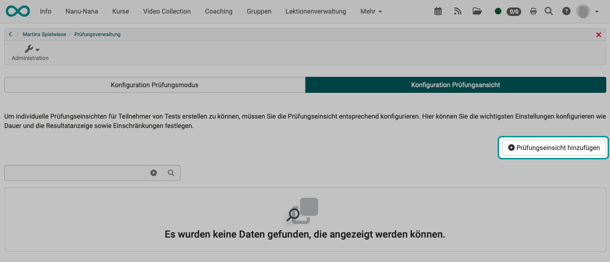
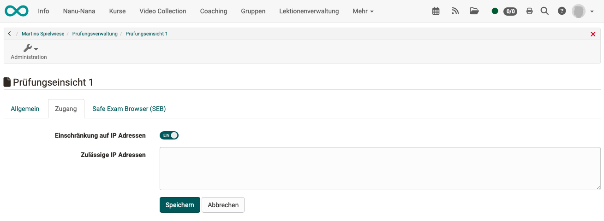
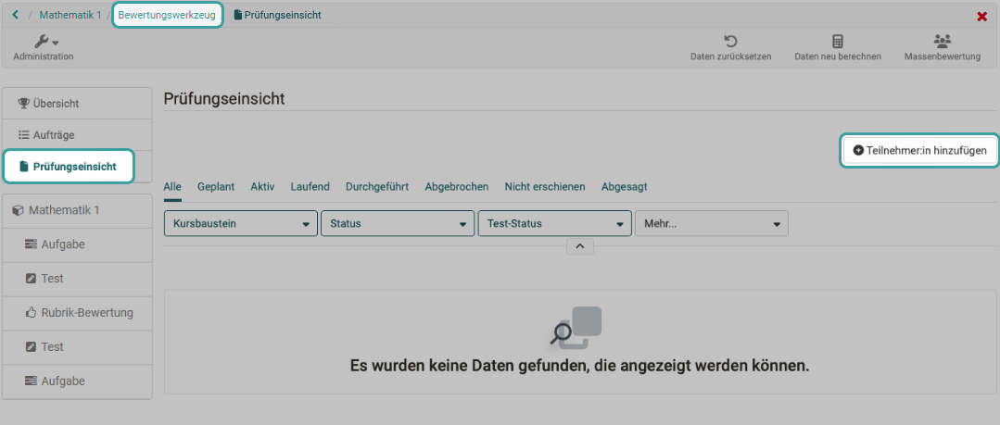
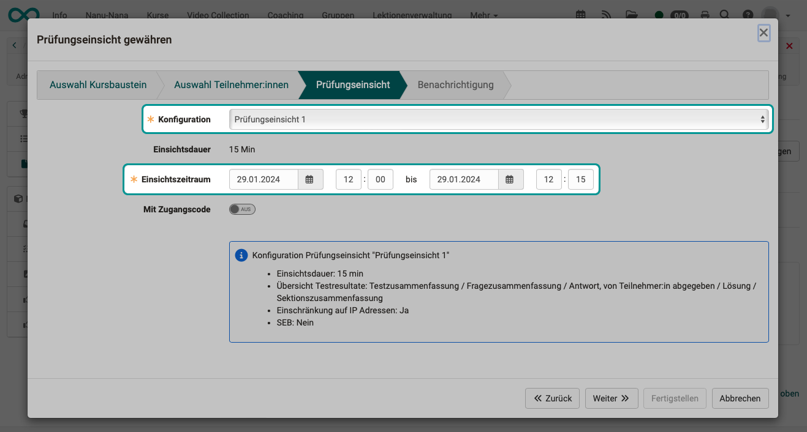
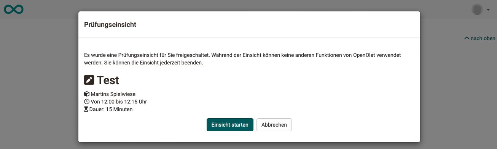
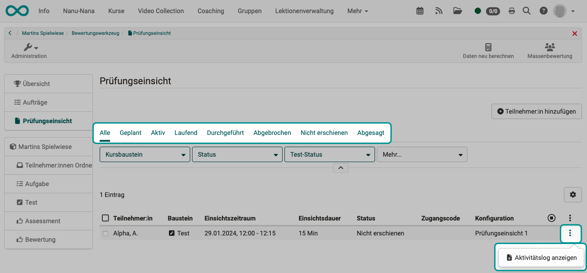

# Prüfungsverwaltung: Prüfungseinsicht {: #Assessment_inspection}

:octicons-tag-24: Release 18.2

## Um was geht es bei einer Prüfungseinsicht?

Prüfungsteilnehmer:innen haben gelegentlich den Wunsch, nicht nur ihre Prüfungsergebnisse zu erfahren, sondern die absolvierte Prüfung nochmals im Original zu sehen. Es ist ein legitimes Anliegen um nachvollziehen zu können, wie das Prüfungsergebnis (Punkte/Noten) zustande kam. 

Dem steht aber entgegen, dass die Teilnehmer die Prüfung nicht ausgehändigt bekommen sollen und auch keine Kopie davon erhalten oder selbst erstellen sollen (Screenshots). Lediglich eine kurze Einsichtnahme soll gestattet werden, um Verbreitung manipulierter Kopien auszuschliessen.  

Deshalb gibt es in OpenOlat ein spezielles Werkzeug zur Prüfungseinsicht. Sie definieren

* ein festes Zeitfenster,
* ob während diesem Zeitfenster der Prüfungsmodus aktiv ist.

## Konfiguration eines Ablaufschemas für eine Einsichtnahme 

Als **Kursbesitzer:in** erstellen Sie Ablaufschemata, in denen Sie bestimmen, wie Prüfungseinsichten ablaufen.  
Die **Betreuer:innen** terminieren dann für die Prüfungsteilnehmer:innen die Einsichtnahmen und wählen dazu eines der vorderfinierten Ablaufschemata (Konfigurationen).

Sie definieren als Kursbesitzer:in eine Prüfungseinsicht (Ablaufschema) unter 
**Administration > Prüfungsverwaltung > Tab "Konfiguration Prüfungseinsicht"** 
Dort fügen Sie durch Klick auf den **Button "Prüfungseinsicht hinzufügen"** eine neue Konfiguration (Ablaufschema) zur Prüfungseinsicht hinzu. Bereits definierte Ablaufschemata werden aufgelistet.

{ class="shadow lightbox" }

### Tab "Allgemein"

Zunächst definieren Sie, wie lange die Einsichtnahme dauern darf und was während der Prüfungseinsicht gezeigt werden soll. (Datum und Uhrzeit bestimmt dann der/die Betreuer:in, wenn er/sie eine Einsichtnahme mit Prüfungsteilnehmer:innen organisert.)

{ class="shadow lightbox" }

### Tab "Zugang"

Im Tab "Zugang" kann die Einsichtnahme durch Angabe einer oder mehrerer IP-Adressen auf ganz bestimmte Geräte eingeschränkt werden. (Z.B. nur ein ganz bestimmter Computer in einem bestimmten Raum.)

{ class="shadow lightbox" }

### Tab "Safe Exam Browser (SEB)"

Durch Verwendung des SEB können alle anderen Aktivitäten auf dem Computer während der Einsichtnahme gesperrt werden.  

{ class="shadow lightbox" }

 

## Planung von Einsichtnahmen durch Betreuer:innen

Als Betreuer:in organisieren Sie im **Bewertungswerkzeug** die Einsichtnahmen für einzelne oder mehrere Prüfungsteilnehmer. (Z.B nur für diejenigen Prüfungsteilnehmer, die ausdrücklich eine Einsichtnahme wünschen.)

{ class="shadow lightbox" }

Ein Wizard führt Sie durch die Schritte.
Bestimmen Sie z.B. den Termin und wählen Sie eines der von dem/der Kursbesitzer:in vordefinierten Ablaufschemata (Konfiguration). So wird sichergestellt, dass für alle Einsichtnehmenden die gleichen Bedingungen herrschen.

{ class="shadow lightbox" }

Die Termine zur Einsichtnahme können bereits vor Durchführung der Prüfung geplant werden.

## Durchführung von Einsichtnahmen als Betreuer:in

Es empfiehlt sich, die Einsichtnahme als Betreuer:in an den geplanten Terminen zu begleiten.

Die in der Konfiguration (von dem/der Kursbesitzer:in) vorgegebene Maximalzeit für die Einsichtnahme muss nicht zwingend bis zum Ende genutzt werden. Als Betreuer:in können Sie die Einsichtnahme vorzeitig abbrechen, wenn Sie z.B. unerlaubtes Verhalten bemerken. (Wenn z.B. jemand unerlaubt Fotos mit dem Mobil macht.)

{ class="shadow lightbox" }

## Einsichtnahme aus Sicht der Prüfungsteilnehmer:innen

Als Prüfungsteilnehmer:in erhalten Sie eine Benachrichtigung mit Termin und Uhrzeit zur Einsichtnahme in Ihre Prüfung, sowie ggf. einen Zugangscode.

Ist das Zeitfenster zur Einsichtnahme verstrichen, wird die Einsichtnahme beendet. Wer nicht pünktlich mit der Einsichtnahme seiner Prüfung beginnt, verliert entsprechend Zeit.

{ class="shadow lightbox" }

## Dokumentation der Einsichtnahmen

Alle Termine zur Einsichtnahme, die von Betreuer:innen geplant wurden, sind in OpenOlat erfasst.
Es kann also nachgewiesen werden, wenn Prüfungsteilnehmer:innen, die einen Termin zur Einsichtnahme hatten, diesen Termin nicht wahrgenommen haben. Auch Beginn, Dauer und Ende der Einsichtnahmen werden protokolliert. 

Für mehrere Personen können Sie die **Tabs oberhalb der Tabelle** verwenden.  
Pro Person finden Sie alles im **Aktivitätslog** unter den 3 Punkten am Ende einer Zeile. 

{ class="shadow lightbox" }

## Unterschied: Report - Prüfungseinsicht

| Report                                    | Prüfungseinsicht                          |
| ----------------------------------------- | ----------------------------------------- |
| **Überblick** zum Ergebnis der Teilnehmer:innen| **Detailansicht** der Prüfung bestimmter Teilnehmer:innen |
| Definierte **Resultatansicht für alle** Kursteilnehmer:innen | Die Prüfungseinsicht ist insbesondere für die **Einsichtnahme durch Einzelpersonen** geeignet (z.B. wenn im Einzelfall Zweifel bestehen). |
| wiederholbar               | einmalig                    |
| jederzeit, solange Zugriff auf den Kurs besteht       | nur zu fixen Terminen         |
| Zugriff für Besitzer:innen: **Administration > Kurseditor > Test-Kursbaustein wählen > Tab "Testkonfiguration" > Abschnitt "Report"**| Zugriff für Besitzer:innen: **Administration > Prüfungsverwaltung > Tab "Konfiguration Prüfungseinsicht"** |
| Zugriff für Betreuer:innen:    | Zugriff für Betreuer:innen:  **Bewertungswerkzeug > Tab Prüfungseinsicht** |

