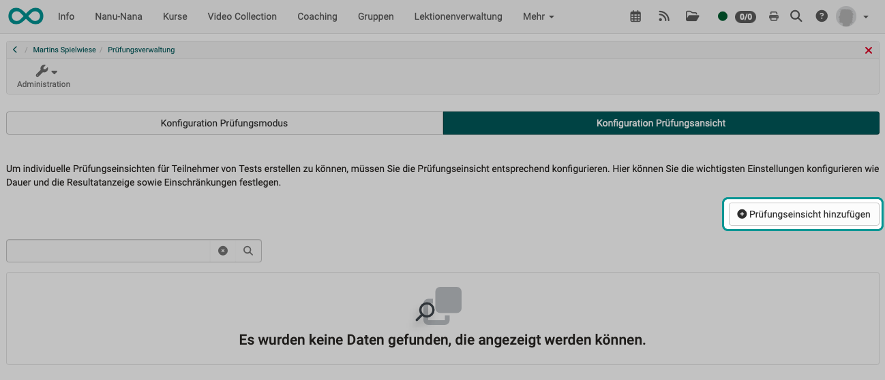
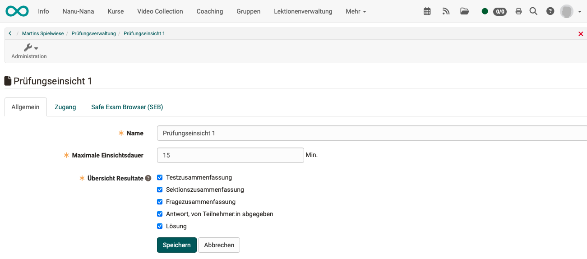
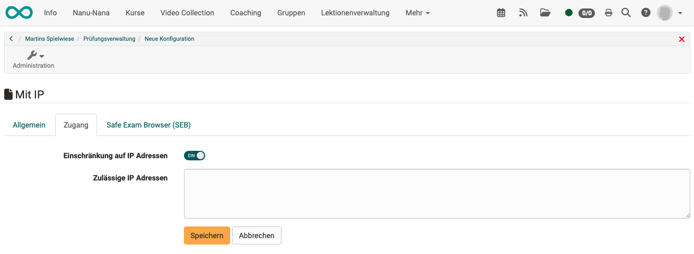
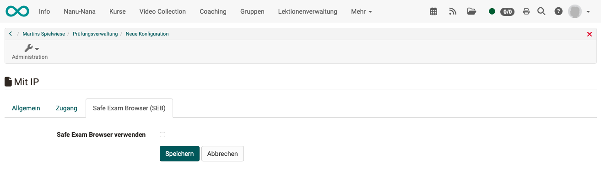
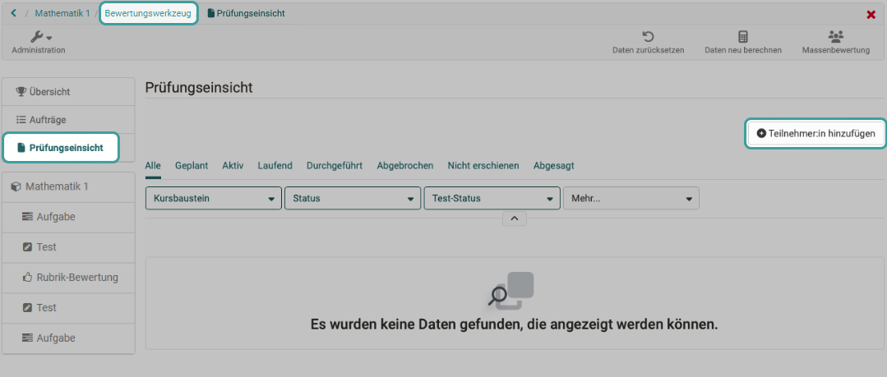
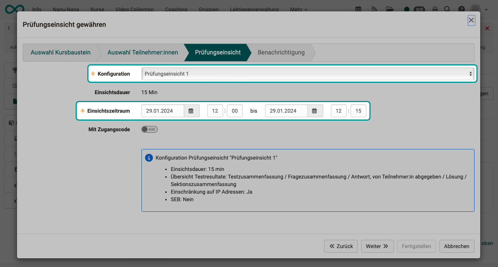
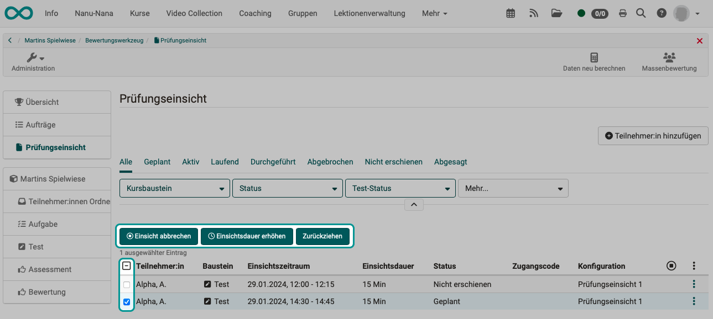
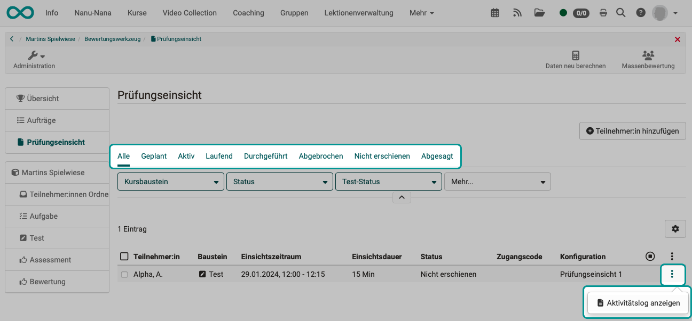

# Assessment management: assessment inspection  {: #Assessment_inspection}

:octicons-tag-24: Release 18.2

## What is an assessment inspection about?

Occasionally, exam participants not only want to know their exam results, but also to see the original exam again. It is a legitimate concern to be able to understand how the examination result (points/grades) came about.

However, this is contradicted by the fact that the participants should not be given the exam and should not receive a copy of it or create one themselves (screenshots).

That's why OpenOlat has a special tool for assessment. You define

* a specific time window,
* if the assessment mode is active during this time window.

## Configuration of a flowchart for an inspection

As **Course owner** you create a flowchart in which you define how exam inspections work.  
The **coaches** then schedule the inspections for the exam participants and select one of the predefined flowcharts (configurations).

As the course owner, you define an assessment (flowchart) under  
**Administration > Assessment management > Tab "Configuration assessment inspection"** 
There you can click on the **button "Add assessment inspection"** to add a new configuration (flowchart) to the assessment management. Already defined flowcharts will be listed.

{ class="shadow lightbox" }

### Tab "General"

First, you define how long the assessment may last and what should be shown during the assessment. (Date and time will be determined by the coach if he/she organizes an inspection with exam participants.)

{ class="shadow lightbox" }

### Tab "Access"

In the "Access" tab, access can be restricted to very specific devices by specifying one or more IP addresses. (E.g. only one specific computer in one specific room).

{ class="shadow lightbox" }

### Tab "Safe Exam Browser (SEB)"

By using the SEB, all other activities on the computer can be blocked during viewing.

{ class="shadow lightbox" }

 

## Planning of inspections by coaches

As a coach, you use the **assessment tool** to organize the inspections for individual or multiple exam participants. (E.g. only for those examination participants who expressly wish to inspect the documents.)

{ class="shadow lightbox" }

A wizard guides you through the steps.
For example, determine the date and select one of the flowcharts (configuration) predefined by the course owner. This ensures that the same conditions prevail for all inspectors.

{ class="shadow lightbox" }

The inspection dates can be scheduled before the audit is carried out.

## Carrying out inspections as coach

It is advisable to accompany the inspection as a coach on the scheduled dates.

The maximum viewing time specified in the configuration (by the course owner) does not necessarily have to be used until the end. As a coach, you can terminate the inspection prematurely if you notice unauthorized behavior, for example. (For example, if someone takes unauthorized photos with the mobile).

{ class="shadow lightbox" }

## Inspection from the perspective of the exam participants

As an exam participant, you will receive a notification with the date and time for viewing your exam and, if applicable, an access code.

Once the time slot for inspection has elapsed, the inspection is terminated. Anyone who does not start viewing their examination on time will lose time accordingly.

{ class="shadow lightbox" }

## Documentation of the inspections

All inspection appointments scheduled by coaches are recorded in OpenOlat.
It can therefore be proven that examination candidates who had an appointment for inspection did not attend this appointment. The start, duration and end of the inspections are also recorded.

You can use the **tabs above the table** for several people.
You can find everything per person in the **activity log** under the 3 points at the end of a line.

{ class="shadow lightbox" }

## Difference: Report - Assessment

| Report                                    | Assessment view                          |
| ----------------------------------------- | ----------------------------------------- |
| **Overview** of the participants' results | **Detailed view** of the examination of certain participants |
| Defined **results view for all** course participants | The assessment is particularly suitable for **inspection by individuals** (e.g. if there are doubts in individual cases). |
| repeatable               | one-time                    |
| at any time, as long as the course is accessible       | only on fixed dates         |
| Access for owners: **Administration > Course editor > Select course element "Test" > Tab "Test configuration" > Section "Report"**| Access for owners: **Administration > Exam administration > Tab "Configuration Exam management"** |
| Access for coaches:    | Access for coaches:  **Assessment tool > Tab Assessment view ** |

