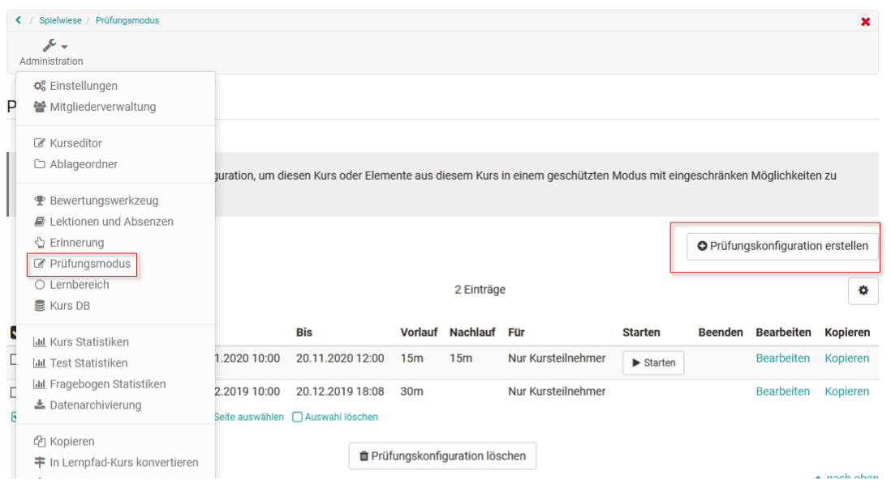
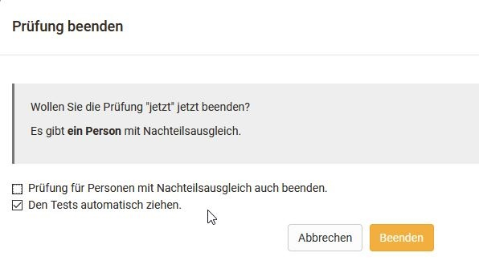

# Prüfungsmodus

## Im Kioskmodus Prüfungen und Tests durchführen

Mit dem Prüfungsmodus erstellen Sie Prüfungskonfigurationen, in denen Tests und Prüfungen in geschütztem Modus während einer festgelegten Zeit durchgeführt werden. Dabei ist nur der Zugriff auf zuvor festgelegte Kursbausteine im betroffenen Kurs gestattet. Alle weiteren Funktionen in OpenOlat wie andere Kurse, Gruppen, Notizen etc. werden während der Prüfungsdauer ausgeblendet. Nur ein Logout ist während der Prüfung möglich.

Sie erstellen einen Prüfungsmodus indem Sie in der Kurs "Administration" den Link "Prüfungsmodus" auswählen und auf den Button "Prüfungskonfiguration erstellen" klicken.

{ class="shadow lightbox" }

Auf der Übersichtsseite sehen Sie alle für einen Kurs bereits abgehaltenen, laufenden oder geplanten Prüfungen. Geplante Prüfungen können bis zur Prüfung noch bearbeitet werden, eine nachträgliche Bearbeitung ist nicht möglich. Die Übersicht enthält Informationen zu Datum und Dauer, Vor- und Nachlaufzeiten sowie Benutzergruppen.

Prüfungskonfigurationen werden vorab erstellt, und enthalten neben einer Start- und Endzeit inklusive Vor- und Nachlaufzeiten, falls diese gewünscht sind, die Einschränkungsmöglichkeit auf spezifische Nutzergruppen. So kann eine Prüfung nur für Kursteilnehmende, nur für Gruppenteilnehmer ausgewählter Gruppen, oder für beide gelten. Dadurch ist es möglich, zeitgleich unterschiedlich konfigurierte Prüfungen für verschiedene Nutzergruppen desselben Kurses abzuhalten. Neben der Benutzergruppe können Sie festlegen, ob und auf welche Kurselemente der Zugriff eingeschränkt werden soll, und ob eines davon als Startbaustein verwendet wird. Des Weiteren kann der Zugang zur Prüfung auf spezifische IP-Adressen beschränkt, oder die Nutzung des [Safe Exam Browsers](http://www.safeexambrowser.org) vorausgesetzt werden.

## Konfigurationsmöglichkeiten im Detail

### Tab Allgemein
Detailliert können neben Titel und Beschreibung, die dem Benutzer in der Prüfungsbenachrichtigung angezeigt werden, die folgenden Parameter konfiguriert werden:

**Beginn**: Legen Sie hier Datum und Uhrzeit für den Beginn der Prüfung fest. Die **Vorlaufzeit**, die Sie in Minuten angeben, sperrt OpenOlat während der angegebenen Dauer vor Prüfungsbeginn.

**Ende**: Der Zeitpunkt an dem die Prüfung beendet wird. Wird eine **Nachlaufzeit** in Minuten angegeben, wird OpenOlat während dieser Dauer im Anschluss an die Prüfung noch gesperrt.

**Art des Beginns / Endes**: Sie können zwischen Automatisch und manuellem Start / Ende wählen. Bei manueller Bedienung finden Sie auf der Übersichtsseite einen Start- und Ende-Link bei der entsprechenden Prüfungskonfiguration.

### Tab Einschränkungen Kursbaustein

**Zugriff auf Kursbaustein einschränken**: Um die Prüfung auf ausgewählte Kursbausteine des betroffenen Kurses zu beschränken, wählen Sie hier die Checkbox aus, und klicken Sie dann auf die Schaltfläche "Kursbausteine auswählen". Es öffnet sich eine Liste aller Kursbausteine des Kurses - wählen Sie jene Kurselemente aus, die den Probanden während der Prüfung angezeigt werden sollen. Alle anderen Kursbausteine werden für die Dauer der Prüfung ausgeblendet.

**Startbaustein**: Soll den Studenten ein bestimmtes Kurselement direkt beim Start angezeigt werden, so arbeiten Sie mit der Schaltfläche "Kursbaustein auswählen". Wählen Sie aus den verfügbaren Kurselementen eines aus. Es werden nur die Kursbausteine angezeigt, die im Schritt zuvor zur Anzeige ausgewählt wurden.

### Tab Zugang 

**Einschränkung auf IP-Adressen**: Um eine Ausführung der Prüfung nur an bestimmten Computern oder Orten zuzulassen, markieren Sie hier die Checkbox und tragen dann die zulässigen IP-Adressen ein. Diese sollten Sie von ihrer Informatik-Abteilung erhalten können. Sie können dadurch z.B. verhindern, dass eine Prüfung von einem Prüfling von zuhause abgelegt wird.

**Teilnehmende**: Hier legen Sie fest für welche Benutzer die Prüfung gültig ist. Wählen Sie aus den folgenden Optionen aus:
* Nur Kursteilnehmende
* Nur Gruppenteilnehmende
* Nur Curriculumteilnehmende oder 
* Teilnehmende des Kurses und der ausgewählten Gruppen oder Curriculum

Sobald eine Option mit Gruppen ausgewählt wurde, müssen Sie zwingend immer über die Schaltflächen "Gruppen auswählen" oder "Lernbereich auswählen" die betroffenen Gruppen auswählen. Wird ein Curriculum verwendet muss dies ebenfalls ausgewählt werden. 

Ferner kann definiert werden ob der Prüfungsmodus auch auf Betreuer angewendet werden soll. 

### Tab Safe Exam Browser

**Safe Exam Browser verwenden**: Die Verwendung des Safe Exam Browser erlaubt die sichere Ausführung von Online-Prüfungen, in dem der Computer in den sogenannten Kioskmodus versetzt wird. Dadurch wird die Verwendung unerlaubter Quellen während einer Prüfung unterbunden. Tragen Sie die Browser Exam Keys aller zugelassenen Browser-Instanzen ein, um die Ausführung im SEB zu ermöglichen. Benutzer werden darüber benachrichtigt, dass der SEB für die Prüfung Voraussetzung ist. Erst wenn OpenOlat im Safe Exam Browser gestartet wurde kann die Prüfung durchgeführt werden.

##  Prüfung durchführen und beenden
Benutzer, die einer Prüfung zugeteilt wurden, werden zu Beginn der Prüfung bzw. zu Beginn der Vorlaufzeit über den Start der Prüfung informiert. Sollte OpenOlat durch einen Nachlaufzeit am Ende der Prüfung noch gesperrt sein, werden Benutzer ebenfalls darüber informiert.

Ein laufender Prüfungsmodus kann vom Lehrenden im [Bewertungswerkzeug](Assessment_tool_overview.de.md) verfolgt werden. Bewertungen z.B. für Einsendeaufgaben oder Freitext Elemente von Tests können auch direkt bewertet und für die User freigeschaltet bzw. sichtbar gemacht werden. So wird direkt eine Prüfungseinsicht- und –besprechung ermöglicht. Ferner können Lehrende im Bewertungswerkzeug im manuellen Modus die Prüfung beenden.

Ein laufender Prüfungsmodus kann generell automatisch oder manuell beendet werden.

{ class="shadow" }

Der Prüfunsmodus wird auch beendet, wenn der entsprechende Kurs beendet oder gelöscht wird.