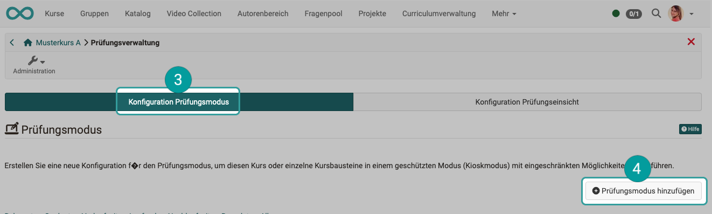
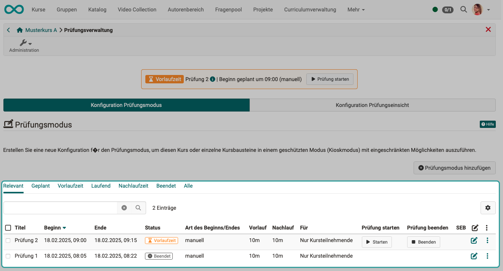
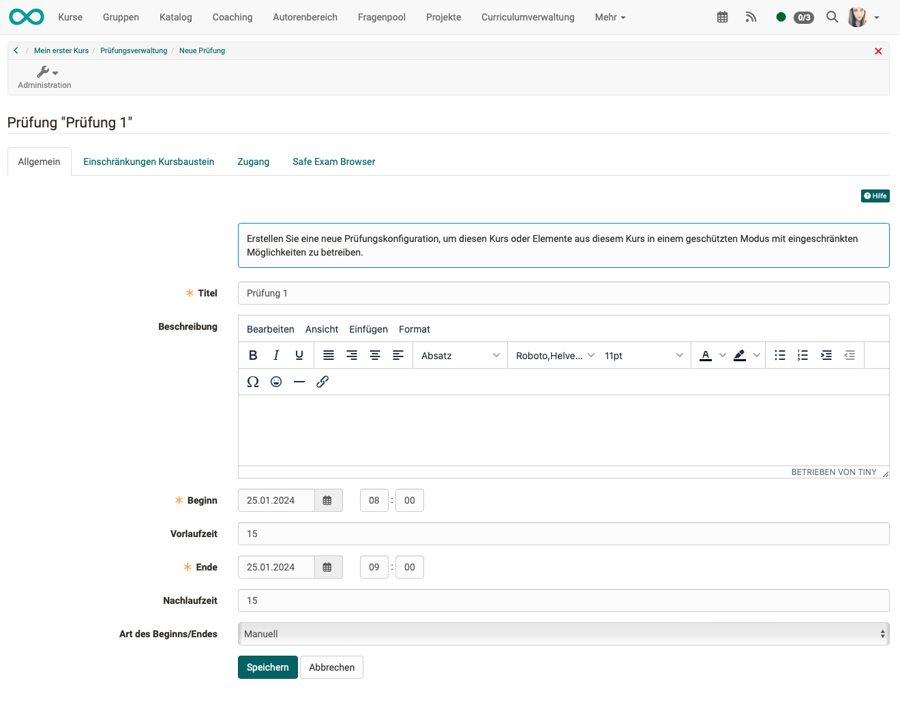
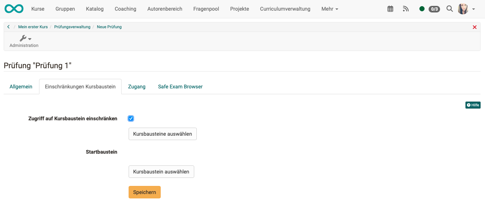
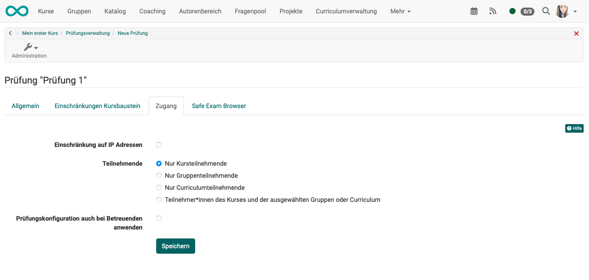
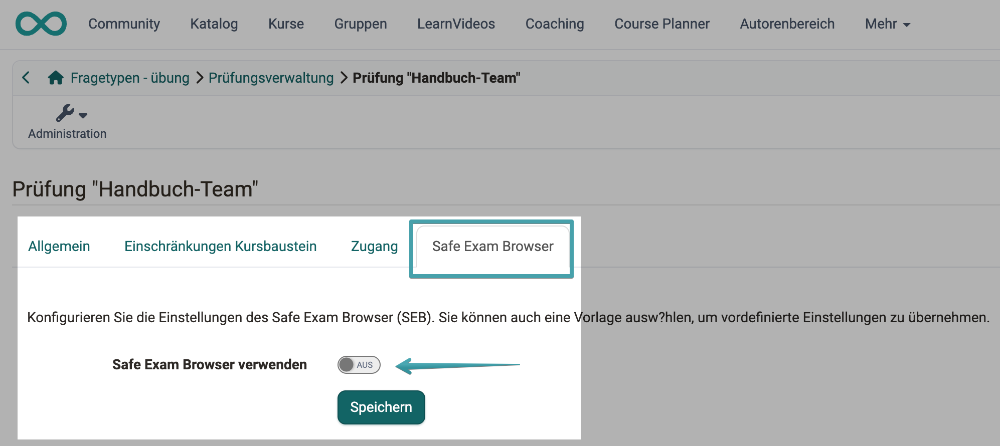
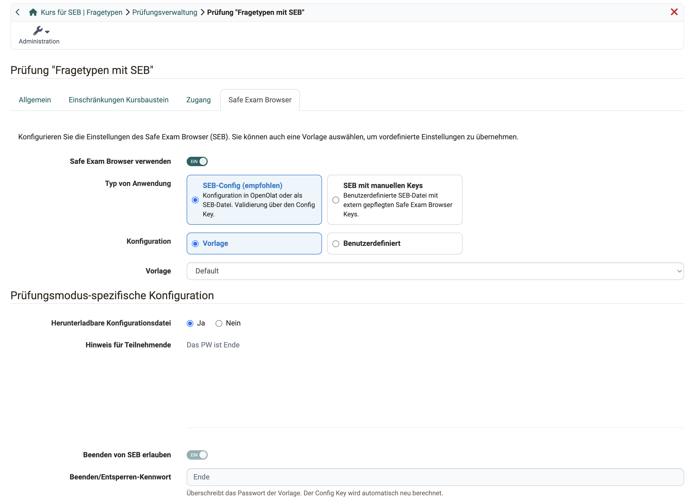
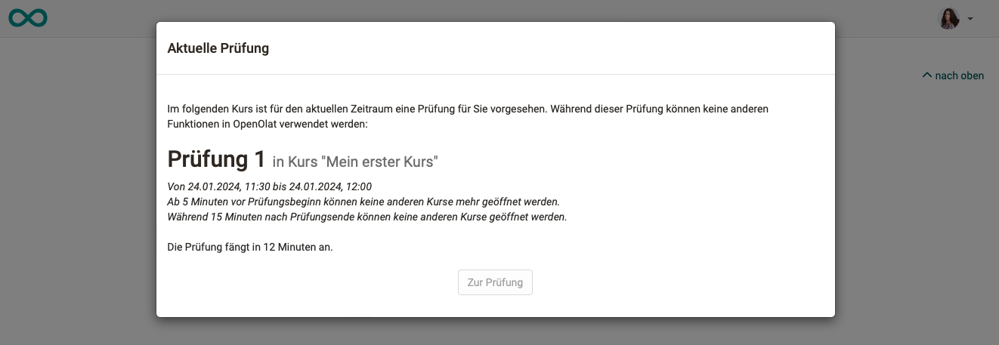
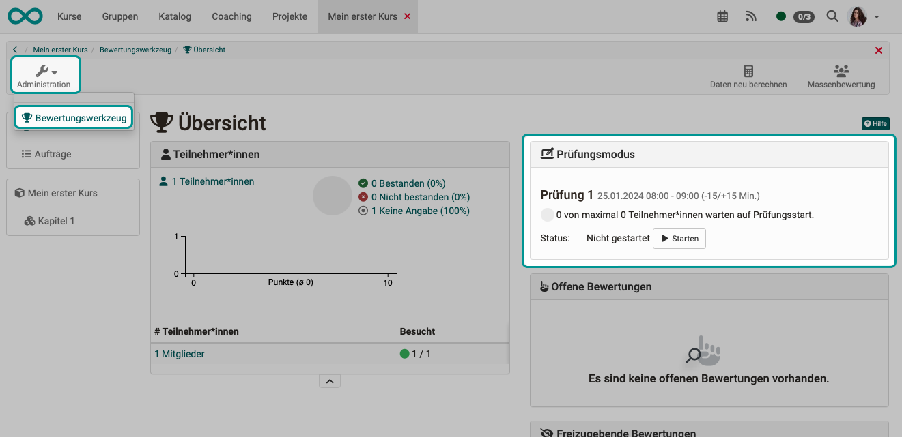
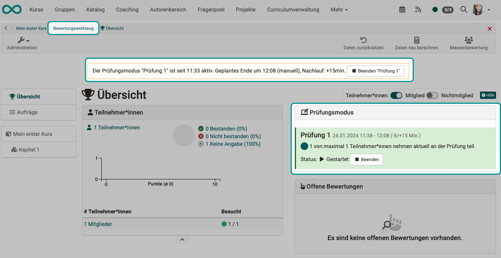

# Prüfungsverwaltung: Prüfungsmodus {: #Assessment_mode}

!!! note "Hinweis"

    Vor Version 18.2 war die Konfiguration des Prüfungsmodus eine separate Menüoption in der Kursadministration.

## Was versteht man unter "Prüfungsmodus"?

Ein Prüfungsmodus ist eine **Prüfungskonfiguration**, in der Tests und Prüfungen in **geschütztem Modus** (sogenannter Kioskmodus) während einer festgelegten Zeit durchgeführt werden.

Während dieser Zeit ist nur der Zugriff auf zuvor festgelegte Kursbausteine im betroffenen Kurs gestattet. Alle weiteren Funktionen in OpenOlat, wie andere Kurse, Gruppen, Notizen etc., werden während der Prüfungsdauer (Laufzeit des Prüfungsmodus) ausgeblendet. Nur ein Logout ist während der Prüfung möglich.

---

## Prüfungsmodus hinzufügen

Sie **erstellen** und konfigurieren einen Prüfungsmodus, indem Sie

1. Ihren **Kurs** mit dem darin enthaltenen Test wählen,
2. in der **"Kurs-Administration"** die Option **"Prüfungsverwaltung"** wählen,
3. und dort den **Tab "Konfiguration Prüfungsmodus"** auswählen.
4. Klicken Sie dort auf den **Button "Prüfungsmodus hinzufügen"**.

{ class="shadow lightbox" }

Auf der Übersichtsseite sehen Sie alle für einen Kurs bereits abgehaltenen, laufenden oder geplanten Prüfungen. Der Modus geplanter Prüfungen kann bis zur Prüfung noch bearbeitet werden, eine nachträgliche Bearbeitung ist nicht möglich. Die Übersicht enthält Informationen zu Datum und Dauer, Vor- und Nachlaufzeiten, sowie Benutzergruppen.

{ class="shadow lightbox" }

Prüfungskonfigurationen werden vorab erstellt und enthalten

* eine Start- und Endzeit
* evtl. Vor- und Nachlaufzeiten (falls diese gewünscht sind)
* evtl. Einschränkungen auf spezifische Nutzergruppen.

Ein Prüfungsmodus kann gelten

* nur für Kursteilnehmende,
* nur für Gruppenteilnehmende ausgewählter Gruppen
* oder für beides.

Dadurch ist es möglich, zeitgleich unterschiedlich konfigurierte Prüfungen für verschiedene Nutzergruppen desselben Kurses abzuhalten.

Neben der Benutzergruppe können Sie festlegen, ob und auf welche Kursbausteine der Zugriff eingeschränkt werden soll, und ob ein Kursbaustein davon als Startbaustein verwendet wird. 
Des Weiteren kann der Zugang zur Prüfung auf spezifische IP-Adressen beschränkt, oder die Nutzung des [Safe Exam Browsers](http://www.safeexambrowser.org) vorausgesetzt werden.

!!! tip "Tipp"

    Für den Prüfungsmodus wird bevorzugt ein herkömmlicher Kurs empfohlen. Wenn Sie einen Lernpfadkurs verwenden, müssen Sie sicherstellen, dass die betroffenen Kursbausteine zugänglich sind.

    Im herkömmlichen Kurs haben Sie ausserdem die Möglichkeit, beim Editieren eines Kursbausteins unter den Tabs "Sichtbarkeit" und "Zugang" die Option **"Nur im Prüfungsmodus"** zu wählen. Diese Option steht in Lernpfadkursen nicht zur Verfügung.

!!! info "Vor- und Nachlaufzeit auf 0 setzen"

    Beim Erstellen eines neuen Prüfungsmodus sind Vor- und Nachlaufzeit ab
    Release 21 mit je 10 Minuten vorbelegt. Dieser Vorschlagswert lässt sich
    pro Prüfungsmodus frei überschreiben: auch auf **0**, wenn OpenOlat vor
    bzw. nach der Prüfung nicht gesperrt werden soll. Ein globaler Standardwert
    ist nicht konfigurierbar; die 0 muss also in jeder Prüfungskonfiguration
    einzeln eingetragen werden.

---

## Tab "Allgemein"

{ class="shadow lightbox" }

Detailliert können neben Titel und Beschreibung, die den Teilnehmenden in der Prüfungsbenachrichtigung angezeigt werden, die folgenden Parameter konfiguriert werden:

**Beginn**: Legen Sie hier Datum und Uhrzeit für den Beginn der Prüfung fest.

Die **Vorlaufzeit**, die Sie in Minuten angeben, sperrt OpenOlat während der angegebenen Dauer vor Prüfungsbeginn.

**Ende**: Der Zeitpunkt an dem die Prüfung beendet wird.

Wird eine **Nachlaufzeit** in Minuten angegeben, bleibt OpenOlat während dieser Dauer im Anschluss an die Prüfung noch gesperrt.

**Art des Beginns / Endes**: Sie können zwischen automatischem und manuellem Start / Ende wählen. Stellen Sie als Autor:in hier "manuelle Bedienung" ein, finden Betreuer:innen auf der Übersichtsseite des Bewertungswerkzeugs einen Start- und Ende-Button bei der entsprechenden Prüfungskonfiguration, mit dem Sie den Prüfungsmodus manuell einschalten können.

---

## Tab "Einschränkungen Kursbaustein"

{ class="shadow lightbox" }

**Zugriff auf Kursbaustein einschränken**: Um die Prüfung auf ausgewählte Kursbausteine des betroffenen Kurses zu beschränken, wählen Sie hier die Checkbox aus, und klicken Sie dann auf die Schaltfläche "Kursbausteine auswählen". Es öffnet sich eine Liste aller Kursbausteine des Kurses - wählen Sie jene Kurselemente aus, die den Probanden während der Prüfung angezeigt werden sollen. Alle anderen Kursbausteine werden für die Dauer der Prüfung ausgeblendet.

**Startbaustein**: Soll den Studenten ein bestimmtes Kurselement direkt beim Start angezeigt werden, so arbeiten Sie mit der Schaltfläche "Kursbaustein auswählen". Wählen Sie aus den verfügbaren Kurselementen eines aus. Es werden nur die Kursbausteine angezeigt, die im Schritt zuvor zur Anzeige ausgewählt wurden.

---

## Tab "Zugang"

{ class="shadow lightbox" }

**Einschränkung auf IP-Adressen**: Um eine Ausführung der Prüfung nur an bestimmten Computern oder Orten zuzulassen, markieren Sie hier die Checkbox und tragen dann die zulässigen IP-Adressen ein. Diese sollten Sie von ihrer Informatik-Abteilung erhalten können. Sie können dadurch z.B. verhindern, dass eine Prüfung von einem Prüfling von zuhause abgelegt wird.

**Teilnehmende**: Hier legen Sie fest, für welche Teilnehmenden die Prüfung gültig ist. Wählen Sie aus den folgenden Optionen aus:

* Nur Kursteilnehmende
* Nur Gruppenteilnehmende
* Nur Curriculumteilnehmende oder
* Teilnehmende des Kurses und der ausgewählten Gruppen oder Curriculum

Sobald eine Option mit Gruppen ausgewählt wurde, müssen Sie zwingend immer über die Schaltflächen "Gruppen auswählen" oder "Lernbereich auswählen" die betroffenen Gruppen auswählen. Wird ein Curriculum verwendet, muss dies ebenfalls ausgewählt werden.

**Prüfungskonfiguration auch bei Betreuenden anwenden**:
Wird diese Option gewählt, gilt der Prüfungsmodus auch für Betreuer:innen. D.h. auch für Betreuer:innen gilt der Kioskmodus, in dem andere Funktionen gesperrt sind.

!!! note "Hinweis"

    Kursbesitzer:innen können während der Prüfung weiterhin normal auf ihren Kurs zugreifen.

---

## Tab "Safe Exam Browser" [:octicons-tag-16:{ title="ab Release 20.3 (OO-9159)" }](https://track.frentix.com/issue/OO-9159)

{ class="shadow lightbox" }

**Safe Exam Browser verwenden**: Die Verwendung des [Safe Exam Browsers](http://www.safeexambrowser.org) erlaubt die sichere Ausführung von Online-Prüfungen, in dem der Computer in den sogenannten Kioskmodus versetzt wird. Dadurch wird die Verwendung unerlaubter Quellen während einer Prüfung unterbunden. Teilnehmende werden darüber benachrichtigt, dass der SEB für die Prüfung Voraussetzung ist. Erst wenn OpenOlat im Safe Exam Browser gestartet wurde kann die Prüfung durchgeführt werden.

{ class="shadow lightbox" }

**Typ von Anwendung** [:octicons-tag-16:{ title="ab Release 21.0 (OO-9571)" }](https://track.frentix.com/issue/OO-9571): Legen Sie fest, wie die SEB-Konfiguration bereitgestellt wird. Mit «SEB-Config (empfohlen)» konfigurieren Sie den SEB in OpenOlat oder über eine importierte SEB-Datei; die Gültigkeit wird über den Config Key sichergestellt. Mit «SEB mit manuellen Keys» verwenden Sie eine benutzerdefinierte SEB-Datei mit extern gepflegten Safe Exam Browser Keys.

**Konfiguration**: Wählen Sie, ob die Einstellungen aus einer «Vorlage» übernommen oder «Benutzerdefiniert» angepasst werden. Bei einer Formularvorlage lassen sich die Einstellungen nach Auswahl von «Benutzerdefiniert» anpassen; bei einer importierten SEB-Datei-Vorlage sind sie fest vorgegeben und werden schreibgeschützt angezeigt.

**Vorlage**: Wählen Sie aus dem Dropdown eine der aktiven SEB-Konfigurationsvorlagen aus, die von der Administration bereitgestellt werden. Die als Standard markierte Vorlage ist vorausgewählt. Wurde eine gespeicherte Vorlage nachträglich deaktiviert, bleibt sie als ausgewähltes Element in der Liste erhalten, bis eine andere Vorlage gewählt wird.

!!! info "Hinweis für Autoren"
    Ist in der gewählten Vorlage ein Hinweis für Autor:innen hinterlegt, erscheint dieser hier.

Unter der Legende **Prüfungsmodus-spezifische Konfiguration** übersteuern Sie einzelne Einstellungen für genau diese Prüfung:

**Herunterladbare Konfigurationsdatei**: Legt fest, ob Teilnehmende die SEB-Konfigurationsdatei für diese Prüfung herunterladen können.

**Hinweis für Teilnehmende**: Ein Text, der den Teilnehmenden zusammen mit der SEB-Konfiguration angezeigt wird.

**Beenden von SEB erlauben**: Erlaubt den Prüfungsteilnehmenden, den Safe Exam Browser nach Abgabe der Prüfung zu beenden.

**Beenden/Entsperren-Kennwort**: Überschreibt das in der Vorlage hinterlegte Kennwort für genau diese Prüfung. Der Config Key wird dabei automatisch neu berechnet.

Unter der Legende **Konfiguration anhand der Vorlage** werden die aus der gewählten Vorlage übernommenen Detaileinstellungen angezeigt.

{ class="shadow lightbox" }

!!! tip "Voraussetzung"
    Die Vorlagenauswahl steht nur zur Verfügung, wenn in der System-Administration unter `Administration > e-Assessment > Prüfungsverwaltung > Tab "Safe Exam Browser Konfiguration"` mindestens eine aktive Vorlage angelegt wurde.

!!! info "Weitere Informationen"
    [Safe Exam Browser (SEB) konfigurieren >](../../manual_how-to/SEB/SEB.de.md)

---

##  Prüfung durchführen

Teilnehmende, die einer Prüfung zugeteilt wurden, werden zu Beginn der Prüfung bzw. zu Beginn der Vorlaufzeit über den Start der Prüfung informiert. Sollte OpenOlat durch eine Nachlaufzeit am Ende der Prüfung noch gesperrt sein, werden sie ebenfalls darüber informiert.

{ class="shadow lightbox" }

Wurde von dem/der Kursbesitzer:in ein manueller Start vorgesehen, finden Betreuer:innen auf der Übersichtsseite des [Bewertungswerkzeugs](Assessment_tool_overview.de.md) einen Start- und Ende-Button bei der entsprechenden Prüfungskonfiguration. Damit kann der Prüfungsmodus manuell eingeschaltet werden. Der Start-Button wird für Betreuer:innen erst sichtbar, sobald der vorkonfigurierte Zeitraum für diese Prüfung erreicht wurde.

{ class="shadow lightbox" }

Wird der Prüfungsmodus manuell durch Betreuer:innen gestartet, so bleibt die Vorlaufzeit unverändert (wie in der Konfiguration vorgesehen), auch wenn der Button zum Start der Prüfung später als geplant geklickt wird.

Wird manuell die Prüfung verspätet gestartet, dann verschiebt sich das Prüfungsende nach hinten.  Die vorkonfigurierte Prüfungs **dauer** bleibt also gleich.

Ein laufender Prüfungsmodus kann von den Betreuer:innen im Bewertungswerkzeug verfolgt werden.

Bewertungen, z.B. für Einsendeaufgaben oder Freitext Elemente von Tests, können auch direkt bewertet und für die Teilnehmer freigeschaltet bzw. sichtbar gemacht werden. So wird direkt eine Prüfungseinsicht und -besprechung ermöglicht.

---

##  Prüfung beenden

Ein laufender Prüfungsmodus kann generell automatisch oder manuell beendet werden.

Bei manuellem Modus können Betreuer:innen und Kursbesitzer:innen die Prüfung im **Bewertungswerkzeug** beenden.

{ class="shadow lightbox" }

Der Prüfungsmodus wird auch beendet, wenn der entsprechende Kurs beendet oder gelöscht wird.

## Weiterführende Informationen {: #further_information}

**Auf dieser Seite erwähnt** 
[Safe Exam Browser >](http://www.safeexambrowser.org) 
[Wie bereite ich eine Prüfung mit dem Safe Exam Browser (SEB) vor? >](../../manual_how-to/SEB/SEB.de.md) 
[Bewertungswerkzeug - Übersicht >](Assessment_tool_overview.de.md)

**Weiterführend** 
[Prüfungsverwaltung: Prüfungseinsicht >](Assessment_inspection.de.md) 
[Test Einstellungen - Administration >](Test_settings.de.md)

[Zum Seitenanfang ^](#Assessment_mode)
