# Prüfungsverwaltung: Prüfungsmodus {: #Assessment_mode}

!!! note "Hinweis"

    Die Konfiguration des Prüfungsmodus finden Sie in der Prüfungsverwaltung des Kurses: `Kurs > Administration > Prüfungsverwaltung > Tab "Konfiguration Prüfungsmodus"`.

## Was versteht man unter "Prüfungsmodus"? [:octicons-tag-16:{ title="ab Release 10.2 (OO-1349)" }](https://track.frentix.com/issue/OO-1349)

Ein Prüfungsmodus ist eine **Prüfungskonfiguration**, in der Tests und Prüfungen in **geschütztem Modus** (sogenannter Kioskmodus) während einer festgelegten Zeit durchgeführt werden.

Während dieser Zeit ist nur der Zugriff auf zuvor festgelegte Kursbausteine im betroffenen Kurs gestattet. Alle weiteren Funktionen in OpenOlat, wie andere Kurse, Gruppen, Notizen etc., werden während der Prüfungsdauer (Laufzeit des Prüfungsmodus) ausgeblendet. Nur ein Logout ist während der Prüfung möglich.

---

## Prüfungsmodus hinzufügen

Sie **erstellen** und konfigurieren einen Prüfungsmodus, indem Sie

1. Ihren **Kurs** mit dem darin enthaltenen Test wählen,
2. in der **"Kurs-Administration"** die Option **"Prüfungsverwaltung"** wählen,
3. und dort den **Tab "Konfiguration Prüfungsmodus"** auswählen.
4. Klicken Sie dort auf den **Button "Prüfungsmodus hinzufügen"**.

Für einen Termin des Kurses entsteht der Prüfungsmodus stattdessen in der Terminliste: [Prüfungsmodus aus einem Termin](#exam_from_event)

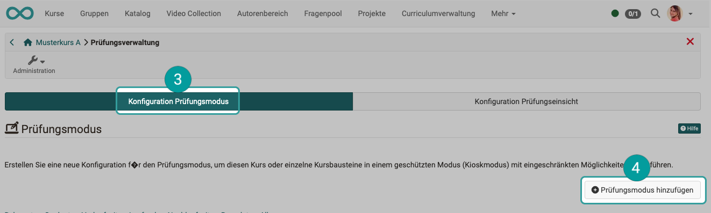{ class="shadow lightbox" title="Seite Prüfungsverwaltung im Kurs" }

Auf der Übersichtsseite sehen Sie alle für einen Kurs bereits abgehaltenen, laufenden oder geplanten Prüfungen. Der Modus geplanter Prüfungen kann bis zur Prüfung noch bearbeitet werden, eine nachträgliche Bearbeitung ist nicht möglich. Die Übersicht enthält Informationen zu Datum und Dauer, Vor- und Nachlaufzeiten, sowie Benutzergruppen.

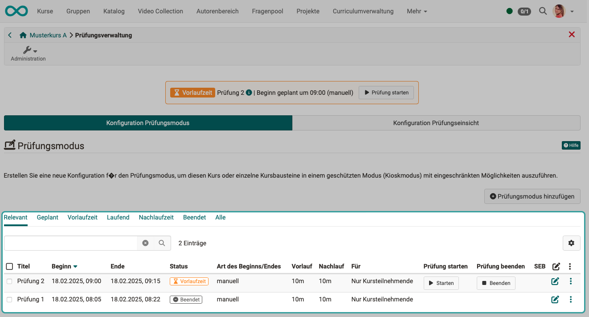{ class="shadow lightbox" title="Tab Konfiguration Prüfungsmodus" }

Prüfungskonfigurationen werden vorab erstellt und enthalten

* eine Start- und Endzeit
* evtl. Vor- und Nachlaufzeiten (falls diese gewünscht sind)
* evtl. Einschränkungen auf spezifische Nutzergruppen.

Ein Prüfungsmodus kann gelten

* nur für die Teilnehmenden des Kurses,
* nur für die Teilnehmenden ausgewählter Gruppen,
* nur für die Teilnehmenden ausgewählter Produkte des Course Planner, sofern das Modul Course Planner eingeschaltet ist,
* oder für die Teilnehmenden des Kurses und der ausgewählten Gruppen oder Produkte.

Dadurch ist es möglich, zeitgleich unterschiedlich konfigurierte Prüfungen für verschiedene Nutzergruppen desselben Kurses abzuhalten.

Neben der Benutzergruppe können Sie festlegen, ob und auf welche Kursbausteine der Zugriff eingeschränkt werden soll, und ob ein Kursbaustein davon als Startbaustein verwendet wird. 
Des Weiteren kann der Zugang zur Prüfung auf spezifische IP-Adressen beschränkt, oder die Nutzung des [Safe Exam Browsers](http://www.safeexambrowser.org) vorausgesetzt werden.

!!! tip "Tipp"

    Für den Prüfungsmodus wird bevorzugt ein herkömmlicher Kurs empfohlen. Wenn Sie einen Lernpfadkurs verwenden, müssen Sie sicherstellen, dass die betroffenen Kursbausteine zugänglich sind.

    Im herkömmlichen Kurs haben Sie ausserdem die Möglichkeit, beim Editieren eines Kursbausteins unter den Tabs "Sichtbarkeit" und "Zugang" die Option **"Nur im Prüfungsmodus"** zu wählen. Diese Option steht in Lernpfadkursen nicht zur Verfügung.

!!! info "Vor- und Nachlaufzeit auf 0 setzen"

    Beim Erstellen eines neuen Prüfungsmodus sind Vor- und Nachlaufzeit mit je 10 Minuten vorbelegt. Beide Felder sind Pflichtfelder. Dieser Vorschlagswert lässt sich pro Prüfungsmodus frei überschreiben: auch auf **0**, wenn OpenOlat vor bzw. nach der Prüfung nicht gesperrt werden soll. Ein globaler Standardwert ist nicht konfigurierbar; die 0 muss also in jeder Prüfungskonfiguration einzeln eingetragen werden.

---

## Tab "Allgemein"

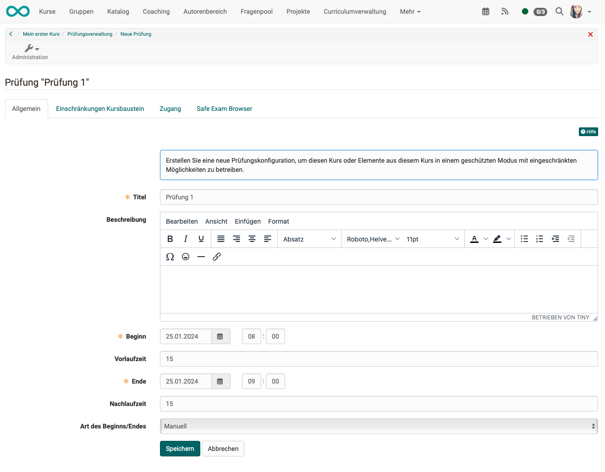{ class="shadow lightbox" title="Dialog einer neuen Prüfung" }

Detailliert können neben Titel und Beschreibung, die den Teilnehmenden in der Prüfungsbenachrichtigung angezeigt werden, die folgenden Parameter konfiguriert werden:

**Beginn**: Legen Sie hier Datum und Uhrzeit für den Beginn der Prüfung fest.

Die **Vorlaufzeit**, die Sie in Minuten angeben, sperrt OpenOlat während der angegebenen Dauer vor Prüfungsbeginn.

**Ende**: Der Zeitpunkt an dem die Prüfung beendet wird.

Wird eine **Nachlaufzeit** in Minuten angegeben, bleibt OpenOlat während dieser Dauer im Anschluss an die Prüfung noch gesperrt.

Vorlaufzeit und Nachlaufzeit regeln, wie lange OpenOlat gesperrt ist, nicht wie lange der Test dauert. Wie Prüfungsmodus, Testzeitraum, Zeitbeschränkung und Verlängerung zusammenwirken, zeigt [Wie hängen die Zeiten einer Prüfung zusammen?](../../manual_how-to/exam_preparation/exam_preparation.de.md#exam_times)

**Art des Beginns/Endes**: Sie können zwischen automatischem und manuellem Start / Ende wählen. Stellen Sie als Autor:in hier "Manuell" ein, finden Betreuer:innen auf der Übersichtsseite des Bewertungswerkzeugs einen Start- und Ende-Button bei der entsprechenden Prüfungskonfiguration, mit dem sie den Prüfungsmodus manuell einschalten können.

---

## Tab "Einschränkungen Kursbaustein"

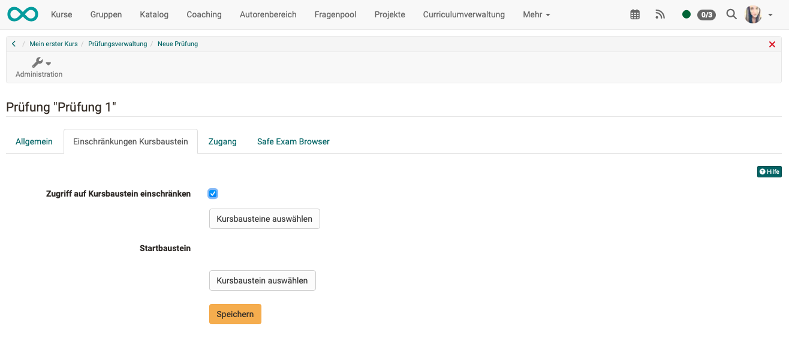{ class="shadow lightbox" title="Dialog einer Prüfung" }

**Zugriff auf Kursbaustein einschränken**: Um die Prüfung auf ausgewählte Kursbausteine des betroffenen Kurses zu beschränken, wählen Sie hier die Checkbox aus, und klicken Sie dann auf die Schaltfläche "Kursbausteine auswählen". Es öffnet sich eine Liste aller Kursbausteine des Kurses - wählen Sie jene Kursbausteine aus, die den Teilnehmenden während der Prüfung angezeigt werden sollen. Alle anderen Kursbausteine werden für die Dauer der Prüfung ausgeblendet.

**Startbaustein**: Soll den Teilnehmenden ein bestimmter Kursbaustein direkt beim Start angezeigt werden, so arbeiten Sie mit der Schaltfläche "Kursbaustein auswählen". Wählen Sie aus den verfügbaren Kursbausteinen einen aus. Es werden nur die Kursbausteine angezeigt, die im Schritt zuvor zur Anzeige ausgewählt wurden.

---

## Tab "Zugang"

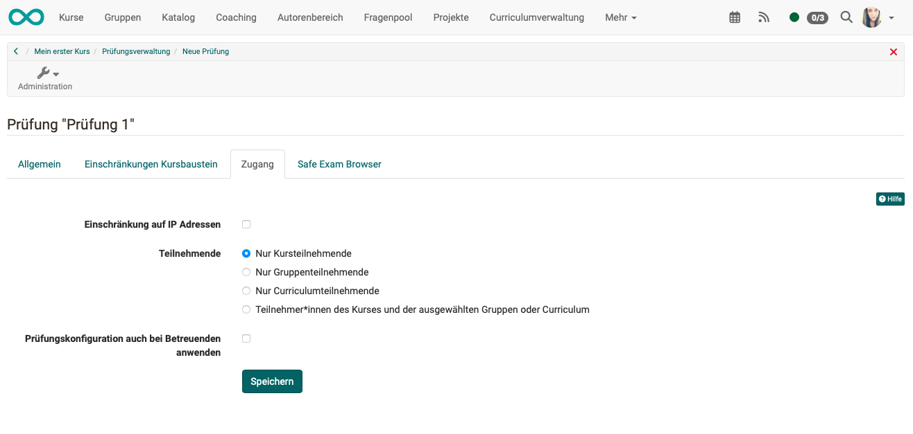{ class="shadow lightbox" title="Tab Zugang im Dialog einer Prüfung" }

**Einschränkung auf IP-Adressen**: Um eine Ausführung der Prüfung nur an bestimmten Computern oder Orten zuzulassen, markieren Sie hier die Checkbox und tragen dann die zulässigen IP-Adressen ein. Diese sollten Sie von ihrer Informatik-Abteilung erhalten können. Sie können dadurch z.B. verhindern, dass Teilnehmende eine Prüfung von zuhause ablegen.

**Teilnehmende**: Hier legen Sie fest, für welche Teilnehmenden die Prüfung gültig ist. Wählen Sie aus den folgenden Optionen aus:

* "Nur Kursteilnehmende"
* "Nur Gruppenteilnehmende"
* "Nur CPL Teilnehmende", sofern das Modul Course Planner eingeschaltet ist
* "Teilnehmer:innen des Kurses und der ausgewählten Gruppen", bei eingeschaltetem Course Planner "Teilnehmer:innen des Kurses und der ausgewählten Gruppen oder Produkten"

Sobald eine Option mit Gruppen ausgewählt wurde, müssen Sie zwingend immer über die Schaltflächen "Gruppen auswählen" oder "Lernbereiche auswählen" die betroffenen Gruppen auswählen. Gilt die Prüfung für Teilnehmende des Course Planner, wählen Sie die Produkte über die Schaltfläche "Produkt auswählen" aus.

**Prüfungskonfiguration auch bei Betreuenden anwenden**:
Wird diese Option gewählt, gilt der Prüfungsmodus auch für Betreuer:innen. D.h. auch für Betreuer:innen gilt der Kioskmodus, in dem andere Funktionen gesperrt sind.

!!! note "Hinweis"

    Kursbesitzer:innen können während der Prüfung weiterhin normal auf ihren Kurs zugreifen.

---

## Tab "Safe Exam Browser" [:octicons-tag-16:{ title="ab Release 20.3 (OO-9159)" }](https://track.frentix.com/issue/OO-9159) {: #tab-safe-exam-browser}

{ class="shadow lightbox" title="Tab Safe Exam Browser im Dialog einer Prüfung" }

**Safe Exam Browser verwenden**: Die Verwendung des [Safe Exam Browsers](http://www.safeexambrowser.org) erlaubt die sichere Ausführung von Online-Prüfungen, in dem der Computer in den sogenannten Kioskmodus versetzt wird. Dadurch wird die Verwendung unerlaubter Quellen während einer Prüfung unterbunden. Teilnehmende werden darüber benachrichtigt, dass der SEB für die Prüfung Voraussetzung ist. Erst wenn OpenOlat im Safe Exam Browser gestartet wurde kann die Prüfung durchgeführt werden.

{ class="shadow lightbox" title="Tab Safe Exam Browser im Dialog einer Prüfung · 2026.10.02" }

**SEB-Konfiguration** [:octicons-tag-16:{ title="ab Release 20.3.10 / 21.0.4 (OO-9730)" }](https://track.frentix.com/issue/OO-9730): Legen Sie fest, woher der Safe Exam Browser seine Einstellungen für diese Prüfung bezieht. Drei Arten stehen zur Auswahl:

- **Aus Vorlage (empfohlen)**: Die Einstellungen kommen aus einer Vorlage. Die Gültigkeit prüft OpenOlat über den Konfigurationsschlüssel.
- **Benutzerdefiniert**: Sie erstellen eine eigene Konfiguration für diese Prüfung. Vorbelegt sind die Werte der Standardvorlage, wenn diese eine Formularvorlage ist.
- **Mit manuellen Keys**: Sie verwenden eine eigene SEB-Datei, die ausserhalb von OpenOlat gepflegt wird, und tragen deren Safe Exam Browser Keys im Feld "Safe Exam Browser Keys" ein.

Die Wahl gilt nur für diese Prüfung. Die Einstellung "Safe Exam Browser - Art der Benutzung" der System-Administration wirkt nicht auf sie, sondern nur auf Prüfungen aus Terminen: [Prüfungsmodus aus einem Termin](#exam_from_event)

**Vorlage**: Erscheint bei "Aus Vorlage (empfohlen)". Mit den beiden Schaltflächen wählen Sie die Quelle der Vorlage:

- **System**: Wählen Sie im Dropdown eine der aktiven Konfigurationsvorlagen, die die Administration bereitstellt. Die als Standard markierte Vorlage ist vorausgewählt. Wurde eine gespeicherte Vorlage nachträglich deaktiviert, bleibt sie ausgewählt, bis eine andere Vorlage gewählt wird.
- **Eigenes**: Laden Sie mit "Hochladen" eine eigene SEB-Datei hoch. OpenOlat liest die Einstellungen aus der Datei, berechnet den Konfigurationsschlüssel und zeigt die Einstellungen schreibgeschützt an. Die Datei darf nicht verschlüsselt sein.

**Vorlage Typ**: Zeigt, ob die Vorlage ein "Formular" oder eine "SEB-Datei" ist. Bei einem Formular steht daneben der Button "Kopie erstellen und anpassen": Er übernimmt die Werte der Vorlage in eine Konfiguration "Benutzerdefiniert", die Sie für diese Prüfung ändern können.

**Hinweis für Autoren**: Ist in der gewählten Vorlage ein Hinweis für Autor:innen hinterlegt, erscheint er hier.

Unter der Legende **Prüfungsmodus-spezifische Konfiguration** stehen die Einstellungen, die für genau diese Prüfung gelten:

**Herunterladbare Konfigurationsdatei**: Legt fest, ob Teilnehmende die SEB-Konfigurationsdatei für diese Prüfung herunterladen können. Das Feld erscheint bei "Aus Vorlage (empfohlen)" und "Benutzerdefiniert".

**Hinweis für Teilnehmende**: Ein Text, der den Teilnehmenden zusammen mit der SEB-Konfiguration angezeigt wird.

**Beenden von SEB erlauben**: Erlaubt den Prüfungsteilnehmenden, den Safe Exam Browser nach Abgabe der Prüfung zu beenden. Der Schalter ändert nur diese Einstellung, die übrigen Werte der Prüfung bleiben erhalten. [:octicons-tag-16:{ title="ab Release 20.3.9 / 21.0.3 (OO-9740)" }](https://track.frentix.com/issue/OO-9740)

**Beenden/Entsperren-Kennwort**: Erscheint, wenn "Beenden von SEB erlauben" eingeschaltet ist. Mit diesem Kennwort beenden die Teilnehmenden den Safe Exam Browser. Bei einer SEB-Datei, aus dem System oder hochgeladen, überschreibt das Kennwort das Kennwort der Datei für genau diese Prüfung. Unter dem Feld steht dann der Hinweis "Überschreibt das Passwort der Vorlage. Der Config Key wird automatisch neu berechnet." Bei "Benutzerdefiniert" gehört das Kennwort zur eigenen Konfiguration, der Hinweis erscheint nicht. [:octicons-tag-16:{ title="ab Release 20.3.9 / 21.0.3 (OO-9743)" }](https://track.frentix.com/issue/OO-9743)

Welcher Wert gilt, hängt von der Vorlage ab. Bei einem Formular aus dem System übernimmt die Prüfung "Hinweis für Teilnehmende", "Beenden von SEB erlauben" und das Kennwort aus der Vorlage; die Felder sind dann nicht änderbar, nur "Herunterladbare Konfigurationsdatei" legen Sie pro Prüfung fest. Bei einer SEB-Datei und bei "Benutzerdefiniert" speichert die Prüfung ihre eigenen Werte. Öffnen Sie die Prüfung erneut oder wechseln Sie den Tab, zeigen die Felder die gespeicherten Werte der Prüfung. Wählen Sie eine andere Vorlage, übernehmen die Felder deren Werte. [:octicons-tag-16:{ title="ab Release 20.3.9 / 21.0.3 (OO-9741)" }](https://track.frentix.com/issue/OO-9741)

Bei "Mit manuellen Keys" zeigt die Legende nur "Hinweis für Teilnehmende". Darunter steht das Pflichtfeld "Safe Exam Browser Keys".

Unter der Legende **Konfiguration anhand der Vorlage** stehen bei einem Formular und bei "Benutzerdefiniert" die Detaileinstellungen des Safe Exam Browser, darunter der "Konfigurationsschlüssel der gespeicherten Konfiguration". Ändern lassen sie sich nur bei "Benutzerdefiniert". Bei einer SEB-Datei zeigt stattdessen die Legende **Konfiguration anhand der SEB-Datei Vorlage** die Einstellungen der Datei schreibgeschützt an.

{ class="shadow lightbox" title="Legende Konfiguration anhand der Vorlage" }

!!! tip "Voraussetzung"
    Die Vorlagenauswahl "System" steht nur zur Verfügung, wenn in der System-Administration unter `Administration > e-Assessment > Prüfungsverwaltung > Tab "Safe Exam Browser Konfiguration"` mindestens eine aktive Vorlage angelegt wurde.

!!! note "Weitere Informationen"
    [Safe Exam Browser (SEB) konfigurieren >](../../manual_how-to/SEB/SEB.de.md)

---

## Prüfungsmodus aus einem Termin [:octicons-tag-16:{ title="ab Release 14.0 (OO-4045)" }](https://track.frentix.com/issue/OO-4045) {: #exam_from_event}

Wer im Kurs Termine führt, macht einen Termin direkt zur Prüfung, ohne einen Prüfungsmodus von Grund auf anzulegen. Wählen Betreuer:innen oder Kursbesitzer:innen im 3-Punkte-Menü eines Termins "Als Prüfung markieren", legt OpenOlat einen Prüfungsmodus an und öffnet den Dialog "Prüfung". Wer den Eintrag erhält und warum er fehlen kann, beschreibt die Seite zur Toolbar: [Termin als Prüfung markieren](../learningresources/Toolbar_Events.de.md#mark_event_as_exam)

Der Dialog ist kürzer als der eines direkt angelegten Prüfungsmodus und hat keine Tabs:

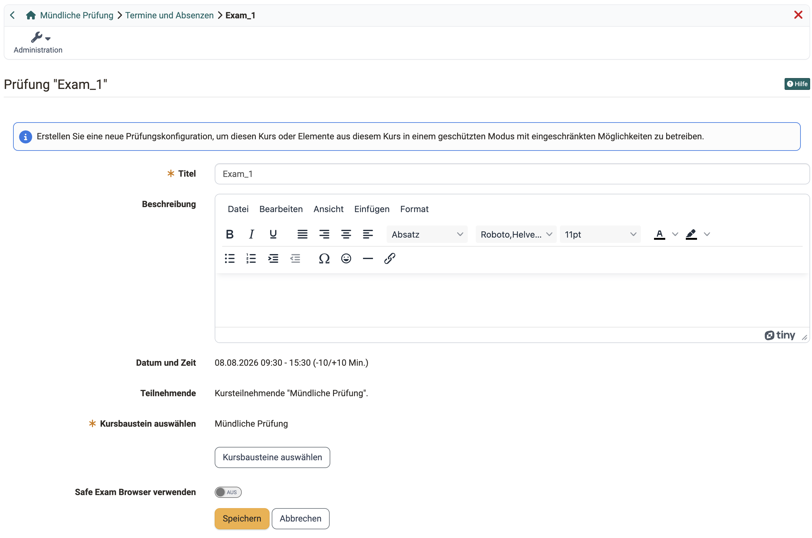{ class="shadow lightbox" title="Dialog Prüfung zu einem Termin · 2026.10.02" }

- **Titel** und **Beschreibung**: Der Titel ist ein Pflichtfeld.
- **Datum und Zeit**: übernommen aus dem Termin. In Klammern stehen Vorlaufzeit und Nachlaufzeit in Minuten, zum Beispiel "(-10/+10 Min.)". Sie kommen aus den Vorgabewerten des Kurses oder der System-Administration.
- **Teilnehmende**: übernommen aus dem Termin.
- **Kursbaustein auswählen**: Pflichtfeld. Mit "Kursbausteine auswählen" legen Sie fest, auf welche Kursbausteine die Teilnehmenden während der Prüfung zugreifen.
- **Safe Exam Browser verwenden**: schaltet den Safe Exam Browser für diese Prüfung ein.
- **Zulässige IP-Adressen**: erscheint, wenn die Vorgabewerte erlaubte IP-Adressen enthalten, und ist nicht änderbar.

Nach dem Einschalten von "Safe Exam Browser verwenden" zeigt der Dialog keine Auswahl "SEB-Konfiguration". Die Art legt die System-Administration mit der Einstellung ["Safe Exam Browser - Art der Benutzung"](../../manual_admin/administration/Modules_Events_and_Absences.de.md#seb_type_of_use) für alle Prüfungen aus Terminen fest:

- **Aus Vorlage (empfohlen)**: Im Feld "Konfiguration" wählen Sie eine der aktiven Vorlagen, die als Standard markierte ist vorausgewählt. "Bereitgestellte Konfiguration anzeigen" zeigt die Einstellungen der gewählten Vorlage. Ob Teilnehmende die Konfigurationsdatei herunterladen können, legt die System-Administration fest.
- **Mit manuellen Keys**: Das Feld "Safe Exam Browser Keys" zeigt die Keys aus den Vorgabewerten des Kurses oder der System-Administration. Im Dialog sind sie nicht änderbar.

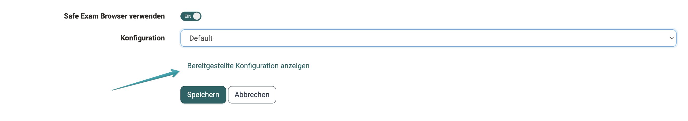{ class="shadow lightbox" title="Dialog Prüfung zu einem Termin · 2026.10.02" }

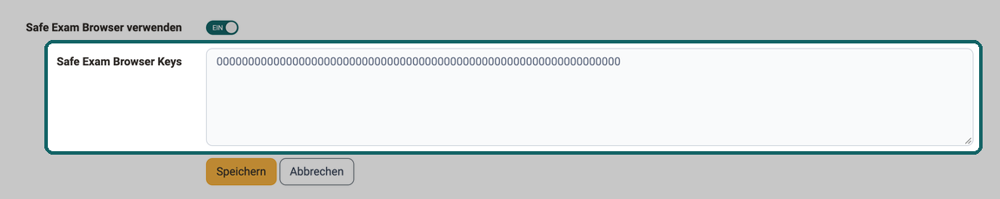{ class="shadow lightbox" title="Dialog Prüfung zu einem Termin · 2026.10.02" }

Eine Prüfung aus einem Termin erscheint auch in der Prüfungsverwaltung des Kurses und öffnet dort denselben Dialog. Direkt in der Prüfungsverwaltung angelegte Prüfungsmodi wählen die Art dagegen pro Prüfung im Feld "SEB-Konfiguration", siehe [Tab "Safe Exam Browser"](#tab-safe-exam-browser).

---

## Prüfung durchführen

Teilnehmende, die einer Prüfung zugeteilt wurden, werden zu Beginn der Prüfung bzw. zu Beginn der Vorlaufzeit über den Start der Prüfung informiert. Sollte OpenOlat durch eine Nachlaufzeit am Ende der Prüfung noch gesperrt sein, werden sie ebenfalls darüber informiert.

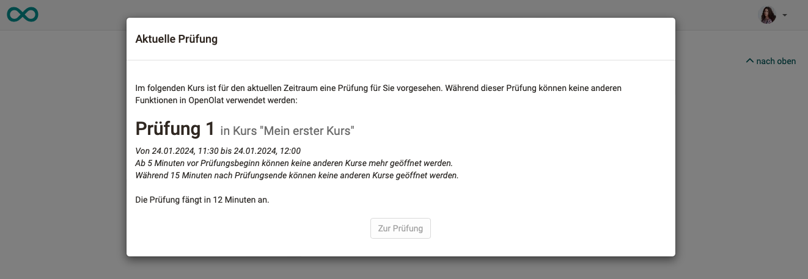{ class="shadow lightbox" title="Benachrichtigung für Teilnehmende" }

Wurde von dem/der Kursbesitzer:in ein manueller Start vorgesehen, finden Betreuer:innen auf der Übersichtsseite des [Bewertungswerkzeugs](Assessment_tool_overview.de.md) einen Start- und Ende-Button bei der entsprechenden Prüfungskonfiguration. Damit kann der Prüfungsmodus manuell eingeschaltet werden. Der Start-Button wird für Betreuer:innen erst sichtbar, sobald der vorkonfigurierte Zeitraum für diese Prüfung erreicht wurde.

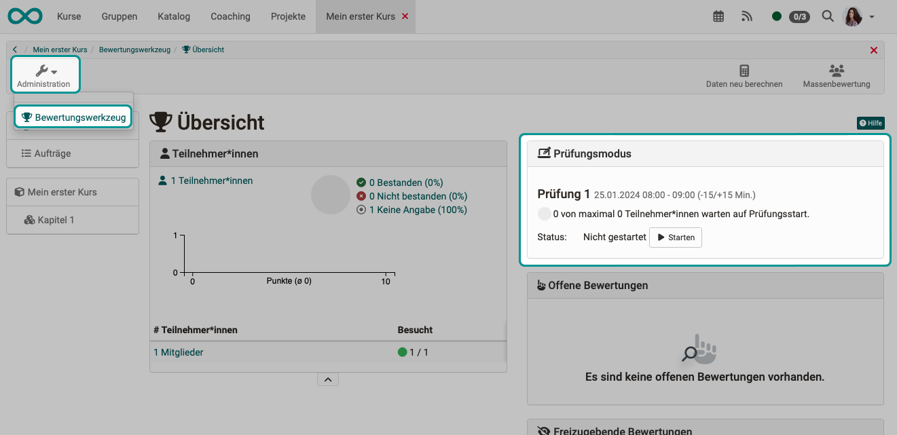{ class="shadow lightbox" title="Übersicht des Bewertungswerkzeugs" }

Wird der Prüfungsmodus manuell durch Betreuer:innen gestartet, so bleibt die Vorlaufzeit unverändert (wie in der Konfiguration vorgesehen), auch wenn der Button zum Start der Prüfung später als geplant geklickt wird.

Wird manuell die Prüfung verspätet gestartet, dann verschiebt sich das Prüfungsende nach hinten. Die vorkonfigurierte **Prüfungsdauer** bleibt also gleich.

Ein laufender Prüfungsmodus kann von den Betreuer:innen im Bewertungswerkzeug verfolgt werden.

Bewertungen, z.B. für Einsendeaufgaben oder Freitextfragen von Tests, können auch direkt bewertet und für die Teilnehmenden freigeschaltet bzw. sichtbar gemacht werden. So wird direkt eine Prüfungseinsicht und -besprechung ermöglicht.

---

## Prüfung beenden

Ein laufender Prüfungsmodus kann generell automatisch oder manuell beendet werden.

Bei manuellem Modus können Betreuer:innen und Kursbesitzer:innen die Prüfung im **Bewertungswerkzeug** beenden.

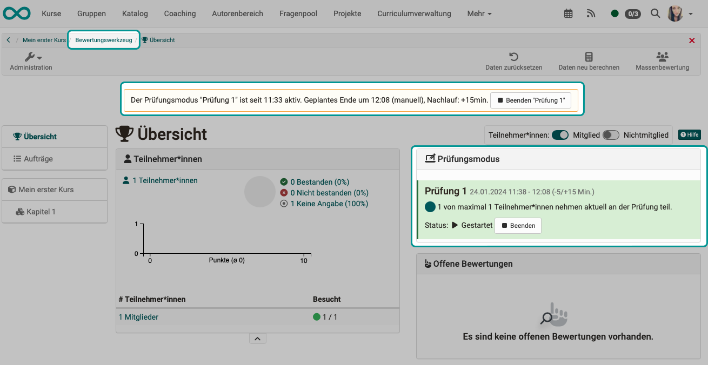{ class="shadow lightbox" title="Übersicht des Bewertungswerkzeugs" }

Der Prüfungsmodus wird auch beendet, wenn der entsprechende Kurs beendet oder gelöscht wird.

## Weiterführende Informationen {: #further_information}

**Auf dieser Seite erwähnt** 
[Safe Exam Browser >](http://www.safeexambrowser.org) 
[Wie bereite ich eine Online-Prüfung vor? >](../../manual_how-to/exam_preparation/exam_preparation.de.md) 
[Wie bereite ich eine Prüfung mit dem Safe Exam Browser (SEB) vor? >](../../manual_how-to/SEB/SEB.de.md) 
[Toolbar: Termine >](../learningresources/Toolbar_Events.de.md) 
[Modul Termine und Absenzen >](../../manual_admin/administration/Modules_Events_and_Absences.de.md) 
[Bewertungswerkzeug - Übersicht >](Assessment_tool_overview.de.md)

**Weiterführend** 
[Prüfungsverwaltung: Prüfungseinsicht >](Assessment_inspection.de.md) 
[Test Einstellungen - Administration >](Test_settings.de.md)

[Zum Seitenanfang ^](#Assessment_mode)
