# Assessment management: Assessment mode {: #Assessment_mode}

!!! note "Note"

    You find the configuration of the assessment mode in the assessment management of the course: `Course > Administration > Assessment management > Tab "Configuration assessment mode"`.

## What is meant by "Assessment mode"? [:octicons-tag-16:{ title="from Release 10.2 (OO-1349)" }](https://track.frentix.com/issue/OO-1349)

An assessment mode is an **assessment configuration** in which tests and assessments are carried out in **protected mode** (so-called kiosk mode) during a specified time.

During this time, access is only permitted to previously defined course elements in the affected course. All other functions in OpenOlat, such as other courses, groups, notes, etc., are hidden during the duration of the assessment mode. Only a logout is possible during the test.

---

## Create configuration

You **create** the configuration of an assessment mode by selecting

1. Select your **course** with the test it contains,
2. select the option **"Assessment management"** in **"Administration"**,
3. and select the **"Configuration assessment mode"** tab.
4. Click on the **"Add assessment mode"** button.

For an event of the course, the assessment mode is created in the event list instead: [Assessment mode from an event](#exam_from_event)

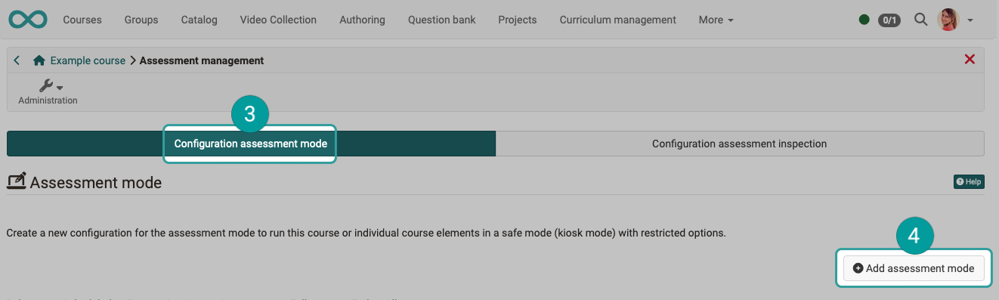{ class="shadow lightbox" title="Assessment management page of a course" }

On the overview page, you can see all examinations that have already been held, are in progress or are planned for a course. The mode of scheduled exams can still be edited up until the exam, but it is not possible to edit them retrospectively. The overview contains information on date and duration, lead and lag times and user groups.

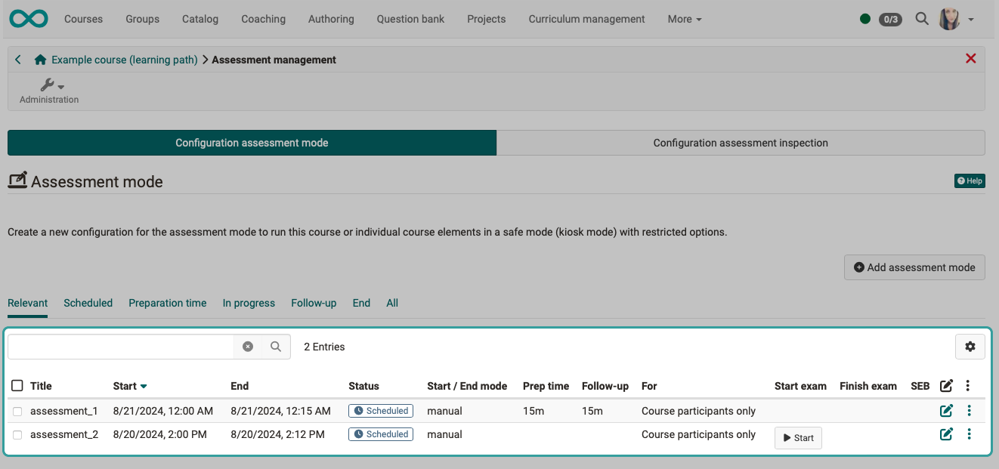{ class="shadow lightbox" title="Tab Configuration assessment mode" }

Test configurations are created in advance and contain

* A start and end date
* Possible prep and follow-up times (if desired)
* Possible restrictions to specific user groups.

One assessment mode may apply

* only for the participants of the course,
* only for the participants of selected groups,
* only for the participants of selected products of the Course Planner, if the Course Planner module is enabled,
* or for the participants of the course and of the selected groups or products.

This makes it possible to hold differently configured exams for different user groups of the same course at the same time.

In addition to the user group, you can specify whether and to which course elements access should be restricted and whether one course element should be used as the start element. 
Furthermore, access to the exam can be restricted to specific IP addresses or the use of the [Safe Exam Browser](http://www.safeexambrowser.org) can be required.

!!! tip "Tip"

    A conventional course is preferably recommended for the assessment mode. If you use a learning path course, you must ensure that the relevant course elements are accessible.

    In conventional courses, you also have the option of selecting the option **"Only in assessment mode"** under the "Visibility" and "Access" tabs when editing a course element. This option is not available in learning path courses.

!!! info "Set Pre- and Post-Exam Time to 0"

    When creating a new exam mode, the pre- and post-exam times are preset to 10 minutes each. Both fields are mandatory. This default value can be freely overridden for each exam mode: including to **0**, if OpenOlat is not to be locked before or after the exam. A global default value cannot be configured; therefore, the value 0 must be entered individually in each exam configuration.

---

## Tab "General"

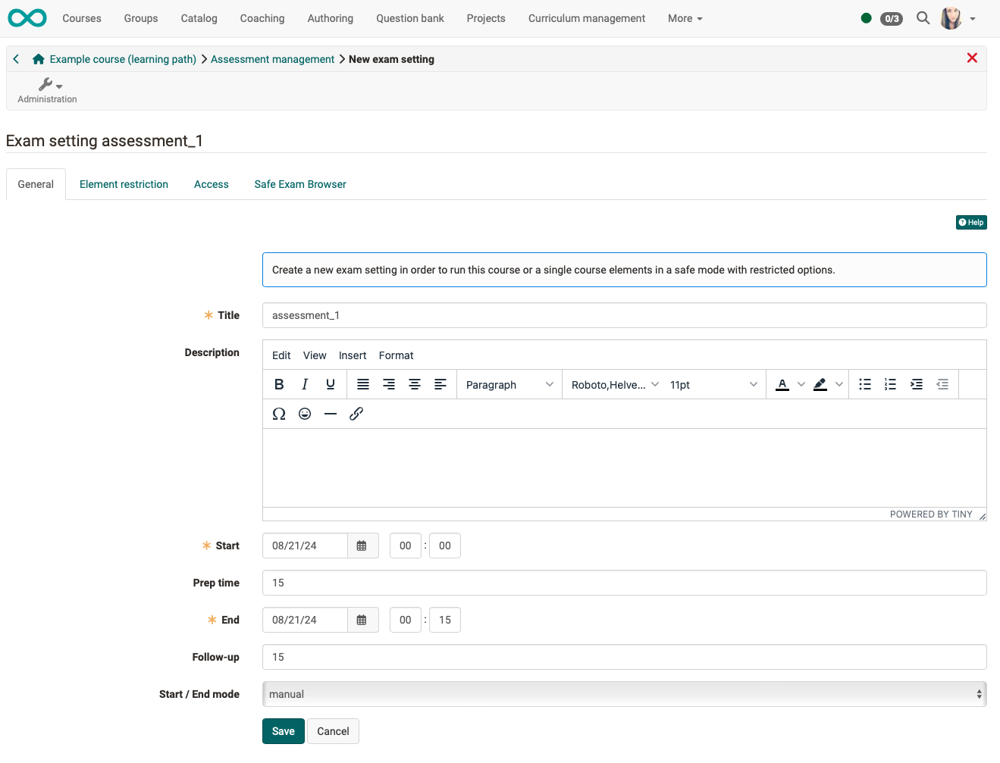{ class="shadow lightbox" title="Dialog of a new exam" }

In addition to the title and description displayed to the participants in the exam notification, the following parameters can be configured in detail:

**Start**: Specify the date and time for the start of the test here. 

The **prep time**, which you specify in minutes, locks OpenOlat for the specified duration before the exam starts.

**End**: The time at which the check is completed. 

If a **follow-up time** is specified in minutes, OpenOlat remains locked for this duration after the check.

Prep time and follow-up time control how long OpenOlat is locked, not how long the test lasts. How assessment mode, test period, time limit and extension work together is shown in [How do the times of an exam fit together?](../../manual_how-to/exam_preparation/exam_preparation.md#exam_times)

**Start / End mode**: You can choose between automatic and manual start/end. If you as the author set "Manual" here, coaches will find a start and end button on the overview page of the assessment tool for the corresponding assessment configuration, which they can use to switch on the assessment mode manually.

---

## Tab "Element restriction"

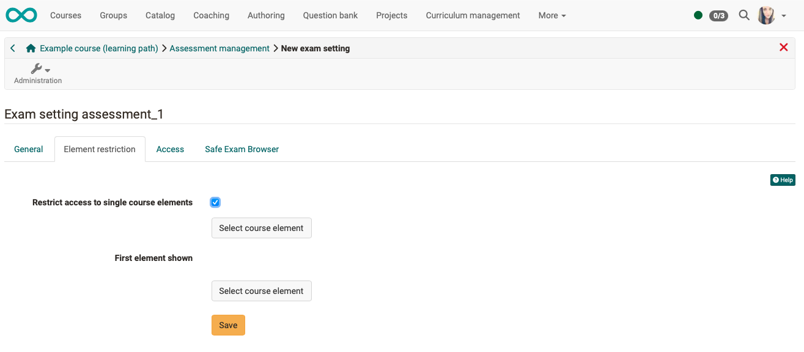{ class="shadow lightbox" title="Dialog of an exam" }

**Restrict access to course element**: To restrict the check to selected course elements of the relevant course, select the checkbox here and then click on the "Select course element" button. A list of all course elements of the course opens - select the course elements that you want to be displayed to the participants during the exam. All other course elements are hidden for the duration of the exam.

**Start module**: If you want a specific course element to be displayed to the participants directly at the start, use the "Select course element" button. Select one of the available course elements. Only the course elements that were selected for display in the previous step are displayed.

---

## Tab "Access"

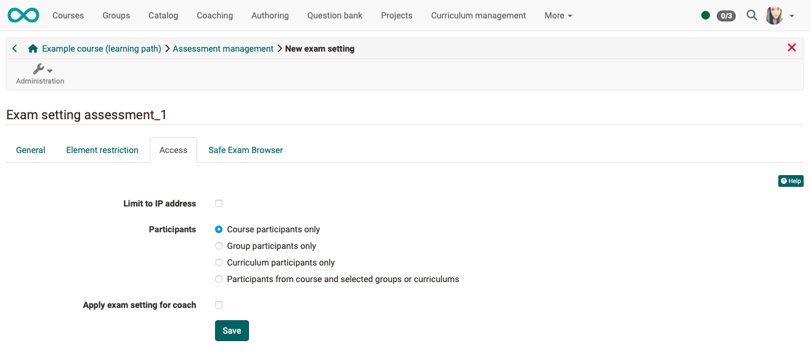{ class="shadow lightbox" title="Tab Access in the exam dialog" }

**Limit to IP address**: To only allow the check to be carried out on certain computers or locations, select the checkbox here and then enter the permitted IP addresses. You should be able to obtain these from your IT department. For example, you can use it to prevent participants from taking an exam from home.

**Participants**: Here you define for which participants the check is valid. Select from the following options:

* "Course participants only"
* "Group participants only"
* "CPL participants only", if the Course Planner module is enabled
* "Participants of courses and selected groups", with the Course Planner enabled "Participants from course and selected groups or products"

As soon as an option with groups has been selected, you must always select the relevant groups using the "Select groups" or "Select learning areas" buttons. If the exam applies to participants of the Course Planner, select the products with the "Select product" button.

**Apply exam setting for coaches**:
If this option is selected, the assessment mode also applies to coaches. This means that other functions are blocked (kiosk mode).

!!! note "Note"

    Course owners can continue to access their course as normal during the exam.

---

## Tab "Safe Exam Browser" [:octicons-tag-16:{ title="from Release 20.3 (OO-9159)" }](https://track.frentix.com/issue/OO-9159) {: #tab-safe-exam-browser}

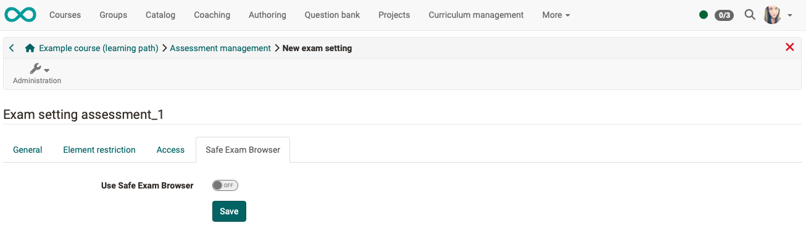{ class="shadow lightbox" title="Tab Safe Exam Browser in the exam dialog" }

**Use Safe Exam Browser**: The use of the [Safe Exam Browser](http://www.safeexambrowser.org) allows the secure execution of online exams by putting the computer into the so-called kiosk mode. This prevents the use of unauthorized sources during an exam. Participants are notified that the SEB is a prerequisite for the exam. The exam can only be carried out once OpenOlat has been started in the Safe Exam Browser.

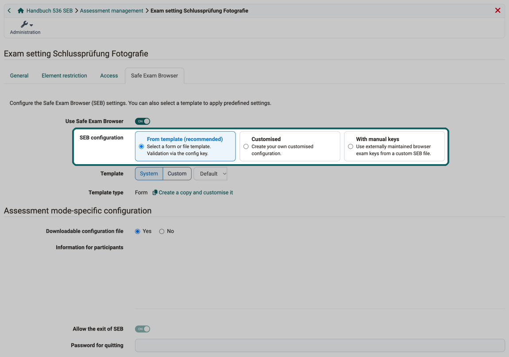{ class="shadow lightbox" title="Tab Safe Exam Browser in the exam dialog · 2026.10.02" }

**SEB configuration** [:octicons-tag-16:{ title="from Release 20.3.10 / 21.0.4 (OO-9730)" }](https://track.frentix.com/issue/OO-9730): Define where the Safe Exam Browser takes its settings for this exam from. Three types are available:

- **From template (recommended)**: The settings come from a template. OpenOlat checks the validity via the config key.
- **Customised**: You create your own configuration for this exam. It is prefilled with the values of the default template if this is a form template.
- **With manual keys**: You use your own SEB-File that is maintained outside of OpenOlat and enter its Safe Exam Browser Keys in the field "Safe Exam Browser Keys".

The choice only applies to this exam. The setting "Safe Exam Browser - Type of use" of the system administration does not affect it, but only exams from events: [Assessment mode from an event](#exam_from_event)

**Template**: Appears with "From template (recommended)". With the two buttons you choose the source of the template:

- **System**: Select one of the active configuration templates provided by the administration from the dropdown. The template marked as default is preselected. If a saved template is subsequently deactivated, it remains selected until another template is chosen.
- **Custom**: Upload your own SEB-File with "Upload". OpenOlat reads the settings from the file, calculates the config key and displays the settings read-only. The file must not be encrypted.

**Template type**: Shows whether the template is a "Form" or a "SEB-File". For a form, the button "Create a copy and customise it" appears next to it: it takes the values of the template into a "Customised" configuration that you can change for this exam.

**Information for authors**: If the selected template contains a note for authors, it is displayed here.

Under the legend **Assessment mode-specific configuration** you find the settings that apply to this specific exam:

**Downloadable configuration file**: Defines whether participants can download the SEB configuration file for this exam. The field appears with "From template (recommended)" and "Customised".

**Information for participants**: A text that is displayed to the participants together with the SEB configuration.

**Allow the exit of SEB**: Allows exam participants to quit the Safe Exam Browser after submitting the exam. The switch only changes this setting, the other values of the exam remain unchanged. [:octicons-tag-16:{ title="from Release 20.3.9 / 21.0.3 (OO-9740)" }](https://track.frentix.com/issue/OO-9740)

**Password for quitting**: Appears if "Allow the exit of SEB" is switched on. With this password, participants quit the Safe Exam Browser. For a SEB-File, from the system or uploaded, the password overwrites the password of the file for this specific exam. The note "Overwrites the template's password. The config key is automatically recalculated." then appears below the field. With "Customised", the password belongs to your own configuration, and the note does not appear. [:octicons-tag-16:{ title="from Release 20.3.9 / 21.0.3 (OO-9743)" }](https://track.frentix.com/issue/OO-9743)

Which value applies depends on the template. With a form from the system, the exam takes "Information for participants", "Allow the exit of SEB" and the password from the template; the fields cannot be changed then, only "Downloadable configuration file" is set per exam. With a SEB-File and with "Customised", the exam saves its own values. If you reopen the exam or switch tabs, the fields show the saved values of the exam. If you select another template, the fields take over its values. [:octicons-tag-16:{ title="from Release 20.3.9 / 21.0.3 (OO-9741)" }](https://track.frentix.com/issue/OO-9741)

With "With manual keys", the legend only shows "Information for participants". Below it, the mandatory field "Safe Exam Browser Keys" appears.

Under the legend **Configuration from the template**, a form and "Customised" show the detailed settings of the Safe Exam Browser, below them the "Config-Key of the saved configuration". They can only be changed with "Customised". For a SEB-File, the legend **Configuration from the SEB-File template** shows the settings of the file read-only instead.

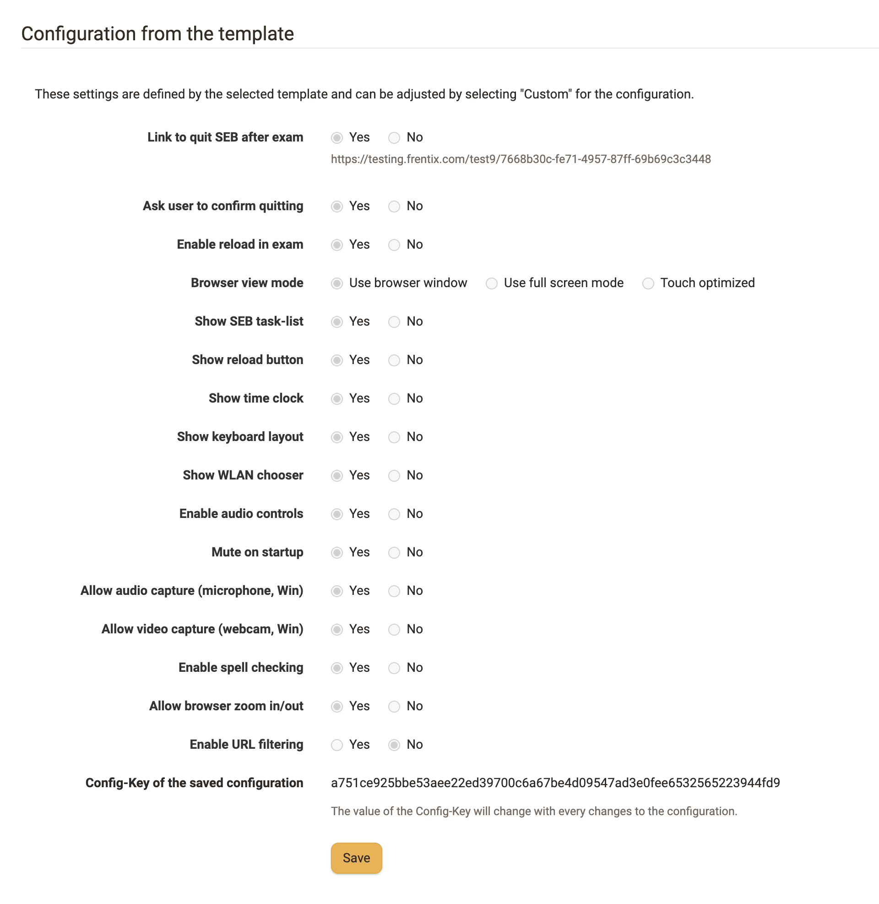{ class="shadow lightbox" title="Legend Configuration from the template" }

!!! tip "Prerequisite"
    The template selection "System" is only available if at least one active template has been created in the System Administration under `Administration > e-Assessment > Assessment management > Tab "Safe Exam Browser configuration"`.

!!! note "Further information"
    [Configure Safe Exam Browser (SEB) >](../../manual_how-to/SEB/SEB.md)

---

## Assessment mode from an event [:octicons-tag-16:{ title="from Release 14.0 (OO-4045)" }](https://track.frentix.com/issue/OO-4045) {: #exam_from_event}

Anyone who runs events in the course turns an event directly into an exam, without creating an assessment mode from scratch. If coaches or course owners choose "Mark as exam" in the 3-dot menu of an event, OpenOlat creates an assessment mode and opens the dialog "Exam setting". The page on the toolbar describes who receives the entry and why it can be missing: [Mark an event as an exam](../learningresources/Toolbar_Events.md#mark_event_as_exam)

The dialog is shorter than that of a directly created assessment mode and has no tabs:

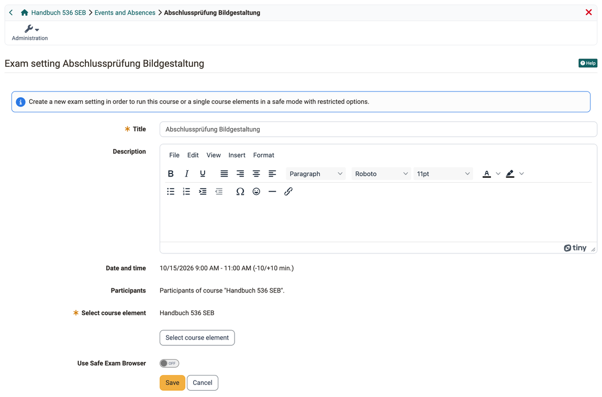{ class="shadow lightbox" title="Dialog Exam setting for an event · 2026.10.02" }

- **Title** and **Description**: The title is a mandatory field.
- **Date and time**: taken from the event. The prep time and follow-up in minutes are shown in brackets, for example "(-10/+10 Min.)". They come from the default values of the course or of the system administration.
- **Participants**: taken from the event.
- **Select course element**: Mandatory field. With "Select course element" you define which course elements the participants access during the exam.
- **Use Safe Exam Browser**: switches on the Safe Exam Browser for this exam.
- **Admissible IP addresses**: appears if the default values contain admissible IP addresses, and cannot be changed.

After switching on "Use Safe Exam Browser", the dialog shows no choice "SEB configuration". The system administration defines the type with the setting ["Safe Exam Browser - Type of use"](../../manual_admin/administration/Modules_Events_and_Absences.md#seb_type_of_use) for all exams from events:

- **From template (recommended)**: In the field "Configuration" you select one of the active templates, the one marked as default is preselected. "Show the provided configuration" shows the settings of the selected template. The system administration defines whether participants can download the configuration file.
- **With manual keys**: The field "Safe Exam Browser Keys" shows the keys from the default values of the course or of the system administration. They cannot be changed in the dialog.

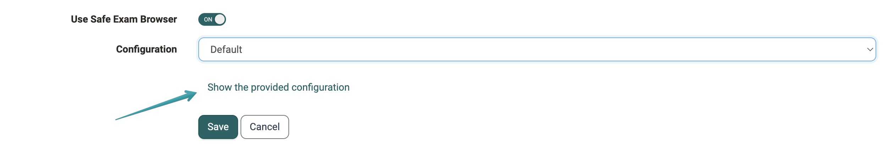{ class="shadow lightbox" title="Dialog Exam setting for an event · 2026.10.02" }

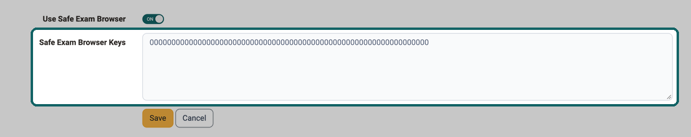{ class="shadow lightbox" title="Dialog Exam setting for an event · 2026.10.02" }

An exam from an event also appears in the assessment management of the course and opens the same dialog there. Assessment modes created directly in the assessment management, in contrast, choose the type per exam in the field "SEB configuration", see [Tab "Safe Exam Browser"](#tab-safe-exam-browser).

---

## Perform Exam

Participants who have been assigned to an exam are informed about the start of the exam at the beginning of the exam or at the beginning of the lead time. If OpenOlat is still blocked at the end of the check due to a follow-up time, they are also informed of this.

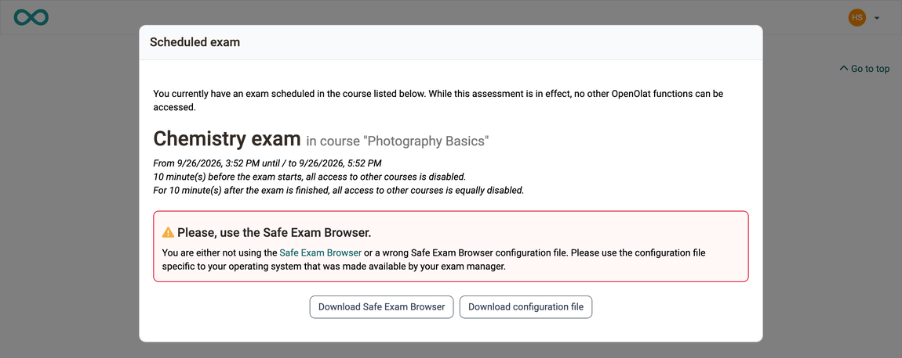{ class="shadow lightbox" title="Notification for participants" }

If the course owner has provided a manual start, coaches will find a start and end button for the corresponding exam configuration on the overview page of the [assessment tool](Assessment_tool_overview.md). This allows the assessment mode to be switched on manually. The start button only becomes visible to coaches once the preconfigured time window for this exam has been reached.

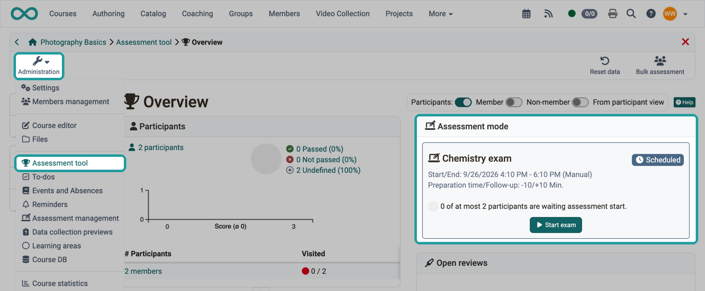{ class="shadow lightbox" title="Overview of the assessment tool" }

If the assessment mode is started manually by coaches, the lead time remains unchanged (as provided for in the configuration), even if the button to start the assessment is clicked later than planned.

If the test is started late manually, the end of the test is postponed. The preconfigured **exam duration** therefore remains the same.

An ongoing assessment mode can be tracked by the coaches in the assessment tool.

Evaluations, e.g. for submission tasks or essay questions of tests, can also be evaluated directly and activated or made visible for the participants. This enables direct assessment and discussion.

---

## End Exam

A running assessment mode can generally be ended automatically or manually.

In manual mode, coaches and course owners can complete the assessment in the **assessment tool**.

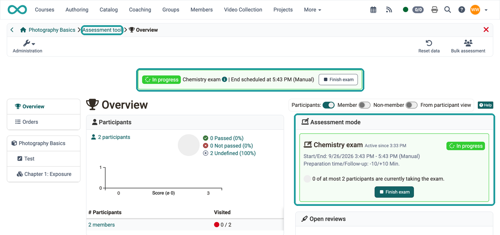{ class="shadow lightbox" title="Overview of the assessment tool" }

The assessment mode is also ended when the corresponding course is ended or deleted.

## Further information {: #further_information}

**Mentioned on this page** 
[Safe Exam Browser >](http://www.safeexambrowser.org) 
[How do I prepare an online exam? >](../../manual_how-to/exam_preparation/exam_preparation.md) 
[How do I prepare an exam with the Safe Exam Browser (SEB)? >](../../manual_how-to/SEB/SEB.md) 
[Toolbar: Events >](../learningresources/Toolbar_Events.md) 
[Module Events and Absences >](../../manual_admin/administration/Modules_Events_and_Absences.md) 
[Assessment tool - overview >](Assessment_tool_overview.md)

**Further reading** 
[Assessment management: assessment inspection >](Assessment_inspection.md) 
[Test settings - Administration >](Test_settings.md)

[To the top of the page ^](#Assessment_mode)

