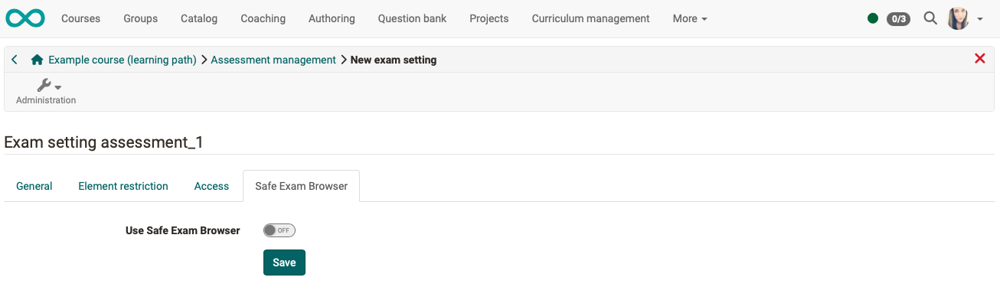

# Assessment management: Assessment mode {: #Assessment_mode}

!!! note "Note"

    Before version 18.2, the configuration of the exam mode was a separate menu option in the course administration.

## What is meant by "Assessment mode"?

An assessment mode is an **assessment configuration** in which tests and assessments are carried out in **protected mode** (so-called kiosk mode) during a specified time.

During this time, access is only permitted to previously defined course elements in the affected course. All other functions in OpenOlat, such as other courses, groups, notes, etc., are hidden during the duration of the assessment mode. Only a logout is possible during the test.

## Create configuration

You **create** the configuration of an assessment mode by selecting

1. Select your **course** with the test it contains,
2. select the option **"Assessment management"** in **"Administration"**,
3. and select the **"Configuration assessment mode"** tab.
4. Click on the **"Add assessment mode"** button.

{ class="shadow lightbox" }

On the overview page, you can see all examinations that have already been held, are in progress or are planned for a course. The mode of scheduled exams can still be edited up until the exam, but it is not possible to edit them retrospectively. The overview contains information on date and duration, lead and lag times and user groups.

{ class="shadow lightbox" }

Test configurations are created in advance and contain

* A start and end date
* Possible prep and follow-up times (if desired)
* Possible restrictions to specific user groups.

One assessment mode may apply

* for course participants only,
* only for group participants of selected groups
* for both.

This makes it possible to hold differently configured exams for different user groups of the same course at the same time.

In addition to the user group, you can specify whether and to which course elements access should be restricted and whether one course element should be used as the start element. 
Furthermore, access to the exam can be restricted to specific IP addresses or the use of the [Safe Exam Browser](http://www.safeexambrowser.org) can be required.

!!! note "Note"

    A conventional course is preferably recommended for the assessment mode. If you use a learning path course, you must ensure that the relevant course elements are accessible.

    In conventional courses, you also have the option of selecting the option **"Only in assessment mode"** under the "Visibility" and "Access" tabs when editing a course element. This option is not available in learning path courses.

## Tab "General"

{ class="shadow lightbox" }

In addition to the title and description displayed to the user in the exam notification, the following parameters can be configured in detail:

**Start**: Specify the date and time for the start of the test here. 

The **prep time**, which you specify in minutes, locks OpenOlat for the specified duration before the exam starts.

**End**: The time at which the check is completed. 

If a **follow-up time** is specified in minutes, OpenOlat remains locked for this duration after the check.

**Type of start/end**: You can choose between automatic and manual start/end. If you as the author set "manual operation" here, coaches will find a start and end button on the overview page of the assessment tool for the corresponding assessment configuration, which they can use to switch on the assessment mode manually.

## Tab "Element restriction"

{ class="shadow lightbox" }

**Restrict access to course element**: To restrict the check to selected course elements of the relevant course, select the checkbox here and then click on the "Select course elements" button. A list of all course elements of the course opens - select the course elements that you want to be displayed to the participants during the exam. All other course elements are hidden for the duration of the exam.

**Start module**: If you want a specific course element to be displayed to students directly at the start, use the "Select course element" button. Select one of the available course elements. Only the course elements that were selected for display in the previous step are displayed.

## Tab "Access"

{ class="shadow lightbox" }

**Limit to IP address**: To only allow the check to be carried out on certain computers or locations, select the checkbox here and then enter the permitted IP addresses. You should be able to obtain these from your IT department. For example, you can use it to prevent a candidate from taking an exam from home.

**Participants**: Here you define for which users the check is valid. Select from the following options:

* only course participants
* only group participants
* only curriculum participants
* participants of the course and selected group or curriculum

As soon as an option with groups has been selected, you must always select the relevant groups using the "Select groups" or "Select learning area" buttons. If a curriculum is used, this must also be selected.

**Apply exame setting for coaches**:
If this option is selected, the assessment mode also applies to coaches. This means that other functions are blocked (kiosk mode).

!!! note "Note"

    Before version 19.1, course owners were also switched to assessment mode. From version 19.1, course owners can continue to access their course as normal. 

You can also define whether the assessment mode should also be applied to coaches.

## Tab "Safe Exam Browser"

{ class="shadow lightbox" }

**Use Safe Exam Browser**: The use of the [Safe Exam Browser](http://www.safeexambrowser.org) allows the secure execution of online exams by putting the computer into the so-called kiosk mode. This prevents the use of unauthorized sources during an exam. Users are notified that the SEB is a prerequisite for the exam. The exam can only be carried out once OpenOlat has been started in the Safe Exam Browser.

[Go to the details > ](../../manual_how-to/SEB/SEB.md)

 

## Perform Exam

Users who have been assigned to an exam are informed about the start of the exam at the beginning of the exam or at the beginning of the lead time. If OpenOlat is still blocked at the end of the check due to a follow-up time, users are also informed of this.

{ class="shadow lightbox" }

If the course owner has provided a manual start, coaches will find a start and end button for the corresponding assessment tool configuration on the overview page. If the course owner has provided a manual start, coaches will find a start and end button for the corresponding assessment configuration on the overview page of the [assessment tool](Assessment_tool_overview.md). 

{ class="shadow lightbox" }

If the assessment mode is started manually by coaches, the lead time remains unchanged (as provided for in the configuration), even if the button to start the assessment is clicked later than planned.

If the test is started late manually, the end of the test is postponed.  The preconfigured exam **duration** therefore remains the same.

An ongoing assessment mode can be tracked by the coaches in the assessment tool.

Evaluations, e.g. for submission tasks or free text elements of tests, can also be evaluated directly and activated or made visible for the participants. This enables direct assessment and discussion.

 

## End Exam

A running assessment mode can generally be ended automatically or manually.

In manual mode, coaches and course owners can complete the assessment in the **assessment tool**.

{ class="shadow lightbox" }

The assessment mode is also ended when the corresponding course is ended or deleted.

