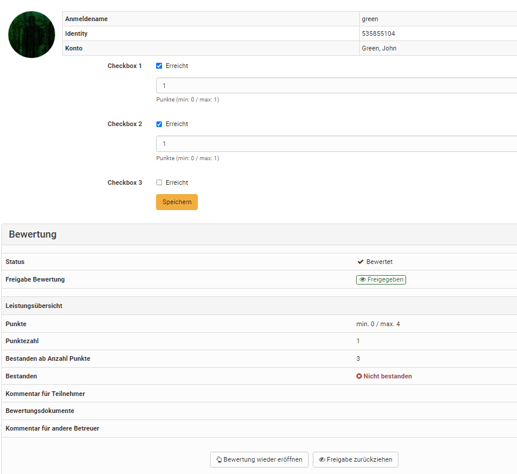
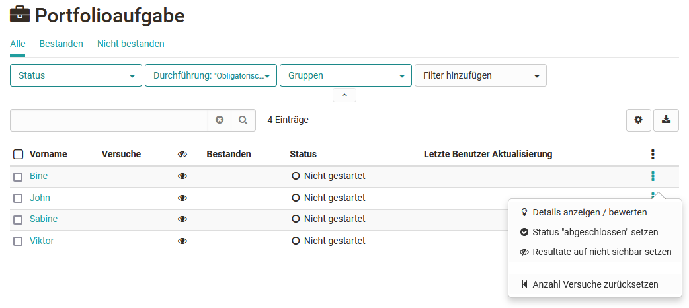
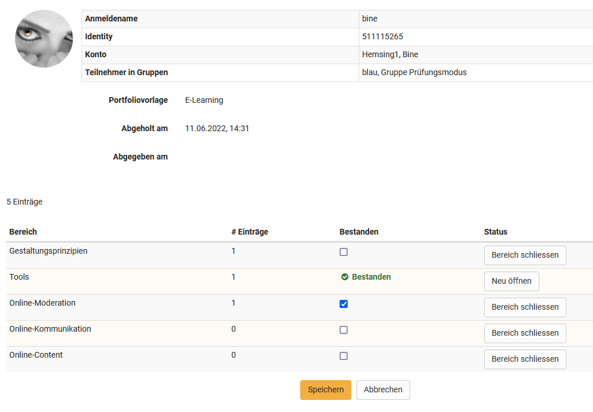

# Assessment of course modules

Here you can find out which options are available to you when evaluating with the different course elements.

In the assessment tool, assessments can be made for the following course elements:

  * Checklist
  * Assessment
  * Portfolio task
  * Course element "Structure" or overall assessment of the course
  * Course element "Participant Folder"
  * Integrated external modules
  * [Task and group task](Assessing_tasks_and_group_tasks.md) 
  * [Tests](Assessing_tests.md)

Here, the general aspects are explained first and then the specifics of the individual assessable course elements with the associated assessment forms are addressed. The evaluation of assignments/group tasks and tests can be found on separate pages. 

## The 3-point menu
{ class="shadow lightbox" }

The gear wheel icon provides key options in the assessment context. These include:

  * **Show details/assess:** To access the respective evaluations or test results.
  
  * **Finalize assessment** or **Reopen assessment:** Depending on the previous status.
  
  * **Release / Withdraw release** This allows learners to see or not see the results.

The following options are additionally available for tests: 

  * **Results as PDF:** for PDF download
   * **Reopen finished test:** The test taker can continue the test where they left off. In addition, if the test is limited to 1 attempt, the attempts must be reset in order for the test taker to continue the test.
  * **Reset number of attempts:** This will set the number of attempts of an assessment module to 0 but the actual data will remain.
  * **Reset data from test:** All data will be deleted.
  * **Add disadvantage compensation:** This way individuals can get additional time to complete a test, e.g. due to a handicap.
   * **Extend test time:** If the test is in "started" status.
  * **Retract running test:** This way the previously completed data will be used for assessment and can be viewed by the teacher.

 !!! note "Note"

    Make sure that the 3-point menu icon is displayed in the table overview. This gives you quick access to specific actions for assessing learners.

## Checklist
The assessment of the course element "Checklist" includes the following options:

{ class="shadow lightbox" }

By clicking on the name of a user, you can get to the specific rating.

The checkboxes of the individual users can be added manually and the assessment form can be filled in. Depending on the course element configuration, either points and/or the attribute "Passed" can be assigned. Further information on the checklist can be found [here](../learningresources/Course_Element_Checklist.md).

{ class="shadow lightbox" }

## Assessment
The assessment of the course element "Assessment" includes the following options:

{ class="shadow lightbox" }

The button "Statistics" is only available when using a rubric assessment.

The button "Adjust rating scale" is only available if a rating scale has been activated for the course element in the course editor. 

By clicking on the name of a user you will get to the concrete assessment. Here you fill in the corresponding assessment form and, if linked, use the assigned rubric assessment form.

{ class="shadow lightbox" }

If you have stored a [rubric](../learningresources/Rubric.md) as the basis for assessment, you can quickly and effectively carry out a criteria-based assessment. Here is an example:

In addition, bulk assessment is also possible for the course element "Assessment".

## Portfolio task
The assessment of the course element "[Portfolio task](../learningresources/Creating_Portfolio_Tasks.md)" includes the following options:

{ class="shadow lightbox" }

The assessment for the portfolio is the same in the assessment tool as in the ["Assessment" tab in the portfolio](../learningresources/Portfolio_assignment_Grading.md) itself. However, the individual areas cannot be opened here, only assessed. It is therefore recommended to perform the assessment directly in the portfolio.

{ class="shadow lightbox" }

## Course element "Structure" or total course assessment

The course element "Structure" also appears in the assessment tool. If points have been activated for the course in general, the total points of the subordinate assessable course elements will be displayed here. However, it is not possible to manually assign points or make assessments here. Instead, the current points status is displayed. 

For learning path courses, the results of all subordinate assessment elements are automatically taken into account. For conventional courses, the course elements to be taken into account can be specifically selected in the course editor in the "Points" tab. The top course element is also a structural element, therefore the points of the entire course are added up here.

!!! note "Hint"

    The display of scores per structure module is always useful if you want to automatically calculate a combination of scores for the entire course or for certain sections.

## Integrated external modules
###  SCORM
For the SCORM element the assessment form can be filled in. It is important that either Score or Transfer Passed is selected in the course element under Learning Content. More information can be found [here](../learningresources/Course_Element_SCORM_Learning_Content.md).

### LTI
The assessment form can also be filled out and customized for the LTI element. In the course element under Page content, it is mandatory that "Transfer points" is selected. Depending on this, a scaling factor must be entered and the passing score defined. Further information on configuring LTI pages can be found [here](../learningresources/Course_Element_LTI_Page.md).