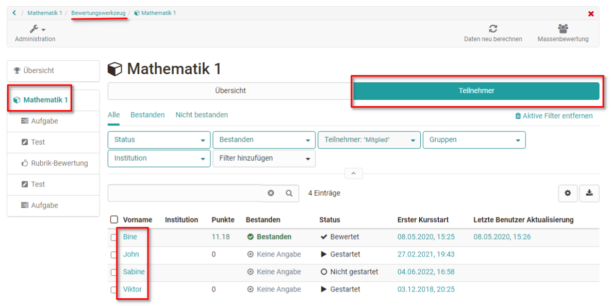
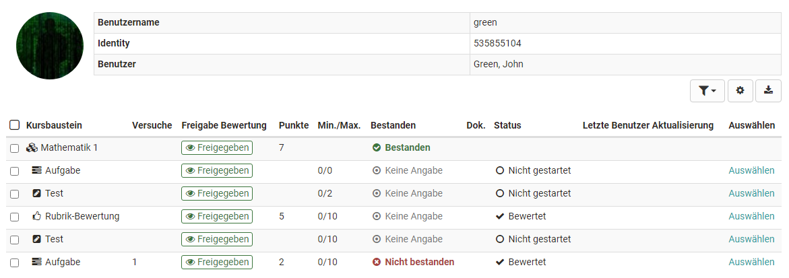
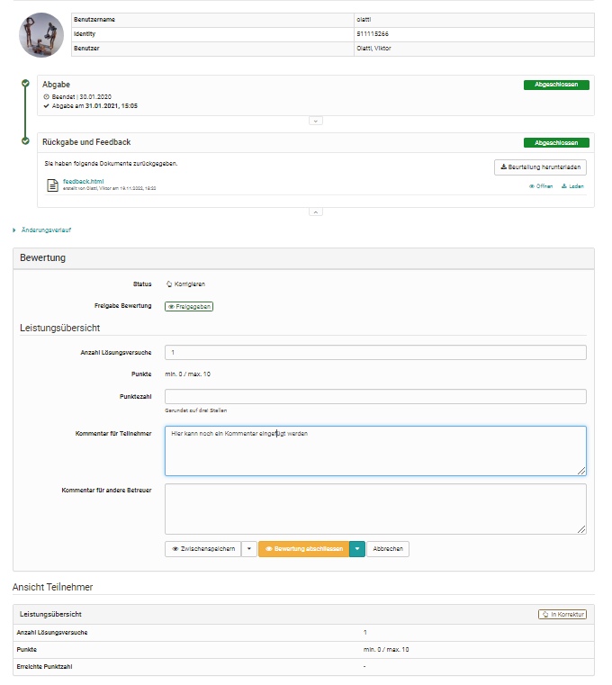
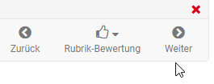
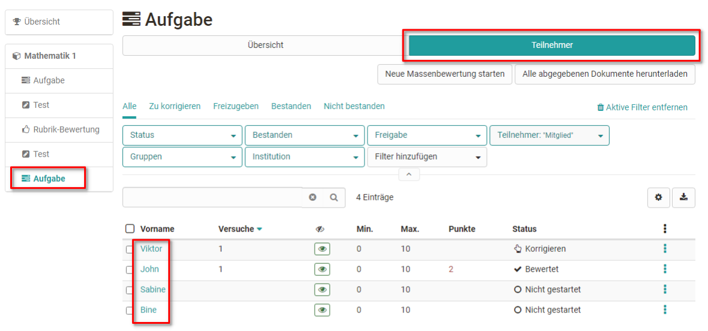

# Lernende bewerten {: #assessment_of_learners}

## So bewerten Sie alle bewertbaren Kursbausteine einer Person {: #assess_all_course_element}

Gehen Sie in das Bewertungswerkzeug und folgen Sie diesen Schritten:

1. Klicken sie in der linken Spalte auf den Namen des Kurses (oberster Kursknoten) und wählen Sie den Tab "Teilnehmer".

    { class="shadow lightbox" }

2. Es erscheint der aktuelle Gesamtbewertungsstand aller Teilnehmenden. Wählen Sie nun die Person aus, die Sie bewerten wollen indem Sie auf den jeweiligen Namen klicken.

3. Nun sieht man den aktuellen Bewertungsstand der gewählten Person für alle bewertbaren Kursbausteine in einer Gesamtübersicht. 

    { class="shadow lightbox" }

    Wählen Sie einen Kursbaustein aus um die Bewertung vorzunehmen. 

4. Sie gelangen zum [Bewertungsformular](The_assessment_form.de.md) des jeweiligen Kursbausteins und können dort alle relevanten Aktionen vornehmen. Die genauen Möglichkeiten sind vom Bausteintyp und den zugehörigen Einstellungen abhängig.

    { class="shadow lightbox" }

5. Über die "Weiter" Pfeile rechts oben können sie bei Bedarf zum nächsten
bewertbaren Kursbaustein für diese Person navigieren.

## So bewerten Sie die Lösungen ausgehend von einem bestimmten Kursbaustein {: #assess_solutions}

1. Wählen Sie in der linken Navigation den gewünschten Kursbaustein aus und klicken Sie auf den Tab "Teilnehmer". 

    { class="shadow lightbox" }

    Es werden wieder alle zu bewertenden Teilnehmenden angezeigt, dieses Mal aber nicht für den gesamten Kurs, sondern nur für den gewählten Kursbaustein. 

2. Klicken Sie auf den Namen der Person, die Sie für den gewählten Kursbaustein bewerten wollen und Sie gelangen zum passenden [Bewertungsformular](The_assessment_form.de.md). 
 { class="shadow lightbox" }
 Die genauen Möglichkeiten sind vom Bausteintyp und den zugehörigen Einstellungen abhängig.

3. Über die Pfeile rechts oben können sie bei Bedarf zur nächsten bewertbaren
Person für diesen Baustein navigieren.

## Massenbewertung {: #bulk_assessment}
Die Kursbausteine ["Aufgabe"](Assessing_tasks_and_group_tasks.de.md) und ["Bewertung"](Assessment_of_course_modules.de.md) bieten auch die Möglichkeit der Massenbewertung.

Wollen Sie alle oder sehr viele Teilnehmende auf einmal bewerten können Sie eine „Neue Massenbewertung starten“. Hierfür erstellen Sie eine Bewertung in einem Tabellenprogramm und fügen die Daten per copy+paste in das Feld der Massenbewertung ein. Weitere Informationen zur Massenbewertung finden Sie im Bereich [How to](../../manual_how-to/bulk_assessment/bulk_assessment.de.md).

## Filtermöglichkeiten {: #filter_options}

Sowohl für den gesamten Kurs als auch für Kursbausteine können auch Filter verwendet werden um eine Übersicht bestimmter Personengruppen zu generieren und diese dann zu bewerten. So können beispielsweise die Mitglieder einer bestimmten Gruppe, alle Personen die den Kurs oder Kursbaustein noch nicht bestanden haben oder nur die Mitglieder einer bestimmten Institution gefiltert angezeigt und dann gezielt bewertet werden.

## Weiterführende Informationen {: #further_information}

**Auf dieser Seite erwähnt** 
[Das Bewertungsformular >](The_assessment_form.de.md) 
[Aufgaben und Gruppenaufgaben bewerten >](Assessing_tasks_and_group_tasks.de.md) 
[Bewertung von Kursbausteinen >](Assessment_of_course_modules.de.md) 
[Wie und wo kann ich eine Massenbewertung vornehmen? >](../../manual_how-to/bulk_assessment/bulk_assessment.de.md)

**Weiterführend** 
[Bewertungswerkzeug - Übersicht >](Assessment_tool_overview.de.md) 
[Bewertungswerkzeug: Tab Teilnehmer:innen >](Assessment_tool_tab_Users.de.md) 
[Tests bewerten >](Assessing_tests.de.md)

[Zum Seitenanfang ^](#assessment_of_learners)
