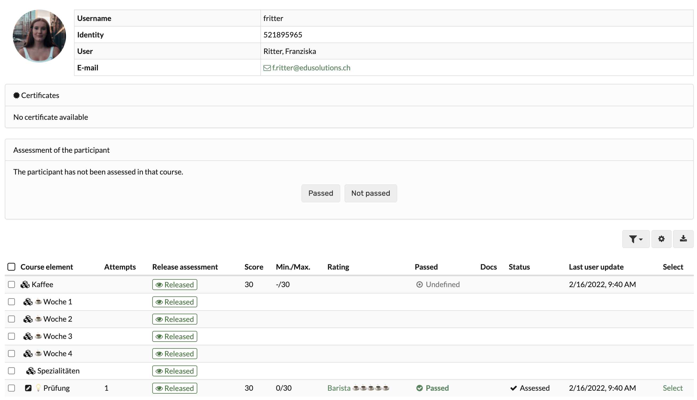
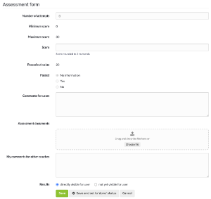
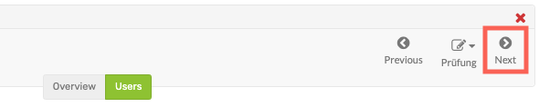
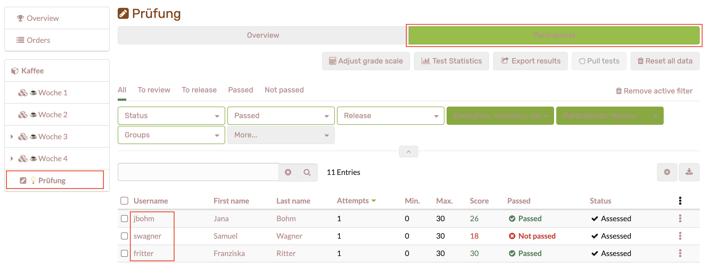
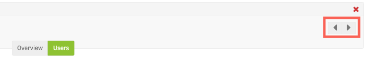

# Assessment of learners

## This is how you assess all assessable course elements of a person

Go to the assessment tool and follow these steps:

1. click on the name of the course in the left column (top course node) and select the tab "Participants".

      
  
2. The current overall evaluation status of all course participants appears. Now select the person you want to rate by clicking on the respective name.
  
3. An overview appears with all assessment elements of the course including the processing status of the person (evidence of achievement). 

  

Select a course element to perform the assessment. 
  
4. You will now be taken to the [assessment form](The_assessment_form.md) of the respective course element. The exact possibilities depend on the course element type and the corresponding settings.

  
  
5. Use the arrows in the upper right corner to navigate to the next assessable course element for this person, if needed.

  
  
## This is how you evaluate the solutions of a particular course element

1. Select the desired course element in the left navigation and click on the tab "Participants". 

    

    All participants to be evaluated will be displayed again, but this time not for the entire course, but only for the selected course element.
  
2. Here you now select the desired individual person by clicking on the respective name. You will now be taken to the [assessment form](The_assessment_form.md) of the respective course element. The exact possibilities depend on the course
element type and the corresponding settings.

  
  
3. Use the arrows in the upper right corner to navigate to the next assessable person for this module, if necessary.

  
  
## Bulk assessment

The course elements ["Task"](Assessing_tasks_and_group_tasks.md) and ["Assessment"](Assessment_of_course_modules.md) also offer the possibility of bulk assessment.

If you want to assess all or many users at once, you can start a "New bulk assessment". To do this, create an assessment in a spreadsheet program and paste the data into the mass assessment field using copy+paste. You can find more information about bulk assessment in the [How to](../../manual_how-to/bulk_assessment/bulk_assessment.md) area.

## Filter options

Filters can be used for the entire course as well as for course elements to generate an overview of specific groups of people and then evaluate them. For example, the members of a certain group, all persons who have not yet passed the course or course element, or only the members of a certain institution can be displayed in a filtered manner and then specifically evaluated.

