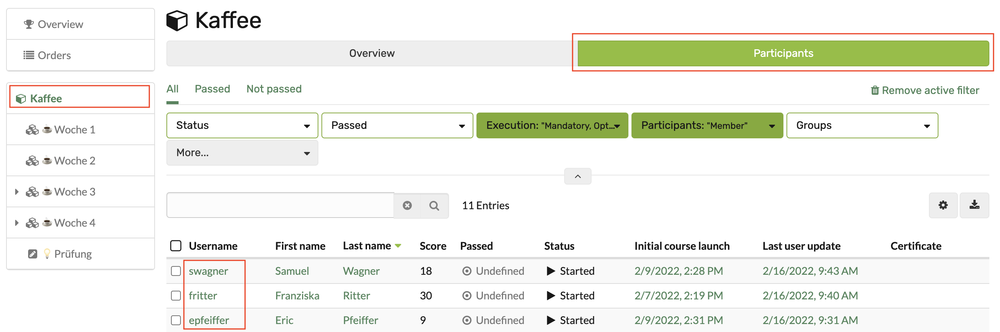
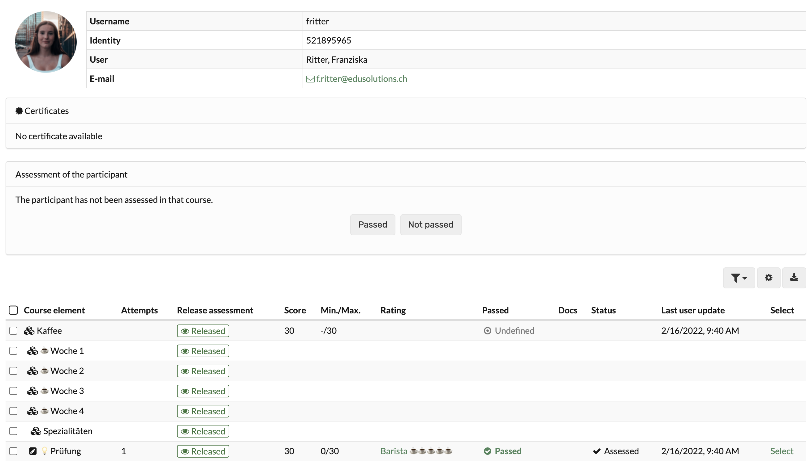
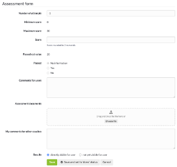
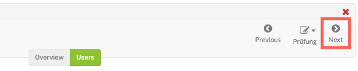
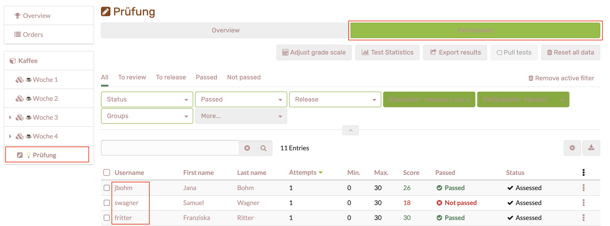

# Assessment of learners {: #assessment_of_learners}

## This is how you assess all assessable course elements of a person {: #assess_all_course_element}

Go to the assessment tool and follow these steps:

1. Click on the name of the course in the left column (top course node) and select the tab "Participants".

    { class="shadow lightbox" }

2. The current overall evaluation status of all participants appears. Now select the person you want to rate by clicking on the respective name.

3. An overview appears with all assessment elements of the course including the processing status of the person (evidence of achievement). 

    { class="shadow lightbox" }

    Select a course element to perform the assessment. 

4. You will now be taken to the [assessment form](The_assessment_form.md) of the respective course element. The exact possibilities depend on the course element type and the corresponding settings.

    { class="shadow lightbox" }

5. Use the arrows in the upper right corner to navigate to the next assessable course element for this person, if needed.

{ class="shadow lightbox" }

## This is how you assess the solutions of a particular course element {: #assess_solutions}

1. Select the desired course element in the left navigation and click on the tab "Participants". 

    { class="shadow lightbox" }

    All participants to be assessed will be displayed again, but this time not for the entire course, but only for the selected course element.

2. Click on the name of the person you want to assess for the selected course element and you will be taken to the matching [assessment form](The_assessment_form.md). 
 { class="shadow lightbox" }
 The exact possibilities depend on the course element type and the corresponding settings.

3. Use the arrows in the top right corner to navigate to the next assessable
person for this element, if needed.

## Bulk assessment {: #bulk_assessment}
The course elements ["Task"](Assessing_tasks_and_group_tasks.md) and ["Assessment"](Assessment_of_course_modules.md) also offer the possibility of bulk assessment.

If you want to assess all or many participants at once, you can start a "New bulk assessment". To do this, create an assessment in a spreadsheet program and paste the data into the bulk assessment field using copy+paste. You can find more information about bulk assessment in the [How to](../../manual_how-to/bulk_assessment/bulk_assessment.md) area.

## Filter options {: #filter_options}

Filters can be used for the entire course as well as for course elements to generate an overview of specific groups of people and then evaluate them. For example, the members of a certain group, all persons who have not yet passed the course or course element, or only the members of a certain institution can be displayed in a filtered manner and then specifically evaluated.

## Further information {: #further_information}

**Mentioned on this page** 
[The assessment form >](The_assessment_form.md) 
[Assessing tasks and group tasks >](Assessing_tasks_and_group_tasks.md) 
[Assessment of course modules >](Assessment_of_course_modules.md) 
[How and where can I do a bulk assessment? >](../../manual_how-to/bulk_assessment/bulk_assessment.md)

**Further** 
[Assessment tool - overview >](Assessment_tool_overview.md) 
[Assessment tool - Tab Users >](Assessment_tool_tab_Users.md) 
[Assessing tests >](Assessing_tests.md)

[To the top of the page ^](#assessment_of_learners)
