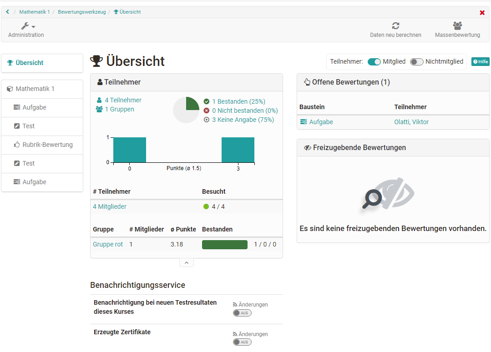
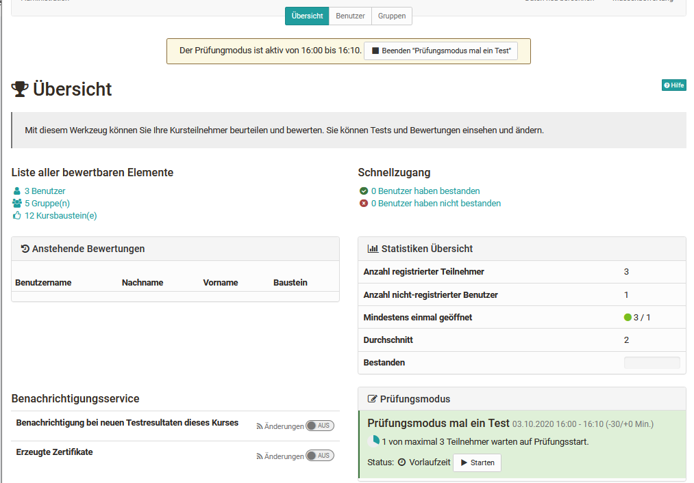
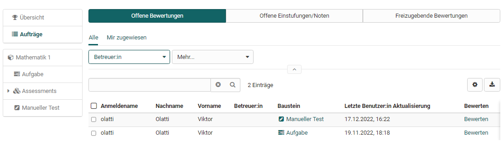
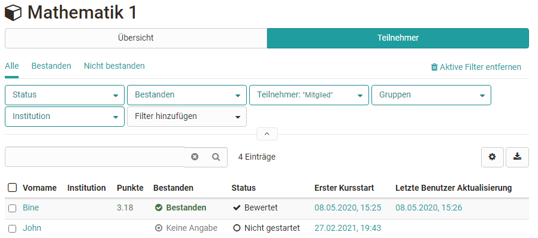

# Bewertungswerkzeug - Übersicht

Das Bewertungswerkzeug ist die zentrale Schaltstelle für die Bewertungen eines
OpenOlat-Kurses. Kursbesitzer und Betreuer erhalten hier einen Gesamtüberblick
über sämtliche im Kurs enthaltenen bewertbaren Bausteine und können die
Bewertungen vornehmen.

Über die Kursadministration gelangt man in das Bewertungswerkzeug. Wenn Sie
das Bewertungswerkzeug aufrufen, erscheint zunächst die Übersichtsseite mit
zentralen Informationen sowie eine Übersicht der aktuell anstehenden
Bewertungen. So wissen Sie schnell, was aktuell zu tun ist. Von der Übersichtsseite aus gelangen Sie auch zu den konkreten Bewertungsbereichen der einzelnen Kursbausteinen und Personen.

Schauen wir uns die einzelnen Bereiche der Übersicht genauer an:

## Der generelle Bereich „Übersicht“ des Bewertungswerkzeugs

### Übersicht -> "Offene Bewertungen"

Auf einen Blick ist hier ersichtlich, für welche Nutzer eine oder mehrere
Bewertung(en) offen sind. Auch wird angezeigt, wie viele Bausteine des
jeweiligen Benutzers zu bewerten sind. Sofern nur ein Baustein bewertet werden
muss, wird dieser direkt aufgelistet. Mit einem Klick auf diesen Baustein
kommt man zur entsprechenden Bewertung.

In der Übersicht werden nur die unerledigten Bewertungen angezeigt. Bereits durchgeführte Bewertungen werden an dieser Stelle nicht aufgelistet.

### Übersicht -> "Freizugebende Bewertungen"

Sollte es im Kurs Bewertungen geben die noch nicht für die Teilnehmenden sichtbar gemacht wurden, erscheinen sie hier.

### Übersicht -> "Teilnehmer"

In diesem Bereich wird angezeigt, wie viele Benutzer, Gruppen und Kursbausteine generell im konkreten Kurs vorhanden sind.

Wurde für den gesamten Kurs ein "Bestehen" konfiguriert, wird die Anzahl der jeweiligen Kursmitglieder angezeigt, die den Kurs bestanden bzw. nicht bestanden haben.

Durch die Verlinkung können Betreuer schnell zu den
entsprechenden Teilnehmenden navigieren und auch die passenden Teilnehmerlisten generieren und herunterladen.

### Übersicht -> "Benachrichtigungsservice"

Hier können Betreuer einschalten, dass sie bei neuen Einsendungen, Testresultaten und sonstigen Einreichungen eine E-Mail erhalten. Auch können
Benachrichtigungen über neu erzeugte Zertifikate (sofern generell aktiviert) abonniert werden.

### Im Prüfungsmodus

Befindet sich der Kurs im [Prüfungsmodus](../learningresources/Assessment_mode.de.md) wird dies ebenfalls im Bewertungswerkzeug angezeigt. Auch ist erkennbar wie viele Personen bereits eingeloggt sind und auf den Start der Prüfung warten.

## Aufträge

Unterhalb der Übersicht befindet sich der Link zum Bereich "Aufträge". Hier sieht man ob es offene Bewertungen gibt, Einstufungen/Noten manuell vorgenommen werden müssen und ob es freizugebende Bewertungen gibt.

## Übersicht der Bewertungsbausteine des Kurses

In der linken Navigation des Bewertungswerkzeugs sieht man alle bewertbaren Kursbausteine. Alle Bausteine werden mit den Tabs "Übersicht" und "Teilnehmer" angezeigt. Ein Download der Bewertungen ist ebenfalls möglich.

 Wie genau Bewertungen vorgenommen werden können erfahren Sie im Kapitel ["Bewertung von Kursbausteinen"](../learningresources/Assessment_of_course_modules.de.md) bzw. ["Lernende bewerten"](../course_operation/Assessment_tool_-_tab_Users.de.md).

### Oberster Kursknoten

Der automatisch generierte oberste Kursknoten zählt ebenfalls als bewertbarer Baustein. Ist auf dem oberersten Kursbaustein, der genau genommen ein
Kursbaustein ["Struktur"](../learningresources/Knowledge_Transfer.de.md/#structure) ist,
eine Punkteberechnung eingerichtet, können auf der obersten Ebene der Benutzeransicht auch die Gesamtpunkte eines Kurses bzw. die für den obersten Baustein definierten Punkte, angezeigt und die Gesamtergebnisse der Kursteilnehmenden heruntergeladen werden.

## Daten zurücksetzen {: #course_reset}

:octicons-tag-24: Release 17.2.4

Mit Hilfe des Wizards können die Daten von Teilnehmer:innen eines Kurses zurückgesetzt werden. Dabei kann das Zurücksetzen für den gesamten Kurs oder nur für ausgewählte Kursbausteine für alle oder ausgewählte Teilnehmer:innen erfolgen.

Abhängig vom Kursbaustein bzw. der Kurskonfiguration werden z.B. der Fortschritt, die Versuchsanzahl, Punkte, Erfolgsstatuts, Bewertungsfreigaben und auch Erinnerungen zurückgesetzt. Bevor die Daten endgültig zurückgesetzt werden, können die alten Ergebnisse als zip Datei heruntergeladen und somit gespeichert werden.

Nachfolgend ein Überblick, wie sich der Reset auf die verschiedenen Kursbereiche auswirkt.

### Bewertungsformular

Attribut | Auswirkung
---------|----------
Status | Auf "Nicht gestartet" gesetzt
Freigabe Bewertungsstatus | Auf "Nicht freigegeben" gesetzt
Anzahl Lösungsversuche | Auf 0 zurückgesetzt
Punktzahl | Zurückgesetzt
Erfolgsstatus | Auf "Keine Angabe" gesetzt
Kommentar für andere Betreuende | Zurückgesetzt; Export "assessment_coach_comment.txt" ins Archiv
Individueller Kommentar / Kommentar für Teilnehmer | Zurückgesetzt; Export "assessment_comment.txt" ins Archiv
Individuelle Bewertungsdokumente | Zurückgesetzt

### Kommentare & Bewertungen

Kommentare und Bewertungen an Kursbausteinen und am Kurs bleiben erhalten.

### Kurserinnerungen

Die Informationen über gesendete Erinnerungen werden gelöscht. (Gilt nur, wenn der gesamte Kurs zurückgesetzt wird.)

### Leistungsnachweis und Zertifikat

Der Leistungsnachweis wird zum Zeitpunkt des Resets versioniert. Das Zertifikat wird nach erfolgreicher Kursdurchführung erneut ausgestellt. (Gilt nur, wenn der gesamte Kurs zurückgesetzt wird.)

### Kursbausteine

Das Zurücksetzen der Daten wirkt sich individuell auf einzelne Kursbausteine aus.

Sofern der Kursbaustein einen Export ins Archiv auslöst, wird dieser immer erstellt, auch wenn keine Daten vorhanden sind.

Baustein | Auswirkung
---------|----------
Aufgabe | Alle Workflow-Daten (Zuweisung, Dokumente, Erweiterungen) zurückgesetzt; Export aller Dokumente ins Archiv
Bewertung | Formular zurückgesetzt; Export der Ergebnisse ins Archiv
Blog | Einträge bleiben erhalten
Checkliste | Alle Checkboxen zurückgesetzt; Export der Ergebnisse ins Archiv
Dateidiskussion | Dateien, Themen und Beiträge bleiben erhalten
Einschreibung | Einschreibungen in Gruppen werden entfernt
Formular | Formular zurückgesetzt; Export der Ergebnisse ins Archiv
Forum | Themen und Beiträge bleiben erhalten
Gruppenaufgabe | Wenn gesamte Gruppe zurückgesetzt wird: Alle Workflow-Daten (Zuweisung, Dokumente, Erweiterungen) zurückgesetzt; Export aller Dokumente für jeden Teilnehmer ins Archiv
LTI | Bewertungsformular zurückgesetzt
Ordner | Inhalte bleiben erhalten
Podcast | Einträge bleiben erhalten
Portfolio-Aufgabe | Link zur Portfolioaufgabe entfernt
Scorm | Versuche zurückgesetzt; Export der Versuche (csv-Datei) ins Archiv
Selbsttest | Alle Durchführungen zurückgesetzt
Struktur | Punktestand zurückgesetzt (nur herkömmlicher Kurs)
Teilnehmer-Ordner | Ordner zurückgesetzt; Export aller eingereichten und zurückgegebenen Dateien ins Archiv
Terminplanung | Anmeldungen bleiben erhalten
Test | Alle Versuche zurückgesetzt; Testdurchführungen bleiben bestehen und werden als ungültig markiert; Export der Testergebnisse ins Archiv
Themenvergabe | Themen-Zuweisungen werden entfernt
Übung | Übungsdaten und -versuche zurückgesetzt; Testdurchführungen bleiben bestehen und werden als ungültig markiert; Export der Testergebnisse ins Archiv
Umfrage | Reset für alle Teilnehmenden: Zurückgesetzt und Export ins Archiv; Reset für einzelne Teilnehmende: Kein Zurücksetzen und Export, da Umfragen anonym sind
Video-Aufgabe | Alle Versuche zurückgesetzt; Durchführungen bleiben bestehen und werden als ungültig markiert; Export der Testergebnisse ins Archiv
Wiki | Einträge bleiben erhalten

### Daten, die nicht zurückgesetzt werden

Die folgenden Elemente werden beim Zurücksetzen nicht gelöscht:

* Mitgliedschaftsdaten (Ausnahme: Gruppenmitgliedschaft im Einschreiben-Kursbaustein)
* Logging-Daten
* Benachrichtigungsabonnements
* Chat-Protokolle
* Hochgeladene Dateien in einem öffentlichen Bereich (z. B. Ordnerbaustein)
* Forenbeiträge und andere Kommentare
* Erstellte Blog- oder Podcast-Einträge der Benutzer:innen
* Hinzugefügte Wiki-Einträge der Benutzer:innen
* Hinzugefügte Glossareinträge der Benutzer:innen

## Daten neu berechnen

Über diesen Link des Menüs kann eine Neuberechnung des Kurses angestoßen
werden. So können die Kursbewertungen und Leistungsnachweise aktualisiert, die
Berechnung für bestanden und auch manuell gesetztes "bestanden" zurückgesetzt
werden.

## Massenbewertung

Mit dem Werkzeug "Massenbewertung" können für mehrere Teilnehmer
Bewertungsdaten wie Punkte, Statusinformationen, Kommentare sowie
Rückgabedateien in einem Schritt übermittelt werden. Wie man eine
Massenbewertung erstellt erfahren Sie
[hier](../how-to/create_a_bulk_assessment_for_submission_tasks.de.md).
