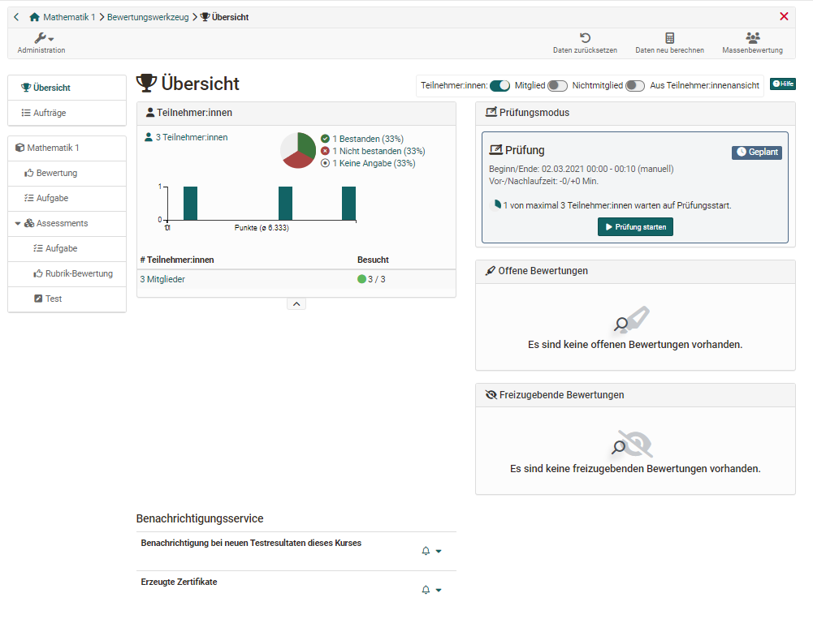
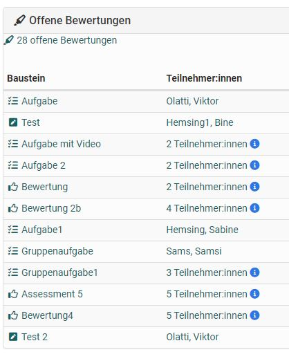
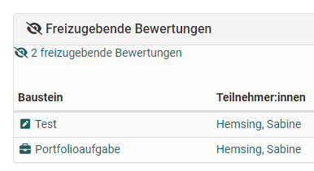
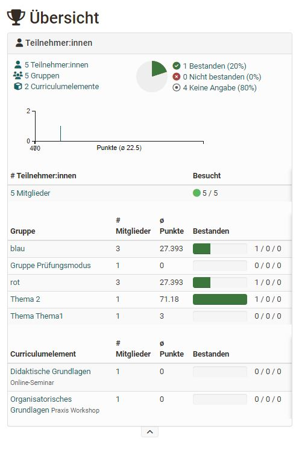
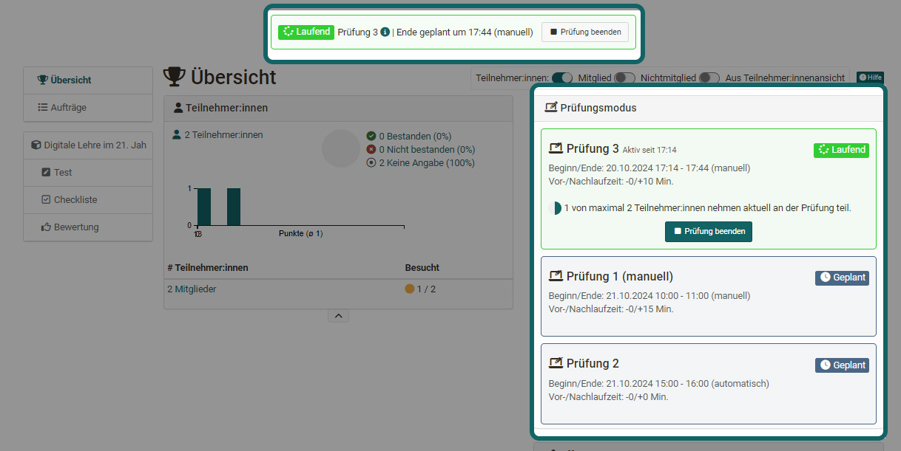
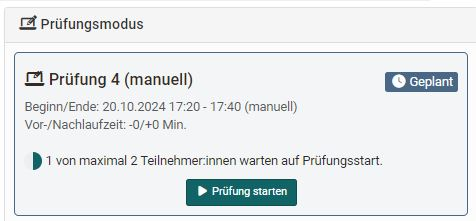
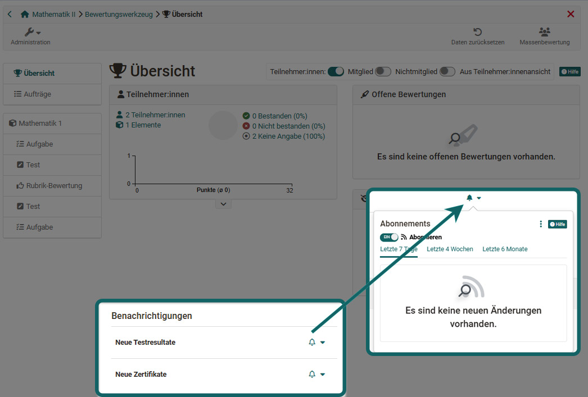
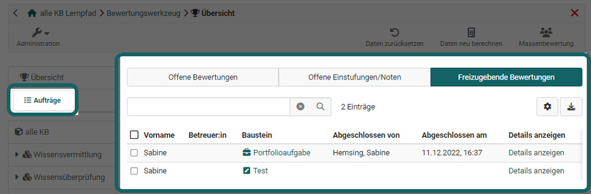
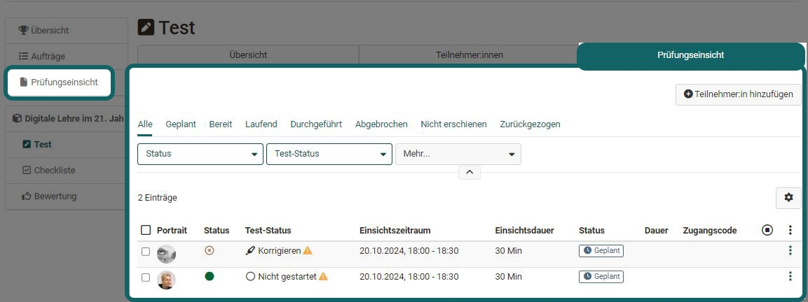
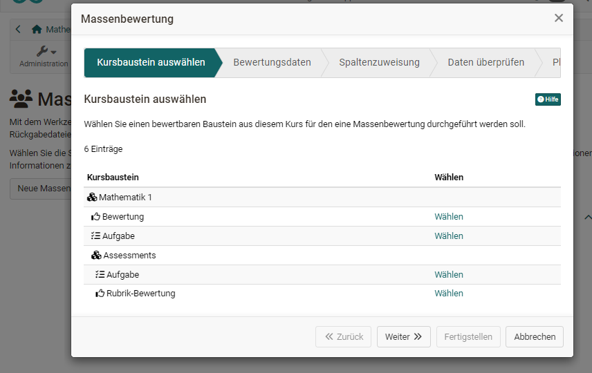

# Bewertungswerkzeug - Übersicht {: #assessment_tool_overview}

Das Bewertungswerkzeug ist die zentrale Schaltstelle für die Bewertungen eines OpenOlat-Kurses. Kursbesitzer:innen und Betreuende erhalten hier einen Gesamtüberblick über sämtliche im Kurs enthaltenen bewertbaren Kursbausteine und können die Bewertungen vornehmen.

Über die Kursadministration gelangt man in das Bewertungswerkzeug. Wenn Sie das Bewertungswerkzeug aufrufen, erscheint zunächst die Übersichtsseite mit zentralen Informationen sowie eine Übersicht der aktuell anstehenden Bewertungen und Aktionen. So wissen Sie schnell, was aktuell zu tun ist. Von der Übersichtsseite aus gelangen Sie auch zu den konkreten Bewertungsbereichen der einzelnen Kursbausteine und Personen.

Schauen wir uns die einzelnen Bereiche der Übersicht genauer an:

## "Übersicht" des Bewertungswerkzeugs

### "Offene Bewertungen" (Übersicht)

Auf einen Blick ist hier ersichtlich, ob bzw. für wen eine oder mehrere Bewertung(en) offen sind. Auch wird angezeigt, wie viele Bausteine des jeweiligen Users zu bewerten sind. Sofern nur ein Baustein bewertet werden muss, wird dieser direkt aufgelistet. Mit einem Klick auf den Baustein kommt man zur entsprechenden Bewertung.

In der Übersicht werden nur die unerledigten Bewertungen angezeigt. Bereits durchgeführte Bewertungen werden an dieser Stelle nicht aufgelistet.

### "Freizugebende Bewertungen" (Übersicht)

Sollte es im Kurs Bewertungen geben die noch nicht für die Teilnehmenden sichtbar gemacht wurden, erscheinen sie hier.

### "Teilnehmer:innen" (Übersicht)

In diesem Bereich wird angezeigt, wie viele Teilnehmende, Gruppen und Curriculumelemente generell im konkreten Kurs vorhanden sind.

Wurde für den gesamten Kurs ein "Bestehen" konfiguriert, wird die Anzahl der jeweiligen Kursmitglieder angezeigt, die den Kurs bestanden bzw. nicht bestanden haben. Auch die durchschnittliche Verteilung der Punkte ist, sofern Punkte im Kurs aktiviert sind, erkennbar. 

### Prüfungsmodus (Übersicht)

Ist für den Kurs eine Prüfung im [Prüfungsmodus](../learningresources/Assessment_mode.de.md) geplant oder findet gerade eine Prüfung statt wird dies ebenfalls im Bewertungswerkzeug angezeigt. 

Auch ist hier erkennbar wie viele Personen bereits eingeloggt sind und auf den Start der Prüfung warten.

### "Benachrichtigungsservice"

Hier können Betreuende über den Abonnieren Schieberegler einschalten, dass sie bei neuen Einsendungen, Testresultaten und sonstigen Einreichungen eine E-Mail erhalten. Auch können
Benachrichtigungen über neu erzeugte Zertifikate (sofern generell aktiviert) abonniert werden.

## Aufträge

Unterhalb der Übersicht befindet sich der Link zum Bereich "Aufträge". Hier sieht man ob es offene Bewertungen gibt, Einstufungen/Noten manuell vorgenommen werden müssen und ob es freizugebende Bewertungen gibt.

## Prüfungseinsicht

:octicons-tag-24: Release 18.2

Dieser Menübereich ist nur sichtbar, wenn für den Kurs eine Prüfung konfiguriert und auch die Prüfungseinsichtsoption aktiviert wurde. 

Betreuende können dann Teilnehmende hinzufügen, definieren auf welche Prüfung sich die Einsicht bezieht und zu welchem konkreten Zeitpunkt die Einsicht möglich ist. Bei Bedarf kann auch noch ein Zugangscode für die Einsicht vergeben und eine Infomail verschickt werden. 

Nähere Informationen zur Prüfungseinsicht finden Sie [hier](../learningresources/Assessment_inspection.de.md).

## Übersicht der Bewertungsbausteine des Kurses

In der linken Navigation des Bewertungswerkzeugs sieht man alle bewertbaren Kursbausteine. Für alle Kursbausteine werden die Tabs "Übersicht" und "Teilnehmer:innen" angezeigt. 

Im Übersichtstab erscheinen ähnliche Informationen wie im Übersichtsbereich des Bewertungswerkzeugs, nur Kursbaustein bezogen, also z.B. die Punkteverteilung, Anzahl de Bewertungen, Infos zum Bestehen usw. 

### Tab Teilnehmer:innen

Im Tab "Teilnehmer:innen" wird die eigentliche Bewertung vorgenommen und die Personen können ausgewählt, Punkte und Feedbacks hinterlegt und die Freigabe der Sichtbarkeit eingestellt werden. 
Die Tabelle zeigt dann den Bearbeitungstand aller Teilnehmenden des konkreten Kursbausteins an.  
Ferner können bei Aufgaben im Teilnehmenden Tab auch alle abgegebenen Dokumente heruntergeladen werden. 

Der automatisch generierte oberste Kursknoten zählt ebenfalls als bewertbarer Baustein. Er entspricht einem ["Struktur"](../learningresources/Knowledge_Transfer.de.md/#structure) Baustein.  
Klickt man beim obersten Kursbaustein auf eine Person erhält man eine Gesamtübersichtübersicht über den Bearbeitungsstand der Assessmentbausteine des Kurses für diese Person und kann sich so auch den Leistungsnachweis der Person anzeigen lassen. 

Ist auf dem oberersten Kursbaustein eine Punkteberechnung eingerichtet, können auf der obersten Ebene der Benutzeransicht auch die *Gesamtpunkte* eines Kurses bzw. die für den obersten Baustein definierten Punkte, angezeigt und die Gesamtergebnisse der Kursteilnehmenden heruntergeladen werden.

!!! info "Tipp"

    Nutzen Sie die Filtereinstellungen um nur bestimmte Teilnehmende in der Tabelle anzuzeigen. Nutzen Sie auch die Spaltenkonfiguration über das Zahnrad um die für Sie relevanten Spalten anzuzeigen.   

Wie genau Bewertungen vorgenommen werden erfahren Sie im Kapitel ["Bewertung von Kursbausteinen"](../learningresources/Assessment_of_course_modules.de.md) bzw. ["Lernende bewerten"](../learningresources/Assessment_tool_tab_Users.de.md).

!!! info "Hinweis"

    Sofern eine Prüfungseinsicht für Teilnehmende aktiviert wurde erscheint beim entsprechenden Kursbaustein auch noch der Tab "Prüfungseinsicht". 

Ausführliche Informationen zur Bearbeitung und Bewertung im Tab Teilnehmer:innen finden Sie im Kapitel ["Tab Teilnehmer"](../learningresources//Assessment_tool_tab_Users.de.md)

## Daten zurücksetzen {: #course_reset}

Mit Hilfe des Wizards können die Daten von Teilnehmer:innen eines Kurses zurückgesetzt werden. Dabei kann das Zurücksetzen für den gesamten Kurs oder nur für ausgewählte Kursbausteine für alle oder ausgewählte Teilnehmer:innen erfolgen.

[Mehr dazu >](../../manual_user/learningresources/Assessment_tool_reset_data.de.md)

## Massenbewertung {: #mass_assessment}

Mit dem Werkzeug "Massenbewertung" können für mehrere Teilnehmer Bewertungsdaten wie Punkte, Statusinformationen, Kommentare sowie Rückgabedateien in einem Schritt übermittelt werden. 

Wie man eine Massenbewertung erstellt erfahren Sie im Bereich [How to](../../manual_how-to/bulk_assessment/bulk_assessment.de.md).