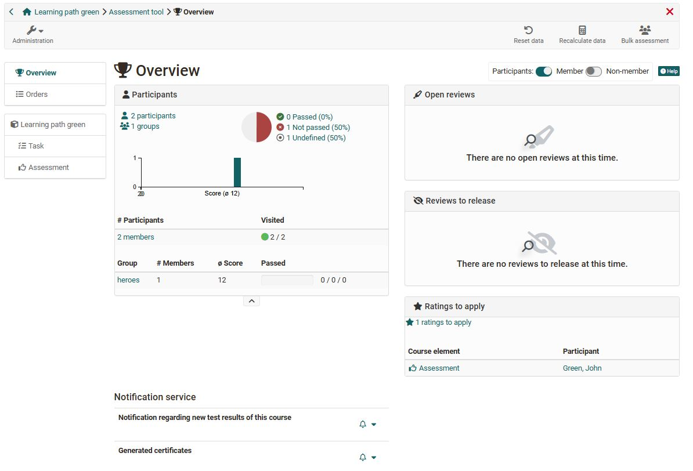
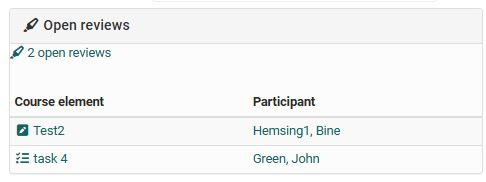
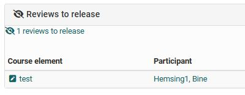
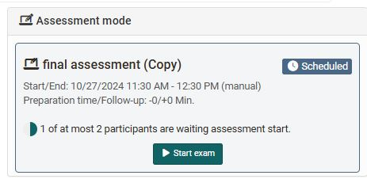

# Assessment tool - overview {: #assessment_tool_overview}

The assessment tool is the central switch point for assessments of an OpenOlat course. Here course owners and tutors will get a general overview of all assessable elements of their course and can carry out assessments.

Via course administration you will get to the assessment tool. When you open the assessment tool you will first see an overview page with central information as well as an overview of currently pending assessments.  This way you will quickly know what you have to do. From the overview page you can also access the concrete assessment areas of the individual course elements and persons.

Let's take a closer look at the individual areas of the overview:

## "Overview" of the assessment tool

### "Open reviews" (Overview)

Here you can see at a glance for which users one or more ratings are open.  It also shows how many modules of the respective user are to be rated. If only one building block needs to be rated, it is listed directly. By clicking on this module, you can access the corresponding rating.

Only the unfinished assessments are displayed here. Reviews that have already been completed are not listed here.

### "Reviews to release" (Overview)

If there are assessments in the course that have not yet been made visible to participants, they will appear here.

### "Participants" (Overview)

This area shows how many users, groups and course elements are generally available in this course.

If passed/not passed has been configured for the entire course, the number of course members who have passed or failed the course is displayed. The average distribution of points can also be seen if points are activated in the course. 

## Assessment mode

If the course is in [Assessment mode](../learningresources/Assessment_mode.md), this is also displayed in the assessment tool.

You can also see how many people are already logged in and waiting for the test to start.

### "Notification Service"

Here coaches can activate the option to receive an email for new submissions, test results and other submissions.  Notifications about newly generated certificates (if generally activated) can also be subscribed to.

## Orders

Below the overview is the link to the "Orders" area. Here you can see whether there are open assessments, levels/gradings have to be made manually and whether there are assessments to be released.

## Assessment inspection

:octicons-tag-24: Release 18.2

This menu area is only visible if an exam has been configured for the course and the exam view option has also been activated. 

Coaches can give exam participants individual access to their exam after it has been completed. For this purpose, time slots are set in which the persons concerned can view their exam again under preconfigured conditions. f required, an access code for the inspection can also be assigned and an info email sent. 

You can find more information about the examination inspection [here](../learningresources/Assessment_inspection.md).

## Overview of the assessment elements of the course

In the left navigation of the assessment tool you can see all assessable course elements. All elements are displayed with the tabs "Overview" and "Participants". 

The overview tab displays similar information to the overview area of the assessment tool, only related to the course element, e.g. the distribution of points, number of assessments, information on passing, etc. 

### Tab Participants

The actual evaluation is carried out in the "Participants" tab, where individuals can be selected, points and feedback can be entered, and visibility settings can be configured. 
The table then shows the processing status of all participants in the specific course module.  
Furthermore, all submitted documents can be downloaded from the Participant Tab. 

The automatically generated top course node also counts as an assessable module. It corresponds to a ["Structure"](../learningresources/Knowledge_Transfer.md/#structure) module.  
Clicking on a person in the top course module gives you a complete overview of the progress made by that person in the assessment modules of the course, allowing you to view their performance record. 

If a point calculation is set up on the top course module, the *total points* for a course or the points defined for the top module can also be displayed at the top level of the user view, and the overall results of the course participants can be downloaded.

!!! info "Hint"

    Use the filter settings to display only certain participants in the table. You can also use the column configuration via the gear icon to display the columns that are relevant to you. 

 To learn how exactly assessments can be made, please refer to the chapter ["Assessment of course modules"](../learningresources/Assessment_of_course_modules.md) or ["User assessment](../learningresources/Assessment_tool_tab_Users.md).

!!! info "Note"

    If exam viewing has been enabled for participants, the "Exam viewing" tab will also appear for the corresponding course element. 

## Reset data {: #course_reset}

With the help of the wizard, the data of course participants can be reset. The reset can be performed for the entire course or only for selected course modules, for all participants or selected participants.

[Find out more >](../../manual_user/learningresources/Assessment_tool_reset_data.md)

## Mass assessment {: #mass_assessment}

The "Mass Assessment" tool can be used to transfer assessment data such as points, status information, comments, and return files for multiple participants in a single step. 

Find out how to create a mass assessment in the [How to](../../manual_how-to/bulk_assessment/bulk_assessment.md) section.
