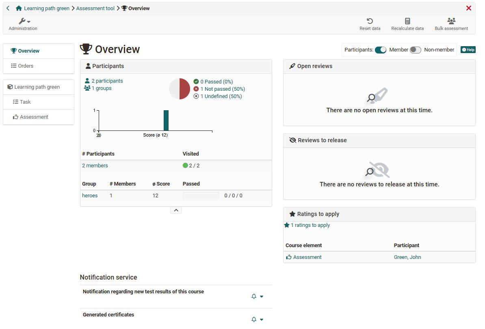
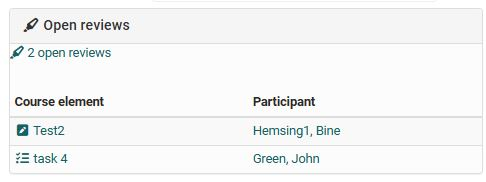
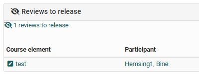
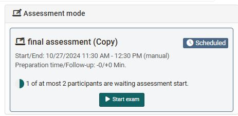

# Assessment tool - overview {: #assessment_tool_overview}

The assessment tool is the central switch point for assessments of an OpenOlat course. Course owners and coaches get a general overview here of all assessable course elements contained in the course and can carry out the assessments.

You reach the assessment tool via `Course > Administration > Assessment tool`. When you open the assessment tool, you will first see the overview page with central information as well as an overview of the currently pending assessments and actions. This way you will quickly know what you have to do. From the overview page you can also access the concrete assessment areas of the individual course elements and persons.

{ class="shadow lightbox" }

Let's take a closer look at the individual areas of the overview:

## "Overview" of the assessment tool

### "Open reviews" (Overview)

At a glance you can see whether, and for whom, one or more reviews are open. It also shows how many course elements of the respective user need to be reviewed. If only one course element needs to be reviewed, it is listed directly. Clicking on the course element takes you to the corresponding review.

{ class="shadow lightbox" }

Only the unfinished reviews are displayed here. Reviews that have already been carried out are not listed here.

### "Reviews to release" (Overview)

If there are reviews in the course that have not yet been made visible to the participants, they appear here.

{ class="shadow lightbox" }

### "Participants" (Overview)

This area shows how many participants, groups and curriculum elements are generally available in the specific course.

If "passed" has been configured for the entire course, the number of the respective course members who have passed or not passed the course is displayed. The average distribution of points is also visible, provided points are activated in the course. 

{ class="shadow lightbox" }

### Assessment mode (Overview)

If an exam in [assessment mode](../learningresources/Assessment_mode.md) is planned for the course, or an exam is currently taking place, this is also displayed in the assessment tool.

{ class="shadow lightbox" }

You can also see how many people are already logged in and waiting for the exam to start.

{ class="shadow lightbox" }

### "Notification Service"

Here coaches can use the subscribe toggle to activate receiving an email for new submissions, test results and other submissions. Notifications about newly generated certificates (if generally activated) can also be subscribed to.

{ class="shadow lightbox" }

## Orders

Below the overview is the link to the "Orders" area. Here you can see whether there are open reviews, whether ratings/grades need to be entered manually, and whether there are reviews to release.

{ class="shadow lightbox" }

## Assessment inspection [:octicons-tag-16:{ title="from Release 18.2 (OO-7425)" }](https://track.frentix.com/issue/OO-7425)

This menu area is only visible if an exam has been configured for the course and the assessment inspection option has also been activated.

Coaches can then add participants, define which exam the inspection applies to, and at what specific time the inspection is possible. If required, an access code for the inspection can also be assigned and an info email sent.

{ class="shadow lightbox" }

You can find more information about assessment inspection [here](../learningresources/Assessment_inspection.md).

## Overview of the assessment elements of the course

In the left navigation of the assessment tool you see all assessable course elements. For all course elements, the tabs "Overview" and "Participants" are displayed.

The overview tab shows information similar to the overview area of the assessment tool, but related to the course element, e.g. the distribution of points, number of reviews, information on passing, etc.

### Tab Participants

In the "Participants" tab, the actual assessment is carried out: persons can be selected, points and feedback entered, and the release of visibility set. 
The table then shows the processing status of all participants of the specific course element. 
Furthermore, for tasks, all submitted documents can also be downloaded in the Participants tab.

The automatically generated top course node also counts as an assessable element. It corresponds to a ["Structure"](../learningresources/Knowledge_Transfer.md#structure) element. 
Clicking on a person at the top course element gives you a complete overview of the processing status of the assessment elements of the course for that person, allowing you to also view their proof of performance.

If a point calculation is set up on the top course element, the *total points* of a course, or the points defined for the top element, can also be displayed at the top level of the user view, and the overall results of the course participants can be downloaded.

!!! tip "Tip"

    Use the filter settings to display only certain participants in the table. Also use the column configuration via the gear icon to display the columns that are relevant to you.

To learn exactly how assessments are carried out, see the chapters ["Assessment of course elements"](../learningresources/Assessment_of_course_modules.md) or ["Assessing learners"](../learningresources/Assessment_of_learners.md).

!!! info "Important"

    If assessment inspection has been activated for participants, the "Assessment inspection" tab also appears for the corresponding course element.

Detailed information on processing and assessing in the Participants tab is available in the chapter ["Tab Participants"](../learningresources/Assessment_tool_tab_Users.md).

## Reset data {: #course_reset}

With the help of the wizard, the data of the participants of a course can be reset. The reset can be carried out for the entire course or only for selected course elements, for all or selected participants.

[Find out more >](../../manual_user/learningresources/Assessment_tool_reset_data.md)

## Mass assessment {: #mass_assessment}

With the "Mass assessment" tool, assessment data such as points, status information, comments as well as return files can be submitted for several participants in one step.

{ class="shadow lightbox" }

Find out how to create a mass assessment in the [How to](../../manual_how-to/bulk_assessment/bulk_assessment.md) section.
