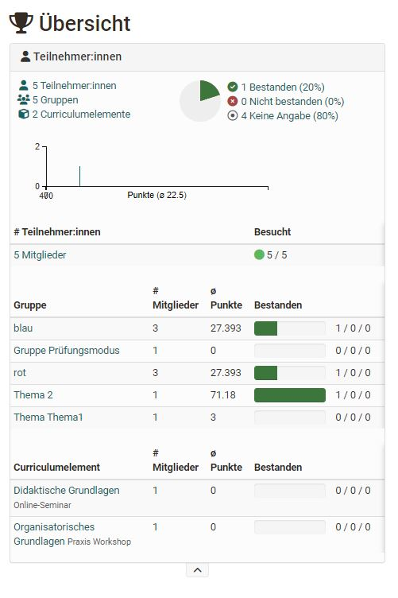
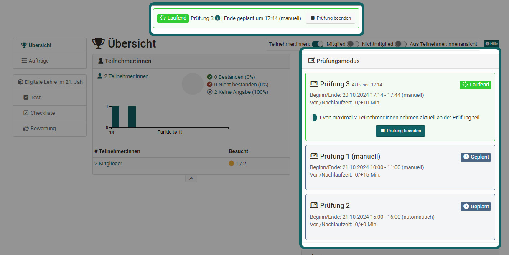
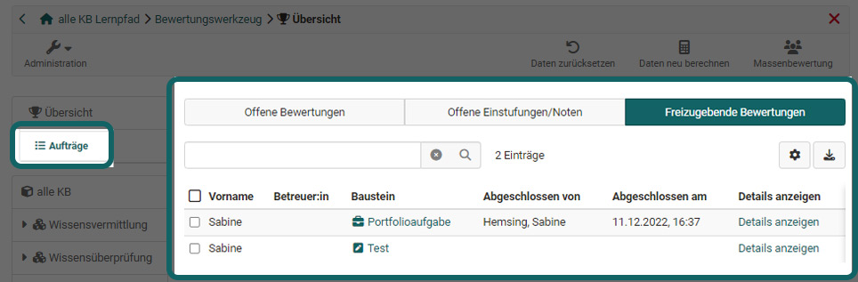

# Assessment tool - overview

The assessment tool is the central switch point for assessments of an OpenOlat course. Here course owners and tutors will get a general overview of all assessable elements of their course and can carry out assessments.

Via course administration you will get to the assessment tool. When you open the assessment tool you will first see an overview page with central information as well as an overview of currently pending assessments.  This way you will quickly know what you have to do. From the overview page you can also access the concrete assessment areas of the individual course elements and persons.

Let's take a closer look at the individual areas of the overview:

## "Overview" of the assessment tool

### "Open reviews" (Overview)

Here you can see at a glance for which users one or more ratings are open.  It also shows how many modules of the respective user are to be rated. If only one building block needs to be rated, it is listed directly. By clicking on this module, you can access the corresponding rating.

Only the unfinished assessments are displayed here. Reviews that have already been completed are not listed here.

### "Reviews to release! (Overview)

If there are assessments in the course that have not yet been made visible to participants, they will appear here.

### "Participants" (Overview)

This area shows how many users, groups and course elements are generally available in this course.

If passed/not passed has been configured for the entire course, the number of course members who have passed or failed the course is displayed. The average distribution of points can also be seen if points are activated in the course. 

## Assessment mode

If the course is in [Assessment mode](../learningresources/Assessment_mode.md), this
is also displayed in the assessment tool. You can also see how many people are already logged in and waiting for the exam to start.

You can also see how many people are already logged in and waiting for the test to start.

### "Notification Service"

Here coaches can activate the option to receive an e-mail for new submissions,
test results and other submissions.  Notifications about newly generated
certificates (if generally activated) can also be subscribed to.

## Orders

Below the overview is the link to the "Orders" area. Here you can see whether there are open assessments, levels/gradings have to be made manually and whether there are assessments to be released.

## Assessment inspection

:octicons-tag-24: Release 18.2

This menu area is only visible if an exam has been configured for the course and the exam view option has also been activated. 

Coaches can give exam participants individual access to their exam after it has been completed. For this purpose, time slots are set in which the persons concerned can view their exam again under preconfigured conditions. f required, an access code for the inspection can also be assigned and an info email sent. 

You can find more information about the examination inspection [here](../learningresources/Assessment_inspection.md).

## Overview of the assessment elements of the course

In the left navigation of the assessment tool you can see all assessable course elements. All elements are displayed with the tabs "Overview" and "Participants". 

The overview tab displays similar information to the overview area of the assessment tool, only related to the course element, e.g. the distribution of points, number of assessments, information on passing, etc. 

### Tab Teilnehmer:innen

Im Tab "Teilnehmer:innen" wird die eigentliche Bewertung vorgenommen und die Personen können ausgewählt, Punkte und Feedbacks hinterlegt und die Freigabe der Sichtbarkeit eingestellt werden. 
Die Tabelle zeigt dann den Bearbeitungstand aller Teilnehmenden des konkreten Kursbausteins an.  
Ferner können bei Aufgaben im Teilnehmenden Tab auch alle abgegebenen Dokumente heruntergeladen werden. 

Der automatisch generierte oberste Kursknoten zählt ebenfalls als bewertbarer Baustein. Er entspricht einem ["Struktur"](../learningresources/Knowledge_Transfer.de.md/#structure) Baustein.  
Klickt man beim obersten Kursbaustein auf eine Person erhält man eine Gesamtübersichtübersicht über den Bearbeitungsstand der Assessmentbausteine des Kurses für diese Person und kann sich so auch den Leistungsnachweis der Person anzeigen lassen. 

Ist auf dem oberersten Kursbaustein eine Punkteberechnung eingerichtet, können auf der obersten Ebene der Benutzeransicht auch die *Gesamtpunkte* eines Kurses bzw. die für den obersten Baustein definierten Punkte, angezeigt und die Gesamtergebnisse der Kursteilnehmenden heruntergeladen werden.

!!! info "Tipp"

    Nutzen Sie die Filtereinstellungen um nur bestimmte Teilnehmende in der Tabelle anzuzeigen. Nutzen Sie auch die Spaltenkonfiguration über das Zahnrad um die für Sie relevanten Spalten anzuzeigen.   

 To learn how exactly assessments can be made, please refer to the chapter ["Assessment of course modules"](../learningresources/Assessment_of_course_modules.md) or ["User assessment](../learningresources/Assessment_tool_tab_Users.md).

!!! info "Hinweis"

    Sofern eine Prüfungseinsicht für Teilnehmende aktiviert wurde erscheint beim entsprechenden Kursbaustein auch noch der Tab "Prüfungseinsicht". 

## Reset data {: #course_reset}

With the help of the wizard the data of participants of a course can be reset. The reset can be done for the whole course or only for selected course elements for all or selected participants.

Depending on the course element or the course configuration, e.g. the progress, the number of attempts, score, success statuses, assessment releases and also reminders are reset. Before the data is finally reset, the old results can be downloaded as a zip file and thus saved.

Below is an overview of how the reset affects the different course areas.

### Assessment form

Attribute | Impact
---------|----------
Status | Set to "Not started"
Release assessment status | Set to "Not released"
Number of attempts | Reset to 0
Score | Reset
Success status | Set to "Undefined"
Comment for other coaches | Reset; Export "assessment_coach_comment.txt" to archive
Individual comment / comment for participant | Reset; Export "assessment_comment.txt" to archive
Individual assessment documents | Reset

### Comments & ratings

Comments and ratings on course elements and the course are retained.

### Course reminders

The information about sent reminders will be deleted. (Applies only if the entire course is reset).

### Evidence of achievement and certificate

The evidence of achievement will be versioned at the time of the reset. The certificate will be reissued after successful course completion. (Applies only if the entire course is reset).

### Course elements

Resetting the data has an individual effect on the course elements.

If the course element triggers an export to the archive, this will always be created even if no data is available.

Course element | Impact
---------|----------
Appointment scheduling | Registrations retained
Assessment | Form reset; Export of results to archive
Blog | Entries retained
Checklist | All checkboxes reset; Export results to archive
Enrollment | Enrollments in groups are removed
File discussion | Files, topics and posts are preserved
Folder | Contents are preserved
Form | Form reset; Export results to archive
Forum | Topics and posts are preserved
Group Task | When entire group is reset: All workflow data (assignment, documents, extensions) reset; Export of all documents for each participant to archive
LTI | Assessment form reset
Podcast | Entries are preserved
Portfolio Task | Link to portfolio task removed
Scorm | Attempts reset; Export of trials (csv file) to archive
Self-test | All executions reset
Structure | Score reset (conventional course only)
Participant Folder | Folder reset; Export of all submitted and returned files to archive
Practice | Exercise data and attempts reset; Test executions remain and are marked as invalid; Export of test results to archive
Survey | Reset for all participants: Reset and export to archive; Reset for individual participants: No reset and export, because surveys are anonymous
Task | All workflow data (assignment, documents, extensions) reset; Export of all documents to archive
Test | All attempts reset; Test executions remain and are marked as invalid; Export of test results to archive
Topic Assignment | Topic assignments are removed
Video task | All attempts reset; Executions remain and are marked as invalid; Export test results to archive
Wiki | Entries remain

### Data that will not be reset

The following items will not be deleted during the reset process:

* Membership data (exception: group membership in enrollment course module)
* Logging data
* Notification subscriptions
* Chat logs
* Uploaded files in a public area (e.g., folder module)
* Forum posts and other comments
* Created blog or podcast entries by users
* Added wiki entries by users
* Added glossary entries by users

## Recalculate data

This link can be used to trigger a recalculation of the course. Thus, the course assessments and certificates of achievement can be updated, the calculation for passed and also manually set "passed" can be reset.

## Bulk assessment

With the tool "bulk assessment", evaluation data such as points, status information, comments as well as return files can be transmitted for several participants in one step. 

You can find out how to create a mass evaluation in the [How to](../../manual_how-to/bulk_assessment/bulk_assessment.md) area.