# Bewertungswerkzeug - Daten zurücksetzen {: #reset_data}

Mit Hilfe eines **Wizards** können die Daten von Teilnehmer:innen eines Kurses zurückgesetzt werden. Dabei kann das Zurücksetzen für den gesamten Kurs oder nur für ausgewählte Kursbausteine, für alle oder ausgewählte Teilnehmer:innen erfolgen.

Sie können aber auch **ohne Wizard** selektiv Daten bestimmter Teilnehmer:innen oder Kursbausteine zurücksetzen.

Abhängig vom Kursbaustein bzw. der Kurskonfiguration werden z.B. der Fortschritt, die Versuchsanzahl, Punkte, Erfolgsstatus, Bewertungsfreigaben und auch Erinnerungen zurückgesetzt. 

## Datensicherung vor dem Zurücksetzen {: #backup}

Bevor die Daten endgültig zurückgesetzt werden, können die alten Ergebnisse heruntergeladen und gespeichert werden. 

### Sicherung des gesamten Kurses {: #backup_course}

In der (Kurs-)Administration unter **Archivierung & Reports** können Sie Reports der Kursresultate generieren. 

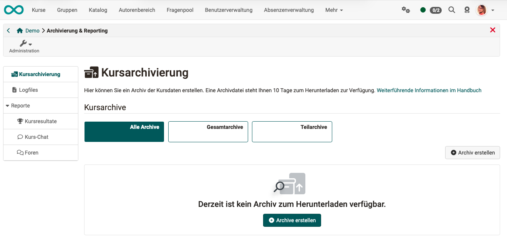{ class="shadow lightbox" } 

### Sicherung eines Kursbausteins "Test" {: #backup_test}

Die Daten eines Kursbausteins "Test" können im Bewertungswerkzeug als zip-Datei heruntergeladen und gespeichert werden.

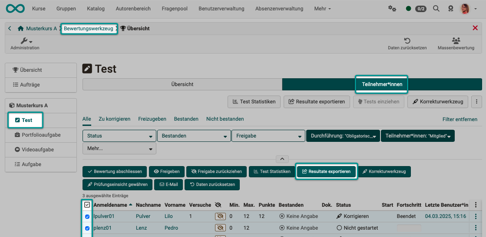{ class="shadow lightbox" }

Die erzeugten zip-Dateien sind dann im unteren Bereich des Bildschirms aufgelistet und können heruntergeladen werden.

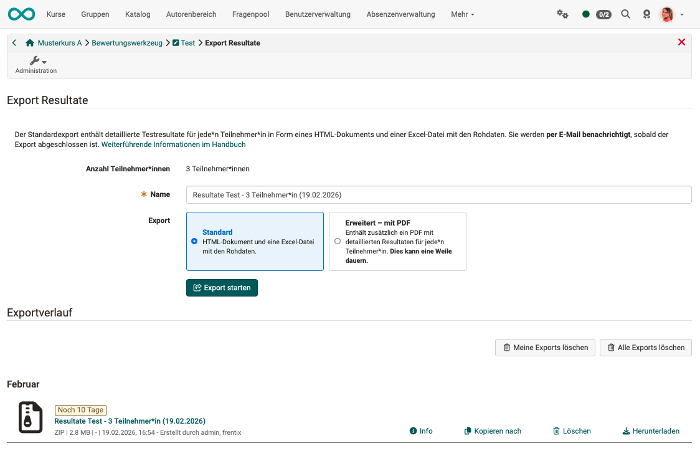{ class="shadow lightbox" }

[Zum Seitenanfang ^](#reset_data)

---

## Voraussetzung/Berechtigung zum Zurücksetzen {: #authorization}

**Kursbesitzer:innen** können Daten immer zurücksetzen.

**Betreuende** können Daten nur zurücksetzen, wenn sie die Berechtigung dafür erhalten haben. Dazu muss ein:e Kursbesitzer:in

1. Kurs öffnen → Administration → Einstellungen
2. Tab "Bewertung" aufrufen
3. Unter "Betreuer:innen können" die Option "Daten zurücksetzen" aktivieren
4. Speichern

[Zum Seitenanfang ^](#reset_data})

---

## Daten zurücksetzen mit Wizard {: #wizard}

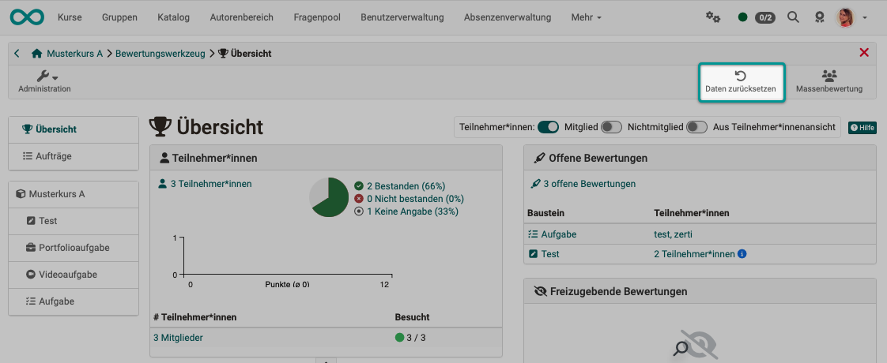{ class="shadow lightbox" }

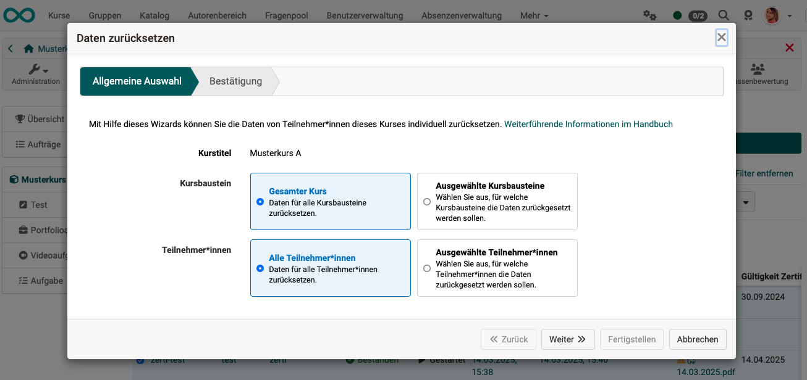{ class="shadow lightbox" }

Wählen Sie im Wizard die Optionen "Ausgewählte Teilnehmer:innen" und "Ausgewählte Kursbausteine", werden Sie im Wizard zusätzlich durch die Teilschritte geführt und zum Schluss nochmals gefragt, ob das Zurücksetzen nun so erfolgen soll.

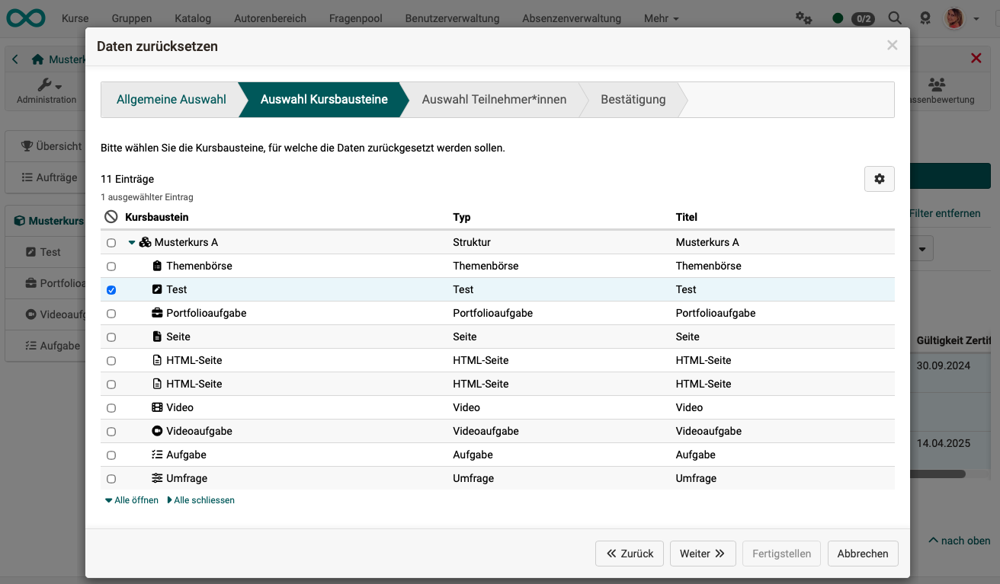{ class="shadow lightbox" }

[Zum Seitenanfang ^](#reset_data)

---

## Daten bestimmter Teilnehmer:innen ohne Wizard zurücksetzen {: #members}

### Zurücksetzen im Bewertungswerkzeug {: #members_assessment_tool}

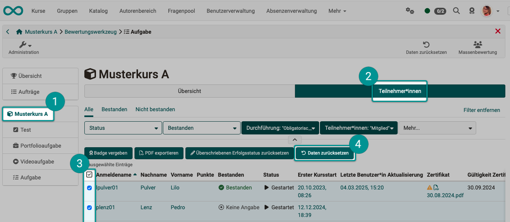{ class="shadow lightbox" }

1. Kurs öffnen → Administration → Bewertungswerkzeug → Kursbaustein wählen 
(Bei Klick auf das Wurzelelement des Kurses (oberste Ebene) bezieht sich die nachfolgenden Schritte auf alle Kursbausteine.)
2. Tab Teilnehmer:innen wählen
3. Eine Teilnehmer:in in der Tabelle anklicken → Übersicht Teilnehmer:in öffnet sich. 
Für mehrere Teilnehmer:innen selektieren Sie in der dersten Spalte die entsprechenden Checkboxen.
4. Sobald mindestens 1 Person selektiert ist, erscheinen über der Tabelle weitere Buttons.
Nach Klick auf den Button "Daten zurücksetzen" werden nach einer Sicherheitsabfrage die Daten der selektierten Personen zurückgesetzt.

### Zurücksetzen im Lernpfad-Werkzeug {: #members_learning_path}

1\. Kurs öffnen → Administration → Lernpfad-Tool auswählen

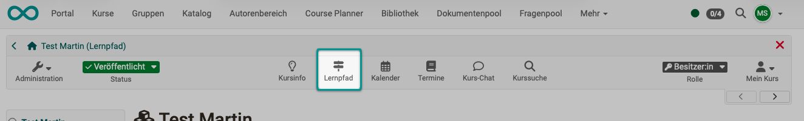{ class="shadow lightbox" }

2\. Es öffnet sich eine Teilnehmerliste. Wählen Sie eine:n Teilnehmer:in in der Tabelle.

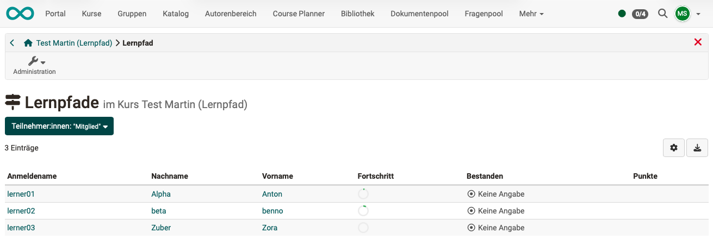{ class="shadow lightbox" }

3\. Klicken Sie auf ein 3-Punkte-Icon am Ende einer Zeile. Dort finden Sie die Option "Daten zurücksetzen". Sie können Daten für einzelne Kursbausteine zurücksetzen oder für den Kurs als Ganzes, wenn Sie das oberste Icon für den Gesamtkurs wählen.

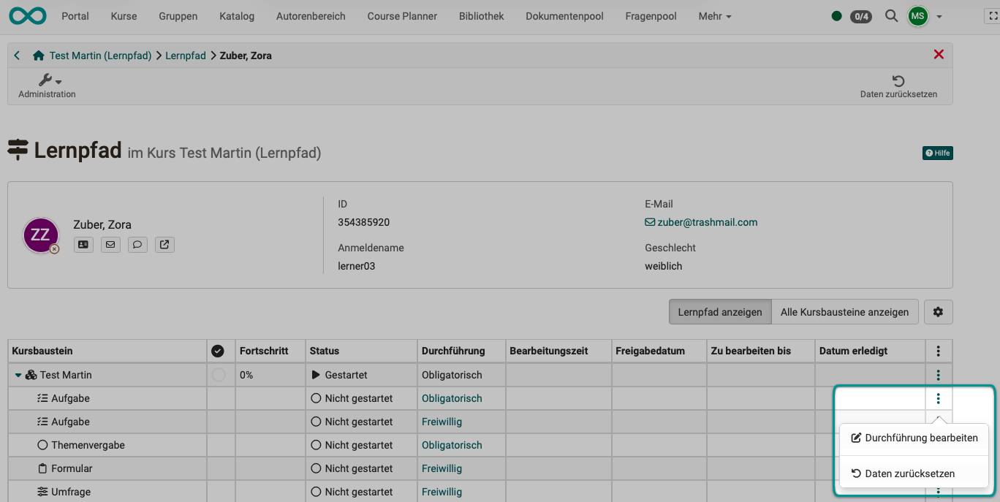{ class="shadow lightbox" }

[Zum Seitenanfang ^](#reset_data)

---

## Daten bestimmter Kursbausteine ohne Wizard zurücksetzen {: #course_elements}

Je nach Kursbaustein werden folgende Daten zurückgesetzt, respektive annulliert:

* Fortschritt
* Anzahl Versuche
* Testdurchläufe
* Punkte und Erfolgsstatus
* Freigabe Bewertung
* Erinnerungen

Beim Zurücksetzen wird eine entsprechende Archivdatei mit den relevanten Daten erstellt und im Anschluss heruntergeladen. Das Archiv steht zusätzlich als Download im Leistungsnachweis der Teilnehmenden zur Verfügung.

[Zum Seitenanfang ^](#reset_data)

---

## Auswirkung des Zurücksetzens {: #impact}

### Auswirkungen im Bewertungsformular {: #impact_on_assessment_form}

Attribut | Auswirkung
---------|----------
Status | wird auf "Nicht gestartet" gesetzt
Freigabe Bewertungsstatus | wird auf "Nicht freigegeben" gesetzt
Anzahl Lösungsversuche | wird auf 0 zurückgesetzt
Punktzahl | wird zurückgesetzt
Erfolgsstatus | wird auf "Keine Angabe" gesetzt
Kommentar für andere Betreuende | wird zurückgesetzt; Export erfolgt als "assessment_coach_comment.txt" ins Archiv
Individueller Kommentar / Kommentar für Teilnehmer | wird zurückgesetzt; Export erfolgt als "assessment_comment.txt" ins Archiv
Individuelle Bewertungsdokumente | werden zurückgesetzt

[Zum Seitenanfang ^](#reset_data)

---

### Auswirkungen auf Kommentare & Bewertungen {: #impact_on_comments_ratings}

Kommentare und Bewertungen an Kursbausteinen und am Kurs bleiben erhalten.

[Zum Seitenanfang ^](#reset_data)

---

### Auswirkung auf Kurserinnerungen {: #impact_on_reminders}

Die Informationen über gesendete Erinnerungen werden gelöscht. (Gilt nur, wenn der gesamte Kurs zurückgesetzt wird.)

[Zum Seitenanfang ^](#reset_data)

---

### Auswirkung auf Leistungsnachweise {: #impact_on_evidence_of_achievements}

Der Leistungsnachweis wird zum Zeitpunkt des Resets versioniert. Er bleibt im persönlichen Menü einsehbar.

[Zum Seitenanfang ^](#reset_data)

---

### Auswirkung auf Zertifikate {: #impact_on_certificates}

Wenn der gesamte Kurs zurückgesetzt ist, wird das Zertifikat nach erfolgreicher Kursdurchführung erneut ausgestellt. 

Einmal erworbene Zertifikate werden bei den Daten der Teilnehmer:in gespeichert und sind im persönlichen Menü weiterhin einsehbar. Auch wenn ein Zertifikat abgelaufen ist oder ein Kurs ganz gelöscht wurde. 

[Zum Seitenanfang ^](#reset_data)

---

### Auswirkung auf Kursbausteine {: #impact_on_course_elements}

Das Zurücksetzen der Daten wirkt sich individuell auf einzelne Kursbausteine aus.

Sofern der Kursbaustein einen Export ins Archiv auslöst, wird dieser immer erstellt, auch wenn keine Daten vorhanden sind.

Baustein | Auswirkung
---------|----------
Aufgabe | Alle Workflow-Daten (Zuweisung, Dokumente, Erweiterungen) zurückgesetzt; Export aller Dokumente ins Archiv
Bewertung | Formular zurückgesetzt; Export der Ergebnisse ins Archiv
Blog | Einträge bleiben erhalten
Checkliste | Alle Checkboxen zurückgesetzt; Export der Ergebnisse ins Archiv
Dateidiskussion | Dateien, Themen und Beiträge bleiben erhalten
Einschreibung | Einschreibungen in Gruppen werden entfernt
Formular | Formular zurückgesetzt; Export der Ergebnisse ins Archiv
Forum | Themen und Beiträge bleiben erhalten
Gruppenaufgabe | Wenn gesamte Gruppe zurückgesetzt wird: Alle Workflow-Daten (Zuweisung, Dokumente, Erweiterungen) zurückgesetzt; Export aller Dokumente für jeden Teilnehmer ins Archiv
LTI | Bewertungsformular zurückgesetzt
Ordner | Inhalte bleiben erhalten
Podcast | Einträge bleiben erhalten
Portfolio-Aufgabe | Link zur Portfolioaufgabe entfernt
SCORM | Versuche zurückgesetzt; Export der Versuche (csv-Datei) ins Archiv
Selbsttest | Alle Durchführungen zurückgesetzt
Struktur | Punktestand zurückgesetzt (nur herkömmlicher Kurs)
Teilnehmer-Ordner | Ordner zurückgesetzt; Export aller eingereichten und zurückgegebenen Dateien ins Archiv
Terminplanung | Anmeldungen bleiben erhalten
Test | Alle Versuche zurückgesetzt; Testdurchführungen bleiben bestehen und werden als ungültig markiert; Export der Testergebnisse ins Archiv
Themenvergabe | Themen-Zuweisungen werden entfernt
Themenbörse | Zuordnungen und Einschreibungen werden zuzrückgesetzt
Übung | Übungsdaten und -versuche zurückgesetzt; Testdurchführungen bleiben bestehen und werden als ungültig markiert; Export der Testergebnisse ins Archiv
Umfrage | Reset für alle Teilnehmenden: Zurückgesetzt und Export ins Archiv; Reset für einzelne Teilnehmende: Kein Zurücksetzen und Export, da Umfragen anonym sind
Video-Aufgabe | Alle Versuche zurückgesetzt; Durchführungen bleiben bestehen und werden als ungültig markiert; Export der Testergebnisse ins Archiv
Wiki | Einträge bleiben erhalten

[Zum Seitenanfang ^](#reset_data)

---

## Daten, die nicht zurückgesetzt werden {: #no_reset}

Die folgenden Elemente werden beim Zurücksetzen nicht gelöscht:

* Mitgliedschaftsdaten (Ausnahme: Gruppenmitgliedschaft im Einschreiben-Kursbaustein)
* Logging-Daten
* Benachrichtigungsabonnements
* Chat-Protokolle
* Hochgeladene Dateien in einem öffentlichen Bereich (z. B. Ordnerbaustein)
* Forenbeiträge und andere Kommentare
* Erstellte Blog- oder Podcast-Einträge der Benutzer:innen
* Hinzugefügte Wiki-Einträge der Benutzer:innen
* Hinzugefügte Glossareinträge der Benutzer:innen

[Zum Seitenanfang ^](#reset_data)

---

## Daten neu berechnen {: #recalculate}

!!! info "Hinweis"

    Diese Funktion ist ab Release 20.2 entfernt worden, weil sie nicht mehr erforderlich ist.

Über diesen Link des Menüs kann eine Neuberechnung des Kurses angestoßen werden. So können die Kursbewertungen und Leistungsnachweise aktualisiert, die Berechnung für bestanden und auch manuell gesetztes "bestanden" zurückgesetzt werden.

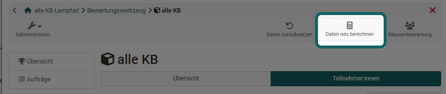

[Zum Seitenanfang ^](#reset_data)

---

## Unterschied: "Daten zurücksetzen" - "Alle Daten löschen" {: #reset_vs_delete}

Wenn Sie im Bewertungswerkzeug einen Test-Kursbaustein gewählt haben, stehen Ihnen sowohl Möglichkeiten zum Zurücksetzen als auch zum Löschen der Daten zur Verfügung. Worin bestehen die Unterschiede?

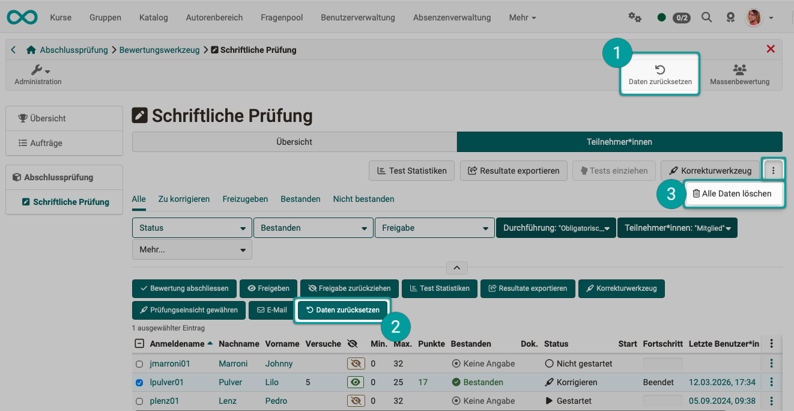{ class="shadow lightbox" }

|  Daten zurücksetzen mit Wizard|  Daten für ausgewählte einzelne Teilnehmer:innen ohne Wizard zurücksetzen |  Alle Daten löschen &nbsp; |
| ----------------- | ----------------- | ----------------- |
| Mit diesem Button öffnen Sie den Wizard. Gemäss der dort gemachten Angaben werden die Daten dann zurückgesetzt. | Mit diesem Button werden nur die Daten der selektierten Teilnehmer:innen zurückgesetzt. &nbsp; | Mit diesem Button werden alle bisher in diesem Kursbaustein gemachten Eingaben von allen Teilnehmer:innen komplett gelöscht. |
|<b>Beispiel: |<b>Alle haben 3 Versuche, den Test zu bestehen.| |
| Mit Klick auf "Daten zurücksetzen" wird die Zahl der bereits gemachten Versuche wieder auf 0 gesetzt. Auch "Bestanden" usw. werden zurückgesetzt (Reset). Die Daten der bereits gemachten Lösungsversuche ("Test-Runs") bleiben jedoch erhalten und weiterhin im Bewertungswerkzeug sichtbar. |  Mit Klick auf "Daten zurücksetzen" wird die Zahl der bereits gemachten Versuche wieder auf 0 gesetzt. Auch "Bestanden" usw. werden zurückgesetzt (Reset).Die Daten der bereits gemachten Lösungsversuche ("Test-Runs") bleiben jedoch erhalten und weiterhin im Bewertungswerkzeug sichtbar.| Alle Daten der bereits gemachten Lösungsversuche ("Test-Runs") werden bei allen Teilnehmer:innen gelöscht. &nbsp; &nbsp; |

[Zum Seitenanfang ^](#reset_data)

---

## Weitere Informationen {: #further_information}

[Bewertungswerkzeug - Tab Teilnehmer >](../../manual_user/learningresources/Assessment_tool_tab_Users.de.md) 
[Kurs löschen >](../../manual_user/learningresources/Course_Delete.de.md) 
[Benutzer:in löschen >](../../manual_admin/usermanagement/Delete_User.de.md) 

[Zum Seitenanfang ^](#reset_data)

