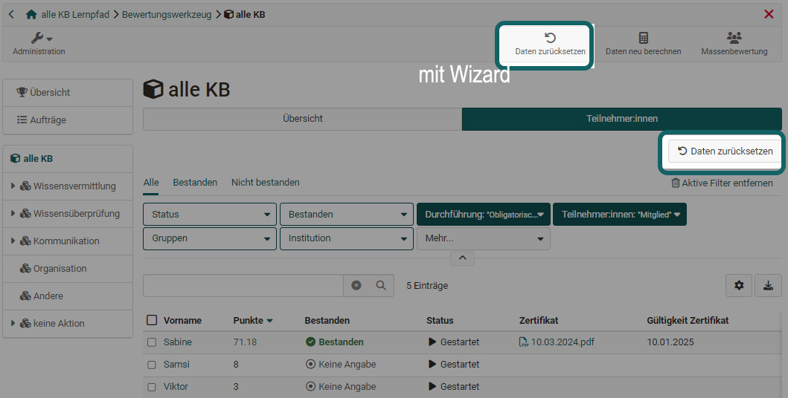

# Assessment tool - reset data

## Reset data {: #course_reset}

With the help of the wizard the data of participants of a course can be reset. The reset can be done for the whole course or only for selected course elements for all or selected participants.

Depending on the course element or the course configuration, e.g. the progress, the number of attempts, score, success statuses, assessment releases and also reminders are reset. Before the data is finally reset, the old results can be downloaded as a zip file and thus saved.

Below is an overview of how the reset affects the different course areas.

### Assessment form

Attribute | Impact
---------|----------
Status | Set to "Not started"
Release assessment status | Set to "Not released"
Number of attempts | Reset to 0
Score | Reset
Success status | Set to "Undefined"
Comment for other coaches | Reset; Export "assessment_coach_comment.txt" to archive
Individual comment / comment for participant | Reset; Export "assessment_comment.txt" to archive
Individual assessment documents | Reset

### Comments & ratings

Comments and ratings on course elements and the course are retained.

### Course reminders

The information about sent reminders will be deleted. (Applies only if the entire course is reset).

### Evidence of achievement and certificate

The evidence of achievement will be versioned at the time of the reset. The certificate will be reissued after successful course completion. (Applies only if the entire course is reset).

### Course elements

Resetting the data has an individual effect on the course elements.

If the course element triggers an export to the archive, this will always be created even if no data is available.

Course element | Impact
---------|----------
Appointment scheduling | Registrations retained
Assessment | Form reset; Export of results to archive
Blog | Entries retained
Checklist | All checkboxes reset; Export results to archive
Enrollment | Enrollments in groups are removed
File discussion | Files, topics and posts are preserved
Folder | Contents are preserved
Form | Form reset; Export results to archive
Forum | Topics and posts are preserved
Group Task | When entire group is reset: All workflow data (assignment, documents, extensions) reset; Export of all documents for each participant to archive
LTI | Assessment form reset
Podcast | Entries are preserved
Portfolio Task | Link to portfolio task removed
Scorm | Attempts reset; Export of trials (csv file) to archive
Self-test | All executions reset
Structure | Score reset (conventional course only)
Participant Folder | Folder reset; Export of all submitted and returned files to archive
Practice | Exercise data and attempts reset; Test executions remain and are marked as invalid; Export of test results to archive
Survey | Reset for all participants: Reset and export to archive; Reset for individual participants: No reset and export, because surveys are anonymous
Task | All workflow data (assignment, documents, extensions) reset; Export of all documents to archive
Test | All attempts reset; Test executions remain and are marked as invalid; Export of test results to archive
Topic Assignment | Topic assignments are removed
Video task | All attempts reset; Executions remain and are marked as invalid; Export test results to archive
Wiki | Entries remain

### Data that will not be reset

The following items will not be deleted during the reset process:

* Membership data (exception: group membership in enrollment course module)
* Logging data
* Notification subscriptions
* Chat logs
* Uploaded files in a public area (e.g., folder module)
* Forum posts and other comments
* Created blog or podcast entries by users
* Added wiki entries by users
* Added glossary entries by users

## Recalculate data

This link can be used to trigger a recalculation of the course. Thus, the course assessments and certificates of achievement can be updated, the calculation for passed and also manually set "passed" can be reset.

