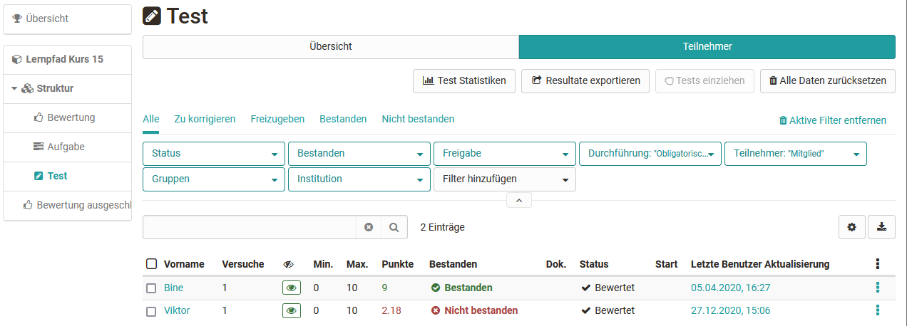
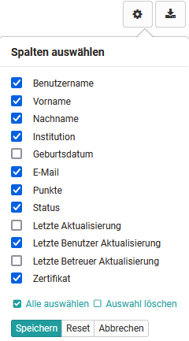
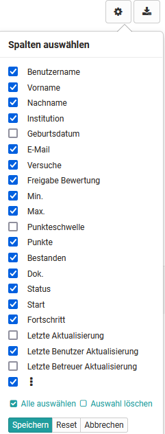
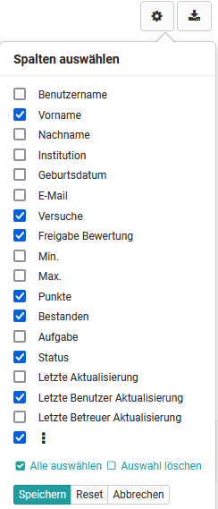
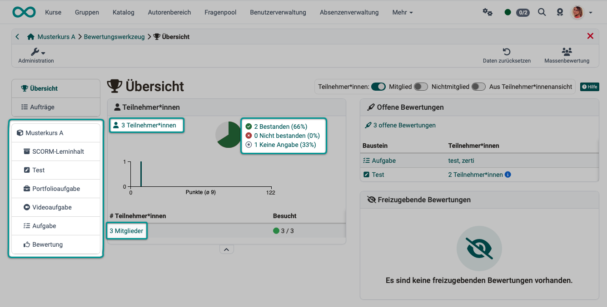
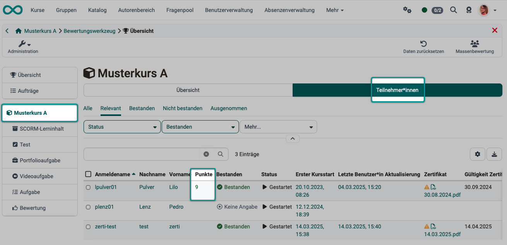
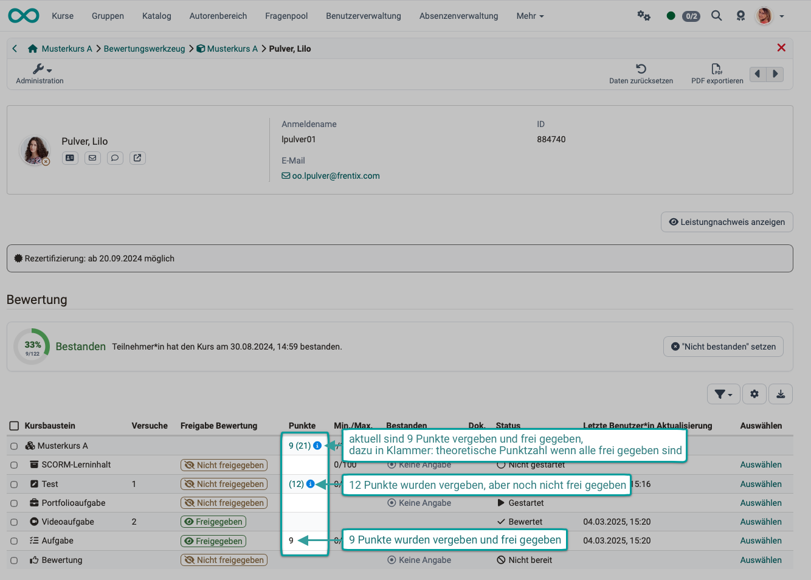
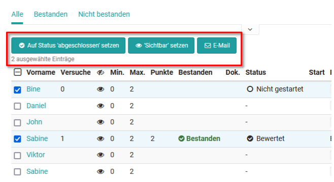

# Bewertungswerkzeug: Tab Teilnehmer:innen {: #assessment_tool_users}

Sie haben zwei generelle Möglichkeiten die Bewertung im Bewertungswerkzeug vorzunehmen. Entweder Sie gehen von einer Person aus und bewerten die von dieser Person vorgenommenen Bearbeitungen. Oder Sie gehen von der Kursstruktur und einem konkreten Assessment Baustein aus und bewerten alle Personen für diese Aufgabe, diesen Test bzw. sonstigen Assessment Kursbaustein. 

In der linken Spalte im Bewertungswerkzeug sehen Sie die Kursstruktur mit allen bewertbaren Kursbausteinen. Hier können Sie direkt zu einem der Kursbausteine navigieren um Ihre Bewertung vorzunehmen. Für jeden Kursbaustein wird ein Tab mit der "Übersicht" und ein Tab mit den "Teilnehmern" angezeigt. 

Die genaue Vorgehensweise wird den Kapiteln [Lernende bewerten](../learningresources/Assessment_of_learners.de.md) und [Bewertung von Kursbausteinen](../learningresources/Assessment_of_course_modules.de.md) beschrieben.

---

## Teilnehmer suchen {: #assessment_tool_participants}

Im Tab "Teilnehmer" werden alle Kursteilnehmenden aufgelistet, die bewertet werden können. Sie können nach diversen Kriterien gefiltert werden. Z.B. alle Teilnehmenden, die diesen Kursbaustein noch "nicht bestanden" haben oder alle Teilnehmende einer bestimmten Gruppe. Ferner kann nach einzelnen Personen gesucht werden.

### Anzeige und Spaltenauswahl {: #display_column}

Die Informationen, die im Tab "Teilnehmer" angezeigt werden, können über die Auswahl der gewünschten Spalten weiter angepasst werden. Klicken Sie hierfür auf das Zahnrad.

Die konkreten Anzeige-Optionen  variieren je nach Assessment-Baustein. Neben Basisinformationen wie Name oder Matrikelnummer, können hier auch Informationen zum Status oder der letzten Aktualisierung eingeblendet werden. Eine Spaltenanpassung ist also hilfreich um einen schnellen Überblick zu erhalten. Besonders die Informationen zu den Punkten, den Versuchen, dem Status, und der letzten Aktualisierung werden häufig benötigt. 

Richten Sie sich die Spalten so ein, wie es für Ihren Kontext sinnvoll ist und schauen Sie in den Einstellungen nach ob diese auch aktiviert ist, wenn Sie mal eine Information vermissen.

Hier Beispiele für die Spaltenauswahl per Zahnrad: 

Kursbaustein "Struktur"

Kursbaustein "Test"

Kursbaustein "Aufgabe"  

[Zum Seitenanfang ^](#assessment_tool_users)

---

### Erreichte Punkte einsehen {: #points}

Um als Betreuer:in nachzuschauen, wieviele Punkte bestimmte Teilnehmer:innnen erreicht haben, öffnen Sie im betreffenen Kurs die (Kurs-)Administration und darin das Bewertungswerkzeug.
Auf der Übersicht gibt es verschiedene Möglichkeiten zu (vorgefilterten) Teilnehmerlisten zu gelangen.
Ist eine Liste geöffnet, klicken Sie dort auf den Namen der betreffenden Person. 

{ class="shadow lightbox" }

#### Punkte des gesamten Kurses

Um die Punkte für den Gesamtkurs zu sehen, wählen Sie links den Namen des Kurses und dann den Tab "Teilnehmer:innen".

{ class="shadow lightbox" }

In der Konfiguration kann festgelegt sein, dass Betreuer:innen im Bewertungswerkzeug Punkte vergeben können, das Ergebnis jedoch nicht selbst freigeben dürfen. 
In diesem Fall sind diese Punkte provisorisch und dürfen noch nicht ins Total übernommen werden.

Damit Betreuer:innen sehen können, wieviele Punkte Teilnehmer:innen haben werden, wenn alle Punkte frei gegeben sind, sind die provisorischen Punkte in Klammer angegeben.

Beispiel:
{ class="shadow lightbox" }

#### Punkte eines bestimmten Kursbausteins

Um die Punkte nur für einen bestimmten Kursbaustein zu sehen, wählen Sie links den Kursbaustein und dann im Tab "Teilnehmer:innen" die gewünschte Person.

[Zum Seitenanfang ^](#assessment_tool_users)

---

## Weitere Optionen aktivieren {: #further_options}

Nach Auswahl einer oder mehrerer Personen eines Assessment Bausteins erscheinen weitere Funktionen z.B. kann der Status auf abgeschlossen gesetzt werden, die Sichtbarkeit aktiviert werden, eine E-Mail versendet oder ein Test verlängert werden. Je nach Assessment-Kursbaustein variieren die Möglichkeiten.

[Zum Seitenanfang ^](#assessment_tool_users)

