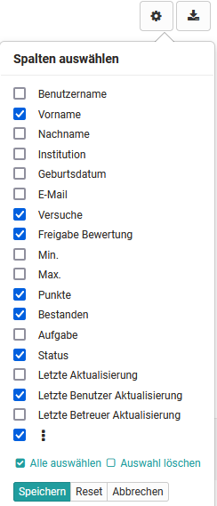

# Bewertungswerkzeug - Tab Teilnehmer

Sie haben zwei generelle Möglichkeiten die Bewertung im Bewertungswerkzeug vorzunehmen. Entweder Sie
gehen von einer Person aus und bewerten die von dieser Person vorgenommenen
Bearbeitungen. Oder Sie gehen von der Kursstruktur und einem konkreten
Assessment Baustein aus und bewerten alle Personen für diese Aufgabe, diesen
Test bzw. sonstigen Assessment Kursbaustein. 

In der linken Spalte im Bewertungswerkzeug sehen Sie die Kursstruktur mit allen bewertbaren Kursbausteinen. Hier können Sie direkt zu einem der Kursbausteine navigieren um Ihre Bewertung vorzunehmen. Für jeden Kursbaustein wird ein Tab mit der "Übersicht" und ein Tab mit den "Teilnehmern" angezeigt. 

Die genaue Vorgehensweise wird den Kapiteln [Lernende bewerten](../learningresources/Assessment_of_learners.de.md) und [Bewertung von Kursbausteinen](../learningresources/Assessment_of_course_modules.de.md) beschrieben.

## Tab Teilnehmer im Bewertungswerkzeug
Im Tab Teilnehmer werden alle Kursteilnehmenden aufgelistet die bewertet werden können. Ferner können die angezeigten Teilnehmenden auch nach diversen Kriterien gefiltert werden, z.B. alle Teilnehmenden die diesen Kursbaustein noch "nicht bestanden" oder alle Teilnehmenden einer bestimmten Gruppe usw. Ferner kann nach Personen gesucht werden.  

### Anzeige und Spaltenauswahl

Die Informationen, die im Tab "Teilnehmer" angezeigt werden, können über die Auswahl der gewünschten Spalten weiter angepasst werden. Klicken Sie hierfür auf das Zahnrad. Die konkreten Anzeige-Optionen  variieren je nach Assessment-Baustein. Neben Basisinformationen wie Name oder Matrikelnummer, können hier auch
Informationen zum Status oder der letzten Aktualisierung eingeblendet werden. Eine Spaltenanpassung ist also hilfreich um einen schnellen Überblick zu erhalten.
Besonders die Informationen zu den Punkten, den Versuchen, dem Status, und der
letzten Aktualisierung werden häufig benötigt. 

Richten Sie sich die Spalten so ein, wie es für Ihren Kontext sinnvoll ist und schauen Sie in den Einstellungen nach ob diese auch aktiviert ist, wenn Sie mal eine Information vermissen.

Hier Beispiele für die Spaltenauswahl per Zahnrad: 

Kursbaustein "Struktur"

Kursbaustein "Test"

Kursbaustein "Aufgabe"  

### Weitere Optionen aktivieren 

Nach Auswahl einer oder mehrerer Personen eines Assessment Bausteins
erscheinen weitere Funktionen z.B. kann der Status auf abgeschlossen gesetzt
werden, die Sichtbarkeit aktiviert werden, eine E-Mail versendet oder ein Test
verlängert werden. Je nach Assessment-Kursbaustein variieren die Möglichkeiten.

