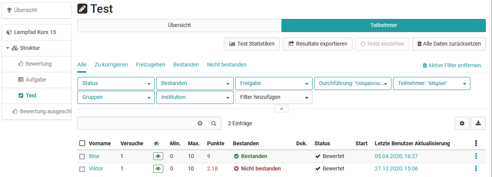
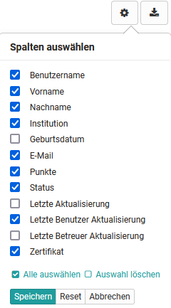
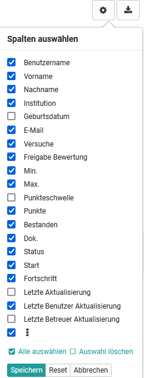
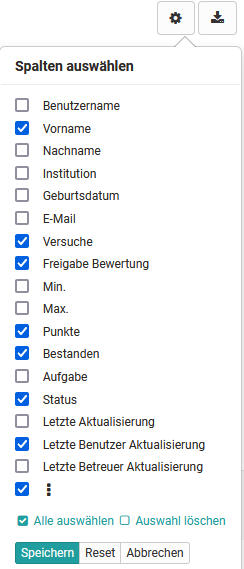
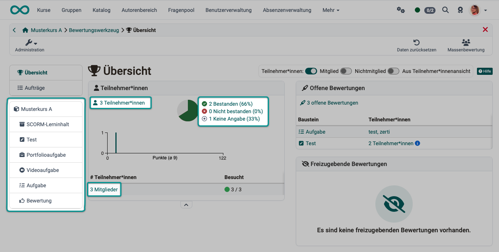
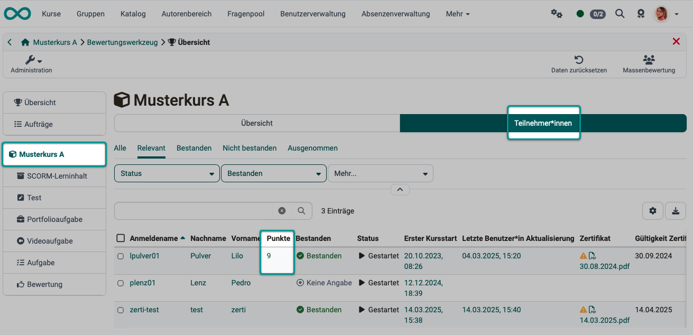
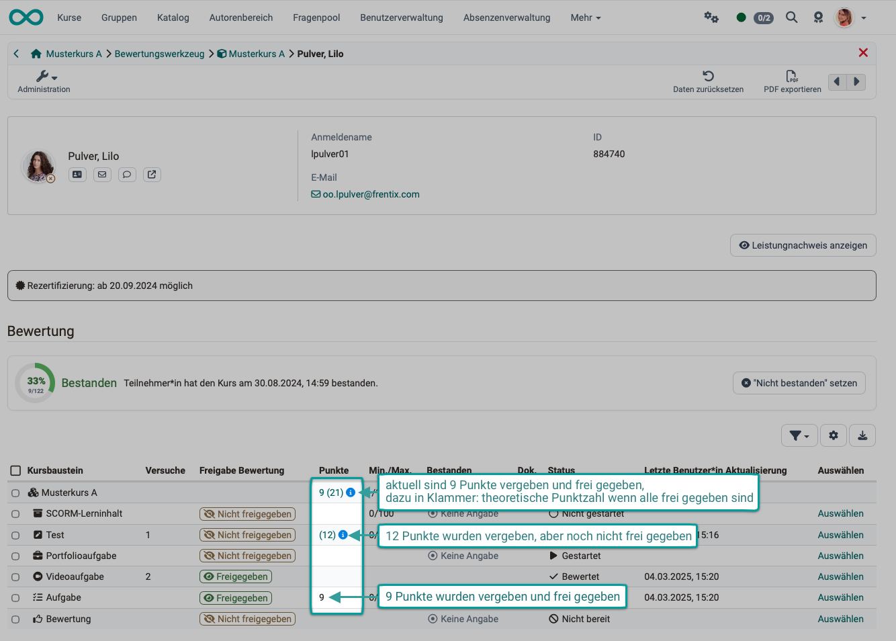
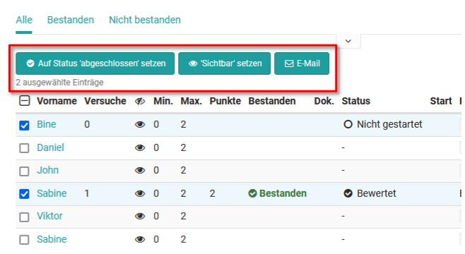

# Assessment tool: Tab Participants {: #assessment_tool_users}

You have two general options for carrying out an assessment in the assessment tool. Either you start from one person and assess the work done by this person, or you start from the course structure and a specific assessment element and assess all persons for this task, this test, or other assessment course element.

In the left column of the assessment tool you see the course structure with all assessable course elements. Here you can navigate directly to one of the course elements to make your assessment. For each course element, a tab with "Overview" and a tab with "Participants" is displayed.

{ class="shadow lightbox" }

The exact procedure is described in the chapters [Assessing learners](../learningresources/Assessment_of_learners.md) and [Assessment of course elements](../learningresources/Assessment_of_course_modules.md).

---

## Search for participants {: #assessment_tool_participants}

In the "Participants" tab, all participants who can be assessed are listed. They can be filtered by various criteria, e.g. all participants who have "not yet passed" this course element, or all participants of a specific group. Individual persons can also be searched for.

### Display and column selection {: #display_column}

The information displayed in the "Participants" tab can be further customized by selecting the desired columns. To do this, click on the gear icon.

The specific display options vary depending on the assessment element. In addition to basic information such as name or matriculation number, information on status or the last update can also be displayed here. Customizing the columns is therefore helpful to get a quick overview. The information on points, attempts, status, and the last update in particular is often needed.

Set up the columns as it makes sense for your context, and check in the settings whether a column is activated if you happen to miss a piece of information.

Here are examples of the column selection via the gear icon:

{ class="shadow lightbox" }

Course element "Structure"

{ class="shadow lightbox" }

Course element "Test"

{ class="shadow lightbox" }

Course element "Task"

[To the top of the page ^](#assessment_tool_users)

---

### View points earned {: #points}

To check as a coach how many points specific participants have earned, open the Administration for the relevant course and then open the assessment tool.
The overview page offers several ways to access (pre-filtered) participant lists.
If a list is open, click on the name of the person in question.

{ class="shadow lightbox" }

#### Points for the entire course

To view the points for the entire course, select the course name on the left and then the "Participants" tab.

{ class="shadow lightbox" }

The configuration may specify that coaches can assign points in the assessment tool but are not permitted to release the result themselves.
In this case, these points are provisional and must not yet be included in the total.

To let coaches see how many points participants will have once all points have been released, the provisional points are shown in parentheses.

Example:
{ class="shadow lightbox" }

#### Points for a specific course element

To view the points for a specific course element only, select the course element on the left and then the desired person in the "Participants" tab.

[To the top of the page ^](#assessment_tool_users)

---

## Activate further options {: #further_options}

After selecting one or more people in an assessment element, further functions appear, e.g. the status can be set to completed, visibility can be activated, an email can be sent, or a test can be extended. The options vary depending on the assessment course element.

{ class="shadow lightbox" }

[To the top of the page ^](#assessment_tool_users)

---

## Further information {: #further_information}

[Assessing learners >](Assessment_of_learners.md) 
[Assessment of course elements >](Assessment_of_course_modules.md)

[To the top of the page ^](#assessment_tool_users)
