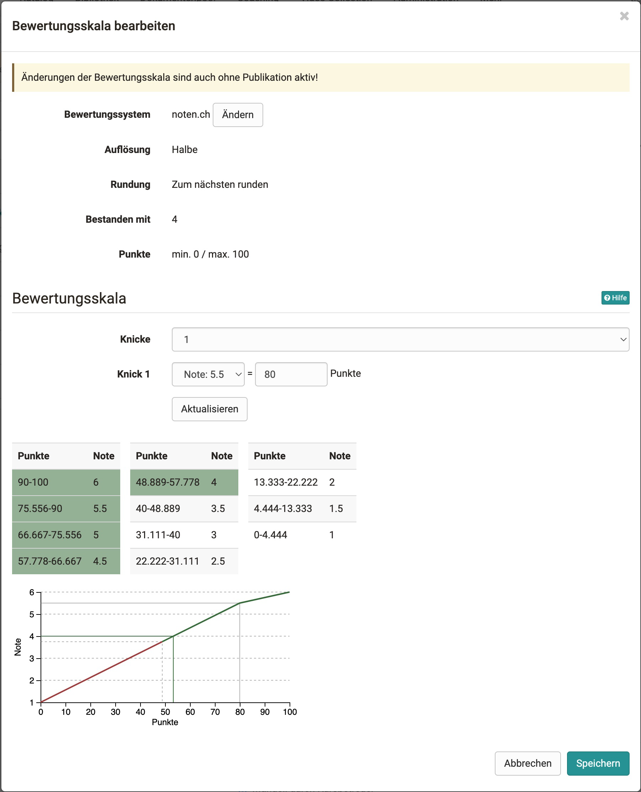

# Einstufung/Noten {: #rating_grades}

:octicons-tag-24: Release 16.2

Sofern ein Assessment-Kursbaustein, wie beispielsweise ein Test, eine Aufgabe usw. mit Punkten versehen werden, können die Punkte auch in Noten übersetzt werden. 

Kursbesitzer:innen können die Funktion im Kurseditor aktivieren und dort konfigurieren. 

## Konfigurieren eines Kursbausteins für Einstufungen und Noten

!!! info "Voraussetzung"

    Das Modul Einstufung/Noten wurde von den OpenOlat Administrator:innen aktiviert und es wurde mindestens ein Bewertungssystem angelegt.

1. **Einstufung/Noten für einen Kursbaustein aktivieren**  
Gehen Sie in den Kurseditor und wählen Sie den Kursbaustein, für den die Einstufung aktiviert werden soll. Im Tab "Bewertung" können Sie die Einzelheiten einrichten. 
(Bei Tests im Tab "Testkonfiguration".) Achten Sie darauf, dass auch "Punkte vergeben" aktiviert ist und aktivieren Sie "Bewertung mit Einstufung/Noten". 
2. **Zuweisung wählen** 
Sie können zwischen manueller und automatischer Zuweisung wählen. Bei manueller Zuweisung muss der/die Betreuer:in die Zuordnung manuell auslösen und für die Benutzer:innen sichtbar machen. 

3. **Bewertungsskala auswählen und anpassen** 
Definieren Sie die minimalen und maximalen Punkte (speichern) und klicken Sie auf "Bewertungsskala bearbeiten". Es öffnet sich ein Einstellungsfenster. Hier können Sie ein Bewertungssystem auswählen und die Bewertungsskala weiter anpassen.

    {class="shadow"}

4. **Speichern**

[Zum Seitenanfang ^](#rating_grades)

---

## Noten im Bewertungswerkzeug

Die Einstufungs- und Notenskala spiegelt sich auch im Bewertungswerkzeug wider. 

* **Tab "Übersicht" eines Kursbausteins**: 
Die Kennzahlen für die Bewertung wurden um Noten erweitert. Man sieht die Normalverteilung und wichtige Einstellungen.

* **Tab "Teilnehmer:innen" eines Kursbausteins**: 
Im Bewertungswerkzeug sieht man die Noten in einer separaten Spalte hinter der Punktzahl. (Sofern die Spalte angezeigt wird. -> Zahnrad-Button) Man kann, wenn auf manuell gestellt, hier auch Noten manuell übernehmen.

Um die Bewertungsskala nachträglich anzupassen oder um neue Noten zu vergeben, klicken Sie oben auf den Button "Bewertungsskala anpassen". 

[Zum Seitenanfang ^](#rating_grades)