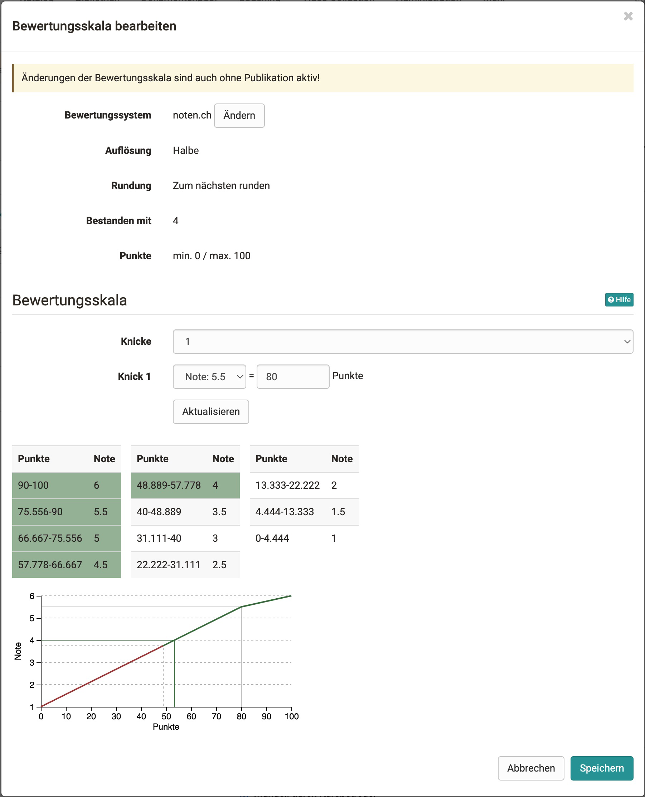

# Einstufung/Noten {: #rating_grades}

[:octicons-tag-16:{ title="ab Release 16.2 (OO-6009)" }](https://track.frentix.com/issue/OO-6009)

Sofern ein Assessment-Kursbaustein, wie beispielsweise ein Test, eine Aufgabe usw. mit Punkten versehen werden, können die Punkte auch in Noten übersetzt werden. 

Kursbesitzer:innen können die Funktion im Kurseditor aktivieren und dort konfigurieren. 

## Konfigurieren eines Kursbausteins für Einstufungen und Noten

!!! tip "Voraussetzung"

    Das Modul Einstufung/Noten wurde von den OpenOlat Administrator:innen aktiviert und es wurde mindestens ein Bewertungssystem angelegt.

1. **Einstufung/Noten für einen Kursbaustein aktivieren**  
Gehen Sie in den Kurseditor und wählen Sie den Kursbaustein, für den die Einstufung aktiviert werden soll. Im Tab "Bewertung" können Sie die Einzelheiten einrichten. 
(Bei Tests im Tab "Test-Konfiguration".) Achten Sie darauf, dass auch "Punkte vergeben" aktiviert ist und aktivieren Sie "Bewertung mit Einstufung/Noten". 
2. **Zuweisung wählen** 
Sie können zwischen manueller und automatischer Zuweisung wählen. Bei der Zuweisung "Manuell" löst die betreuende Person die Zuordnung aus und macht sie für die Teilnehmenden sichtbar. Die offenen Fälle sammelt das Coaching unter [Bewertungsaufträge](../area_modules/Coaching_Assessment_Orders.de.md#tab_open_classifications_scores) im Tab "Offene Einstufungen/Noten". Damit auch Betreuende ohne Besitzrecht dort zuweisen können, setzen Kursbesitzer:innen unter `Kurs > Administration > Einstellungen > Tab "Bewertung"` im [Abschnitt Berechtigungen](Course_Settings_Assessment.de.md#section_assessment_rights) die Option "Einstufung/Noten zuweisen". Bei der Zuweisung "Automatisch bei Punktänderungen" vergibt OpenOlat die Note selbst.

3. **Bewertungsskala auswählen und anpassen** 
Definieren Sie die minimalen und maximalen Punkte (speichern) und klicken Sie auf "Bewertungsskala bearbeiten". Es öffnet sich ein Einstellungsfenster. Hier können Sie ein Bewertungssystem auswählen und die Bewertungsskala weiter anpassen.

    {class="shadow"}

4. **Speichern**

[Zum Seitenanfang ^](#rating_grades)

---

## Grenzwerte der Bewertungsskala lesen {: #grade_boundaries}

In der Bewertungsskala wird jeder Note bzw. Stufe ein Punktebereich mit einem "von"- und einem "bis"-Wert zugeordnet. In der Spalte "Punkte" wird dieser Bereich angezeigt, in der Spalte "Note" die zugehörige Note.

Bei automatisch berechneten Skalen kann der "bis"-Wert einer Stufe mit dem "von"-Wert der nächsthöheren Stufe übereinstimmen. Ein und derselbe Punktewert erscheint dann in zwei aufeinanderfolgenden Zeilen. In diesem Fall gilt:

!!! info "So wird der Grenzwert gelesen"

    Der Grenzwert gehört immer zur höheren Stufe. Der "von"-Wert einer Stufe ist also eingeschlossen, der "bis"-Wert ausgeschlossen (der "bis"-Wert zählt bereits zur nächsthöheren Stufe).

**Beispiel** (Schweizer Notensystem, erreichbare Punkte 0 bis 5):

| Punkte | Note |
| ------ | ---- |
| 3.25 bis 3.75 | 4.5 |
| 3.75 bis 4.25 | 5 |

Ein Ergebnis von genau 3.75 Punkten ergibt die Note 5 und nicht die Note 4.5, weil der Grenzwert zur höheren Stufe zählt. Ein Ergebnis von 3.74 Punkten ergibt dagegen die Note 4.5.

[Zum Seitenanfang ^](#rating_grades)

---

## Noten im Bewertungswerkzeug

Die Einstufungs- und Notenskala spiegelt sich auch im Bewertungswerkzeug wider. 

* **Tab "Übersicht" eines Kursbausteins**: 
Die Kennzahlen für die Bewertung wurden um Noten erweitert. Man sieht die Normalverteilung und wichtige Einstellungen.

* **Tab "Teilnehmer:innen" eines Kursbausteins**: 
Im Bewertungswerkzeug sieht man die Noten in einer separaten Spalte hinter der Punktzahl. (Sofern die Spalte angezeigt wird. -> Zahnrad-Button) Man kann, wenn auf manuell gestellt, hier auch Noten manuell übernehmen.

Um die Bewertungsskala nachträglich anzupassen oder um neue Noten zu vergeben, klicken Sie oben auf den Button "Bewertungsskala anpassen". 

[Zum Seitenanfang ^](#rating_grades)

---

## Weiterführende Informationen {: #further_information}

**Auf dieser Seite erwähnt** 
[Coaching - Bewertungsaufträge >](../area_modules/Coaching_Assessment_Orders.de.md) 
[Kurseinstellungen - Tab Bewertung >](Course_Settings_Assessment.de.md)

**Weiterführend** 
[Bewertungswerkzeug - Übersicht >](Assessment_tool_overview.de.md) 
[Das Bewertungsformular >](The_assessment_form.de.md) 
[Tests auf Kursebene >](Tests_at_course_level.de.md)

[Zum Seitenanfang ^](#rating_grades)
